# 地理信息系统原理复习2026

| 地理信息系统原理与应用课程复习重点 |
| --- |
| 第一章：1.1,1.2,1.4; 第二章：2.2,2.5; |
| 第三章：3.1,3.2,3.3,3.4; |
| 第四章：4.1,4.5,4.6,矢量栅格化，栅格矢量化； 第五章：矢量线要素压缩、扫描矢量化、多边形拓扑关系建立； |
| 第六章：6.1,6.2,6.4; 第七章：7.3,7.4; |
| 第八章：8.1,8.2,8.3; |
| 第十章：10.1,10.3,空间索引； 第十一章：11.1,11.2,11.4; |
| 第十二章：12.2,12.3,12.4,12.7; 第十三章:DEM表示方法,13.3,13.5; |
| 第十四章：14.1,14.2,14.3,14.4,14.5; |
| 第十五章：15.1,15.2,15.3,15.4,15.5; 第十六章：16.1,16.4; |
| 第十七章：17.1,17.3,17.5; 第十八章：18.1,18.2,18.3; |

## 第1章 绪论复习总结

### 1. 全章主线

**GIS是什么、GIS由什么组成、GIS能做什么**。

**现实世界 → 数据获取 → 数据管理 → 数据处理与分析 → 信息输出 → 辅助决策**

例如公园选址中，需要综合地形、水系、道路、植被等信息，GIS通过空间分析给出候选方案，所以 GIS 本质上是解决空间问题的**辅助决策支持工具**。

### 2. 数据、信息与地理信息

#### 2.1 数据

**数据**是对客观现象的表示，可以是数字、文字、符号、声音、图像等，能够被计算机处理。但数据本身没有意义，只有经过解释和加工后，才可能成为信息。

#### 2.2 信息

**信息**是现实世界在人们头脑中的反映，可以用文字、数字、符号、声音、图像等形式记录、传递和处理，为生产、建设、管理等提供依据。

信息的基本特征：

| 特征     | 含义                                       |
|----------|--------------------------------------------|
| 客观性   | 信息与客观事实相关，是正确性和精确度的保证 |
| 适用性   | 不同问题需要不同类型的信息                 |
| 可传输性 | 信息可以在发送者和接受者之间传输           |
| 共享性   | 信息可被多个用户共享，本身不因共享而损失   |

#### 2.3 数据与信息的关系

这部分是绪论里的基础概念，容易考简答。

**数据是信息的表达和载体；信息是数据的内涵。**  
二者是“形与质”的关系。

也就是说，数据经过加工、解释，对实体行为产生影响后，才成为信息。

### 3. 地理信息与地理数据

**地理信息**是与地理分布有关的事物信息，描述地理事物的数量、质量、分布特征、相互联系和变化规律。

**地理数据**是各种地理特征和现象之间关系的符号化表示，包括三个基本部分：

| 组成         | 含义                   |
|--------------|------------------------|
| 空间位置特征 | 地物在哪里             |
| 属性特征     | 地物是什么、有什么性质 |
| 时态特征     | 地物何时存在、如何变化 |

地理信息的特征主要包括：**信息的基本特征、空间分布性、多维结构、时序特征、数据量大**。其中空间分布性和时序特征最能体现 GIS 与普通信息系统的区别。

### 4. GIS 的概念

GIS 的定义有很多，但考试中抓住核心即可：

**地理信息系统 GIS 是一种用于获取、存储、查询、分析和显示地理空间数据的计算机系统。**

也可以从功能角度理解：

GIS 是采集、存储、管理、分析和表达地理空间数据的信息系统。

GIS 与普通信息系统的主要区别在于：  
它处理的是**经过地理编码的空间数据**，地理位置及其相关属性是信息检索和分析的重要部分。

### 5. GIS 的组成要素

一个实用的 GIS 系统要支持空间数据的采集、管理、处理、分析、建模和显示。基本组成包括五部分：**空间数据、软件、硬件、专业人员和组织**。

| 组成要素 | 作用                                                |
|----------|-----------------------------------------------------|
| 空间数据 | GIS 的核心，描述地物位置、属性和时间变化            |
| 软件     | 实现数据输入、管理、分析、显示等功能                |
| 硬件     | 支撑 GIS 运行的计算机、服务器、存储、输入输出设备等 |
| 专业人员 | 使用、维护、开发和管理 GIS 的主体                   |
| 组织     | 标准、规范、流程、项目管理和质量控制                |

这里注意：**GIS不是只有软件**。软件只是工具，空间数据是核心，人员和组织决定系统能否长期稳定运行。课件中还把人员分为一般用户、高级用户，以及系统管理、系统开发、数据处理、数据分析和终端用户等类型。

### 6. GIS 的基本功能

GIS 的功能可以按照“数据生命周期”理解：

1.  **数据获取**：采集地图、遥感影像、GPS、调查数据等。

2.  **数据管理**：组织、存储、维护空间数据和属性数据。

3.  **数据处理与分析**：进行空间查询、叠置分析、缓冲区分析、网络分析等。

4.  **信息表达与输出**：输出地图、报表、图表和决策方案。

### 7. GIS 应用领域

| 应用领域 | 典型作用                             |
|----------|--------------------------------------|
| 资源管理 | 土地、森林、水资源、矿产资源管理     |
| 城市规划 | 用地规划、选址分析、基础设施布局     |
| 环境保护 | 污染监测、生态评价、环境影响分析     |
| 交通运输 | 路径规划、交通管理、物流配送         |
| 防灾减灾 | 洪水、地震、火灾等灾害监测与应急决策 |
| 公共服务 | 医疗、教育、消防、警务设施布局       |
| 商业分析 | 门店选址、客户分布、市场分析         |

## 第2章 坐标系统

### 1. 全章主线

**GIS 空间数据的数学基础**。

**地理空间数据要定位、量算、转换和空间分析，必须有统一的空间参考基准。**

两个地图图层只有在**相同坐标系统**下才能空间匹配；如果坐标系统不一致，图层叠加会错位。课件中的州际公路图就说明：不同坐标系统下公路无法正确连接，相同坐标系统下才能匹配。

| 内容              | 解决的问题                   |
|-------------------|------------------------------|
| 地理坐标系统      | 地球表面位置怎么表示         |
| 地图投影          | 球面坐标怎么转成平面坐标     |
| 常用地图投影      | 不同投影适合什么场景         |
| 投影坐标系统      | 平面坐标系统怎么组织         |
| GIS中运用坐标系统 | 如何定义投影、投影和重新投影 |

### 2. 地理坐标系统

#### 2.1 基本概念

**地理坐标系统**是地球表面空间要素的定位参照系统，由**经纬度**定义。

但是经纬度是球面坐标，不适合直接进行距离、面积和方向量算。因此，在 GIS 分析中，很多时候需要把地理坐标转换为投影坐标。

#### 2.2 地球的近似表示

| 模型     | 含义                                           |
|----------|------------------------------------------------|
| 球体     | 最简单，常用于说明地图投影原理                 |
| 椭球体   | 更接近真实地球形状，因为地球赤道较宽、两极略扁 |
| 大地坐标 | 基于椭球体的地理坐标                           |

椭球体是描述地球形状的数学模型，主要参数包括：$\text{长半径}a,\text{短半径}b,\text{扁率}\alpha = \frac{a - b}{a}$

#### 2.3 大地基准

**大地基准**是测量的参考框架与起算依据，可作为计算某个位置地理坐标的参照或基础，也用于计算垂直数据的海拔。

**基准不同，同一个点的坐标值可能不同；基准转换会引起点位置偏移。**

### 3. 地图投影

#### 3.1 为什么要投影

**地图投影**是把地球椭球面上的点映射到平面上的方法。

为什么需要投影？

1.  地理坐标是球面坐标，不方便距离、方位、面积量算；

2.  地球椭球体是不可展曲面，不能无变形展开为平面；

3.  地图是平面，更符合视觉表达，也方便空间分析。

**地图投影的本质是：把椭球体上的地理坐标转换成平面位置。**

#### 3.2 地图投影的变形

由于椭球面不能无变形地展开到平面，地图投影一定会产生变形。不同投影只能优先保持某一种性质。

| **投影类型**       | **保持的性质**               | **说明**               |
|--------------------|------------------------------|------------------------|
| 等角投影正形投影   | 角度不变                     | 适合航海、方向判断     |
| 等面积投影等积投影 | 面积不变                     | 适合面积统计和专题制图 |
| 等距投影           | 某些方向或特定线上的距离准确 | 不是所有距离都准确     |
| 真方位投影         | 保持确定方向准确             | 常用于方位表达         |

#### 3.3 地图投影按投影面分类

| 分类     | 投影面 | 常见理解                     |
|----------|--------|------------------------------|
| 圆柱投影 | 圆柱面 | 适合低纬或沿经线方向区域     |
| 圆锥投影 | 圆锥面 | 适合中纬度东西向延伸区域     |
| 方位投影 | 平面   | 适合极区或以某点为中心的区域 |

也可以按投影面位置分为：

- **正轴投影**：投影面中心轴与地轴重合；

- **斜轴投影**：投影面中心轴与地轴斜交；

- **横轴投影**：投影面中心轴与地轴垂直；

- **相切投影**：投影面与椭球相切；

- **相割投影**：投影面与椭球相割。

#### 3.4 地图投影参数

地图投影参数用于控制投影的中心、比例和坐标原点。主要包括：标准线、主比例尺、比例系数、中心线、横坐标东移和纵坐标北移。

| 参数                | 含义                                       |
|---------------------|--------------------------------------------|
| 标准线              | 投影面与椭球的切线，标准线上无长度变形     |
| 标准纬线 / 标准经线 | 标准线沿纬线或经线方向                     |
| 主比例尺            | 球体半径与地球半径的比值，仅适用于标准线   |
| 比例系数            | 局部比例尺与主比例尺之比，反映投影变形程度 |
| 中央经线 / 中央纬线 | 定义地图投影中心或原点                     |
| 横坐标东移          | 给 x 坐标加固定值，避免负坐标              |
| 纵坐标北移          | 给 y 坐标加固定值，避免负坐标              |

### 4. 常用地图投影

#### 4.1 墨卡托投影

墨卡托投影是等角投影，角度在投影过程中保持不变。其特点是等角航线在图上表现为直线，因此常用于航海地图。

**墨卡托投影：保角，航线方便，但高纬地区面积变形大。**

#### 4.2 横轴墨卡托投影 / 高斯—克吕格投影

横轴墨卡托投影是墨卡托投影的变种，又称**高斯—克吕格投影**。墨卡托投影使用标准纬线，而横轴墨卡托投影使用标准经线。

我国地形图中，高斯—克吕格投影非常重要。课件说明，我国规定 1:1万、1:2.5万、1:5万、1:10万、1:25万、1:50万比例尺地形图均采用高斯—克吕格投影；其中 1:2.5万至 1:50万采用 6° 分带，1:1万采用 3° 分带。

| 分带 | 说明                                           |
|------|------------------------------------------------|
| 6°带 | 从 0° 子午线起，每隔经差 6° 为一带，全球 60 带 |
| 3°带 | 从东经 1°30′ 开始，每隔 3° 为一带，全球 120 带 |

#### 4.3 兰勃特正形圆锥投影

兰勃特正形圆锥投影属于圆锥投影，适合东西向延伸、中纬度地区。课件中美国大陆兰勃特正形圆锥投影示例设置了中央经线、两条标准纬线和投影原点纬度。

**兰勃特正形圆锥：保角，适合中纬度东西向区域。**

#### 4.4 阿伯斯等积圆锥投影、等距圆锥投影、网络墨卡托投影

| 投影               | 主要特点                       |
|--------------------|--------------------------------|
| 阿伯斯等积圆锥投影 | 保面积，适合面积统计和专题图   |
| 等距圆锥投影       | 某些方向或标准线上距离保持较好 |
| 网络墨卡托投影     | 在线地图常用，近似等角         |

### 5. 投影坐标系统

**投影坐标系统**是基于地图投影建立的平面坐标系统。它使用平面直角坐标，通常以米为单位，更适合距离、面积、缓冲区、叠置等 GIS 空间分析。

| 坐标系统     | 坐标形式      | 特点                           |
|--------------|---------------|--------------------------------|
| 地理坐标系统 | 经纬度        | 表示全球位置，单位是角度       |
| 投影坐标系统 | x、y 平面坐标 | 适合量算和空间分析，单位常为米 |

**投影连接地理坐标系统和投影坐标系统。**

## 第3章 矢量数据模型

### 1. 全章主线

**现实世界中的空间对象，如何在计算机中组织、表达和分析。**

**现实世界 → 抽象建模 → 点线面表达 → 建立空间关系 → 存入数据库 → 支持查询与分析**

### 2. 空间实体抽象的三个层次

GIS 不能直接处理现实世界，必须先把现实世界进行**选择、综合、简化和抽象**，形成模型。空间实体抽象分为三个层次：

| 层次         | 作用 |                                        | 关键词                 |
|--------------|------|----------------------------------------|------------------------|
| 概念模型     |      | 从现实世界中抽象出空间事物或现象       | 选择、综合、简化、抽象 |
| 逻辑数据模型 |      | 对空间对象进行编码、表达，建立空间关系 | 点、线、面、拓扑       |
| 物理数据模型 |      | 用数据结构组织数据，存入空间数据库     | 文件、数据库、存储结构 |

**概念模型回答“现实中要表达什么”；  
逻辑模型回答“用什么方式表达”；  
物理模型回答“计算机怎么存”。**

### 3. 矢量数据模型的基本概念

**矢量数据模型**也称为**离散对象模型**，采用离散对象表示地球表面的空间特性。它主要用**点、线、面**来表示空间要素。

矢量数据准备包括三步：

**矢量数据模型 = 点线面几何表达 + 属性信息 + 空间关系。**

### 4. 简单要素表示

矢量数据模型用**点、线、面**表示简单空间要素。

#### 4.1 点实体

点实体是有特定位置、维数为 0 的实体，用一对坐标表示：$\left( X,Y \right)$

点实体包括：

| 类型   | 作用                               |
|--------|------------------------------------|
| 实体点 | 用来代表一个实体，如车站、路灯     |
| 注记点 | 用于定位注记                       |
| 内点   | 用于记录多边形属性，位于多边形内部 |
| 结点   | 表示线的起点和终点                 |

#### 4.2 线实体

线实体维数为 1，由一系列有序坐标点表示：$\left( X_{1},Y_{1}),(X_{2},Y_{2}),\cdots\,,(X_{n},Y_{n} \right)$

线实体的特征包括：

- **长度**：从起点到终点的总长；

- **弯曲度**：表示道路、河流等弯曲程度；

- **方向性**：如河流从上游到下游，道路有单双向之分。

线实体包括：**线段、边界、链、网络、多边线**等。

#### 4.3 面实体

面实体维数为 2，由封闭坐标点序列表示，可用于表达湖泊、岛屿、地块等。

面实体的特征包括：

- 面积范围；

- 周长；

- 与其他地物相邻；

- 可有内岛或复杂边界；

- 可考虑重叠性与非重叠性。

### 5. 坐标序列法与 Spaghetti 方式

最简单的矢量编码方式是**坐标序列法**，也称 **Spaghetti 方式**。

它的特点是：  
每个点、线、面都用自己的坐标序列单独存储。多边形边界由一串 $x,y$坐标对组成。

优点是**结构简单，容易存储；**

缺点是**只记录几何形状，不直接记录相邻、连接、包含等空间关系。**

### 6. 拓扑结构

#### 6.1 拓扑的概念

拓扑用于描述空间对象之间不随几何变形而改变的关系，比如连接、相邻、包含等。基本拓扑关系包括：

| 拓扑关系 | 含义                           | 例子                       |
|----------|--------------------------------|----------------------------|
| 关联关系 | 不同类拓扑元素之间的关系       | 结点与弧段、弧段与面       |
| 邻接关系 | 同类拓扑元素之间的关系         | 面与面相邻、弧段与弧段连接 |
| 包含关系 | 面与面内其他拓扑元素之间的关系 | 湖泊中有岛，面内有点       |

#### 6.2 拓扑元素

拓扑数据结构的基本元素是：

| 拓扑元素 | 含义                               |
|----------|------------------------------------|
| 结点     | 点状要素，或线的起点、终点、连接点 |
| 弧段     | 两结点之间的有序线段，具有方向性   |
| 面       | 由一条或多条弧段构成的闭合区域     |

$$
\begin{aligned}
\text{简单数据结构} &= \text{标识码} + \text{属性项} + \text{位置信息} \\
\text{拓扑数据结构} &= \text{标识码} + \text{属性项} + \text{位置信息} + \text{拓扑空间关系}
\end{aligned}
$$

#### 6.3 拓扑的重要性

拓扑需要增加数据文件来存储空间关系，但它至少有三个主要优点：

| 作用                 | 理解                                     |
|----------------------|------------------------------------------|
| 保证数据质量和完整性 | 检查线是否断开、面是否闭合、边界是否重复 |
| 强化 GIS 分析        | 支持河流流向、道路连通、面邻接等分析     |
| 支持空间查询         | 可以查询谁相邻、谁包含谁、谁连接谁       |

### 7. 地理关系数据模型

**地理关系数据模型**用两个独立系统分别存储空间数据和属性数据：  
空间数据存在图形文件中，属性数据存在关系数据库中，二者通过要素识别码 ID 连接。

| 数据部分 | 存储方式     |
|----------|--------------|
| 空间数据 | 图形文件     |
| 属性数据 | 关系数据库   |
| 联系方式 | 要素 ID 连接 |

**空间数据和属性数据分开存，但必须同步。**

| **数据格式** | **特点** |
|--------------|----------|
| Coverage     | 拓扑型   |
| Shapefile    | 非拓扑型 |

### 8. 基于对象的数据模型

| 对比项         | 地理关系数据模型   | 基于对象的数据模型   |
|----------------|--------------------|----------------------|
| 空间与属性存储 | 分开存储           | 存储在一个系统中     |
| 空间要素能力   | 主要记录几何和属性 | 对象可关联属性和方法 |
| 表达能力       | 相对传统           | 更适合复杂对象和规则 |

### 9. 复合要素

**复合要素**是指由点、线、面组合使用，才能更好表示的空间要素。

| 复合要素 | 含义                             | 用途                   |
|----------|----------------------------------|------------------------|
| TIN      | 用一组三角面近似表达地表         | 表达地形表面           |
| 分区     | 由多个空间单元组成的区域         | 表达行政区、管理区等   |
| 路径     | 由一系列线段组成，并带有测量系统 | 支持线性参照和动态分段 |

## 第4章《栅格数据模型》

### 一、全章主线

**栅格数据模型**的核心逻辑是：

**空间现象 → 用规则格网离散化 → 用像元值表达属性 → 用不同数据结构组织与压缩 → 在栅格与矢量之间进行转换。**  
这一章本质上是在回答三个问题：

1.  栅格是什么；

2.  栅格怎么存；

3.  栅格怎么转、怎么用。

### 二、栅格数据模型的核心概念

#### 1. 定义

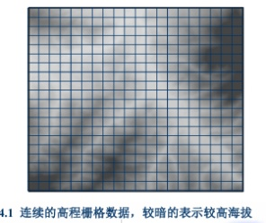
栅格数据模型是用**规则格网**覆盖整个空间，用各个**像元值**表示该位置上的空间现象特征的模型。它适合表示**连续变化的空间现象**，因此又称**基于场模型（field-based model）**。典型对象有：降水量、海拔、土壤侵蚀等。

#### 2. 表达方式

- **点**：一个像元表示

- **线**：一串相邻像元表示

- **面**：连续像元集合表示

这说明：**栅格对空间对象的表达，本质上是离散逼近，不是精确边界重建。**

#### 3. 与矢量模型的根本区别

- **栅格**：强调“区域覆盖”和“每个位置都有值”，适合连续表面

- **矢量**：强调“几何边界和坐标精度”，适合离散目标

考试里如果问“二者差别”，最核心的一句就是：  
**栅格重场，矢量重形。**

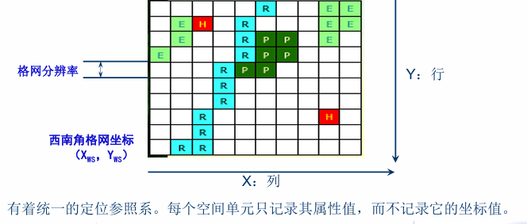
### 三、栅格数据模型要素

#### 1. 坐标系与描述参数

栅格数据通常要明确以下参数：

- **X：列**

- **Y：行**

- **西南角格网坐标（Xws，Yws）**

- **格网分辨率（像元大小）**

栅格具有统一定位参照系，**每个空间单元一般只记录属性值，不单独存储其坐标值**。

#### 2. 像元值

每个像元都有一个值，代表该行列位置上的空间现象特征。  
像元值可以是：

- **整型栅格**

- **浮点型栅格**

#### 3. 栅格单元代码确定方法

这是常考点，尤其在“矢量转栅格”或“分类赋值”里容易出。

常见方法有：

- **中心点法**：看栅格中心落在哪类地物上

- **重要性法**：优先保留具有特殊意义的小地物

- **面积占优法**：取该栅格内面积最大的地物类别

- **百分比法**：按各类地物占比确定代码

结论：  
**想逼近原始数据精度，除了选取赋值规则，还可以减小像元面积、增加像元总数。**

#### 4. 像元大小（分辨率）

像元大小决定分辨率，也是高频简答题。

**原则**

既要**有效逼近空间对象分布特征**，又要**减少数据冗余**。

- 像元太大：小图斑会被忽略，信息丢失

- 像元太小：分辨率高，但数据量大、成本高、处理慢

**经验公式**

PPT给出按最小多边形精度确定像元边长的经验公式：

$$
h = \frac{1}{2}\sqrt{\min A_i}
$$

其中：

- **h**：栅格单元边长

- **Ai**：区域多边形面积

一句话记忆：  
**对象越复杂，像元应越小；但像元越小，数据量按平方级增长。**

#### 5. 单元深度

单元深度是用于存储单元值的**比特数**。

- 8 bit → 256种可能值

- 16 bit → 65536种可能值

所以：**单元深度决定可表达的属性值范围。**

#### 6. 栅格波段

- **单波段**：每个像元只有一个值，如高程栅格

- **多波段**：每个像元有多个值，如卫星影像

所以：  
**高程模型→单波段，遥感影像→多波段。**

#### 7. 空间参照

栅格必须具有空间参照信息，才能与其他 GIS 数据集进行空间配准。  
基本关系：

- 列对应 **x**

- 行对应 **y**

行列数可由范围和像元大小计算：

- **行数 =** $\mathbf{(}\mathbf{y}_{\mathbf{\max}}\mathbf{\  -}\mathbf{y}_{\mathbf{m}\mathbf{in}}\mathbf{)}$ **/ 像元大小**

- **列数 =** $\mathbf{(}\mathbf{x}_{\mathbf{\max}}\mathbf{\  -}\mathbf{x}_{\mathbf{m}\mathbf{in}}\mathbf{)}$ **/ 像元大小**

### 四、栅格数据类型

本章列出的典型栅格数据包括：

1.  卫星影像

2.  数字高程模型（DEM）

3.  数字正射影像（DOM）

4.  土地覆被数据

5.  二值扫描文件

6.  数字栅格图（DRG）

7.  图形文件（TIFF、GIF、JPEG等）

8.  特定 GIS 软件的栅格数据

**易考定义**

- **DOM**：经过地形起伏和镜头倾斜改正后的数字影像

- **土地覆被数据**：覆盖地表的自然和人工营造物信息，常由遥感分类得到

- **二值扫描文件**：只包含 0 和 1 的扫描图像

- **DRG**：地形图扫描形成的数字栅格图

### 五、卫星影像

#### 1. 主动与被动卫星系统对比

| **类型** | **原理** | **优点** | **局限** | **例子** |
| --- | --- | --- | --- | --- |
| 被动系统 （光学系统） | 接收地表反射或发射的电磁波 | 信息丰富，常见于光学遥感 | 云层覆盖、夜间采集受限 | Landsat、SPOT、GeoEye、Digital Globe、Terra |
| 主动系统 | 主动发射能量并接收回波，典型为 SAR | 可在云、雨、黑暗条件下工作 | 影像机理与光学不同 | TerraSAR-X、RADARSAT-2、COSMO-SkyMed |

其中：

- 被动系统常记录**可见光、近红外（叶绿素）、短波红外（水分子、矿物）**

- 主动系统典型代表是**合成孔径雷达（SAR）**

- 对二者而言，空间分辨率都体现为**像素大小**。

#### 2. 典型卫星及记忆点

- **Landsat（陆地卫星）**：使用最广；Landsat 8 在 Landsat 7 基础上增加深蓝波段、短波红外波段，并提供两个热红外波段；常用于森林变化、NDVI、冰川监测。

- **SPOT**：法国对地观测卫星，分辨率逐代提高。

- **Sentinel**：

  - Sentinel-1：近 20m 的 C 波段 SAR

  - Sentinel-2：13个波段，分辨率分别为 10m、20m、60m。

- **Terra**：代表载荷有

  - **ASTER**：15m/30m/90m

  - **MODIS**：250m、500m、1000m。

### 六、数字高程模型（DEM）

#### 1. 定义

DEM 是由一组**均匀间隔的高程数据**组成的模型。

#### 2. DEM 生产方法

**传统方法**

- 立体测图仪

- 航空照片立体像对

**新技术**

- **光学传感器**：同一区域需两个或以上不同方向影像，且获取时间间隔要短

- **InSAR**：利用两个或以上 SAR 影像生成高程

- **LiDAR**：机载激光扫描仪 + GPS + 惯导系统

#### 3. LiDAR 的考试价值

LiDAR 是高频点，因为它有明显优势：

- 可生成**高分辨率 DEM**，分辨率约 **0.5～2m**

- 可记录**多个回波**

- 因而可区分：

  - **地面高程**（最后回波）

  - **树冠高度**（第一次回波）

#### 4. 结论

**分辨率越高，地形细节越丰富。**  
PPT中 3m LiDAR DEM 比 10m、30m DEM 含有更多地形细节。

### 七、栅格数据结构（本章最重要）

#### 1. 定义

栅格数据结构是指**对栅格数据编码和存储在计算机中的方法**。  
它把地表划分为大小均匀、紧密相邻的网格，每个像元由行列定义，并记录属性代码或量值。

#### 2. 五种主要结构对比

| **结构** | **基本思想** | **特点** | **优点** | **局限** |
| --- | --- | --- | --- | --- |
| 逐个像元编码 | 每个像元逐一存储，形成矩阵 | 最直接，DEM常用 | 结构简单 | 数据量大 |
| 游程编码（RLE） | 按行/列合并相邻等值像元 | 重复值多的栅格 | 压缩较好，保留原栅格结构，编码解码简单 | 对复杂图形压缩效果受限 |
| 链码 弗里曼链码 边界链码 | 记录边界起点和方向序列 | 线、面状地物的边界 | 压缩效率高，便于长度/面积/转折分析 | 区域运算困难，局部修改会影响整体 |
| 块码 | 游程编码扩展到二维，用方块记录 | 面状区域较规整 | 有区域性质，压缩优于逐像元 | 规则性受图形影响 |

#### 3. 各结构简明记忆

**（1）逐个像元编码**

- 最简单

- 栅格模型直接存成矩阵

- **DEM 常采用这种结构**

**（2）游程编码**

基本思想：  
**按行或列扫描，把相邻等值像元合并，记录值及重复个数，或记录变化位置与代码。**  
关键词：**简单、有效、适合重复值多的栅格。**

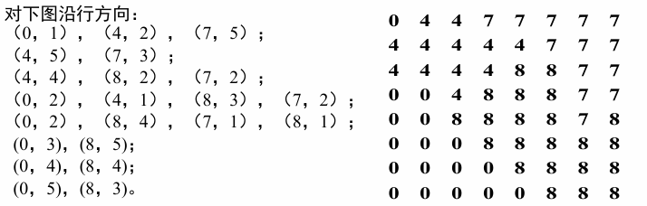

**第一位：值，第二位：位置**

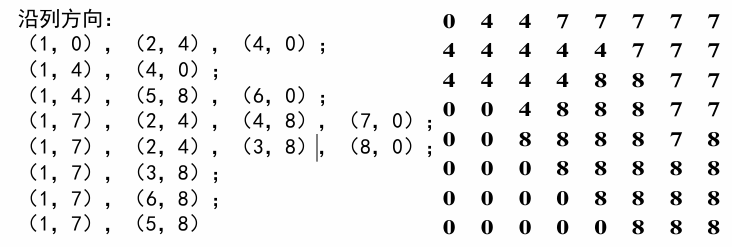

**第一位：位置，第二位：值**

以第1列为例

右边第1列从上到下是：

0, 4, 4, 0, 0, 0, 0, 0

所以编码成：

(1,0)，(2,4)，(4,0)

解释：

- (1,0)：第1行开始是0

- 到第2行变了，所以记 (2,4)

- 到第4行又变了，所以记 (4,0)

也就是：

- 第1行 = 0

- 第2~3行 = 4

- 第4~8行 = 0

**（3）链码**

链码又称 **Freeman 链码** 或边界链码。  
本质：  
**用起始点 + 一系列方向单位矢量，记录线状或面状边界。**

优点：

- 对边界压缩效率高

- 便于估算面积、长度、凹凸度、转折方向

缺点：

-
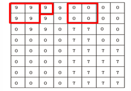
对边界合并、插入、局部编辑困难

- 局部修改会牵动整体结构

**（4）块码**

块码是**游程长度编码的二维扩展**。

记录内容一般为：

- 初始位置（行、列）

- 半径

- 代码

- 示例：

> (1,1,2,9),(1,3,1,9),(1,4,1,9),(1,5,2,0),(1,7,2,0),(2,3,1,9),(2,4,1,0),(3,1,1,0),(3,2,1,9),(3,3,1,9),(3,4,1,0), (3,5,2,7), (3,7,2,0), (4,1,4,0),(5,5,4,7), (8,1,1,0), (8,2,1,0), (8,3,1,0), (8,4,1,0)

**（5）四叉树编码**

四叉树核心概念：

- **根**：整个区域

- **树叉/分支**：还需继续分割的块

- **叶结点**：不再分割的块

- 每个分支都分成 4 个象限

优点：

- 可变分辨率

- 有区域性质

- 很多运算可直接在编码上进行，效率高

缺点：

- **不能直接表示拓扑关系**

- 对平移敏感，存在“滑动变异”

- 一个物体可能被切分到多个象限，削弱整体相关性

- 不广泛用于存数据，而是建立索引文件

**4. 线性四叉树**

线性四叉树记录的是**叶结点的位置、深度和属性**，常用 **Morton 码** 作为地址码。  
优点：

- 存储量小

- 可直接寻址

- 便于做集合相加等组合操作

### 八、栅格数据压缩

PPT强调：**好的压缩编码方法**应满足三点：

1.  尽可能减少运算时间

2.  尽可能提高压缩效率

3.  适应性强、易实现

**应试结论**

- **链码**：边界运算方便，但区域运算差

- **游程编码**：压缩较好，且最大限度保留原始栅格结构，编码解码容易

- **块码、四叉树**：既有区域性质，又有较高压缩效率

- **四叉树**：还能直接做较多图形图像运算，效率高

**关于“有损压缩 / 无损压缩”**

PPT“重点掌握”里明确把这部分列为考点，但当前检索到的页面对这两个概念的展开不多。稳妥的考试写法可记为：

- **无损压缩**：解压后可完全恢复原始数据

- **有损压缩**：允许一定信息损失，以换取更高压缩率

本章实际展开更偏向**无损编码型结构**，如游程编码、链码、块码、四叉树。

### 九、数据转换与综合

#### 1. 矢量到栅格的转换

**（1）转换要点**

先记这两个原则：

- **先定分辨率**：地形起伏大、目标复杂时要用高分辨率

- **坐标系要对应**：矢量是直角坐标系，原点常在左下；栅格是行列坐标系，原点常在左上。转换时一般使 x、y 轴与行、列平行。

**（2）点转换**

点转栅格，本质是把几何坐标换成行列号。计算形式可概括为：

- **i = 1 +** $\mathbf{Integer\lbrack(}\mathbf{y}_{\mathbf{\max}}\mathbf{\  - \ y)\ /\ \Delta y\rbrack}$取整

- **j = 1 +** $\mathbf{Integer\lbrack(x\  - \ }\mathbf{x}_{\mathbf{\min}}\mathbf{)\ /\ \Delta x\rbrack}$

即：

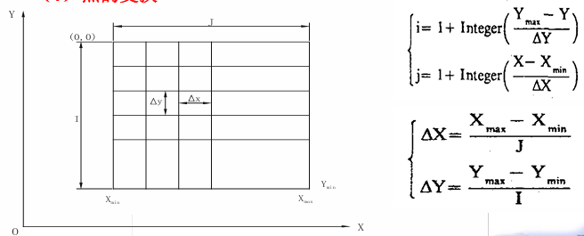
**x 决定列，y 决定行；但行号方向与常规直角坐标 y 方向相反。**

**（3）线转换**

线转栅格的思路：

1.  求出直线经过的起始、终止行号

2.  对中间各行，求该行中心与直线交点的 y 值

3.  再由直线方程求对应 x 值

4.  最后由 x、y 换算成列号 j，逐行完成转换

一句话记忆：  
**线栅格化 = 沿行推进，逐行求交，换成列号。**
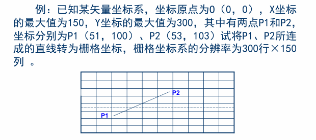

**一、题目已知条件**

- 矢量坐标原点：$O(0,0)$

- $X$最大值：150

- $Y$最大值：300

- 栅格分辨率：**300行 × 150列**

两点：

- $P_{1}(51,100)$

- $P_{2}(53,103)$

**二、先求每个栅格的大小**

因为：

- 横向范围是 150

- 一共有 150 列

所以每列宽度：

$$
\Delta x = \frac{150}{150} = 1
$$

又因为：

- 纵向范围是 300

- 一共有 300 行

所以每行高度：

$$
\Delta y = \frac{300}{300} = 1
$$

也就是说：

**每个栅格就是** $1 \times 1$**的小方格。**

**三、点坐标怎么转成栅格坐标**

通常栅格坐标里：

- **列号** $j$从左往右增大

- **行号** $i$从上往下增大

而矢量坐标里：

- $x$向右增大

- $y$向上增大

所以转换公式是：

$$
\begin{aligned}
j &= 1 + \operatorname{Int}\left( \frac{x - x_{\min}}{\Delta x} \right) \\
i &= 1 + \operatorname{Int}\left( \frac{y_{\max} - y}{\Delta y} \right)
\end{aligned}
$$

这里：

- $x_{\min} = 0$

- $y_{\max} = 300$

- $\Delta x = 1$

- $\Delta y = 1$

**四、先把两个端点转成栅格坐标**

**1. 点** $\mathbf{P}_{\mathbf{1}}\mathbf{(51,100)}$

**列号**

$$
j_{1} = 1 + \operatorname{Int}(51) = 52
$$

**行号**

$$
i_{1} = 1 + \operatorname{Int}(300 - 100) = 201
$$

所以：

$$
P_{1} \rightarrow (201,52)
$$

**2. 点** $\mathbf{P}_{\mathbf{2}}\mathbf{(53,103)}$

**列号**

$$
j_{2} = 1 + \operatorname{Int}(53) = 54
$$

**行号**

$$
i_{2} = 1 + \operatorname{Int}(300 - 103) = 198
$$

所以：

$$
P_{2} \rightarrow (198,54)
$$

**五、现在开始转“直线”**

也就是要把

$$
P_{1}(51,100) \rightarrow P_{2}(53,103)
$$

这条线，变成栅格中的一串格子。

**1. 先写出直线方程**

已知两点：

- $P_{1}(51,100)$

- $P_{2}(53,103)$

斜率：

$$
k = \frac{103 - 100}{53 - 51} = \frac{3}{2}
$$

所以直线方程可写成：

$$
y - 100 = \frac{3}{2}(x - 51)
$$

如果改写成 $x$关于 $y$的式子，更方便逐行算：

$$
x = 51 + \frac{2}{3}(y - 100)
$$

**六、看这条线经过哪些“行”**

因为：

- 起点 $P_{1}$在第 **201 行**

- 终点 $P_{2}$在第 **198 行**

所以这条线会经过这些行：

- 第201行

- 第200行

- 第199行

- 第198行

也就是一共经过 **4 行**

**七、逐行求对应的列号**

我们按矢量坐标里的 $y$来看：

**第201行对应起点** $\mathbf{y = 100}$

代入直线方程：

$$
x = 51 + \frac{2}{3}(100 - 100) = 51
$$

列号：

$$
j = 1 + \operatorname{Int}(51) = 52
$$

所以得到：

$$
\left( 201,52 \right)
$$

**第200行对应** $\mathbf{y = 101}$

$$
x = 51 + \frac{2}{3}(101 - 100) = 51 + \frac{2}{3} = 51.667
$$

列号：

$$
j = 1 + \operatorname{Int}(51.667) = 52
$$

所以得到：

$$
\left( 200,52 \right)
$$

**第199行对应** $\mathbf{y = 102}$

$$
x = 51 + \frac{2}{3}(102 - 100) = 51 + \frac{4}{3} = 52.333
$$

列号：

$$
j = 1 + \operatorname{Int}(52.333) = 53
$$

所以得到：

$$
\left( 199,53 \right)
$$

**第198行对应终点** $\mathbf{y = 103}$

$$
x = 51 + \frac{2}{3}(103 - 100) = 51 + 2 = 53
$$

列号：

$$
j = 1 + \operatorname{Int}(53) = 54
$$

所以得到：

$$
\left( 198,54 \right)
$$

**八、最终结果**

这条直线转成栅格坐标后，可表示为：

$$
\left( 201,52),\text{ }(200,52),\text{ }(199,53),\text{ }(198,54 \right)
$$

如果按从上到下写，也可以写成：

$$
\left( 198,54),\text{ }(199,53),\text{ }(200,52),\text{ }(201,52 \right)
$$

**九、你要记住的套路**

以后这类题就按这个模板做：

**第一步：求像元大小**

$$
\Delta x = \frac{x_{\max} - x_{\min}}{\text{列数}},\Delta y = \frac{y_{\max} - y_{\min}}{\text{行数}}
$$

**第二步：点转栅格**

$$
\begin{aligned}
j &= 1 + \operatorname{Int}\left( \frac{x - x_{\min}}{\Delta x} \right) \\
i &= 1 + \operatorname{Int}\left( \frac{y_{\max} - y}{\Delta y} \right)
\end{aligned}
$$

**第三步：写直线方程**

**第四步：逐行或逐列求交点，换成栅格列号或行号**

**十、为什么行号是反着的？**

这个你一定要懂：

- 矢量坐标里，$y$ 越大，点越往上

- 栅格行号里，越往上，**行号越小**

所以：

- $y = 100$对应第201行

- $y = 103$反而对应第198行

**因为栅格的行号是从上往下数的。**

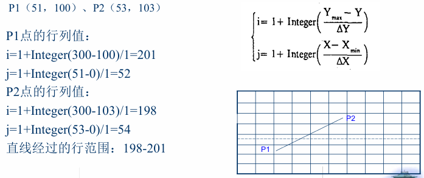
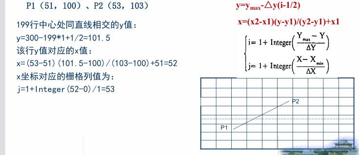
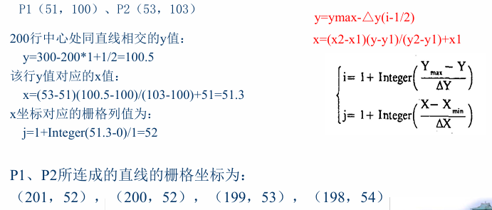

**（4）多边形转换**

PPT给出四类方法：

1.  内部点扩散算法

2.  射线算法

3.  扫描填充法

4.  边界代数算法

其中最常考的是：

**射线算法**

从待判点向图外引一条射线：

- 与多边形边界相交**偶数次** → 点在外部

- 相交**奇数次** → 点在内部

关键词：**奇内偶外**。  
注意：边界相切等特殊情况要单独处理。

**扫描算法**

扫描算法是射线算法的改进。  
步骤：

1.  求扫描线与多边形边的交点

2.  按 x 坐标排序

3.  交点两两配对

4.  对每个区间进行填充

结论：  
**扫描算法比射线算法效率更高，因为减少了大量交点计算。**

#### 2. 栅格向矢量的转换

这是另一类常考步骤题。

**基本思路**

1.  **提取边界点和结点信息**

    - 相邻 4 个栅格单元中若只有两种取值组合 → 边界点，走向唯一

    - 若有三种及以上取值 → 结点，走向不唯一

2.  **处理首尾行问题**

    - 在原始图像上下各加一行

    - 左右各加一列值为 0 的栅格  
      这样便于边界搜索。

3.  **多余点去除**

    - 若连续三个边界点近似共线，则中间点可删去

    - 目的：减少冗余，提高矢量边界质量

4.  **曲线圆滑**

    - 由于栅格精度限制，转出的边界往往不光滑

    - 可采用插补或平滑算法处理  
      如线形迭代、分段三次多项式插值、样条函数插值等。

## 第5章《GIS数据获取》

### 一、全章主线

**GIS 数据获取**，本质上是为了构建地理空间数据库或形成地理空间数据集，而对与空间位置有关的数据进行**采集、接收、转换和处理**的方法与工作。  
这不是一次性工作，后续还要根据实际情况持续更新。

**核心思路**

GIS 需要数据用于**制图、分析和建模**，获取数据时应遵循“**混搭**”思路：

1.  **先从现有数据源获取**

2.  若不存在，再考虑**创建新数据**

3.  若数据与软件不兼容，则通过**元数据和数据转换**解决

### 二、GIS数据来源

#### 1. 常见数据来源

本章列出的 GIS 数据来源主要有：

- **地图数据**：最重要的数据源之一，既有属性信息，也有空间位置和空间关系信息，精度高

- **影像数据**：现势性强、信息丰富，可快速、大面积、周期性获取专题信息，也是数据更新的重要手段

- **统计数据**：人口、基础设施、土地资源、国民经济等，是 GIS 属性数据的主要来源

- **实测数据**：野外实验、实地测量、传感器采集等，可直接进入 GIS

- **导航定位数据**：卫星定位、基站定位、室内定位获取的位置数据

- **文本数据**：法律文档、规范标准、条约文件等

- **多媒体数据**：声音、图像、录像等

- **共享数据**：来自已建系统和数据库，可扩展数据可用性与潜在价值

**一句话记忆**

**地图重精度，影像重现势，统计重属性，实测重实时，导航重位置，共享重复用。**

#### 2. 按处理阶段和处理方式划分

GIS 空间数据采集的任务有两步：

1.  **把非电子的第一手或第二手数据变成电子数据**

2.  **进一步加工处理成符合 GIS 要求的空间数据**

这里容易出名词判断题：

- **第一手数据**：平板测量、工程测量、笔记、航空遥感照片、人口普查、社会经济调查等

- **第二手数据**：地图、专题地图、统计图表、已建数据库等

- **电子数据**：全站仪、GNSS、遥感数据、已有数据库中的 GIS 数据等

#### 3. 现有可下载 GIS 数据平台

**国内**

- 地理空间数据云

- 国家卫星气象中心

- 中国科学院数据云

- 国家地球系统科学数据共享服务平台

- 资源环境数据云平台

- 对地观测数据共享计划

- 中国资源卫星应用中心

**国外 / 全球**

- Natural Earth Data

- OpenStreetMap

- FAO GeoNetwork

- USGS Earth Explorer

- NASA Earth Observations（NEO）

- NASA SEDAC

- 美国人口普查局 TIGER 数据

- NRCS 土壤数据

- DIVA-GIS

- UNEP Data Explorer

- ISCGM Global Map

- SoilGrids

**应试结论**

考试一般不会让你背网址，但会问：

- **举例说明现有 GIS 数据来源**

- **举例说明国内外共享 GIS 数据平台**

### 三、元数据

#### 1. 定义

**元数据（metadata）**：关于数据的描述，即“**数据的数据**”。  
其主要目的是：**促进数据的高效利用，实现数据共享。**

#### 2. 元数据的内容

元数据通常包括：

- 对数据集本身的描述

- 对数据项、数据来源、数据所有者、数据生产历史的说明

- 对数据质量的描述：精度、逻辑一致性、完整性、分辨率、源数据比例尺等

- 对数据处理信息的说明：转换方法、更新方式、集成方法等

#### 3. 元数据的作用

- 用于**检索、访问数据库**

- 便于对数据进行**加工和二次开发**

- 有助于**管理和维护空间数据**

- 建立**数据文档**

- 便于用户查询、检索地理空间数据

- 提供网络查询与检索的方法和途径

**一句话记忆**

**元数据不是数据本身，而是帮助你“找到、理解、评价、使用”数据的信息。**

### 四、现有数据的转换

#### 1. 定义

数据转换是把 GIS 数据从一种格式转换为另一种格式的机制。

#### 2. 两种方式

| **类型** | **含义**                                            | **记忆点**         |
|----------|-----------------------------------------------------|--------------------|
| 直接转换 | 用 GIS 软件中的译码器，把一种格式直接转成另一种格式 | 快，但依赖具体软件 |
| 中性格式 | 先转成公共交换格式，再由各软件译码成目标格式        | 适合多软件共享     |

例如：

- **直接转换**：MapInfo 的 MIF 直接转为 Shapefile

- **中性格式**：先转成 SDTS，再供不同 GIS 软件用户使用

**高频简答**

**直接转换 vs 中性格式**

- 直接转换：路径短、效率高，但兼容范围有限

- 中性格式：更适合公共数据交换和多平台共享

### 五、创建新数据

本章给出的创建新地理空间数据的方法有 7 类：

1.  遥感图像处理

2.  摄影测量方式

3.  野外数据采集

4.  众源地理数据

5.  数字化仪数字化

6.  扫描数字化

7.  屏幕数字化

其中后面 3 个合起来常被称为**地图数字化**。  
地图数字化就是：**把纸质地图转换成计算机能存储、处理和分析的数字地图的过程。**

### 六、几种主要建库方法

#### 1. 遥感图像处理

作用：

- 生成一系列 GIS 专题数据

- 提供实时数据

- 借助极高分辨率影像提取详细要素

- DOM 还可作为数字化背景或用于图层更新

**应试结论**

**遥感的优势在于：快、广、新。**  
即：获取速度快、覆盖范围大、现势性强。

#### 2. 摄影测量

摄影测量的任务：

- 测制各种比例尺地形图

- 建立地形数据库

- 建设实景三维

- 为 GIS 提供基础数据

本章结论是：  
**数字摄影测量将在 GIS 空间数据采集中发挥越来越重要的作用。**

#### 3. 野外数据采集

主要方式：

- 平板测量

- 经纬仪测量

- 全站仪测量

- GNSS 测量

**总体特点**

- **精度高**

- **效率相对较低**

- 适合**小范围 GIS 数据采集或局部数据更新**

**全站仪测量**

原理：集成了**电子经纬仪 + 激光测距仪**，可同时测目标的距离和方位，进一步得到大地坐标。  
特点：**精度相对较高。**

**GNSS 测量**

本章给了三个很容易考的小点：

- **线要素**可以通过连接一系列 GPS 定位点实现

- **4颗 GPS 卫星**可用于确定接收站坐标

- GPS 接收机给出的高程是**基于地球椭球面**，不是基于大地水准面

**一句话记忆**

**野外测量精度高，但不适合大范围快速建库。**

#### 4. 众源地理数据

**定义**

众源地理数据是指**来源广泛、由非专业个人或单位生产的地理数据**。  
随着导航定位、互联网、Web2.0 的普及，逐渐成为重要的数据获取方式。

**特点**

- **以民众作为传感器**

- **时效性强**

- **覆盖度高**

- 是大量非专业人员志愿获取并通过互联网提供的**开放地理数据**

**主要类型**

- **公共版权数据**：如天地图、OpenStreetMap 路网

- **GNSS 接收机数据**：志愿者或普通人上传的位置数据

- **网民自发创建的地理数据**：如 OpenStreetMap、Wikimapia

- **Web2.0 催生的其他地理数据**：如微博等信息中隐含的地理信息

**高频结论**

**众源数据的核心优势不是精度最高，而是更新快、覆盖广、参与者多。**

### 七、地图数字化（非常重要）

#### 1. 定义与本质

地图数字化是把纸质地图变成数字地图的过程。  
在计算机中：

- 点 → 一个坐标

- 线 → 一串坐标

- 面 → 一条或多条线围成的区域

所以地图数字化本质上是：  
**把地图上的空间特征转化为数字形式表示，并获取一系列点和线的过程。**

#### 2. 优点

- 原始数据源（地图）容易获取

- 对仪器设备和人员要求不算太高

- 采集速度快，适合大批量作业

- 可按图幅、图层分开采集，提高效率

#### 3. 三种方法

**（1）数字化仪数字化**

做法：

- 把纸质地图固定在数字化板上

- 用手扶跟踪方式逐点采集图廓点及点、线、面坐标

- 赋予属性编码

- 再做几何纠正，形成矢量数据

结论：  
**这种方法现在基本不再使用。**

**（2）扫描数字化**

基本思想：

- 用扫描仪把纸质地图扫成栅格图像

- 做**几何纠正、地理配准**

- 再通过屏幕数字化软件跟踪矢量化，形成矢量数据

后续处理还包括：

- **图形数据跟踪**

  - 点：定位到定位点即可

  - 线：按整体趋势跟踪并尽量平滑

  - 面：沿边界跟踪到闭合，并正确处理拓扑关系

- **属性赋值**

  - 可同步录入，也可后续统一录入

- **注记识别与输入**

  - 注记量大，通常应单独分层完成

**（3）屏幕数字化**

屏幕数字化也叫**平视（head-up）数字化**。  
含义是：以 DOM 等数字影像作为背景，在计算机屏幕上进行手扶跟踪数字化。

#### 4. 数字化中的线压缩（补充考点）

线压缩应满足：

- 保持曲线形状特征

- 保持特征转折点精度

- 保持空间关系正确

常见算法：

- **道格拉斯—普克法**

- **垂距法**

- **光栏法**

这部分常出在“简答题/填空题”里，不一定展开计算，但名称和原则最好记住。

### 八、空间数据录入后的处理

这部分的核心就是：**拓扑生成**。  
拓扑关注的是实体之间的**连接关系、相邻关系**，而**节点具体位置、弧段具体形状**这些非拓扑属性，不影响拓扑建立。

**1. 建立拓扑关系时要描述什么**

如果采用 DIME 或类似编码模型，多边形拓扑关系要描述：

- **多边形由哪些弧段组成**

- **弧段左右两侧分别是哪两个多边形**

- **弧段两端是哪两个节点**

- **节点连接了哪些弧段**

**一句话记忆**

**拓扑不是看图形像不像，而是看谁和谁连、谁挨着谁。**

**2. 点—线拓扑关系建立**

本章给出的思路是：

1.  从某个结点出发，数字化下一条弧段

2.  根据起结点坐标，查附近是否已有结点或弧段

3.  若存在已有结点，则新弧段不再产生新的起结点号，而直接使用已有结点

4.  终结点处理同理

5.  图形采集编辑完成后，系统自动建立点—线拓扑关系

**3. 结点表**

PPT中还强调：

- **结点表**中要记录与每个结点相连的弧段

- 并且这些弧段通常按**顺时针方向排序**记录

这很适合出填空题：

结点表中记录的是：**与结点相连并按顺时针排序的弧段。**

## 第6章 几何变换复习

### 一、本章总体逻辑

GIS 数据常来自 **数字化地图、扫描地图、遥感影像** 等。

这些数据刚获取时，往往还停留在自己的坐标体系中：

| **数据来源**        | **原始坐标特点**            | **问题**                   |
|---------------------|-----------------------------|----------------------------|
| 数字化仪 / 扫描地图 | DPI、扫描坐标、数字化仪坐标 | 不能直接与投影坐标图层叠加 |
| 遥感影像            | 行列号、像素坐标            | 不能直接表达真实地理位置   |
| GIS 投影图层        | 投影坐标，如米              | 是空间分析和叠加的基础     |

因此，需要通过 **几何变换** 把原始坐标转换到真实地图坐标或投影坐标中。

本章逻辑可以概括为：

**原始坐标数据 → 选取控制点 → 建立变换方程 → 进行几何变换 → 用 RMS 评价精度 → 栅格数据还需要重采样**

### 二、几何变换

#### 1. 几何变换的定义

**几何变换** 是指：

**利用一系列控制点建立变换方程，**

**将数字地图或图像从一种坐标系转换成另一种坐标系的过程。**

也可以理解为：

利用控制点和转换方程，把数字化地图、卫星图像或航空照片配准到投影坐标系统中的过程。

基本形式为：

$$
\begin{aligned}
X &= f_{1}(x,y) \\
Y &= f_{2}(x,y)
\end{aligned}
$$

其中：

| **符号** | **含义**                             |
|----------|--------------------------------------|
| $x,y$  | 原始坐标，如图像行列号、数字化仪坐标 |
| $X,Y$  | 目标坐标，如投影坐标、真实地图坐标   |

### 2. 几何变换的两大应用类型

#### 2.1 地图到地图的变换

指将 **数字化地图坐标** 转换为 **投影坐标**。

例如：

扫描后的纸质地图坐标 → GIS 投影坐标

特点：

- 控制点通常比较容易确定；

- 只要找到地图上已知真实世界坐标的点即可；

- 常用于纸质地图数字化后的配准。

### 2.2 图像到地图的变换

指将 **遥感影像的行列坐标 / 像素坐标** 转换为 **地图投影坐标**。

例如：

卫星影像像素坐标 → 投影坐标

特点：

- 控制点通常称为 **地面控制点GCPs**；

- GCPs必须同时能在影像上识别，也能在真实世界坐标中定位；

- 控制点选择难度通常大于地图到地图变换。

### 三、几何变换的主要类型

| **类型**     | **允许的变化**         | **保持不变的内容** | **特点**                       |
|--------------|------------------------|--------------------|--------------------------------|
| **等积变换** | 旋转                   | 形状和大小         | 只改变方向，不改变形状和尺寸   |
| **相似变换** | 旋转、整体缩放         | 形状               | 大小可变，形状不变             |
| **仿射变换** | 旋转、平移、缩放、错切 | 直线和平行关系     | GIS 配准中最常用               |
| **投影变换** | 角度、长度均可变       | 一般不保持平行     | 可将矩形变成不规则四边形       |
| **拓扑变换** | 几何形状可变           | 拓扑关系           | 重点在连接、邻接、包含关系不变 |

### 四、仿射变换

仿射变换是本章核心。

#### 1. 仿射变换的定义

**仿射变换** 是指：

**在保留图形线条平行的条件下，对目标图形进行旋转、平移、错切和不均匀缩放等操作。**

也就是说，仿射变换允许图形发生形状变化，但必须满足：

- 直线变换后仍为直线；

- 平行线变换后仍为平行线；

- 不同方向上的长度比例可以发生变化。

#### 2. 仿射变换包含的基本操作

**2.1 旋转**

图形绕原点旋转。

公式：

$$
\begin{aligned}
X &= x\cos\theta - y\sin\theta \\
Y &= x\sin\theta + y\cos\theta
\end{aligned}
$$

矩阵形式：

$$
\left\lbrack \begin{array}{r}
X \\
Y
\end{array} \right\rbrack = \begin{bmatrix}
\cos\theta & - \sin\theta \\
\sin\theta & \cos\theta
\end{bmatrix}\left\lbrack \begin{array}{r}
x \\
y
\end{array} \right\rbrack
$$

作用：**改变图形方向。**

**2.2 平移**

将图形移动到坐标系中的另一个位置。

公式：

$$
\begin{aligned}
X &= x + T_{x} \\
Y &= y + T_{y}
\end{aligned}
$$

其中：

| **符号**  | **含义**     |
|-----------|--------------|
| $T_{x}$ | x 方向平移量 |
| $T_{y}$ | y 方向平移量 |

作用：

**改变图形位置，不改变形状和大小。**

**2.3 错切**

错切是指图形沿某个坐标方向发生不等量移动，引起图形倾斜变形。

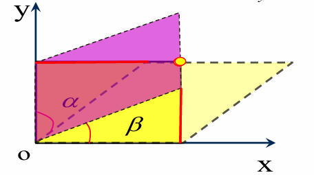
**x 方向错切**

$$
\begin{aligned}
X &= x + y \cdot sh_{x} \\
Y &= y
\end{aligned}
$$

其中：

$$
sh_{x} = \tan\alpha
$$

**y 方向错切**

$$
\begin{aligned}
X &= x \\
Y &= y + x \cdot sh_{y}
\end{aligned}
$$

其中：

$$
sh_{y} = \tan\beta
$$

作用：

**使图形发生倾斜变形，但平行关系仍保持。**

**2.4 缩放**

图形在 x、y 方向分别放大或缩小。

公式：

$$
\begin{aligned}
X &= x \cdot S_{x} \\
Y &= y \cdot S_{y}
\end{aligned}
$$

矩阵形式：

$$
\left\lbrack \begin{array}{r}
X \\
Y
\end{array} \right\rbrack = \begin{bmatrix}
S_{x} & 0 \\
0 & S_{y}
\end{bmatrix}\left\lbrack \begin{array}{r}
x \\
y
\end{array} \right\rbrack
$$

其中：

| **符号**  | **含义**       |
|-----------|----------------|
| $S_{x}$ | x 方向缩放比例 |
| $S_{y}$ | y 方向缩放比例 |

注意：

当 $S_{x} \neq S_{y}$时，会产生不均匀缩放，图形形状会改变。

### 五、仿射变换方程

#### 1. 标准形式

仿射变换最终可写成：

$$
\begin{aligned}
X &= Ax + By + C \\
Y &= Dx + Ey + F
\end{aligned}
$$

其中：

| **系数**    | **控制内容**         |
|-------------|----------------------|
| $A,B,D,E$ | 控制缩放、旋转、错切 |
| $C,F$     | 控制平移             |

#### 2. 控制点数量要求

仿射变换共有 6 个未知系数：

$$
A,B,C,D,E,F
$$

每一对控制点可以提供两个方程：

$$
\begin{aligned}
X &= Ax + By + C \\
Y &= Dx + Ey + F
\end{aligned}
$$

因此：

至少需要 **3 对不在同一直线上的控制点** 才能求解仿射变换参数。

注意：

- **控制点不能共线；**

- **控制点数量越多，通常越有利于提高稳定性；**

- **多于 3 对控制点时，一般采用最小二乘法估计变换参数。**

### 六、控制点

#### 1. 控制点的作用

控制点是连接两个坐标系统的桥梁。

在几何变换中，控制点用于：

1.  **建立原始坐标与目标坐标之间的数学关系；**

2.  **求解变换方程参数；**

3.  **评价几何配准精度。**

#### 2. 控制点选择原则

控制点质量直接决定仿射变换质量。

控制点应满足：

- **定位准确**：点位应容易识别，坐标可靠；

- **分布均匀**：应尽量分布在整个图幅范围内；

- **覆盖边缘和中心**：避免只集中在局部区域；

- **数量适当**：至少 3 对，实际应用中通常多选；

- **避免共线**：否则无法稳定求解仿射参数。

#### 3. 地面控制点 GCPs

在影像到地图变换中，控制点通常称为：

**地面控制点 GCPs**

GCPs 具有双重坐标：

| **坐标类型** | **说明**               |
|--------------|------------------------|
| 影像坐标     | 行列号或像素坐标       |
| 地图坐标     | 真实世界坐标或投影坐标 |

GCPs 的选取比普通地图控制点更难，因为必须在影像上清晰识别。

### 七、仿射变换的基本流程

几何变换通常包括三步：

**第一步：更新控制点到真实世界坐标**

将原始图像或数字化地图中的控制点与真实坐标对应起来。

**第二步：利用控制点进行仿射变换**

根据控制点求解：

$$
\begin{aligned}
X &= Ax + By + C \\
Y &= Dx + Ey + F
\end{aligned}
$$

**第三步：将变换方程应用到输入要素**

将求得的变换方程作用于所有输入要素，生成新的输出图层。

### 八、均方根 RMS 误差

#### 1. RMS 误差的作用

RMS 误差用于评价几何变换质量。

它衡量的是：

**控制点实际位置与变换估算位置之间的平均偏差。**

**控制点误差越小，说明配准精度越高。**

#### 2. 单个控制点误差

对于某个控制点：

$$
\text{误差} = \sqrt{\left( x_{act} - x_{est})^{2} + (y_{act} - y_{est} \right)^{2}}
$$

其中：

| **符号**            | **含义**       |
|---------------------|----------------|
| $x_{act},y_{act}$ | 控制点实际坐标 |
| $x_{est},y_{est}$ | 变换后估算坐标 |

#### 3. RMS 误差公式

$$
RMS = \sqrt{\frac{\sum_{i = 1}^{n}{\lbrack(}x_{act,i} - x_{est,i})^{2} + (y_{act,i} - y_{est,i})^{2}\rbrack}{n}}
$$

其中：

| **符号** | **含义**   |
|----------|------------|
| $n$    | 控制点数量 |
| $act$  | 实际坐标   |
| $est$  | 估算坐标   |

#### 4. RMS 误差的理解

RMS 误差可以理解为：

**所有控制点配准误差的综合平均水平。**

考试中要注意：

- **RMS 是评价几何变换质量的重要指标；**

- **RMS 越小，说明控制点拟合越好；**

- **RMS 只反映控制点位置误差，不一定完全代表整幅地图变换质量。**

### 九、数字化地图上的 RMS 误差问题

#### 1. RMS 误差的局限性

通常情况下：

如果 RMS 误差在可接受范围内，我们会认为整幅地图的变换也是可以接受的。

但这种判断并不总是正确。

#### 2. 为什么 RMS 可能失效？

在某些情况下，即使控制点输入出现较大错误，RMS 仍可能保持不变。

例如：

- 上方两个控制点的 X 值同时增加一个常数；

- 下方两个控制点的 X 值同时减少一个常数。

结果可能是：

- RMS 数值没有明显变化；

- 但整幅地图已经发生变形。

#### 3. 结论

RMS 误差只能说明：

控制点处的拟合误差大小。

但不能完全保证：

整幅地图内部所有位置都没有变形。

因此，评价几何变换质量时，应同时关注：

- RMS 数值；

- 控制点是否准确；

- 控制点分布是否合理；

- 变换后图形是否存在明显扭曲；

- 与已有可靠图层叠加是否吻合。

### 十、像元值重采样

#### 1. 为什么需要重采样？

几何变换会改变栅格图像的位置、方向、大小或像元排列方式。

对于栅格数据而言，变换后新的像元网格位置通常不再与原图像像元完全对应。

因此需要：

**根据原始图像像元值，为新图像的每个像元重新赋值。**

这个过程称为 **像元值重采样**。

### 2. 什么时候需要重采样？

只要输入图像和输出图像的：

- 位置发生变化；

- 坐标系发生变化；

- 像元大小发生变化；

- 栅格投影发生变化；

就需要进行重采样。

例如：

- 栅格数据从一个坐标系投影到另一个坐标系；

- 像元大小由 10 m 改为 15 m；

- 遥感影像经过几何校正；

- 建立大型栅格数据金字塔。

### 十一、三种常用重采样方法

#### 1. 邻近点插值法

**原理**

将原始图像中距离新像元中心最近的像元值，直接赋给新像元。

**特点**

| **项目**           | **内容**             |
|--------------------|----------------------|
| 计算速度           | 快                   |
| 是否改变原始像元值 | 不改变               |
| 图像效果           | 可能出现锯齿或块状感 |
| 适用数据           | 分类数据、离散数据   |

**典型应用**

适合土地利用类型、土壤类型、植被类型等分类栅格。

原因：

分类编码不能被平均，否则会产生没有意义的新类别。

### 2. 双线性插值法

**原理**

利用新像元周围 **4 个最邻近像元值**，按距离进行线性加权平均。

PPT 示例中：

先沿扫描线计算：

$$
\begin{aligned}
a &= 0.6 \times 5 + 0.4 \times 10 = 7 \\
b &= 0.6 \times 10 + 0.4 \times 15 = 12
\end{aligned}
$$

再计算：

$$
x = 0.5 \times 7 + 0.5 \times 12 = 9.5
$$

**特点**

| **项目**           | **内容** |
|--------------------|----------|
| 计算速度           | 中等     |
| 是否改变原始像元值 | 会改变   |
| 图像效果           | 较平滑   |
| 适用数据           | 连续数据 |

**典型应用**

适合高程、温度、降水、遥感灰度值等连续型数据。

#### 3. 三次卷积插值法

**原理**

利用新像元周围 **16 个相邻像元值** 进行插值计算。

**特点**

| **项目**           | **内容**             |
|--------------------|----------------------|
| 计算速度           | 较慢                 |
| 是否改变原始像元值 | 会改变               |
| 图像效果           | 最平滑，视觉质量较高 |
| 适用数据           | 连续影像数据         |

**典型应用**

适合遥感影像增强显示、连续表面数据处理等。

### 十二、三种重采样方法对比

| **方法**       | **使用像元数量** | **是否改变原值** | **优点**               | **缺点**       | **适用对象** |
|----------------|------------------|------------------|------------------------|----------------|--------------|
| 邻近点插值法   | 1 个             | 不改变           | 简单、快速、保持类别值 | 图像可能不平滑 | 分类数据     |
| 双线性插值法   | 4 个             | 改变             | 结果较平滑             | 不适合分类数据 | 连续数据     |
| 三次卷积插值法 | 16 个            | 改变             | 图像质量高、平滑       | 计算量较大     | 连续影像     |

### 十三、知识点之间的关系

本章知识不能孤立记忆，要按流程理解：

**1. 几何变换解决“坐标不统一”的问题**

数字化地图和遥感影像最初不能直接用于 GIS 分析，需要通过几何变换转换到地图坐标系统。

**2. 控制点是几何变换的基础**

控制点提供原始坐标与目标坐标之间的对应关系。

没有控制点，就无法建立变换方程。

**3. 仿射变换是常用数学模型**

仿射变换通过：

- 旋转；

- 平移；

- 缩放；

- 错切；

实现坐标转换。

其核心公式是：

$$
\begin{aligned}
X &= Ax + By + C \\
Y &= Dx + Ey + F
\end{aligned}
$$

**4. RMS 用于评价变换质量**

变换完成后，需要用 RMS 误差衡量控制点实际位置与估算位置之间的偏差。

**5. 栅格数据变换后必须重采样**

矢量数据可以直接对坐标点进行变换。

但栅格数据由像元组成，几何变换后新旧像元位置不完全对应，因此必须重新确定像元值。

## 第7章 空间数据准确度和质量

### 一、本章核心逻辑

本章的主线可以概括为：

- **GIS 数据要可靠，首先要知道错误从哪里来；**

- **其次要知道如何评价准确度；**

- **最后要掌握如何通过编辑操作修正错误、提升数据质量。**

从 PPT 内容看，本章可以分成三个层次：

**1. 为什么要进行空间数据编辑？**

空间数据是GIS分析、制图、查询和空间决策的基础。如果数据本身存在位置偏差、拓扑关系错误或图层之间不匹配，那么后续的叠加分析、网络分析、缓冲区分析、路径分析等结果都会受到影响。

因此，空间数据编辑的作用主要有两个：

- **消除数字化错误**

- **实现空间数据更新**

其中，矢量数据常见的数字化错误主要包括两类：

| **错误类型** | **核心含义**   | **典型表现**                       |
|--------------|----------------|------------------------------------|
| 定位错误     | 几何位置不准确 | 线条偏移、扭曲、塌陷、多余线       |
| 拓扑错误     | 空间关系不一致 | 悬挂节点、未闭合多边形、缝隙、重叠 |

**2. 如何评价空间数据质量？**

评价空间数据质量，重点不是只看数据“画得像不像”，而是要判断其位置记录与真实地面位置之间的接近程度。

本章重点介绍了空间数据准确度标准，尤其是美国空间数据准确度标准的发展过程，包括：

- **NMAS：国家制图准确度标准**

- **ASPRS：大比例尺地图准确度标准**

- **NSSDA：空间数据准确度国家标准**

其中，NSSDA 使用 **均方根误差 RMS** 来评价空间数据位置准确度，并建议检查点数量不少于 20 个。

**3. 如何修正空间数据错误？**

空间数据错误的修正主要通过两类编辑完成：

| **编辑类型** | **主要作用**                           |
|--------------|----------------------------------------|
| 拓扑编辑     | 修正空间要素之间的逻辑关系错误         |
| 非拓扑编辑   | 对单个要素进行基本几何修改或创建新要素 |

拓扑编辑更强调空间关系，例如“线是否相连”“面是否闭合”“面之间是否存在缝隙或重叠”；非拓扑编辑则更偏向基本图形操作，例如移动、删除、重塑、分割、融合、缓冲、相交等。

### 二、知识点关系图式梳理

可以把本章内容理解成下面这个结构：

空间数据准确度和质量  
│  
├── 1. 空间数据错误来源  
│ ├── 定位错误  
│ │ ├── 二手数据源错误  
│ │ │ ├── 手扶跟踪数字化误差  
│ │ │ ├── 扫描与自动跟踪误差  
│ │ │ └── 坐标转换控制点误差  
│ │ └── 第一手数据源错误  
│ │ └── 与测量工具分辨率有关  
│ │  
│ └── 拓扑错误  
│ ├── 多边形错误  
│ ├── 线要素错误  
│ ├── 点要素错误  
│ └── 不同图层之间的拓扑错误  
│  
├── 2. 空间数据准确度评价  
│ ├── NMAS  
│ ├── ASPRS  
│ └── NSSDA  
│ └── RMS 均方根误差  
│  
├── 3. 空间数据编辑方法  
│ ├── 拓扑编辑  
│ │ ├── 聚合容差  
│ │ ├── 接合容差  
│ │ ├── 清除伪节点  
│ │ ├── 地图拓扑编辑  
│ │ └── 拓扑规则编辑  
│ │  
│ └── 非拓扑编辑  
│ ├── 延伸或整饰线条  
│ ├── 删除或移动要素  
│ ├── 重塑要素  
│ ├── 分割线和多边形  
│ └── 从现有要素创建新要素  
│  
└── 4. 其他编辑操作  
├── 图幅拼接  
├── 线的泛化  
└── 线的平滑

### 三、重点概念解释

#### 1. 空间数据准确度

**空间数据准确度** 是指空间要素记录的位置与其真实地面位置之间的接近程度。

简单说，准确度关注的是：

数据中的点、线、面是否接近现实世界中的真实位置。

例如，地图上一条道路的位置与实地道路中心线越接近，说明该道路数据的位置准确度越高。

#### 2. 空间数据精确度

**空间数据精确度** 是指位置记录本身的精细程度或重复一致性。

它强调的是数据表达得是否细、是否稳定，而不一定代表它离真实位置近。

例如，一个坐标记录到小数点后很多位，看起来很“精细”，但如果整体坐标系统有偏差，它仍然可能不准确。

#### 3. 定位错误

**定位错误** 是数字化要素的几何位置错误，主要表现为数字化后的几何要素与源地图或真实目标的位置不一致。

常见原因包括：

- 手工跟踪数字化时产生人为误差；

- 扫描或自动跟踪时，由于线条太近、太宽、太细、断裂或交叉，导致跟踪算法出错；

- 坐标转换过程中控制点选取或控制点坐标存在误差；

- GNSS、遥感影像等第一手数据受到仪器分辨率和观测条件影响。

#### 4. 拓扑错误

**拓扑错误** 是指空间要素之间的逻辑关系不正确。

它不一定表现为单个要素形状错误，而是表现为要素之间的关系错误。

例如：

- 两条本应相接的道路没有接上；

- 两个相邻行政区之间出现缝隙；

- 两个地块之间发生不合理重叠；

- 河流方向与高程变化方向矛盾；

- 监测站点没有落在河流线上。

#### 5. 拓扑编辑

**拓扑编辑** 是为了检查和修正拓扑错误而进行的编辑操作。

它的核心不是简单移动图形，而是保证空间要素之间满足规定的拓扑关系。例如：

- 点必须落在线上；

- 线不能有悬挂节点；

- 多边形必须闭合；

- 多边形之间不能有缝隙或重叠；

- 相邻图层边界应保持一致。

#### 6. 非拓扑编辑

**非拓扑编辑** 是对空间要素进行基本几何修改或从已有要素创建新要素的操作。

它主要处理单个或若干个要素的几何形态，而不一定强调拓扑关系。

常见操作包括：

- 延伸线条；

- 删除或移动要素；

- 重塑线或面；

- 分割线和多边形；

- 融合、缓冲、合并、相交等。

#### 7. 图幅拼接

**图幅拼接** 是指沿相邻图层或图幅边缘进行线条匹配，使跨越边界的线状要素保持连续。

它常用于多幅地图接边处理。如果边界线条不匹配，放大后会发现道路、河流或等高线在图幅边界处出现错位。

#### 8. 线的泛化

**线的泛化** 是通过删除线条上的部分节点，使线条变得更简化的过程。

它常用于地图缩编或小比例尺表达中。泛化的目标是减少数据量，同时尽量保留线状要素的主要形态特征。

#### 9. 线的平滑

**线的平滑** 是利用数学函数改变线型，使线条更加连续、圆滑的过程。

与线的泛化不同，平滑不只是减少点，而是通过插值或曲线函数改善线条形态。

### 四、关键公式、方法与流程

#### 1. 空间数据准确度评价公式：RMS

$$
RMS = \sqrt{\frac{\sum_{i = 1}^{n}\left\lbrack (x_{data,i} - x_{check,i})^{2} + (y_{data,i} - y_{check,i})^{2} \right\rbrack}{n}}
$$

其中：

| **符号**                    | **含义**                               |
|-----------------------------|----------------------------------------|
| $x_{data,i},y_{data,i}$   | 数据集中第 $i$个检查点的坐标           |
| $x_{check,i},y_{check,i}$ | 高准确度参照数据中第 $i$个检查点的坐标 |
| $n$                       | 被测检查点数量                         |
| $i$                       | 第 $i$个检查点                         |

核心理解：

RMS 反映的是待检数据坐标与高精度参考坐标之间的平均位置偏差，数值越小，说明空间数据的位置准确度越高。

#### 2. 空间数据准确度标准发展过程

| **阶段** | **标准** | **核心特点**                                   |
|----------|----------|------------------------------------------------|
| 1947 年  | NMAS     | 采用固定误差阈值判断地图精度                   |
| 1990 年  | ASPRS    | 用均方根误差 RMSE 取代固定阈值                 |
| 1998 年  | NSSDA    | 形成空间数据准确度国家标准，扩展适用比例尺范围 |

可记忆为：

空间数据准确度标准经历了从固定阈值评价到均方根误差评价，再到国家标准化评价的发展过程。

#### 3. 定位错误检查思路

确定数据源  
│  
├── 二手数据源  
│ ├── 与纸质源地图比较  
│ ├── 检查跟踪线是否偏移、塌陷、变形  
│ └── 检查坐标转换控制点是否可靠  
│  
└── 第一手数据源  
├── 检查测量工具分辨率  
├── 检查采集环境  
└── 检查数据与实地目标的一致性

#### 4. 拓扑错误分类

| **类型**       | **常见错误**                                         |
|----------------|------------------------------------------------------|
| 多边形拓扑错误 | 未闭合、多边形之间有缝隙、多边形重叠                 |
| 线要素拓扑错误 | 悬挂节点、伪节点、重复线、方向错误                   |
| 点要素拓扑错误 | 点没有落在线或面内，一个多边形存在多个内部标识点     |
| 图层间拓扑错误 | 边界不一致、点线关系错误、点面关系错误、线与线不连接 |

#### 5. 拓扑规则编辑流程

拓扑规则编辑一般包括三个步骤：

具体来说：

| **步骤** | **内容**                                     |
|----------|----------------------------------------------|
| 创建拓扑 | 定义参与要素类型、排序、拓扑规则和聚合容差   |
| 拓扑验证 | 检查哪些要素违反拓扑规则，并形成拓扑错误图层 |
| 修复错误 | 使用 GIS 软件提供的拓扑修正工具进行处理      |

#### 6. 聚合容差与接合容差

| **项目** | **聚合容差** | **接合容差** |
|----------|----------------------------------------|----------------------------------------|
| 又称     | XY 容差                                | Snap 容差                              |
| 主要对象 | 顶点                                   | 顶点、边缘、终点                       |
| 主要作用 | 自动捕捉距离很近的点，使其一致         | 将局部不匹配的点、线、边进行吸附       |
| 使用场景 | 处理小的过伸、未及、重复线             | 处理局部较明显的连接错误               |
| 注意事项 | 不宜设置过大，否则会改变线和面的形状   | 可配合较小聚合容差使用                 |

一句话区分：

聚合容差更偏向整体数据中的细小误差处理，接合容差更适合局部几何对象之间的吸附和连接。

#### 7. 非拓扑编辑常见操作

| **操作**       | **含义**                                 |
|----------------|------------------------------------------|
| 延伸或整饰线条 | 延长或裁剪线，使其与目标线相交或会合     |
| 删除/移动要素  | 对点、线、面进行删除或移动               |
| 集成           | 在指定 $x,y$容差内使要素一致             |
| 重塑要素       | 通过移动、删除或添加节点改变线或面的形状 |
| 分割线和多边形 | 用新线分割已有线段或多边形               |

#### 8. 从现有要素创建新要素

| **操作** | **英文**  | **作用**                         |
|----------|-----------|----------------------------------|
| 要素融合 | Merge     | 将选中的线或多边形组合成一个要素 |
| 要素缓冲 | Buffer    | 在指定距离内围绕要素创建缓冲区   |
| 要素合并 | Union     | 将不同图层的要素组合成一个新要素 |
| 要素相交 | Intersect | 由不同图层重叠部分生成新要素     |

需要注意：

Merge 通常针对同一图层中的要素，Union 和 Intersect 通常涉及不同图层之间的空间叠加关系。

#### 9. 线的泛化与平滑方法

| **方法**             | **含义**                                         | **特点**                           |
|----------------------|--------------------------------------------------|------------------------------------|
| Douglas-Peucker 算法 | 根据容差和点到趋势线的离差删除节点               | 简化效果明显，但可能产生较明显折角 |
| 弯曲简化             | 将曲线划分为若干弯曲，删除不重要弯曲             | 更关注线形整体弯曲特征             |
| 权重面积法           | 根据点与相邻点构成的加权三角形面积判断点的重要性 | 通过几何面积衡量节点贡献           |
| 线的平滑             | 使用数学函数生成新节点，使线条更圆滑             | 适合改善线条视觉形态               |

### 五、PPT 思考题解答

PPT 最后一页列出的重点掌握内容可以作为思考题来回答。

#### 思考题 1：空间数据准确度和精确度有何异同？

**答案：**

空间数据准确度和精确度都用于描述空间数据质量，但二者侧重点不同。

**空间数据准确度** 是指空间要素记录的位置与真实地面位置之间的接近程度。也就是说，数据中的点、线、面越接近现实世界中的真实位置，准确度越高。

**空间数据精确度** 是指位置记录本身的细致程度、分辨能力或重复一致性。它强调数据表达得是否细、测量结果是否稳定，而不一定代表位置一定接近真实值。

二者的区别可以概括为：

| **项目** | **准确度**                   | **精确度**                   |
|----------|------------------------------|------------------------------|
| 关注重点 | 是否接近真实位置             | 表达是否细致、结果是否一致   |
| 衡量对象 | 数据与真实地面位置之间的差距 | 数据记录本身的分辨率和重复性 |
| 典型问题 | 坐标整体偏移、位置不准       | 坐标记录粗略、重复测量离散   |
| 关系     | 准确度高说明接近真实值       | 精确度高不一定准确           |

因此，空间数据质量评价中不能只看数据记录是否精细，还要判断其是否接近真实地理位置。

#### 思考题 2：空间数据准确度的度量方法或标准有哪些？

**答案：**

空间数据准确度的度量主要依赖检查点坐标与高精度参考坐标之间的误差统计。PPT 中重点介绍了美国空间数据准确度标准的发展，包括 NMAS、ASPRS 和 NSSDA。

**1. NMAS 标准**

NMAS 是美国国家制图准确度标准，采用固定阈值判断地图精度。其基本思想是：在一定比例尺条件下，测试点误差超过规定距离的比例不能超过一定限度。

**2. ASPRS 标准**

ASPRS 是美国摄影测量和遥感学会提出的大比例尺地图准确度标准。它用 **均方根误差 RMSE** 取代固定误差阈值，对水平准确度进行定义。

**3. NSSDA 标准**

NSSDA 是美国联邦地理数据委员会提出的空间数据准确度国家标准。它继承了 ASPRS 的 RMS 思想，并扩展了适用比例尺范围。

NSSDA 中常用的准确度评价公式为：

$$
RMS = \sqrt{\frac{\sum_{i = 1}^{n}\left\lbrack (x_{data,i} - x_{check,i})^{2} + (y_{data,i} - y_{check,i})^{2} \right\rbrack}{n}}
$$

其中，$x_{data,i},y_{data,i}$ 是待检数据中的检查点坐标，$x_{check,i},y_{check,i}$ 是高精度参考数据中的检查点坐标，$n$ 是检查点数量。

NSSDA 建议检查点数量不少于 20 个。

#### 思考题 3：拓扑错误包含哪些类型？

**答案：**

拓扑错误是空间要素之间逻辑关系不一致所产生的错误。根据要素类型，拓扑错误主要包括以下几类：

**1. 面状要素拓扑错误**

主要包括：

- 未闭合多边形；

- 相邻多边形之间存在缝隙；

- 多边形之间发生重叠。

这类错误会影响面积统计、空间叠加和土地利用分类等分析结果。

**2. 线状要素拓扑错误**

主要包括：

- 悬挂节点；

- 伪节点；

- 线要素重复或重叠；

- 线方向错误。

例如道路网络中出现未连接的线段，会影响网络连通性和最短路径分析。

**3. 点状要素拓扑错误**

主要包括：

- 点没有落在对应线要素上；

- 点没有落在对应面要素内部；

- 一个多边形中存在多个内部标识点。

例如水文监测站点应布设在河流线上，如果点没有落在河流线上，就属于点线关系错误。

**4. 不同图层之间的拓扑错误**

主要包括：

- 两个面图层的边界不一致；

- 一个图层的线与另一个图层的线没有正确连接；

- 点要素没有落在另一图层的线或面上；

- 一个图层的线没有被另一图层的线覆盖。

这类错误在多图层叠加分析中尤其常见，也最容易影响综合分析结果。

#### 思考题 4：什么是拓扑编辑？常见拓扑编辑方法有哪些？

**答案：**

拓扑编辑是指利用 GIS 软件检查、显示并修正空间数据中拓扑关系错误的过程。它的目的在于保证点、线、面之间满足既定的空间逻辑关系。

常见拓扑编辑方法包括：

**1. 结点吻合**

结点吻合是将本应表示同一位置、但由于数字化误差导致坐标不完全一致的多个结点匹配到同一位置。

常见方式包括：

- 结点移动；

- 框选范围内结点自动取中点；

- 求两线交点或延长线交点；

- 在给定容差范围内自动匹配。

**2. 结点与线吻合**

当一个结点本应落在线要素上，但实际没有完全相交时，可以通过移动结点、求线段交点或自动捕捉方式，使结点与线实现吻合。

**3. 聚合容差处理**

聚合容差用于捕捉距离很近的顶点，使其在指定范围内自动一致。它适合处理小的过伸、未及和重复线问题，但不能设置过大，否则会改变原有线或面的形状。

**4. 接合容差处理**

接合容差可以捕捉顶点、边缘和终点，适合处理局部较明显的连接错误。实际操作中，常采用较小聚合容差，再配合接合容差处理局部严重错误。

**5. 清除伪节点**

伪节点会把一条完整线分成两段。若伪节点没有实际意义，可以通过合并线段来清除；如果伪节点代表真实属性变化或管理分界，则应保留。

**6. 地图拓扑编辑**

地图拓扑是在一个或多个图层之间临时建立拓扑关系，用于同时编辑共享几何部分。例如土地利用图层和土壤图层的外部边界需要保持一致时，可以通过地图拓扑进行同步编辑。

**7. 拓扑规则编辑**

拓扑规则编辑通常包括三个步骤：

创建拓扑规则  
↓  
进行拓扑验证  
↓  
修复拓扑错误

它适合系统检查和修正图层内部以及图层之间的拓扑错误。

#### 思考题 5：什么是非拓扑编辑？常见非拓扑编辑操作有哪些？

**答案：**

非拓扑编辑是指不依赖拓扑关系约束，对空间要素进行基本几何修改或从已有要素创建新要素的操作。它主要关注要素本身的形状、位置和组成方式。

常见非拓扑编辑操作包括：

**1. 延伸或整饰线条**

将线条延伸或裁剪，使其与目标线相交或会合。

**2. 删除或移动要素**

对选中的点、线、多边形要素进行删除或移动。需要注意的是，移动面要素后，原位置可能产生空白区域。

**3. 集成**

如果要素落在指定的 $x,y$容差范围内，可以通过集成操作使其位置一致。

**4. 重塑要素**

通过移动、删除或添加节点改变线或多边形的形状。

**5. 分割线和多边形**

通过绘制穿越已有线段或多边形的新线，将线或面分割成多个部分。

**6. 从现有要素创建新要素**

包括：

| **操作**  | **说明**                             |
|-----------|--------------------------------------|
| Merge     | 将选中的线或多边形组合成一个要素     |
| Buffer    | 围绕点、线或面在指定距离内生成缓冲区 |
| Union     | 将不同图层的要素组合成新的叠加结果   |
| Intersect | 提取不同图层重叠部分生成新要素       |

#### 思考题 6：线的泛化和平滑有什么区别？

**答案：**

线的泛化和平滑都是线状要素编辑的重要方法，但二者目的不同。

**线的泛化** 是通过删除线条上的部分节点来简化线条。它主要用于减少数据量、降低线条复杂度，并适应较小比例尺地图表达。

常见泛化方法包括：

- Douglas-Peucker 算法；

- 弯曲简化；

- 权重面积法。

其中，Douglas-Peucker 算法通过设定容差，计算节点到趋势线的离差，逐步保留重要节点、删除次要节点。它的缺点是简化后的线条可能出现明显棱角。

**线的平滑** 是通过数学函数生成新节点或调整线型，使线条更加圆滑自然。它不只是删除点，而是改变线条形态，使其视觉效果更加连续。

二者区别可以概括为：

| **项目** | **线的泛化**           | **线的平滑**           |
|----------|------------------------|------------------------|
| 主要目的 | 简化线条               | 改善线型               |
| 主要方法 | 删除不重要节点         | 使用数学函数调整线条   |
| 结果特点 | 节点减少，形状更概括   | 线条更圆滑自然         |
| 应用场景 | 地图缩编、小比例尺表达 | 线状要素美化、形态优化 |

## 第8章 属性数据管理

### 一、本章核心逻辑

本章围绕 GIS 中的 **属性数据如何组织、存储、关联、输入和处理** 展开。前一章主要讨论空间数据的准确度和编辑问题，而这一章转向空间要素背后的描述性信息，也就是属性数据。

本章的核心主线可以概括为：

**GIS 不仅要管理“在哪里”的空间位置，还要管理“是什么、有什么特征、与谁相关”的属性信息。属性数据管理的关键，是通过表格、关键字和数据库关系，把空间对象与其描述信息有效组织起来。**

从 PPT 内容来看，本章可以分为五个层次：

#### 1. 属性数据是什么

GIS 数据包括两部分：

| **类型** | **作用**                                   |
|----------|--------------------------------------------|
| 空间数据 | 描述空间要素的几何形状和位置               |
| 属性数据 | 描述空间要素的名称、类型、数量、等级等特征 |

例如一条道路的几何线段属于空间数据，而道路名称、道路等级、长度、邮政编码等信息属于属性数据。

#### 2. 属性数据如何存储

属性数据通常以表格形式存储。表格由 **行和列** 组成：

| **表格组成** | **含义**                           |
|--------------|------------------------------------|
| 行           | 一条记录，通常对应一个空间要素     |
| 列           | 一个字段，表示空间要素的某个属性   |
| 单元格       | 某一要素在某一属性字段上的具体取值 |

对于矢量数据和栅格数据，属性数据的管理方式不同；对于地理关系模型和面向对象模型，空间数据与属性数据的组织方式也不同。

#### 3. 属性数据如何组织成数据库

关系数据库是 GIS 属性数据管理中最常用、最标准的数据库设计方式。它通过 **表、记录、字段、主键、外键** 等概念，把不同数据表联系起来。

其中：

- **主键** 用来唯一标识一条记录；

- **外键** 用来引用另一个表中的主键；

- 表与表之间通过关键字段建立联系。

#### 4. 属性表之间如何建立联系

GIS 中常用的表间联系方法包括：

| **方法**                  | **特点**                                      |
|---------------------------|-----------------------------------------------|
| Join 合并                 | 把一个表的字段追加到另一个表中                |
| Relate 关联               | 临时建立表间联系，但表仍保持独立              |
| Relationship Class 关系类 | 在 geodatabase 中预先定义和存储对象之间的关系 |
| Spatial Join 空间连接     | 根据空间位置关系连接两个图层的属性            |

其中，Join 依赖共同字段，Spatial Join 则依赖空间关系，例如包含、相交、邻近等。

#### 5. 属性数据如何输入和处理

属性数据输入包括字段定义、数据导入、键盘录入和属性校核。属性数据处理则包括字段添加、字段删除、属性分类和属性计算等操作。

这一部分更偏实际操作，重点是掌握：

- 字段怎么定义；

- 数据怎么导入；

- 属性数据如何检查；

- 字段如何计算和更新。

### 二、知识点关系图式梳理

本章知识体系可以整理为下面的结构：

第8章 属性数据管理  
│  
├── 1. GIS中的属性数据  
│ ├── 空间数据与属性数据  
│ ├── 矢量数据的属性管理  
│ │ ├── 地理关系数据模型：几何与属性分开存储  
│ │ └── 面向对象数据模型：几何与属性集中存储  
│ ├── 栅格数据的属性管理  
│ │ └── Value字段与Count字段  
│ ├── 属性表类型  
│ │ ├── 要素属性表  
│ │ └── 非空间属性表  
│ ├── 数据库管理系统 DBMS  
│ └── 属性数据类型  
│ ├── 数字型  
│ ├── 文本型  
│ ├── 日期型  
│ ├── BLOB  
│ └── 测量尺度类型  
│ ├── 命名型  
│ ├── 有序型  
│ ├── 区间型  
│ └── 比率型  
│  
├── 2. 关系数据库模型  
│ ├── 平面文件  
│ ├── 层次模型  
│ ├── 网络模型  
│ ├── 关系模型  
│ ├── 主键与外键  
│ ├── 候选码、主码、全码  
│ ├── 主属性与非主属性  
│ ├── 规范化  
│ │ ├── 第一范式  
│ │ ├── 第二范式  
│ │ └── 第三范式  
│ └── 关系类型  
│ ├── 一对一  
│ ├── 一对多  
│ ├── 多对一  
│ └── 多对多  
│  
├── 3. 合并、关联和关系类  
│ ├── Join 合并  
│ ├── Relate 关联  
│ └── Relationship Class 关系类  
│  
├── 4. 空间连接  
│ ├── 包含关系  
│ ├── 求交关系  
│ └── 邻近关系  
│  
├── 5. 属性数据输入  
│ ├── 字段定义  
│ ├── 数据输入方法  
│ └── 属性数据校核  
│  
└── 6. 字段与属性数据处理  
├── 添加和删除字段  
├── 属性数据分类  
└── 属性数据计算

### 三、重点概念解释

#### 1. 属性数据

**属性数据** 是描述空间要素特征的数据。

例如：

| **空间要素** | **属性数据示例**             |
|--------------|------------------------------|
| 道路         | 道路名称、道路等级、长度     |
| 地块         | 土地利用类型、面积、权属     |
| 学校         | 学校名称、学生人数、所属区域 |
| 栅格影像     | 像元值、像元数量、类别编号   |

属性数据与空间数据共同构成 GIS 数据的完整表达。

#### 2. 要素属性表

**要素属性表** 是直接与空间要素相联系的属性表。每一个矢量数据集通常都有一个要素属性表。

它的特点是：

- 每一行对应一个空间要素；

- 每一列表示该要素的一个属性；

- 可以通过要素 ID 或 Shape 字段与几何对象相联系。

<!-- -->

- 在地理关系数据模型中，属性表通过要素 ID 与空间几何连接；

- 在面向对象数据模型中，几何信息可以作为字段存储在同一张表中。

#### 3. 非空间属性表

**非空间属性表** 是不直接存储空间几何信息的独立表格，常用于存储补充性属性信息。

例如城市人口统计表、经济统计表、调查问卷表等。它们本身不包含点、线、面几何对象，但可以通过 ID、编码、名称等字段与空间数据建立联系。

一句话理解：

要素属性表直接对应空间要素，非空间属性表本身不对应几何对象，但可以通过关键字段与空间数据关联。

#### 4. 数据库管理系统 DBMS

**数据库管理系统 DBMS** 是用于建立、管理和操作数据库的软件系统。

它主要提供以下功能：

- 数据输入；

- 数据搜索；

- 数据存取；

- 数据操作；

- 数据输出。

在 GIS 中，既可以使用本地数据库，也可以使用远程数据库系统。例如 ArcGIS 中的个人 geodatabase 可以使用 MS Access 进行管理。

#### 5. 属性数据类型

属性数据可以按照两种方式分类。

**按数据存储类型分类**

| **类型** | **含义**         | **示例**               |
|----------|------------------|------------------------|
| 数字型   | 存储数值         | 面积、人口、长度       |
| 文本型   | 存储文字或字符串 | 地名、道路名、类型名称 |
| 日期型   | 存储日期或时间   | 调查日期、建成年份     |
| BLOB     | 存储二进制对象   | 图像、几何数据、附件   |

其中，BLOB 可以通过紧凑的二进制格式存储复杂数据，在 GIS 数据管理中具有重要作用。

**按测量尺度分类**

| **类型**        | **含义**                         | **示例**                 |
|-----------------|----------------------------------|--------------------------|
| 命名型 Nominal  | 只表示类别，没有大小顺序         | 土地利用类型、行政区名称 |
| 有序型 Ordinal  | 表示等级或顺序                   | 道路等级、适宜性等级     |
| 区间型 Interval | 数值间差值有意义，但没有绝对零点 | 摄氏温度                 |
| 比率型 Ratio    | 有绝对零点，可进行比例计算       | 面积、长度、人口         |

#### 6. 关系数据库模型

**关系数据库模型** 是以表格形式组织数据的数据库模型。它通过行和列组织数据，并通过主键和外键建立表之间的联系。

其基本特点是：

- 数据以表格形式存储；

- 表由记录和字段组成；

- 表之间通过关键字建立联系；

- 支持 SQL 查询；

- 适合 GIS 中大规模属性数据管理。

关系数据库是 GIS 属性数据管理的标准设计。

#### 7. 主键

**主键** 是表中用于**唯一标识每一条记录**的字段或字段组合。

主键具有以下特点：

| **特点** | **说明**                                 |
|----------|------------------------------------------|
| 唯一性   | 每条记录的主键值不能重复                 |
| 非空性   | 主键不能为空                             |
| 稳定性   | 主键值不应频繁改变                       |
| 标识性   | 可以唯一确定一条记录                     |
| 自动索引 | 数据库通常会为主键建立索引，提高查询效率 |

例如地块表中的 PIN 编号、学生表中的学号、行政区表中的行政区代码，都可以作为主键。

#### 8. 外键

**外键** 是一个表中用来引用另一个表***主键***的字段。

它的作用是建立表与表之间的关系。例如：

- 地块表中有一个土地类型编码；

- 土地类型表中以土地类型编码作为主键；

- 地块表中的土地类型编码就是外键。

一句话理解：

主键负责“唯一识别自己”，外键负责“连接别的表”。

### 9. 候选码、主码、全码、主属性、非主属性

| **概念** | **含义**                                                     |
|----------|--------------------------------------------------------------|
| 候选码   | 能唯一标识一个元组的属性或属性组，且其任一子集不能再唯一标识 |
| 主码     | 从多个候选码中选定的一个作为主键                             |
| 全码     | 整个属性组共同构成候选码                                     |
| 主属性   | 包含在任一候选码中的属性                                     |
| 非主属性 | 不包含在任何候选码中的属性                                   |

这一部分容易出现在数据库基础题中，核心是理解“唯一标识记录”的逻辑。

#### 10. 数据库规范化

**规范化** 是将一个包含大量属性的大表分解成若干小表，并通过**关键字段**保持表间联系的过程。

规范化的目的包括：

- 减少数据冗余；

- 避免更新异常；

- 避免插入异常；

- 避免删除异常；

- 提高数据一致性和完整性；

- 便于后续维护和更新。

#### 11. Join 合并

**Join 合并** 是利用两个表中的共同字段，将一个表的字段追加到另一个表中。

特点：

- 依赖共同关键字；

- 常用于一对一或多对一关系；

- 合并后结果表字段被扩展；

- 若要永久保存结果，需要导出数据。

#### 12. Relate 关联

**Relate 关联** 是临时建立两个表之间的联系，但两个表仍保持独立。

特点：

- 表结构不直接合并；

- 四种关系类型都适用；

- 一个表中记录被选中时，另一个表中对应记录也可同步进入选择集；

- 更适合复杂关系，尤其是一对多或多对多关系。

#### 13. 关系类

**关系类** 是 geodatabase 中预先定义并存储的对象关系。

它适用于面向对象数据模型，可以更稳定地管理对象之间的关联关系。

与普通 Join 或 Relate 相比，关系类更强调：

- 关系被预先定义；

- 关系存储在 geodatabase 中；

- 可用于多种关系操作；

- 更适合长期维护的数据管理场景。

#### 14. 空间连接

**空间连接** 是根据空间位置关系连接两个图层的属性数据。

它与属性连接的区别在于：

| **类型** | **匹配依据** |
|----------|--------------|
| 属性连接 | 共同字段     |
| 空间连接 | 空间位置关系 |

常见空间连接关系包括：

- 包含：例如一个县包含哪些学校；

- 求交：例如哪些道路穿过火灾区；

- 邻近：例如哪个村庄离断裂带最近。

### 四、关键方法与流程

#### 1. GIS 中属性数据的管理方式

**矢量数据的属性管理**

矢量数据中，空间数据和属性数据通常能够明确区分。

| **数据模型**     | **管理方式**                                            |
|------------------|---------------------------------------------------------|
| 地理关系数据模型 | 几何数据和属性数据分开存储，通过 ID 连接                |
| 面向对象数据模型 | 几何数据和属性数据集中存储，例如 Shape 字段存储几何特征 |

例如 shapefile、TIGER 文件等属于空间数据和属性数据分开管理；

而 geodatabase 则可以将几何和属性整合在同一对象模型中。

**栅格数据的属性管理**

栅格数据通常通过***栅格属性表***管理属性信息。

常见字段包括：

| **字段** | **含义**               |
|----------|------------------------|
| Value    | 像元值                 |
| Count    | 具有该像元值的像元数量 |

例如土地利用栅格中，Value 字段可以表示不同土地利用类型编码，Count 字段表示每类像元出现的数量。

#### 2. 四种数据库模型对比

| **模型**     | **数据结构**         | **关系支持**       | **优点**                       | **缺点**             |
|--------------|----------------------|--------------------|--------------------------------|----------------------|
| **平面文件** | 简单文本或二进制文件 | 基本不支持复杂关系 | 简单易用                       | 冗余严重、查询效率低 |
| **层次模型** | 树状结构             | 一对多             | 结构清晰、父子查询效率高       | 难表示多对多关系     |
| **网络模型** | 图状结构             | 一对多、多对多     | 比层次模型灵活                 | 设计维护复杂         |
| **关系模型** | 表格结构             | 支持复杂关系       | 易理解、易查询、适合大规模管理 | 复杂关系下需优化查询 |

结论：

关系数据库模型由于结构清晰、可扩展性强、支持多表查询，成为 GIS 属性数据管理的标准设计。

#### 3. 关系数据库基本结构

关系数据库可以理解为由多个相互关联的表组成。

关系数据库  
│  
├── 表 Table  
│ ├── 行 Row / Record：记录  
│ └── 列 Column / Field：字段  
│  
├── 主键 Primary Key  
│ └── 唯一标识每条记录  
│  
└── 外键 Foreign Key  
└── 引用其他表中的主键，建立表间关系

例如：

地块表  
PIN 面积 土地类型编码  
P101 1.0 1  
P102 3.0 2  
  
土地类型表  
土地类型编码 土地类型  
1 Residential  
2 Commercial

其中，土地类型表中的“土地类型编码”是主键，地块表中的“土地类型编码”是外键。

#### 4. 规范化流程

PPT 中重点讲了第一范式、第二范式和第三范式，可以整理如下：

**第一范式 1NF**

要求：

字段值必须是原子的，一个字段中不能包含多个值。

例如一个地块有两个所有者，不能把两个所有者写在同一个单元格里，而应该拆成两条记录。

作用：

- 消除重复值；

- 保证每个字段只表达一个属性值；

- 为后续规范化打基础。

**第二范式 2NF**

要求：

非主属性必须完全依赖于主关键字，不能只依赖主关键字的一部分。

它主要解决 **部分依赖** 问题。

作用：

- 减少数据冗余；

- 提高数据一致性；

- 将不同主题的信息拆成独立表格。

例如地块信息、所有者信息、地址信息可以拆成不同表格，通过关键字段连接。

**第三范式 3NF**

要求：

非主属性不能依赖于其他非主属性。

它主要解决 **传递依赖** 问题。

例如：

Zone code → Zoning

如果地块表中已经有 Zone code，而 Zoning 又依赖于 Zone code，那么可以将二者拆成单独的分区类型表。

作用：

- 进一步减少冗余；

- 提高数据完整性；

- 降低更新异常风险。

#### 5. 规范化要解决的异常问题

未规范化表格容易产生四类问题：

| **问题** | **含义**                                   |
|----------|--------------------------------------------|
| 数据冗余 | 同一信息被重复存储，浪费空间               |
| 更新异常 | 一处信息修改后，其他重复位置也必须同步修改 |
| 插入异常 | 某些信息必须依赖其他信息存在后才能插入     |
| 删除异常 | 删除某些记录时，可能误删其他有用信息       |

规范化的核心目的，就是让数据结构更加清晰，减少重复存储，保证数据更新时的一致性。

#### 6. 关系类型

关系数据库表格之间常见四种关系：

| **关系类型** | **含义**                                     | **示例**                         |
|--------------|----------------------------------------------|----------------------------------|
| 一对一       | 一条记录对应另一表中的一条记录               | 一个地块对应一个唯一编号         |
| 一对多       | 一条记录对应另一表中多条记录                 | 一个土壤地图单元包含多个土壤组分 |
| 多对一       | 多条记录对应另一表中一条记录                 | 多种树种对应同一个土壤组分       |
| 多对多       | 一个表中多条记录与另一个表中多条记录相互对应 | 多个学生选多门课程               |

在 GIS 属性管理中，一对多、多对一关系比较常见，尤其是在土地、土壤、人口、行政区等数据组织中。

#### 7. Join、Relate 和关系类的区别

| **项目**       | **Join 合并**            | **Relate 关联** | **关系类**                    |
|----------------|--------------------------|-----------------|-------------------------------|
| 是否合并字段   | 是                       | 否              | 否，关系存储在 geodatabase 中 |
| 表是否保持独立 | 被连接表字段追加到结果表 | 两表保持独立    | 对象保持独立                  |
| 适用关系       | 一对一、多对一           | 四种关系均可    | 多种关系均可                  |
| 是否临时       | 通常是临时，导出后可保存 | 临时            | 可长期存储                    |
| 依赖基础       | 共同字段                 | 共同字段        | geodatabase 中定义的关系      |

一句话区分：

Join 是把字段接到一起，Relate 是让表之间保持联系，关系类是在 geodatabase 中正式保存这种对象关系。

#### 8. 空间连接流程

空间连接不依赖共同字段，而是依赖空间关系。

选择目标图层  
↓  
选择连接图层  
↓  
确定空间关系  
├── 包含  
├── 相交  
└── 邻近  
↓  
将匹配要素的属性连接到目标图层  
↓  
生成带有新属性的结果图层

举例：

| **空间关系** | **示例**               |
|--------------|------------------------|
| 包含         | 查询一个县包含哪些学校 |
| 相交         | 查询哪些道路穿过火灾区 |
| 邻近         | 查询离断裂带最近的村庄 |

#### 9. 属性数据输入流程

属性数据输入一般包括三个环节：

字段定义  
↓  
数据输入  
↓  
属性校核

**字段定义**

字段定义通常包括：

- 字段名；

- 字段长度；

- 字段类型；

- 小数位数。

**数据输入方法**

常见方式包括：

- 自动导入分隔符文本文件；

- 导入 dBASE 文件；

- 导入 Excel 文件；

- 键盘手动输入。

如果已有属性数据文件，通常优先使用自动导入；如果没有属性数据文件，则只能人工录入。

**属性数据校核**

属性数据校核包括两个方面：

| **校核内容** | **说明**                             |
|--------------|--------------------------------------|
| 关联正确性   | 标识码或要素 ID 应唯一，且不能为空   |
| 属性准确性   | 检查属性值是否合理，可使用有效性校验 |

#### 10. 字段与属性数据处理

字段与属性数据处理主要包括：

| **操作** | **说明**                                       |
|----------|------------------------------------------------|
| 添加字段 | 根据分析需要新增属性字段                       |
| 删除字段 | 删除无用或冗余字段                             |
| 属性分类 | 按属性值对要素进行分类表达                     |
| 属性计算 | 使用字段计算器计算面积、长度、密度、比例等指标 |

例如可以通过字段计算器计算：

- 地块面积；

- 人口密度；

- 道路长度；

- 不同类别面积比例；

- 栅格类别统计结果。

### 五、PPT 中思考题 / 重点掌握内容解答

PPT 最后一页列出的重点掌握内容包括五个方面：

1.  GIS 中属性数据的管理方式：矢量、栅格管理的不同模式

2.  要素属性表和非空间属性表的区别

3.  关系类型

4.  关系数据库模型：表、记录、主关键字

5.  属性数据的计算

下面逐一作答。

#### 思考题 1：GIS 中属性数据的管理方式是什么？矢量数据和栅格数据管理有何不同？

**答案：**

GIS 中属性数据通常以表格方式进行管理，但矢量数据和栅格数据的属性管理方式不同。

**1. 矢量数据的属性管理**

矢量数据包括点、线、面要素。每个空间要素通常对应属性表中的一条记录，每个字段表示该要素的某一类属性。

例如道路图层中：

| **空间要素** | **属性字段**                   |
|--------------|--------------------------------|
| 一条道路     | 道路名称、道路等级、长度、宽度 |

矢量数据中，空间数据与属性数据的组织方式又可以分为两种：

| **模型**         | **管理方式**                                              |
|------------------|-----------------------------------------------------------|
| 地理关系数据模型 | 空间几何与属性数据分开存储，通过要素 ID 连接              |
| 面向对象数据模型 | 空间几何与属性数据集中存储，几何信息可存放在 Shape 字段中 |

例如 shapefile 更接近几何与属性分开组织，而 geodatabase 可以将几何和属性统一管理。

#### 2. 栅格数据的属性管理

栅格数据由规则像元组成，属性管理通常围绕像元值展开。

栅格属性表中常见字段包括：

| **字段** | **含义**               |
|----------|------------------------|
| Value    | 像元值，表示类别或数值 |
| Count    | 具有该像元值的像元数量 |

例如土地利用栅格中，Value=1 可以表示耕地，Value=2 可以表示林地，Count 则表示对应类别的像元数量。

#### 3. 二者区别

| **对比项目** | **矢量数据**                 | **栅格数据**                             |
|--------------|------------------------------|------------------------------------------|
| 基本对象     | 点、线、面要素               | 像元                                     |
| 属性记录     | 一行通常对应一个空间要素     | 一行通常对应一个像元值类别               |
| 常见字段     | 名称、类型、长度、面积等     | Value、Count                             |
| 管理重点     | 要素与属性记录的对应关系     | 像元值及其数量统计                       |
| 适用场景     | 道路、地块、行政区等离散对象 | 影像分类、土地覆盖、DEM 等连续或格网数据 |

总结来说：

矢量数据的属性管理以空间要素为单位，栅格数据的属性管理以像元值为核心；前者强调要素记录，后者强调像元类别和数量统计。

#### 思考题 2：要素属性表和非空间属性表有什么区别？

**答案：**

要素属性表和非空间属性表都是 GIS 中常见的表格数据，但它们与空间要素的关系不同。

#### 1. 要素属性表

要素属性表直接与空间要素关联。每一行通常对应一个点、线或面要素，每一列表示该要素的一个属性。

例如地块图层的属性表中，一行对应一个地块，多列可以记录地块编号、面积、土地利用类型、权属单位等信息。

特点：

- 直接关联空间要素；

- 可通过记录选择对应图形；

- 每个矢量数据通常都有要素属性表；

- 是空间查询、属性查询和专题制图的基础。

#### 2. 非空间属性表

非空间属性表本身不直接对应空间几何对象，通常用于存储补充性信息。

例如人口统计表、经济统计表、调查数据表等。这类表没有几何图形，但可以通过行政区代码、地块编号、道路编号等字段与空间数据建立联系。

特点：

- 不直接存储几何对象；

- 可以独立存在；

- 可通过 ID 或编码与空间数据关联；

- 常用于补充专题信息。

#### 3. 二者区别

| **对比项目**           | **要素属性表**           | **非空间属性表**           |
|------------------------|--------------------------|----------------------------|
| 是否直接关联几何       | 是                       | 否                         |
| 是否能直接访问空间要素 | 能                       | 不能                       |
| 主要作用               | 描述空间对象本身         | 存储补充性属性信息         |
| 典型内容               | 地块编号、面积、道路名称 | 人口统计、经济数据、调查表 |
| 与空间数据联系         | 直接联系                 | 通过关键字段间接联系       |

一句话概括：

要素属性表是“跟着图形走”的表，非空间属性表是“先独立存在，再通过字段与图形联系”的表。

### 思考题 3：关系数据库中的关系类型有哪些？

**答案：**

关系数据库中，表与表之间通常存在四种关系类型：一对一、一对多、多对一和多对多。

**1. 一对一关系**

一张表中的一条记录，只对应另一张表中的一条记录。

例如：

一个地块编号 ↔ 一个地块权属证号

这种关系较简单，常用于将信息拆分到不同表中管理。

**2. 一对多关系**

一张表中的一条记录，对应另一张表中的多条记录。

例如：

一个土壤地图单元 ↔ 多个土壤组分

这是 GIS 属性数据管理中非常常见的关系。

**3. 多对一关系**

一张表中的多条记录，对应另一张表中的一条记录。

例如：

多种树种记录 ↔ 同一个土壤组分

多对一可以看作一对多关系的反向表达。

**4. 多对多关系**

一张表中的多条记录，可以对应另一张表中的多条记录。

例如：

多个学生 ↔ 多门课程  
多个地块 ↔ 多个所有者

多对多关系通常需要借助中间表来表达。

**总结表**

| **关系类型** | **含义**             | **示例**                     |
|--------------|----------------------|------------------------------|
| 一对一       | 一条记录对应一条记录 | 一个地块对应一个权属证       |
| 一对多       | 一条记录对应多条记录 | 一个土壤单元对应多个土壤组分 |
| 多对一       | 多条记录对应一条记录 | 多个树种记录对应同一土壤组分 |
| 多对多       | 多条记录对应多条记录 | 多个地块对应多个所有者       |

### 思考题 4：什么是关系数据库模型？表、记录、主关键字分别是什么？

**答案：**

关系数据库模型是以表格形式组织数据的数据库模型，是 GIS 属性数据管理中的标准设计方式。

在关系数据库中，数据存储在一张张表中，表与表之间通过关键字段建立联系。

**1. 表**

**表** 是关系数据库中存储数据的基本单位，也称为关系表。

一张表通常由行和列组成。

例如地块表：

| **PIN** | **面积** | **土地类型** |
|---------|----------|--------------|
| P101    | 1.0      | Residential  |
| P102    | 3.0      | Commercial   |

**2. 记录**

**记录** 是表中的一行，表示一个具体对象或事件。

例如上表中：

P101，1.0，Residential

就是一条地块记录。

在 GIS 中，一条记录通常对应一个空间要素。

**3. 字段**

**字段** 是表中的一列，表示对象的某一类属性。

例如：

- PIN；

- 面积；

- 土地类型。

每个字段都有字段名、字段类型、字段长度等定义。

**4. 主关键字**

**主关键字**，也称主键，是用来唯一标识表中每一条记录的字段或字段组合。

主键必须满足：

- 唯一；

- 非空；

- 稳定；

- 能够区分每条记录。

例如地块表中的 PIN 编号可以作为主键，因为每个地块都有唯一的 PIN 值。

**5. 外键**

外键是用于引用另一张表主键的字段。它的作用是建立表与表之间的联系。

例如：

地块表中的 Zone code  
引用  
分区类型表中的 Zone code

这样就可以通过 Zone code 将地块表和分区类型表连接起来。

**总结**

关系数据库模型的核心可以概括为：

数据存储在表中，表由记录和字段组成；主键唯一标识记录，外键连接不同表格，从而形成结构清晰、便于查询和维护的数据组织方式。

### 思考题 5：属性数据的计算包括哪些内容？有什么作用？

**答案：**

属性数据的计算是指根据已有字段或空间几何信息，生成新的属性值或更新原有属性值的过程。

它是 GIS 属性数据处理中的重要操作，常用于统计分析、专题制图和空间评价。

**1. 常见计算内容**

属性数据计算通常包括以下几类：

| **计算内容** | **示例**                       |
|--------------|--------------------------------|
| 几何计算     | 计算面积、长度、周长           |
| 数值计算     | 计算人口密度、道路密度、比例   |
| 分类赋值     | 根据条件划分等级或类别         |
| 字段更新     | 根据已有字段生成新字段         |
| 统计计算     | 求总和、平均值、最大值、最小值 |

**2. 常见应用示例**

**示例一：计算人口密度**

如果已有行政区人口和面积字段，可以新增人口密度字段：

人口密度 = 人口数量 / 行政区面积

**示例二：计算土地利用比例**

如果已有不同土地利用类型面积，可以计算其占比：

某类土地比例 = 某类土地面积 / 总面积 × 100%

**示例三：计算道路长度**

道路图层可以根据线要素几何长度生成道路长度字段，用于交通网络分析。

**示例四：分类赋值**

例如根据坡度字段划分等级：

| **坡度范围** | **等级** |
|--------------|----------|
| 0°—5°        | 平缓     |
| 5°—15°       | 中等     |
| 15°以上      | 陡坡     |

**3. 属性数据计算的作用**

属性数据计算主要有以下作用：

- 补充原始属性表中没有的指标；

- 将空间几何信息转化为可分析的属性值；

- 支持统计分析和专题制图；

- 为空间决策提供量化依据；

- 提高属性表的信息表达能力。

## 第10章 数据探查

### 一、本章核心逻辑

本章围绕 **“如何通过统计、地图和查询方法认识数据”** 展开。它不是直接做空间分析，而是在正式分析之前，先通过描述性统计、图形显示、地图操作和查询工具，了解数据的分布特征、空间关系和异常情况。

本章主线可以概括为：

**数据探查的目的，是在正式分析前认识数据；**

**主要方法包括统计描述、图形表达、地图操作、属性查询、空间查询和栅格查询。**

PPT 中将本章内容分为五个部分：数据探查概述、基于地图的数据操作、属性数据查询、空间数据查询和栅格数据查询。

从应试角度看，本章重点不是记住所有图形案例，而是掌握以下几个问题：

| **核心问题**             | **对应知识点**               |
|--------------------------|------------------------------|
| 如何概括一组数据？       | 描述性统计量                 |
| 如何观察数据分布？       | 直方图、盒状图、QQ 图等      |
| 如何在地图上探查数据？   | 数据分类、空间集聚、地图比较 |
| 如何按属性筛选数据？     | SQL 与查询表达式             |
| 如何按空间关系筛选数据？ | 空间查询与空间索引           |
| 如何查询栅格数据？       | 像元值查询与布尔表达式       |

### 二、知识点关系图式梳理

第10章 数据探查  
│  
├── **1. 数据探查概述**  
│ ├── 数据探查的目的  
│ │ ├── 查看总体趋势  
│ │ ├── 发现异常值  
│ │ ├── 理解变量关系  
│ │ └── 为后续分析提供依据  
│ │  
│ ├── 描述性统计量  
│ │ ├── 值域  
│ │ ├── 中值  
│ │ ├── 平均值  
│ │ ├── 方差  
│ │ ├── 标准差  
│ │ └── Z 得分  
│ │  
│ └── 常用统计图形  
│ ├── 线状图  
│ ├── 直方图  
│ ├── 累积分布图  
│ ├── 散点图  
│ ├── 泡状图  
│ ├── 盒状图  
│ ├── QQ 图  
│ └── 动态图  
│  
├── **2. 基于地图的数据操作**  
│ ├── 数据分类  
│ ├── 空间集聚  
│ └── 地图比较  
│  
├── **3. 属性数据查询**  
│ ├── SQL 查询  
│ │ ├── SELECT  
│ │ ├── FROM  
│ │ └── WHERE  
│ │  
│ ├── 查询表达式  
│ │ ├── 布尔表达式  
│ │ ├── AND  
│ │ ├── OR  
│ │ ├── NOT  
│ │ └── XOR  
│ │  
│ ├── 查询运算类型  
│ │ ├── 新建选择集  
│ │ ├── 添加到当前选择集  
│ │ ├── 从当前选择集中移除  
│ │ ├── 从当前选择集中再选择  
│ │ └── 切换选择  
│ │  
│ └── 关系数据库查询  
│ ├── 单表查询  
│ └── 多表关联查询  
│  
├── **4. 空间数据查询**  
│ ├── 空间数据查询含义  
│ ├── 空间索引  
│ │ ├── 过滤步  
│ │ └── 精炼步  
│ │  
│ ├── 常见空间索引  
│ │ ├── 格网型空间索引  
│ │ ├── R 树 / R+ 树  
│ │ └── 四叉树  
│ │  
│ └── 属性与空间关系组合查询  
│ └── 扩展 SQL  
│  
└── **5. 栅格数据查询**  
├── 基于像元值查询  
├── 基于选择要素查询  
└── 布尔连接符组合查询

### 三、重点概念解释

#### 1. 数据探查

**数据探查** 是指

通过统计、图形、地图和查询等方式，对数据集的总体趋势、分布规律、异常值以及变量间关系进行初步认识。

它的目的不是直接得出最终结论，而是为后续空间分析、统计建模或专题制图提供依据。

可以这样理解：

数据探查是 GIS 分析前的“读数据”过程，重点是先弄清数据有什么特点、哪里异常、变量之间是否有关联。

### 2. 描述性统计量

描述性统计量用于概括一组数据的基本特征，是本章最容易考的基础内容。

| **统计量**    | **含义**                     | **应试理解**                 |
|---------------|------------------------------|------------------------------|
| 值域          | 最大值与最小值之差           | 反映数据整体跨度             |
| 中值 / 中位数 | 排序后处于中间位置的数       | 不易受极端值影响             |
| 平均值        | 所有数值之和除以样本数       | 反映总体平均水平             |
| 方差          | 衡量数据相对于均值的离散程度 | 数值越大，数据越分散         |
| 标准差        | 方差的平方根                 | 与原始数据量纲一致           |
| Z 得分        | 某值距离均值多少个标准差     | 常用于判断异常值或标准化比较 |

PPT 中给出的 Z 得分公式是：

$$
Z = \frac{x - \text{mean}}{s}
$$

其中，$x$ 表示某个样本值，$\text{mean}$ 表示平均值，$s$ 表示标准差。

Z 得分的核心含义是：**某个数据值距离平均值有几个标准差**。

#### 3. 常用统计图形

这一部分不需要死记每张图的例子，重点掌握每种图适合观察什么。

| **图形类型** | **主要作用**                                           | **考试重点**                               |
|--------------|--------------------------------------------------------|--------------------------------------------|
| 线状图       | 表示数据随时间或顺序变化的趋势                         | 看趋势变化                                 |
| 直方图       | 表示数据频数分布                                       | 看集中区间、偏态和异常值                   |
| 累积分布图   | 表示小于或等于某值的累积比例                           | 看累计概率或累计频率                       |
| 散点图       | 表示两个变量之间的关系                                 | 判断正相关、负相关或无明显关系             |
| 泡状图       | 在散点图基础上增加第三个变量                           | 点的位置表示两个变量，气泡大小表示第三变量 |
| 盒状图       | 概括最小值、第一四分位数、中位数、第三四分位数、最大值 | 判断偏态、离散程度和异常值                 |
| QQ 图        | 比较实际分布与理论分布                                 | 判断是否接近正态分布                       |
| 动态图       | 将地图、图形和表格联动显示                             | 用于交互式数据探查                         |

其中，盒状图是应试中比较重要的一类图。它通常包含五个统计量：

最小值  
第一四分位数  
中位数  
第三四分位数  
最大值

如果某些点距离盒体较远，尤其超过一定范围，就可能被视为异常值或非常态数据点。

#### 4. 基于地图的数据操作

基于地图的数据操作主要包括三类：**数据分类、空间集聚和地图比较**。PPT 将这三项作为地图数据探查的主要方法。

| **方法** | **含义**                           | **作用**                   |
|----------|------------------------------------|----------------------------|
| 数据分类 | 根据某种规则将数据值划分为不同类别 | 便于在地图上观察空间差异   |
| 空间集聚 | 按空间单元对数据进行分组或汇总     | 从更高层级观察数据规律     |
| 地图比较 | 对两个或多个图层或变量进行对比     | 发现变量之间的空间对应关系 |

简单说：

数据分类是“把数值分等级”，空间集聚是“把空间单元合并观察”，地图比较是“看两个变量或图层之间是否有空间联系”。

#### 5. 属性数据查询

**属性数据查询** 是通过

处理属性表中的字段和值，从完整数据集中选出满足条件的数据子集。

例如：

SELECT Parcel.PIN  
FROM Parcel  
WHERE Parcel.Acres \> 2 AND Parcel.Zone_code = 2

这个查询的含义是：选择面积大于 2 英亩，并且属于商业区的地块。

属性查询的结果可以同时在属性表、统计图和地图中显示，高亮显示对应的空间要素。

#### 6. SQL 查询

SQL 是结构化查询语言，主要用于关系数据库查询。

基本结构为：

SELECT \<属性列表\>  
FROM \<关系或表\>  
WHERE \<条件\>

在 GIS 软件中，很多时候软件已经提供了 SELECT 和 FROM，用户只需要在对话框中输入 WHERE 条件表达式即可。

例如：

Parcel.PIN = 'P101'

表示选择 PIN 编号为 P101 的地块。

#### 7. 查询表达式

查询表达式通常由 **布尔表达式** 和 **布尔连接符** 构成。

一个简单布尔表达式包括：

操作数 + 逻辑运算符 + 操作数

例如：

Parcel.PIN = 'P101'

常见布尔连接符包括：

| **连接符** | **含义**                     | **集合意义**    |
|------------|------------------------------|-----------------|
| AND        | 同时满足两个条件             | 交集 Intersect  |
| OR         | 满足任一条件                 | 并集 Union      |
| NOT        | 排除某一条件                 | 补集 Complement |
| XOR        | 满足其中一个但不同时满足两个 | 异或            |

这部分要重点理解，因为属性查询、栅格查询和空间查询中都会用到布尔逻辑。

#### 8. 空间数据查询

**空间数据查询** 是指

通过直接处理空间要素的几何图形，从一个图层中检索数据子集的过程。

它与属性查询的区别在于：

| **类型**     | **查询依据**                       |
|--------------|------------------------------------|
| 属性数据查询 | 属性表中的字段和值                 |
| 空间数据查询 | 空间要素的几何位置、形状和空间关系 |

例如：

- 查询某个行政区内的学校；

- 查询穿过某条河流缓冲区的道路；

- 查询距离断裂带一定范围内的村庄；

- 查询与某个面相交的线状要素。

PPT 中指出，空间查询通常需要借助 **空间索引** 提高查询效率。

#### 9. 空间索引

**空间索引** 是

依据空间对象的位置、形状或空间关系，将空间对象按一定顺序组织起来的数据结构。

空间索引中通常包含：

- 空间对象标识；

- 空间对象外接矩形；

- 指向空间对象实体的指针；

- 空间对象的概要信息。

常见空间索引包括：

- 格网型空间索引  
  R 树 / R+ 树  
  四叉树  
  BSP 树  
  K-D-B 树  
  CELL 树

应试重点主要掌握前三类：**格网索引、R 树索引、四叉树索引**。

#### 10. 栅格数据查询

**栅格数据查询** 是根据像元值或选择条件，从栅格数据中提取满足条件的像元。

PPT 中给出的例子是：

slope = 2 AND aspect = 1

也就是同时满足坡度值为 2、坡向值为 1 的像元被选中。在输出栅格中，满足条件的像元编码为 1，其余像元编码为 0。栅格查询也可以使用 AND、OR、NOT 等布尔连接符组合多个表达式。

### 四、关键方法与流程

#### 1. 数据探查的一般流程

获取数据  
↓  
查看基本统计量  
↓  
绘制统计图形  
↓  
进行地图显示与分类  
↓  
进行属性查询或空间查询  
↓  
发现趋势、异常值和空间关系  
↓  
为后续分析或建模提供依据

这套流程可以用于回答“数据探查的作用和步骤”类问题。

#### 2. 描述性统计量的计算与理解

**平均值**

$$
\bar{x} = \frac{\sum_{i = 1}^{n}x_{i}}{n}
$$

表示一组数据的平均水平。

**方差**

$$
S^{2} = \frac{\sum_{i = 1}^{n}(x_{i} - \bar{x})^{2}}{n}
$$

表示数据相对于平均值的离散程度。

**标准差**

$$
S = \sqrt{S^{2}}
$$

表示数据离散程度，数值越大，说明数据波动越明显。

**Z 得分**

$$
Z = \frac{x - \bar{x}}{S}
$$

表示某一数值距离均值有多少个标准差。

应试时可以这样答：

平均值反映集中趋势，方差和标准差反映离散程度，Z 得分用于标准化比较和识别异常值。

#### 3. 常用统计图形的选择方法

| **分析目的**                 | **推荐图形** |
|------------------------------|--------------|
| 看随时间或顺序变化趋势       | 线状图       |
| 看数据集中在哪些区间         | 直方图       |
| 看累积比例或累计概率         | 累积分布图   |
| 看两个变量是否相关           | 散点图       |
| 同时表达三个变量             | 泡状图       |
| 判断中位数、四分位数和异常值 | 盒状图       |
| 判断是否接近正态分布         | QQ 图        |
| 地图、图表、表格联动分析     | 动态图       |

考试中如果问“如何选择合适的图形进行数据探查”，可以按这个表格回答。

#### 4. 基于地图的数据探查方法

**1. 数据分类**

数据分类是将连续或离散属性值按照一定规则划分为若干类别，然后在地图上用不同符号或颜色表达。

常见分类依据包括：

- 高于或低于平均值；

- 高于或低于平均值加减标准差；

- 按自然断点、等距、分位数等方式分类。

重点理解：

数据分类既是制图方法，也是数据探查方法，尤其适用于发现属性值在空间上的高低分布差异。

**2. 空间集聚**

空间集聚是按照空间关系或空间层级对数据进行分组、汇总和表达。

例如：

县级数据 → 市级汇总  
州级数据 → 大区汇总  
像元数据 → 分区统计

它的作用是减少局部细节，突出较大尺度上的空间规律。

**3. 地图比较**

地图比较是通过叠加两个图层或同时表达两个变量，观察它们之间是否存在空间对应关系。

常见方式包括：

- 两个图层叠加；

- 双变量符号；

- 双变量专题地图。

例如，可以同时比较失业率与收入变化率，观察二者在空间分布上是否存在关联。

#### 5. 属性数据查询流程

属性查询一般包括以下步骤：

确定查询目标  
↓  
选择查询字段  
↓  
构建查询表达式  
↓  
执行查询  
↓  
生成选择集  
↓  
在属性表、统计图和地图中查看结果

例如，查询面积大于 2 且属于商业区的地块：

SELECT Parcel.PIN  
FROM Parcel  
WHERE Parcel.Acres \> 2 AND Parcel.Zone_code = 2

其中：

| **SQL 部分** | **作用**         |
|--------------|------------------|
| SELECT       | 指定要返回的字段 |
| FROM         | 指定查询的数据表 |
| WHERE        | 指定筛选条件     |

#### 6. 查询选择集的常见操作

在 GIS 软件中，查询结果通常形成一个选择集。对选择集可以继续操作。

| **操作**                      | **含义**               |
|-------------------------------|------------------------|
| Create a new selection        | 新建选择集             |
| Add to current selection      | 添加到当前选择集       |
| Remove from current selection | 从当前选择集中移除     |
| Select from current selection | 从当前选择集中继续筛选 |
| Switch Selection              | 反选 / 切换选择        |

PPT 中举例说明：先选择 40 条记录后，可以继续添加记录、删除记录，或者从中选择更小的子集。

#### 7. 关系数据库查询方法

关系数据库查询不仅可以在单表中选择子集，还可以通过关键字段在多个表之间选择相关记录。

多表查询时要注意三个问题：

熟悉数据库整体结构  
↓  
明确表与表之间的连接关键字  
↓  
理解每个字段的含义

例如，地块表和业主表可以通过 PIN 字段关联。查询 Costello 名下地块的销售日期时，需要同时用到 Parcel 表和 Owner 表。

基本逻辑是：

SELECT Parcel.Sale_date  
FROM Parcel, Owner  
WHERE Parcel.PIN = Owner.PIN  
AND Owner_name = 'Costello'

这里 WHERE 条件包括两部分：

| **条件类型** | **作用**                          |
|--------------|-----------------------------------|
| 表连接条件   | 说明 Parcel.PIN 与 Owner.PIN 对应 |
| 属性筛选条件 | 说明业主名称为 Costello           |

#### 8. 空间索引的基本流程

空间索引的基本思想是：

先用简单几何对象进行快速筛选，得到候选集；再用真实几何对象进行精确判断，得到最终结果。

PPT 将其概括为两个步骤：**过滤步** 和 **精炼步**。

空间查询条件  
↓  
空间索引初步检测  
↓  
生成候选集  
↓  
输入真实几何对象  
↓  
精确几何检测  
↓  
匹配 / 不匹配  
↓  
输出查询结果

**过滤步**

使用外接矩形、格网或空间索引结构进行初步筛选，快速排除明显不可能满足条件的对象。

**精炼步**

对候选对象进行真实几何关系判断，确定最终是否满足查询条件。

这个流程非常重要，考试可以直接这样答：

空间索引通过“过滤—精炼”两步提高空间查询效率。过滤步利用近似几何对象快速得到候选集，精炼步再对候选对象进行精确几何判断。

#### 9. 常见空间索引方法

**1. 格网型空间索引**

格网型空间索引是将研究区域划分为大小相等或不等的格网，并记录每个格网中包含的空间实体。

查询时，先判断查询对象落在哪些格网中，再到对应格网中查找空间实体。

| **项目** | **内容**                                                   |
|----------|------------------------------------------------------------|
| 基本思想 | 将空间划分为格网单元                                       |
| 查询方式 | 先定位格网，再查找对象                                     |
| 优点     | 计算简单，查询速度快                                       |
| 缺点     | 索引冗余，格网大小难确定，需要预知范围，可能存在大量空格网 |

PPT 中提到，合理调整格网大小可以提高索引性能，也可以采用多级格网索引。

**2. R 树 / R+ 树索引**

R 树根据地物的 **最小外包矩形** 建立索引。

其基本思想是：

空间对象  
↓  
最小外包矩形  
↓  
层次化组织  
↓  
根据矩形范围进行空间查询

R 树的特点：

| **项目** | **内容**                               |
|----------|----------------------------------------|
| 建立依据 | 空间对象的最小外包矩形                 |
| 优点     | 检索效率高，结构灵活                   |
| 缺点     | 外包矩形可能重叠，可能存在多条查找路径 |
| 常见变体 | R+ 树、R\* 树、Hilbert R 树等          |

PPT 中强调，R 树根据地物最小外包矩形建立，叶结点中一般存储空间对象的外接矩形。

**3. 四叉树索引**

四叉树索引递归地将空间划分为四个部分，可以看作格网索引的一种特殊形式。

特点：

- 递归四分空间；

- 适合表达空间分布不均匀的数据；

- 常见类型包括点四叉树索引和区域四叉树索引。

可以这样记：

格网索引是规则划分，四叉树是递归四分，R 树是用最小外包矩形组织空间对象。

#### 10. 属性与空间关系组合查询

传统 SQL 主要处理属性字段，不直接处理空间关系。因此 GIS 中需要对 SQL 进行扩展，加入空间数据类型和空间操作算子。

扩展 SQL 需要支持：

- 点、线、面等空间数据类型；

- 长度、面积、叠加、距离等空间操作；

- 相交、包含、邻近等空间关系。

例如：

SELECT \*  
FROM 县或市  
WHERE 县或市.人口 \> 500000  
AND CROSS(河流.名称 = '长江')

其含义是：查询与长江存在空间交叉关系，并且人口大于 50 万的县或市。

PPT 中指出，扩展 SQL 的优点是保留了 SQL 风格，便于熟悉 SQL 的用户掌握，但属性条件与空间关系的统一优化存在一定困难。

#### 11. 栅格数据查询方法

栅格查询通常以像元为基本对象，查询结果往往生成新的栅格。

基本流程是：

输入一个或多个栅格  
↓  
设置像元值条件  
↓  
使用布尔连接符组合条件  
↓  
输出查询结果栅格

例如：

slope = 2 AND aspect = 1

表示选出坡度类别为 2 且坡向类别为 1 的像元。

输出结果通常是：

| **输出值** | **含义**         |
|------------|------------------|
| 1          | 满足条件的像元   |
| 0          | 不满足条件的像元 |

栅格查询中常见布尔连接符仍然是：

AND  
OR  
NOT

这部分可以和属性查询中的布尔逻辑结合记忆。

### 五、PPT 中重点掌握内容解答

PPT 最后一页列出的重点掌握内容包括：

1.  常用描述性统计量的相关概念

2.  掌握数据探查中的常用统计方法

3.  基于地图的数据探查操作方法

4.  属性数据查询：SQL

5.  空间数据查询：空间索引

6.  栅格数据查询

下面逐一作答。

#### 思考题 1：常用描述性统计量有哪些？各自含义是什么？

**答案：**

常用描述性统计量主要包括值域、中值、平均值、方差、标准差和 Z 得分。

| **统计量** | **含义**                                         |
|------------|--------------------------------------------------|
| 值域       | 最大值与最小值之差，用于表示数据变化范围         |
| 中值       | 数据按大小排序后位于中间的数，反映数据的中间水平 |
| 平均值     | 所有数值的算术平均，反映数据总体平均水平         |
| 方差       | 衡量数据相对于平均值的离散程度                   |
| 标准差     | 方差的平方根，表示数据波动大小                   |
| Z 得分     | 表示某个数据值距离平均值有多少个标准差           |

其中，平均值反映数据的集中趋势，方差和标准差反映数据的离散程度，Z 得分可用于不同数据之间的标准化比较，也可用于识别异常值。

#### 思考题 2：数据探查中的常用统计方法有哪些？

**答案：**

数据探查中的常用统计方法主要包括描述性统计和统计图形分析。

**1. 描述性统计**

通过值域、中值、平均值、方差、标准差、Z 得分等指标，对数据集的集中趋势、离散程度和异常情况进行概括。

**2. 统计图形分析**

常用图形包括：

| **图形**   | **作用**                                 |
|------------|------------------------------------------|
| 线状图     | 分析数据随时间或顺序的变化趋势           |
| 直方图     | 分析数据频数分布和集中区间               |
| 累积分布图 | 分析数据的累计频率或累计概率             |
| 散点图     | 分析两个变量之间的相关关系               |
| 泡状图     | 同时表达三个变量之间的关系               |
| 盒状图     | 分析中位数、四分位数、离散程度和异常值   |
| QQ 图      | 判断数据是否接近某种理论分布             |
| 动态图     | 将地图、图形和表格联动起来进行交互式探查 |

总结来说：

描述性统计用于概括数据，统计图形用于观察分布、趋势、相关性和异常值。

#### 思考题 3：基于地图的数据探查操作方法有哪些？

**答案：**

基于地图的数据探查操作主要包括 **数据分类、空间集聚和地图比较**。

**1. 数据分类**

数据分类是根据属性值或统计标准，将数据划分成不同等级，并在地图上用不同符号或颜色表示。

它的作用是突出空间差异，帮助发现高值区、低值区和异常区。

**2. 空间集聚**

空间集聚是按照空间关系或空间层级对数据进行分组汇总。

例如将县级数据汇总到市级，将州级数据汇总到大区级。它可以减少局部噪声，帮助观察更大尺度上的空间格局。

**3. 地图比较**

地图比较是通过图层叠加或双变量符号，对两个图层或两个变量进行空间对比。

它可以用于判断两个变量是否在空间上具有一致性、差异性或关联性。

因此，这三种方法的区别可以概括为：

| **方法** | **关键词** | **主要作用**               |
|----------|------------|----------------------------|
| 数据分类 | 分级表达   | 看属性值高低差异           |
| 空间集聚 | 分组汇总   | 看区域尺度上的空间规律     |
| 地图比较 | 叠加对比   | 看变量或图层之间的空间关系 |

#### 思考题 4：什么是属性数据查询？SQL 查询的基本结构是什么？

**答案：**

属性数据查询是通过属性表中的字段和值，从完整数据集中筛选满足条件的数据子集的过程。

SQL 是属性数据查询常用的结构化查询语言，其基本结构为：

SELECT \<属性列表\>  
FROM \<表名\>  
WHERE \<查询条件\>

其中：

| **语句** | **作用**         |
|----------|------------------|
| SELECT   | 指定要返回的字段 |
| FROM     | 指定查询的数据表 |
| WHERE    | 指定筛选条件     |

例如，查询面积大于 2 且属于商业区的地块：

SELECT Parcel.PIN  
FROM Parcel  
WHERE Parcel.Acres \> 2 AND Parcel.Zone_code = 2

在 GIS 软件中，很多查询对话框已经默认提供了 SELECT 和 FROM，用户通常只需要输入 WHERE 条件表达式。

属性查询表达式常使用布尔连接符：

| **连接符** | **含义**                     |
|------------|------------------------------|
| AND        | 两个条件同时满足             |
| OR         | 满足任意一个条件             |
| NOT        | 排除某个条件                 |
| XOR        | 满足其中一个但不同时满足两个 |

#### 思考题 5：什么是空间数据查询？空间索引有什么作用？

**答案：**

空间数据查询是通过处理空间要素的几何图形，从图层中检索满足空间条件的数据子集的过程。

它不同于属性查询。属性查询依靠字段和值，空间查询依靠位置、形状和空间关系。

例如：

- 查询某区域内的学校；

- 查询穿过某区域的道路；

- 查询距离某河流一定范围内的居民点；

- 查询与某个多边形相交的线要素。

**空间索引的作用**

空间索引用于提高空间查询效率。由于空间数据数量大、结构复杂，如果逐个要素进行几何判断，效率会很低。空间索引可以先进行快速筛选，再进行精确判断。

其基本过程是：

空间索引初步筛选  
↓  
得到候选集  
↓  
真实几何精确判断  
↓  
得到最终查询结果

也就是：

| **步骤** | **含义**                                   |
|----------|--------------------------------------------|
| 过滤步   | 用外接矩形、格网等近似对象快速排除无关要素 |
| 精炼步   | 对候选要素进行真实几何关系判断             |

常见空间索引包括：

| **类型**       | **特点**                       |
|----------------|--------------------------------|
| 格网型空间索引 | 将空间划分为格网，查询简单快速 |
| R 树 / R+ 树   | 根据最小外包矩形组织空间对象   |
| 四叉树         | 递归地将空间划分为四个部分     |

总结来说：

空间索引的核心作用是减少需要精确几何判断的对象数量，从而提高空间查询效率。

#### 思考题 6：什么是栅格数据查询？如何进行栅格查询？

**答案：**

栅格数据查询是根据像元值或选择条件，从栅格数据中提取满足条件的像元。

与矢量查询不同，栅格查询的基本单位是像元，查询结果通常也是一个新的栅格。

**查询方式**

栅格查询可以基于：

- 单个栅格的像元值；

- 多个栅格的像元值组合；

- 选择要素与栅格之间的关系；

- 布尔表达式组合条件。

例如：

slope = 2 AND aspect = 1

表示选择坡度值为 2 且坡向值为 1 的像元。

查询结果中：

| **像元值** | **含义**       |
|------------|----------------|
| 1          | 满足查询条件   |
| 0          | 不满足查询条件 |

**常用布尔连接符**

| **连接符** | **作用**         |
|------------|------------------|
| AND        | 同时满足多个条件 |
| OR         | 满足任意一个条件 |
| NOT        | 排除某类条件     |

总结来说：

栅格数据查询是以像元值为基础，通过条件表达式和布尔连接符筛选目标像元，并生成新的查询结果栅格。

## 第11章 矢量数据分析

### 一、本章核心逻辑

第11章围绕 **矢量数据如何进行空间分析** 展开。前几章更多是在讲数据质量、属性管理和数据探查，而这一章开始进入 GIS 中更典型的空间分析操作。

本章主线可以概括为：

**矢量数据分析的核心，是利用点、线、面要素的几何形状、空间位置和属性信息，完成邻近关系判断、图层叠加、距离计算、空间分布模式识别和要素加工处理。**

PPT 将本章分为五部分：**缓冲区分析、地图叠置、距离量测、模式分析、要素操作**。

从考试角度看，本章重点是下面五类问题：

| **核心问题**                 | **对应知识点**                          |
|------------------------------|-----------------------------------------|
| 一个地物影响范围怎么确定？   | 缓冲区分析                              |
| 多个图层如何叠加并保留属性？ | 地图叠置                                |
| 两类要素之间距离如何量测？   | 距离量测                                |
| 点或属性值是否聚集？         | 点模式分析、空间自相关                  |
| 如何对矢量要素进行加工处理？ | Dissolve、Clip、Append、Erase、Split 等 |

### 二、知识点关系图式梳理

第11章 矢量数据分析  
│  
├── 1. 缓冲区分析  
│ ├── 邻近度 Proximity  
│ ├── 缓冲区定义  
│ │ ├── 点缓冲区  
│ │ ├── 线缓冲区  
│ │ └── 面缓冲区  
│ ├── 缓冲区建立方法  
│ │ ├── 角平分线法  
│ │ └── 凸角圆弧法  
│ ├── 缓冲区建立中的差别  
│ │ ├── 固定距离 / 变距离缓冲  
│ │ ├── 双侧 / 单侧缓冲  
│ │ ├── 内侧 / 外侧缓冲  
│ │ └── 边界融合 / 不融合  
│ └── 自相交问题  
│ ├── 重叠多边形  
│ └── 岛屿多边形  
│  
├── 2. 地图叠置  
│ ├── 叠置分析含义  
│ ├── 叠置分析特点  
│ ├── 按要素类型分类  
│ │ ├── 点与多边形叠置  
│ │ ├── 线与多边形叠置  
│ │ └── 多边形与多边形叠置  
│ ├── 按布尔逻辑分类  
│ │ ├── Intersect 求交  
│ │ ├── Union 联合  
│ │ ├── Symmetrical Difference 对称差异  
│ │ └── Identity 识别  
│ ├── 碎屑多边形  
│ └── 误差传递  
│  
├── 3. 距离量测  
│ ├── 欧氏距离  
│ ├── 点到点距离  
│ ├── 点到最近点距离  
│ └── 点到线距离  
│  
├── 4. 模式分析  
│ ├── 点模式分析  
│ │ ├── 最近邻分析  
│ │ └── Ripley's K 函数 / L 函数  
│ ├── 空间自相关分析  
│ │ ├── 全局 Moran's I  
│ │ └── 局部 Moran's I / LISA  
│ └── 高低值聚集度分析  
│ └── G 统计量  
│  
└── 5. 要素操作  
├── Dissolve 边界消除  
├── Clip 剪取  
├── Append 拼接 / 追加  
├── Select 选择  
├── Eliminate 排除  
├── Update 更新  
├── Erase 擦除  
└── Split 分割

### 三、重点概念解释

#### 1. 缓冲区分析

**缓冲区分析** 是

根据给定空间对象及其影响半径，确定该对象邻域范围的空间分析方法。

缓冲区可以理解为某一地物的：

- 影响范围；

- 服务范围；

- 保护范围；

- 限制范围；

- 邻近范围。

例如：

| **对象**   | **缓冲区含义**       |
|------------|----------------------|
| 学校       | 公共服务半径         |
| 河流       | 两岸生态保护范围     |
| 危险品仓库 | 潜在影响范围         |
| 道路       | 一定距离内的管控区域 |
| 湖泊       | 周边生态保护区       |

PPT 中给出的缓冲区定义为：

$$
B_{i} = \{ x:d(x,O_{i}) \leq R\}
$$

其中，$O_{i}$ 表示空间对象，$R$ 表示缓冲半径，$d(x,O_{i})$ 表示点 $x$到对象 $O_{i}$的距离。也就是说，距离对象 $O_{i}$小于或等于 $R$的全部点构成该对象的缓冲区。

#### 2. 点、线、面缓冲区

| **类型** | **含义**                       | **典型形态**     |
|----------|--------------------------------|------------------|
| 点缓冲区 | 围绕点建立一定半径的区域       | 圆形或近似圆形   |
| 线缓冲区 | 沿线两侧建立一定距离的带状区域 | 带状多边形       |
| 面缓冲区 | 沿面边界建立一定距离的区域     | 面外扩或内缩区域 |

应试时可以这样记：

点缓冲区形成圆形影响范围，线缓冲区形成带状影响范围，面缓冲区沿边界向内或向外扩展形成新的多边形范围。

#### 3. 缓冲区建立中的差别

缓冲区并不一定都是固定半径、双侧、独立边界的简单图形。PPT 中强调了三个容易考的变化点：

| **变化类型** | **含义**                           |
|--------------|------------------------------------|
| 变距离缓冲   | 缓冲距离可根据字段值变化           |
| 单侧缓冲     | 线要素可以只在左侧或右侧建立缓冲区 |
| 边界融合     | 相邻缓冲区可以融合，消除重叠边界   |

例如，按照道路等级设置不同缓冲距离，就是变距离缓冲；只在河流一侧划定保护带，就是单侧缓冲；多个点的缓冲区合并为一个整体范围，就是边界融合。

#### 4. 地图叠置

**地图叠置** 是

将两个或多个图层的**几何形状和属性信息**组合起来，生成新输出图层的空间分析方法。

PPT 中指出，地图叠置的输出图层具有两个特点：

- 一是几何形状来自输入图层要素的几何交集

- 二是输出要素包含输入图层的属性组合。

一句话理解：

地图叠置既改变几何形状，也组合属性信息。

例如，将“乡镇区划图层”和“土地利用图层”叠置后，可以得到每个乡镇内不同土地利用类型的分布情况。

#### 5. 地图叠置的特点

叠置分析有三个基本特点：

| **特点**               | **说明**                                                 |
|------------------------|----------------------------------------------------------|
| 数据基础一致           | 通常要求同一区域、相同坐标系统、相同比例尺或一致空间基准 |
| 运算对象包括空间和属性 | 不仅处理几何边界，也处理属性表                           |
| 结果同时改变几何和属性 | 输出图层的形状和属性都可能发生变化                       |

这句话适合直接用于答题：

叠置分析是将同一区域、相同空间基准下的多个专题图层进行空间叠加，生成同时包含新几何关系和新属性组合的输出图层。

#### 6. 点与多边形叠置

**点与多边形叠置** 的本质是判断点是否落在多边形内。

输出结果通常仍是点图层，但点要素会获得其所在多边形的属性信息。

例如：

农作物采样点 + 乡镇区划图层  
↓  
每个采样点获得所在乡镇名称

应试关键词：

点与多边形叠置的核心是点在多边形内的包含关系判断，结果通常是点图层继承多边形属性。

#### 7. 线与多边形叠置

**线与多边形叠置** 是判断线要素穿过哪些多边形，并按多边形边界对线进行切割。

输出结果仍是线图层，但线段会被多边形边界分割，并继承对应多边形的属性信息。

PPT 中给出的基本过程包括：

计算交点  
↓  
形成结点和链  
↓  
建立拓扑  
↓  
更新属性

应试关键词：

线与多边形叠置会使线要素在多边形边界处被分割，输出线段同时具有原线图层属性和所在多边形属性。

#### 8. 多边形与多边形叠置

**多边形与多边形叠置** 是最典型、也最容易考的叠置类型。

它将两个面图层的边界进行几何求交，生成新的多边形单元，并将两个输入图层的属性组合到输出图层中。

PPT 中把多边形叠置过程概括为两步：

几何求交过程  
↓  
属性分配过程

应试关键词：

多边形与多边形叠置先求所有边界交点并重建拓扑多边形，再为新多边形分配来自输入图层的属性。

#### 9. Intersect、Union、Symmetrical Difference、Identity

这四个叠置方法非常容易考，尤其是区别。

| **方法**                        | **布尔逻辑**      | **输出范围**       | **核心理解**                     |
|---------------------------------|-------------------|--------------------|----------------------------------|
| Intersect 求交                  | AND               | 只保留共同区域     | 两个图层都覆盖的部分             |
| Union 联合                      | OR                | 保留全部区域       | 两个图层所有范围都保留           |
| Symmetrical Difference 对称差异 | XOR               | 只保留各自独有区域 | 去掉共同重叠部分                 |
| Identity 识别                   | 输入层 AND 识别层 | 保留输入图层范围   | 输入层范围不变，但加入识别层属性 |

PPT 中明确指出，所有叠置方法都可看作基于 AND、OR、XOR 等布尔连接符的空间运算。

#### 10. 碎屑多边形

**碎屑多边形** 是多边形叠置中常见的错误结果，通常出现在两个输入图层边界本应重合但实际存在微小偏差时。

其特点是：

- 面积很小；

- 形状狭长；

- 常出现在共同边界附近；

- 会影响面积统计和属性分析。

PPT 中指出，ArcGIS 可通过聚合容差将指定距离内的点和线接合起来，从而减少碎屑多边形，但容差过大也可能错误改变真实边界。

#### 11. 距离量测

**距离量测** 是指量测空间要素之间的直线距离，一般指**欧氏距离**。

距离量测可以发生在：

- 一个图层中的点到另一个图层中的点；

- 一个图层中各点到另一图层最近点；

- 点到线；

- 点到最近设施或服务点。

PPT 中对距离量测的定义是：要素之间直线，即欧氏距离的量测。

#### 12. 模式分析

**模式分析** 是研究二维空间中点要素分布模式的方法。

它主要回答：

空间要素是随机分布、规则分布，还是聚集分布？

PPT 中指出，模式分析在整体水平上可以判断分布是随机、离散还是集聚；在局部水平上可以检测高值或低值的局部集聚。模式分析主要包括点模式分析、Moran’s I 和 G 统计量。

#### 13. 最近邻分析

**最近邻分析** 是经典点模式分析方法，用每个点到最近邻点的距离来判断点分布模式。

其判断指标为：

$$
R = \frac{d_{obs}}{d_{\exp}}
$$

其中：

- $d_{obs}$：观测点到最近邻点的平均距离；

- $d_{\exp}$：随机分布条件下的期望平均距离。

判断规则：

| **R 值**  | **分布模式**    |
|-----------|-----------------|
| $R < 1$ | 聚集模式        |
| $R = 1$ | 随机模式        |
| $R > 1$ | 离散 / 规则模式 |

这是本章最容易考的公式判断之一。

#### 14. Ripley’s K 函数 / L 函数

**Ripley’s K 函数** 是一种多尺度点模式分析方法。它不像最近邻分析只看最近距离，而是在不同距离尺度 $d$下判断点分布是聚集还是离散。

PPT 中进一步使用 L 函数进行判断：

| **判断条件**           | **含义**               |
|------------------------|------------------------|
| $L(d) - d > 0$       | 在尺度 $d$上呈聚集分布 |
| $L(d) - d < 0$       | 在尺度 $d$上呈离散分布 |
| $L(d) - d \approx 0$ | 接近随机分布           |

应试理解：

最近邻分析偏整体、单尺度；K 函数或 L 函数可以分析不同距离尺度下的聚集或离散特征。

#### 15. 空间自相关与 Moran’s I

**空间自相关** 是根据空间位置和属性值，判断邻近对象之间属性值是否相似。

如果空间上相近的对象属性值也相近，就说明存在正的空间自相关；如果属性值分布没有明显空间规律，则可认为接近随机。

PPT 中给出的理解是：空间自相关按照空间赋值状况量测变量值之间的相关关系；如果空间上彼此接近的对象值也相似，则为高度相关关系。

Moran’s I 的常见判断：

| **Moran’s I 情况** | **含义**                             |
|--------------------|--------------------------------------|
| 大于期望值且显著   | 相似值在空间上聚集                   |
| 接近期望值         | 接近随机分布                         |
| 显著偏低           | 相邻区域差异较大，可能呈离散或负相关 |

#### 16. 局部 Moran’s I / LISA

全局 Moran’s I 可以说明整个研究区是否存在空间自相关，但不能说明具体哪里发生聚集。

因此需要局部 Moran’s I，也就是 LISA。

LISA 的作用是：

- 找出局部空间聚集位置；

- 判断某个要素是否与相近值要素邻近；

- 识别局部正相关或负相关。

PPT 中指出，LISA 为每个要素计算指数值和 Z 得分：当 Z 得分较高且 I 值为正时，说明该要素与相近值要素邻近；当 Z 得分较高且 I 值为负时，说明该要素与不同数值的要素邻近。

#### 17. G 统计量

Moran’s I 可以判断是否存在相似值聚集，但不能直接说明聚集的是高值还是低值。因此需要 **G 统计量**。

G 统计量用于区分：

- 高值聚集；

- 低值聚集。

PPT 中明确说明：Z 得分为正，表示观察 General G 指数大于期望 General G 指数，数据在高值区域聚类；Z 得分为负，则表示数据在低值区域聚类。

应试判断：

| **G 统计量 Z 得分**    | **含义**         |
|------------------------|------------------|
| Z 得分为正且较高       | 高值聚集，热点   |
| Z 得分为负且绝对值较大 | 低值聚集，冷点   |
| Z 得分接近 0           | 高低值聚集不明显 |

#### 18. 要素操作

**要素操作** 是对矢量图层中的空间要素进行加工、选择、裁剪、拼接、更新、擦除、分割等处理。

PPT 中列出的常用工具包括：

Dissolve  
Clip  
Append  
Select  
Eliminate  
Update  
Erase  
Split

这些操作常用于数据预处理、图层整理和空间分析结果加工。

### 四、关键方法与流程

#### 1. 缓冲区分析流程

确定分析对象  
↓  
确定缓冲距离 R  
↓  
选择缓冲方式  
├── 点缓冲  
├── 线缓冲  
└── 面缓冲  
↓  
选择缓冲参数  
├── 固定距离 / 变距离  
├── 单侧 / 双侧  
├── 内侧 / 外侧  
└── 融合 / 不融合  
↓  
生成缓冲区图层  
↓  
用于保护区、影响范围或邻近分析

**应试重点**

缓冲区分析的本质是：

以空间对象为中心，根据给定距离确定其邻域范围。

#### 2. 缓冲区建立方法对比

| **方法**   | **基本思想**                       | **优点**                     | **缺点**                           |
|------------|------------------------------------|------------------------------|------------------------------------|
| 角平分线法 | 通过轴线两侧平行线交点确定缓冲边界 | 方法较直接                   | 转角较尖时端点远离轴线，难保证等宽 |
| 凸角圆弧法 | 凹侧用平行线交点，凸侧用圆弧拟合   | 形态更自然，更能保持缓冲宽度 | 需要判断转折点凸凹性               |

**凸凹判断公式**

设：

$$
\begin{aligned}
\overrightarrow{AB} &= (a_{x},a_{y}) \\
\overrightarrow{BC} &= (b_{x},b_{y})
\end{aligned}
$$

叉积为：

$$
S = \overrightarrow{AB} \times \overrightarrow{BC} = a_{x}b_{y} - b_{x}a_{y}
$$

判断规则：

| **S 值**  | **含义**               |
|-----------|------------------------|
| $S > 0$ | ABC 呈逆时针，顶点为凸 |
| $S < 0$ | ABC 呈顺时针，顶点为凹 |
| $S = 0$ | 三点共线               |

这一部分如果考试涉及算法原理，可以按“叉积判断凸凹性”来回答。

#### 3. 地图叠置分析流程

准备两个或多个输入图层  
↓  
确保坐标系统和空间范围一致  
↓  
选择叠置方法  
├── Intersect  
├── Union  
├── Symmetrical Difference  
└── Identity  
↓  
计算几何交点  
↓  
重建拓扑关系  
↓  
分配和组合属性  
↓  
生成输出图层

**应试重点**

叠置分析不是简单把图层“叠在一起看”，而是：

通过空间几何运算生成新的要素，并把输入图层的属性组合到输出图层中。

#### 4. 三类地图叠置对比

| **类型**           | **几何判断核心**         | **输出结果**               |
|--------------------|--------------------------|----------------------------|
| 点与多边形叠置     | 点是否落在多边形内       | 点图层获得多边形属性       |
| 线与多边形叠置     | 线是否穿过或落在多边形内 | 线被分割，并获得多边形属性 |
| 多边形与多边形叠置 | 面边界求交并重建拓扑     | 新面图层获得两个图层属性   |

#### 5. 叠置方法对比

| **方法**               | **输出范围**         | **适合场景**                   |
|------------------------|----------------------|--------------------------------|
| Intersect              | 共同重叠区域         | 找两个条件同时满足的区域       |
| Union                  | 所有输入图层范围     | 综合两个面图层全部信息         |
| Symmetrical Difference | 两者独有区域         | 找不重叠部分                   |
| Identity               | 保留输入图层范围     | 在输入图层范围内叠加识别层属性 |
| Erase                  | 删除擦除图层覆盖部分 | 去除某一限制区或排除区         |

需要特别区分：

Intersect 保留共同区域，Union 保留全部区域，Identity 保留输入图层范围，Erase 删除擦除范围。

#### 6. 碎屑多边形处理

输入图层边界不完全重合  
↓  
叠置后形成狭长小多边形  
↓  
产生碎屑多边形  
↓  
影响面积统计和属性分析  
↓  
可用聚合容差或 Eliminate 工具处理

注意：

聚合容差可以减少碎屑多边形，但设置过大可能错误改变真实边界。

#### 7. 距离量测方法

确定源要素  
↓  
确定目标要素  
↓  
选择距离类型  
└── 通常为欧氏距离  
↓  
计算最近距离或两两距离  
↓  
用于可达性、邻近性和服务范围分析

常见题目会问：

- 距某医院最近的居民点；

- 各居民点到最近学校的距离；

- 家庭位置到医疗服务点的距离；

- 点到线状设施的距离。

#### 8. 点模式分析方法

**最近邻分析**

$$
R = \frac{d_{obs}}{d_{\exp}}
$$

判断：

R \< 1 → 聚集  
R = 1 → 随机  
R \> 1 → 离散 / 规则

**K 函数 / L 函数**

L(d)-d \> 0 → 在距离尺度 d 上聚集  
L(d)-d \< 0 → 在距离尺度 d 上离散  
L(d)-d ≈ 0 → 接近随机

二者区别：

| **方法**        | **特点**                       |
|-----------------|--------------------------------|
| 最近邻分析      | 用最近邻距离判断整体分布模式   |
| K 函数 / L 函数 | 在多个距离尺度上判断聚集或离散 |

#### 9. 空间自相关分析方法

输入空间要素及属性值  
↓  
定义空间邻近关系或空间权重  
↓  
计算 Moran's I  
↓  
判断是否存在空间自相关  
↓  
若需要定位局部聚集，则计算 LISA

判断逻辑：

| **结果**               | **含义**             |
|------------------------|----------------------|
| Moran’s I 显著为正     | 相似值空间聚集       |
| Moran’s I 接近随机期望 | 空间分布无明显相关   |
| Moran’s I 显著为负     | 相邻区域属性差异较大 |

#### 10. G 统计量分析方法

输入带属性值的空间要素  
↓  
确定距离阈值或空间权重  
↓  
计算 G 统计量  
↓  
计算 Z 得分  
↓  
识别热点或冷点

判断：

| **Z 得分** | **解释**         |
|------------|------------------|
| 正值较大   | 高值聚集，热点   |
| 负值较大   | 低值聚集，冷点   |
| 接近 0     | 高低值聚集不明显 |

#### 11. 常用要素操作方法

| **工具**  | **中文**    | **作用**                                         |
|-----------|-------------|--------------------------------------------------|
| Dissolve  | 边界消除    | 消除具有相同属性值的要素边界，生成简化图层       |
| Clip      | 剪取        | 只保留落在剪取范围内的输入要素                   |
| Append    | 拼接 / 追加 | 把相邻或同类图层合并到一个图层，但不消除公共边界 |
| Select    | 选择        | 根据条件选择要素并生成新图层                     |
| Eliminate | 排除        | 消除碎屑多边形或小面                             |
| Update    | 更新        | 用更新图层替换输入图层的对应部分                 |
| Erase     | 擦除        | 删除落在擦除图层范围内的输入要素                 |
| Split     | 分割        | 按分割图层把输入图层拆成多个独立图层             |

这张表很适合直接背，尤其是 **Clip、Erase、Dissolve、Append、Split** 的区别。

### 五、PPT 中重点掌握内容解答

PPT 最后一页给出的重点掌握内容包括：

1.  缓冲区分析

2.  叠加分析，也就是地图叠置

3.  点模式分析的几种方法：经典点模式、K 函数

4.  空间自相关分析：莫兰指数、高/低聚集度 G 统计量

5.  常用要素分析方法

下面逐一作答。

#### 思考题 1：什么是缓冲区分析？点、线、面缓冲区有什么区别？

**答案：**

缓冲区分析是根据给定空间对象及其缓冲距离，确定该对象邻域范围的空间分析方法。它常用于影响范围、服务范围、保护范围和限制范围的确定。

其数学表达为：

$$
B_{i} = \{ x:d(x,O_{i}) \leq R\}
$$

即距离对象 $O_{i}$小于或等于半径 $R$的所有点构成该对象的缓冲区。

点、线、面缓冲区的区别如下：

| **类型** | **建立方式**           | **结果形态**       | **示例**       |
|----------|------------------------|--------------------|----------------|
| 点缓冲区 | 以点为中心向外扩展     | 圆形或近似圆形区域 | 学校服务半径   |
| 线缓冲区 | 沿线两侧扩展           | 带状区域           | 河流两岸保护带 |
| 面缓冲区 | 沿面边界向内或向外扩展 | 新的多边形区域     | 湖泊生态保护区 |

需要注意的是，缓冲距离不一定固定，可以根据属性字段变化；线缓冲区也不一定是双侧，可以建立单侧缓冲；相邻缓冲区还可以进行边界融合。

#### 思考题 2：什么是地图叠置？地图叠置有哪些类型和方法？

**答案：**

地图叠置是将两个或多个图层的几何形状和属性信息组合起来，生成新的输出图层的空间分析方法。

它的特点是：

- 输入图层通常应具有相同坐标系统和空间基准；

- 运算对象既包括空间几何，也包括属性数据；

- 输出结果同时发生几何变化和属性变化。

**按要素类型分类**

地图叠置可以分为三类：

| **类型**           | **含义**                                     |
|--------------------|----------------------------------------------|
| 点与多边形叠置     | 判断点落在哪个多边形内，并给点赋予多边形属性 |
| 线与多边形叠置     | 线被多边形边界分割，并获得对应多边形属性     |
| 多边形与多边形叠置 | 两个面图层边界求交，生成新的面图层并组合属性 |

**按叠置方法分类**

| **方法**               | **逻辑关系**           | **输出特点**                       |
|------------------------|------------------------|------------------------------------|
| Intersect              | AND                    | 只保留共同重叠区域                 |
| Union                  | OR                     | 保留两个图层全部区域               |
| Symmetrical Difference | XOR                    | 只保留各输入图层独有区域           |
| Identity               | 输入层范围内叠加识别层 | 保留输入图层范围，并加入识别层属性 |

总结来说：

地图叠置的核心是通过几何求交和属性分配，把多个专题图层综合为一个同时包含空间关系和属性信息的新图层。

#### 思考题 3：什么是碎屑多边形？如何产生？如何处理？

**答案：**

碎屑多边形是多边形叠置过程中产生的狭长、面积很小的错误多边形。

它通常由输入图层边界不完全重合造成。例如两个图层的边界本应一致，但由于数字化误差、坐标偏差或数据精度不同，在叠置时会沿共同边界形成细小面状区域。

**产生原因**

输入图层边界不一致  
↓  
叠置时边界交错  
↓  
生成狭长小面  
↓  
形成碎屑多边形

**影响**

- 影响面积统计；

- 造成属性误判；

- 增加数据冗余；

- 降低叠置分析结果质量。

**处理方法**

- 设置合理聚合容差；

- 使用 Eliminate 工具排除；

- 提前进行拓扑检查和边界匹配；

- 保证输入图层坐标系统和数据精度一致。

需要注意：

聚合容差不能过大，否则可能把真实边界错误合并。

#### 思考题 4：什么是距离量测？它在 GIS 中有什么作用？

**答案：**

距离量测是指对空间要素之间的直线距离进行计算，通常采用欧氏距离。

它可以用于：

- 点到点距离；

- 点到最近点距离；

- 点到线距离；

- 一个图层到另一个图层中最近要素的距离。

在 GIS 中，距离量测常用于邻近性分析和可达性分析。例如居民点到最近医院的距离、家庭位置到医疗服务点的距离、村庄到断裂带的距离等。

总结来说：

距离量测通过计算空间要素之间的距离，反映对象之间的邻近程度，是缓冲区分析、服务范围分析和可达性评价的重要基础。

#### 思考题 5：点模式分析有哪些方法？最近邻分析如何判断分布模式？

**答案：**

点模式分析用于判断二维空间中的点要素是随机分布、规则分布还是聚集分布。

常用方法包括：

- 最近邻分析；

- Ripley’s K 函数；

- L 函数。

**最近邻分析**

最近邻分析使用每个点到其最近邻点的距离，判断点分布模式。

其指标为：

$$
R = \frac{d_{obs}}{d_{\exp}}
$$

其中，$d_{obs}$ 是观测平均最近邻距离，$d_{\exp}$ 是随机分布条件下的期望平均最近邻距离。

判断标准为：

| **R 值**  | **分布模式**   |
|-----------|----------------|
| $R < 1$ | 聚集分布       |
| $R = 1$ | 随机分布       |
| $R > 1$ | 离散或规则分布 |

因此，如果观测平均最近邻距离小于随机期望距离，说明点之间距离偏小，点分布更可能呈聚集状态。

#### 思考题 6：Ripley’s K 函数或 L 函数有什么作用？

**答案：**

Ripley’s K 函数是一种点模式分析方法，用于判断点数据在不同距离尺度下的聚集或离散程度。

与最近邻分析相比，K 函数不只考察最近邻距离，而是考察一定距离范围内点与点之间的总体关系。因此它更适合分析多尺度空间分布模式。

PPT 中使用 L 函数进行判断：

| **判断条件**           | **分布模式**           |
|------------------------|------------------------|
| $L(d) - d > 0$       | 在尺度 $d$上呈聚集分布 |
| $L(d) - d < 0$       | 在尺度 $d$上呈离散分布 |
| $L(d) - d \approx 0$ | 接近随机分布           |

总结来说：

最近邻分析适合整体判断点分布是否聚集，K 函数或 L 函数适合分析不同距离尺度下的聚集或离散特征。

#### 思考题 7：什么是空间自相关？Moran’s I 有什么作用？

**答案：**

空间自相关是指空间位置相近的对象，其属性值是否也表现出相似性的统计关系。

如果相邻区域的属性值相似，例如高值邻近高值、低值邻近低值，则说明存在正的空间自相关；如果相邻区域属性值差异明显，则可能存在负的空间自相关；如果没有明显规律，则接近随机分布。

Moran’s I 是常用的空间自相关指标，用于判断整体研究区内属性值是否存在空间聚集特征。

判断逻辑如下：

| **Moran’s I 情况** | **含义**                           |
|--------------------|------------------------------------|
| 显著为正           | 相似值聚集，存在正空间自相关       |
| 接近随机期望       | 空间分布接近随机                   |
| 显著为负           | 相邻区域差异较大，存在负空间自相关 |

需要注意：

全局 Moran’s I 能判断整体是否存在空间自相关，但不能指出具体聚集位置。若要识别局部聚集，需要使用局部 Moran’s I 或 LISA。

#### 思考题 8：G 统计量与 Moran’s I 有什么区别？

**答案：**

Moran’s I 和 G 统计量都用于空间模式分析，但二者关注点不同。

| **方法**  | **主要作用**               |
|-----------|----------------------------|
| Moran’s I | 判断相似值是否在空间上聚集 |
| G 统计量  | 判断聚集的是高值还是低值   |

Moran’s I 可以说明是否存在空间自相关，但不能直接判断聚集的是高值还是低值。G 统计量则可以进一步区分热点和冷点。

**G 统计量的判断：**

| **Z 得分**             | **含义**         |
|------------------------|------------------|
| Z 得分为正且较高       | 高值聚集，热点   |
| Z 得分为负且绝对值较大 | 低值聚集，冷点   |
| Z 得分接近 0           | 高低值聚集不明显 |

因此可以这样概括：

Moran’s I 解决“是否聚集”的问题，G 统计量进一步解决“高值聚集还是低值聚集”的问题。

#### 思考题 9：常用要素分析方法有哪些？各自作用是什么？

**答案：**

常用要素分析方法包括 Dissolve、Clip、Append、Select、Eliminate、Update、Erase 和 Split。

| **方法**  | **中文名称** | **作用**                                     |
|-----------|--------------|----------------------------------------------|
| Dissolve  | 边界消除     | 按相同属性值合并要素，消除内部边界           |
| Clip      | 剪取         | 保留落在剪取范围内的输入要素                 |
| Append    | 拼接 / 追加  | 将多个图层追加到一个图层中，但不消除公共边界 |
| Select    | 选择         | 按条件选择要素并生成新图层                   |
| Eliminate | 排除         | 消除碎屑多边形或小面                         |
| Update    | 更新         | 用更新图层替换输入图层中的对应部分           |
| Erase     | 擦除         | 删除落在擦除图层范围内的输入要素             |
| Split     | 分割         | 按分割图层将输入图层分成多个图层             |

其中最容易混淆的是 Clip 和 Erase：

| **方法** | **保留什么**                         |
|----------|--------------------------------------|
| Clip     | 保留剪取范围内的部分                 |
| Erase    | 删除擦除范围内的部分，保留范围外部分 |

也容易混淆的是 Dissolve 和 Append：

| **方法** | **区别**                                   |
|----------|--------------------------------------------|
| Dissolve | 消除相同属性要素之间的边界                 |
| Append   | 只是把图层拼接或追加到一起，不消除公共边界 |

## 第12章 栅格数据分析

### 一、本章核心逻辑

第12章的核心是：**栅格数据以像元为基本分析单元，所有分析都围绕像元值、像元邻域、分区范围和像元间距离展开。**

本章主线可以概括为：

**栅格数据分析的本质，是根据像元值及其空间位置关系，对一个或多个栅格图层进行计算、重分类、统计、距离量测和综合表达。**

本章主要内容包括：

栅格数据分析环境、局域运算、邻域运算、分区运算、自然距离量测运算、其他栅格运算、地图代数，以及矢量数据分析与栅格数据分析的比较。

从应试角度看，重点是下面几个问题：

| **核心问题**               | **对应知识点**                 |
|----------------------------|--------------------------------|
| 栅格分析前要设置什么？     | 分析范围、像元大小、像元值类型 |
| 如何逐像元计算？           | 局域运算                       |
| 如何利用周围像元计算？     | 邻域运算                       |
| 如何按区域统计？           | 分区运算                       |
| 如何计算到源像元的距离？   | 自然距离量测                   |
| 如何提取、剪取、综合栅格？ | 其他栅格数据运算               |
| 如何用表达式组合栅格？     | 地图代数                       |
| 栅格和矢量分析有什么差异？ | 两类数据分析优缺点比较         |

### 二、知识点关系图式梳理

第12章 栅格数据分析  
│  
├── 1. 栅格数据分析环境  
│ ├── 分析范围  
│ ├── 输出像元大小  
│ ├── 像元值类型  
│ │ ├── 数值型  
│ │ └── 类别型  
│ └── 单栅格 / 多栅格分析  
│  
├── 2. 局域运算  
│ ├── 单一栅格局域运算  
│ │ ├── 算术函数  
│ │ ├── 对数函数  
│ │ ├── 三角函数  
│ │ └── 幂函数  
│ ├── 重分类  
│ │ ├── 一对一重分类  
│ │ ├── 多对一重分类  
│ │ ├── 按值范围重分类  
│ │ ├── 相等间隔重分类  
│ │ └── 相等面积重分类  
│ └── 多栅格局域运算  
│ ├── 最大值、最小值、值域  
│ ├── 总和、平均值、中值、标准差  
│ ├── 众数、少数  
│ └── Combine 组合运算  
│  
├── 3. 邻域运算  
│ ├── 焦点像元  
│ ├── 环绕像元  
│ ├── 邻域类型  
│ │ ├── 矩形  
│ │ ├── 圆形  
│ │ ├── 环形  
│ │ └── 楔形  
│ ├── 邻域统计值  
│ ├── 块状运算  
│ └── 应用  
│ ├── 滑动平均  
│ ├── 边缘增强  
│ └── 基于众数的平滑  
│  
├── 4. 分区运算  
│ ├── 分区概念  
│ ├── 单栅格分区几何统计  
│ │ ├── 面积  
│ │ ├── 周长  
│ │ ├── 厚度  
│ │ └── 重心  
│ └── 双栅格分区统计  
│ ├── 分区栅格  
│ └── 值栅格  
│  
├── 5. 自然距离量测运算  
│ ├── 欧氏距离  
│ ├── 源像元  
│ ├── 到最近源像元距离  
│ └── 与成本距离区别  
│  
├── 6. 其他栅格数据运算  
│ ├── 栅格数据提取  
│ │ ├── 按属性值提取  
│ │ └── 按几何形状提取  
│ ├── 栅格数据管理  
│ │ ├── 提取  
│ │ ├── 剪取  
│ │ ├── 拼接  
│ │ └── 镶嵌  
│ └── 栅格数据综合  
│ ├── 重采样  
│ └── 聚合  
│  
├── 7. 地图代数  
│ ├── 栅格计算器  
│ ├── 数学表达式  
│ ├── 条件表达式  
│ └── 多栅格组合分析  
│  
└── 8. 矢量与栅格分析比较  
├── 矢量分析优缺点  
└── 栅格分析优缺点

### 三、重点概念解释

#### 1. 栅格数据分析环境

**栅格数据分析环境**

是指进行栅格运算前必须统一或明确的分析条件，主要包括 **分析范围** 和 **输出像元大小**。

PPT 中强调，栅格操作需要通过指定区域范围和输出单元尺寸来定义分析环境；同时还要考虑像元值类型，是数值型还是类别型。

应试时可以这样答：

栅格数据分析以像元为基本单位，分析前需要确定输入栅格、输出范围、像元大小以及像元值类型。若多个栅格共同运算，还要保证它们在空间范围和分辨率上能够对应。

#### 2. 局域运算

**局域运算** 是栅格数据分析的核心。它的特点是 **一个像元接一个像元进行运算**，输出像元值只由对应位置上的输入像元值决定，不考虑周围像元影响。

PPT 明确指出，局域运算可由单个或多个输入栅格生成新栅格，新像元值可以由函数计算或分类表赋值得到。

一句话理解：

局域运算看的是“同一位置上的像元值”，不看邻近像元。

例如，将坡度栅格从百分数转换为度数，就是单一栅格的局域运算。

#### 3. 重分类

**重分类** 是通过改变原有像元值来生成新栅格的局域运算方法，也称为再编码。PPT 中指出，重分类主要包括一对一改变和多对一改变。

| **类型**       | **含义**                         | **示例**                         |
|----------------|----------------------------------|----------------------------------|
| 一对一重分类   | 一个原始值对应一个新值           | 土地利用类型 3 改为适宜性等级 10 |
| 多对一重分类   | 多个原始值或一个值域对应一个新值 | 坡度 0%—10% 赋值为 1             |
| 按范围重分类   | 按上下限设置新值                 | 1—5 赋值为 100                   |
| 相等间隔重分类 | 将数值范围平均分成若干等级       | 1—20 分为 10 级                  |
| 相等面积重分类 | 让每组像元数量尽量相等           | 分成 5 组，每组像元数接近        |

重分类的目的主要有三个：

1.  简化连续栅格数据；

2.  生成包含唯一类别或数值的新栅格；

3.  生成适宜性等级或排序等级栅格。

#### 4. 多栅格局域运算

**多栅格局域运算** 是对多个栅格中相同位置的像元进行计算。它在栅格数据中类似于矢量数据的图层叠置。

常见统计方式包括：

| **数据类型**       | **可用统计量**                                   |
|--------------------|--------------------------------------------------|
| 数值型栅格         | 最大值、最小值、值域、总和、平均值、中值、标准差 |
| 数值型或类别型栅格 | 众数、少数                                       |

其中，**Combine 运算** 是比较重要的多栅格局域运算。它会根据多个输入栅格中同一位置像元值的组合，生成新的组合编码，用于表达不同因子组合。PPT 中以坡度和坡向为例，说明输出像元值代表输入像元值的独特组合。

应试表达：

多栅格局域运算是在多个栅格的相同空间位置上进行逐像元计算，可用于多因子叠加、适宜性评价和土地覆被变化检测。

#### 5. 邻域运算

**邻域运算** 又称 **焦点操作**。它在计算某个输出像元值时，不仅考虑该位置原始像元本身的值，还要考虑其邻域范围内其他像元的影响。

一句话理解：

邻域运算看的是“一个像元及其周围像元”的关系。

邻域运算涉及两个概念：

| **概念** | **含义**                       |
|----------|--------------------------------|
| 焦点像元 | 当前正在计算的中心像元         |
| 环绕像元 | 焦点像元周围参与计算的邻域像元 |

常见邻域类型包括：

| **邻域类型** | **特点**                   |
|--------------|----------------------------|
| 矩形邻域     | 最常见，如 3×3、5×5 窗口   |
| 圆形邻域     | 以焦点像元为中心设定半径   |
| 环形邻域     | 只计算一定距离环带内的像元 |
| 楔形邻域     | 强调方向性，适合方向分析   |

PPT 中还指出，对于部分覆盖的像元，一般原则是：**如果像元中心在邻域内，则将其包括。**

#### 6. 邻域统计值

邻域统计值是根据邻域范围内的像元值计算出来的结果，并将该结果赋给焦点像元。

常见统计值包括：

最大值、最小值、值域、总和、平均值、中值、标准差、众数、少数、种类数

例如 3×3 邻域求和，就是把焦点像元及其周围 8 个像元的值相加，结果赋给焦点位置的输出像元。

#### 7. 块状运算

**块状运算** 是一种特殊的邻域运算。普通邻域运算是从一个像元滑动到另一个像元，而块状运算是按照固定的非重叠窗口一块一块地计算。PPT 中说明，块状运算为每个非重叠窗口计算统计值，并把结果赋给该块中的所有像元。

对比：

| **项目**     | **普通邻域运算**     | **块状运算**           |
|--------------|----------------------|------------------------|
| 移动方式     | 逐像元滑动           | 逐块移动               |
| 窗口是否重叠 | 通常重叠             | 不重叠                 |
| 输出结果     | 每个焦点像元一个值   | 一个块内像元常赋同一值 |
| 应用         | 平滑、滤波、边缘增强 | 数据概括、分块统计     |

#### 8. 分区运算

**分区运算** 用于处理具有相同值或相似特征的像元分组，这些分组称为分区。分区可以是连续的，也可以是不连续的。

分区运算有两种常见情况：

| **类型**       | **含义**                               |
|----------------|----------------------------------------|
| 单栅格分区统计 | 对每个分区计算几何特征                 |
| 双栅格分区统计 | 用分区栅格定义区域，用值栅格提供统计值 |

单栅格分区可统计：

| **指标** | **含义**                |
|----------|-------------------------|
| 面积     | 分区像元数量 × 像元大小 |
| 周长     | 分区边界长度            |
| 厚度     | 分区内可画最大圆的半径  |
| 重心     | 分区几何中心            |

双栅格分区统计中，一个栅格提供分区范围，另一个栅格提供待统计数值。例如，用土壤类型栅格作为分区栅格，用坡度栅格作为值栅格，就可以统计不同土壤类型区内的平均坡度。

#### 9. 自然距离量测运算

**自然距离量测运算** 是计算像元到源像元的直线距离，也就是欧氏距离。PPT 中指出，自然距离即欧氏距离，而耗费距离或成本距离则表示穿越空间时的代价。

若像元大小为 $r$，从像元 $\left( i_{1},j_{1} \right)$到像元 $\left( i_{2},j_{2} \right)$的自然距离可表示为：

$$
D = r\sqrt{\left( i_{2} - i_{1})^{2} + (j_{2} - j_{1} \right)^{2}}
$$

PPT 中还指出，栅格自然距离量测类似于在整个栅格上对源像元以连续距离或最大距离建立缓冲区，并求每个像元到最近源像元的距离。

应试关键词：

自然距离是直线距离，成本距离是考虑穿越阻力或代价后的距离。

#### 10. 其他栅格数据运算

除了局域、邻域、分区和距离运算，PPT 还列出了其他栅格数据运算，主要包括 **栅格数据管理** 和 **栅格数据综合**。

| **类型**     | **内容**               |
|--------------|------------------------|
| 栅格数据管理 | 提取、剪取、拼接、镶嵌 |
| 栅格数据综合 | 重采样、聚合           |

其中，**栅格数据提取** 可按属性值提取，也可按几何形状或分析掩膜提取。

**重采样** 是考试容易考的内容，常见方法包括：

| **方法**            | **适用数据**             | **特点**                            |
|---------------------|--------------------------|-------------------------------------|
| 最邻近法 Nearest    | 离散数据，如土地利用分类 | 速度快，不改变原类别值              |
| 众数法 Majority     | 类别数据                 | 根据窗口内最常见值赋值，结果较平滑  |
| 双线性插值 Bilinear | 连续数据                 | 根据 4 个邻近像元加权平均，结果平滑 |
| 三次卷积 Cubic      | 连续数据                 | 根据 16 个邻近像元拟合，平滑度较高  |

PPT 中明确说明，Nearest 主要用于离散数据，Bilinear 和 Cubic 适用于连续数据。

#### 11. 地图代数

**地图代数** 是指利用数学表达式、逻辑表达式或函数对一个或多个栅格图层进行计算，从而生成新栅格的分析方法。

它的实现工具通常是 **栅格计算器**。

常见形式包括：

输出栅格 = 栅格A + 栅格B  
输出栅格 = 栅格A × 权重1 + 栅格B × 权重2  
输出栅格 = Con(条件, 满足条件赋值, 不满足条件赋值)

应试时可以这样答：

地图代数是以栅格图层为变量，通过数学、逻辑或条件表达式进行栅格计算的方法，是多因子适宜性评价和栅格叠加分析的重要工具。

#### 12. 矢量数据分析与栅格数据分析比较

| **对比项目** | **矢量数据分析**                   | **栅格数据分析**                     |
|--------------|------------------------------------|--------------------------------------|
| 基本单元     | 点、线、面                         | 像元                                 |
| 数据表达     | 几何边界精确                       | 空间被规则格网离散化                 |
| 适合对象     | 道路、行政区、管线、宗地等离散对象 | DEM、遥感影像、连续表面、适宜性评价  |
| 分析方式     | 几何关系、拓扑关系、属性关系       | 像元值运算、邻域统计、地图代数       |
| 优点         | 边界清晰，表达精确，属性管理方便   | 运算统一，叠加方便，适合连续空间分析 |
| 缺点         | 叠置和拓扑处理较复杂               | 精度受像元大小影响，数据量可能较大   |
| 典型分析     | 缓冲区、叠置、网络分析             | 重分类、邻域分析、分区统计、距离分析 |

一句话概括：

矢量分析适合表达边界清晰的离散地物，栅格分析适合连续表面、多因子叠加和像元级空间计算。

### 四、关键方法与流程

#### 1. 栅格数据分析一般流程

确定输入栅格  
↓  
设置分析环境  
├── 分析范围  
├── 输出像元大小  
└── 像元值类型  
↓  
选择分析方法  
├── 局域运算  
├── 邻域运算  
├── 分区运算  
├── 距离运算  
└── 地图代数  
↓  
执行栅格计算  
↓  
生成输出栅格  
↓  
解释像元值含义

#### 2. 局域运算流程

输入一个或多个栅格  
↓  
按相同位置逐像元读取数值  
↓  
应用函数、表达式或分类规则  
↓  
生成对应位置的新像元值  
↓  
输出新栅格

**核心判断**

只看对应位置像元 → 局域运算

#### 3. 重分类流程

输入原始栅格  
↓  
确定重分类规则  
├── 一对一  
├── 多对一  
├── 按范围  
├── 相等间隔  
└── 相等面积  
↓  
用新值替代原始像元值  
↓  
生成重分类栅格

**应用场景**

- 坡度分级；

- 土地适宜性评价；

- 风险等级划分；

- 连续变量离散化；

- 多因子评价前统一量纲。

#### 4. 邻域运算流程

确定焦点像元  
↓  
设置邻域类型和大小  
├── 矩形  
├── 圆形  
├── 环形  
└── 楔形  
↓  
提取邻域内像元值  
↓  
计算统计值  
├── 平均值  
├── 总和  
├── 最大值  
├── 最小值  
├── 值域  
└── 众数  
↓  
将结果赋给焦点像元  
↓  
移动到下一个像元

**核心判断**

看焦点像元周围范围 → 邻域运算

#### 5. 分区运算流程

输入分区栅格  
↓  
识别相同值的分区  
↓  
输入值栅格或直接统计分区几何特征  
↓  
按每个分区分别统计  
↓  
将统计结果赋给分区内像元  
↓  
生成分区统计输出栅格

**核心判断**

按区域或类别整体统计 → 分区运算

#### 6. 自然距离量测流程

确定源像元  
↓  
计算其他像元到源像元的欧氏距离  
↓  
若存在多个源像元，则取到最近源像元的距离  
↓  
生成距离栅格

**核心判断**

每个像元到最近源像元的直线距离 → 自然距离量测

#### 7. 地图代数流程

准备输入栅格  
↓  
统一分析范围和像元大小  
↓  
建立栅格表达式  
↓  
逐像元计算  
↓  
输出新栅格

例如适宜性评价可写成：

适宜性 = 土地利用等级 × 0.4 + 坡度等级 × 0.3 + 距离等级 × 0.3

### 五、PPT 中重点掌握内容解答

PPT 最后一页的重点掌握内容包括：局域运算常用类型、邻域运算常用类型、分区运算、自然距离量测运算、其他栅格数据运算、地图代数概念，以及矢量数据分析与栅格数据分析比较。

#### 思考题 1：什么是局域运算？局域运算有哪些常用类型？

**答案：**

局域运算是以像元为单位、逐像元进行的栅格运算。它只考虑输入栅格中与输出像元位置相对应的像元值，不考虑邻近像元的影响。

局域运算常用类型包括：

| **类型**         | **含义**                               |
|------------------|----------------------------------------|
| 单一栅格局域运算 | 对一个栅格逐像元进行数学函数计算       |
| 重分类           | 按分类规则重新赋予像元值               |
| 多栅格局域运算   | 对多个栅格同一位置的像元进行统计或组合 |

其中，重分类是局域运算中的重要内容，可用于把连续值分级、把类别值转化为适宜性等级，或把多个原始值归并为一个新值。

#### 思考题 2：什么是邻域运算？邻域运算有哪些常用类型？

**答案：**

邻域运算又称焦点操作，是在计算某个输出像元值时，不仅考虑该位置原始像元本身，还考虑其周围邻域像元值的运算方法。

常见邻域类型包括：

| **邻域类型** | **说明**                       |
|--------------|--------------------------------|
| 矩形邻域     | 最常见，如 3×3、5×5 窗口       |
| 圆形邻域     | 以焦点像元为中心设定圆形范围   |
| 环形邻域     | 只计算一定距离范围内的环带像元 |
| 楔形邻域     | 按方向选取邻域像元             |

邻域运算常用于：

- 平滑数据；

- 降低局部噪声；

- 边缘增强；

- 提取局部变化；

- 基于众数修正分类图斑。

#### 思考题 3：什么是分区运算？分区运算有什么作用？

**答案：**

分区运算是对具有相同值或相似特征的像元组进行统计分析的方法，这些像元组称为分区。分区可以是连续的，也可以是不连续的。

分区运算主要有两类：

| **类型**       | **作用**                                       |
|----------------|------------------------------------------------|
| 单栅格分区运算 | 统计每个分区的面积、周长、厚度、重心等几何特征 |
| 双栅格分区运算 | 以分区栅格定义区域，对值栅格进行统计           |

例如，可以用土壤类型栅格作为分区栅格，用坡度栅格作为值栅格，统计不同土壤类型区内的平均坡度、高程或坡向特征。

#### 思考题 4：什么是自然距离量测运算？

**答案：**

自然距离量测运算是计算各像元到源像元的直线距离，也称欧氏距离量测。

若像元大小为 $r$，两个像元之间行列差分别为 $\Delta i$、$\Delta j$，则距离可表示为：

$$
D = r\sqrt{\left( \Delta i)^{2} + (\Delta j \right)^{2}}
$$

如果源像元有多个，则通常计算每个像元到最近源像元的距离。

自然距离量测与成本距离不同：

| **类型** | **含义**                     |
|----------|------------------------------|
| 自然距离 | 直线距离，只考虑空间几何距离 |
| 成本距离 | 考虑穿越不同区域的阻力或代价 |

因此，自然距离适合简单邻近性分析，成本距离更适合路径分析和通行代价分析。

#### 思考题 5：其他栅格数据运算包括哪些？

**答案：**

其他栅格数据运算主要包括栅格数据管理和栅格数据综合。

**1. 栅格数据管理**

包括：

| **操作** | **作用**                     |
|----------|------------------------------|
| 提取     | 根据属性值或空间范围提取像元 |
| 剪取     | 用指定范围裁剪栅格           |
| 拼接     | 将多个相邻栅格连接起来       |
| 镶嵌     | 将多个栅格合成为一个连续栅格 |

**2. 栅格数据综合**

包括：

| **操作** | **作用**                                 |
|----------|------------------------------------------|
| 重采样   | 改变栅格空间分辨率或像元大小             |
| 聚合     | 将较小像元合并为较大像元，降低空间分辨率 |

重采样方法中，最邻近法适合类别数据，双线性插值和三次卷积适合连续数据。

#### 思考题 6：什么是地图代数？

**答案：**

地图代数是利用数学表达式、逻辑表达式和函数，对一个或多个栅格图层进行计算并生成新栅格的方法。

它通常通过栅格计算器实现。

地图代数常用于：

- 栅格叠加；

- 多因子适宜性评价；

- 风险评价；

- 条件筛选；

- 指数计算；

- 模型表达。

例如：

适宜性 = 坡度等级 × 0.3 + 土地利用等级 × 0.4 + 距离等级 × 0.3

这个表达式就是典型的地图代数应用。

#### 思考题 7：矢量数据分析与栅格数据分析有什么区别？各自优缺点是什么？

**答案：**

矢量数据分析和栅格数据分析的根本区别在于数据组织方式不同。矢量数据以点、线、面为基本对象，栅格数据以像元为基本单元。

| **对比项目** | **矢量数据分析**       | **栅格数据分析**               |
|--------------|------------------------|--------------------------------|
| 基本单元     | 点、线、面             | 像元                           |
| 适合对象     | 离散地物               | 连续表面                       |
| 典型数据     | 道路、宗地、行政区     | DEM、遥感影像、土地覆盖        |
| 分析重点     | 几何关系、拓扑关系     | 像元值运算、邻域关系           |
| 优点         | 边界精确、属性表达清晰 | 计算规则统一、叠加方便         |
| 缺点         | 拓扑和叠置操作复杂     | 精度受像元大小限制，数据量较大 |

## 第13章：地形制图和分析

### 0. 先抓住整章主线

**地形数据是什么 → DEM 怎么表示 → 不同 DEM 之间怎么转换 → 怎样制成地形图 → 怎样做地形分析 → 栅格 DEM 和 TIN 怎么选择。**

对应 PPT 内容就是：  
**用于地形制图与分析的数据 → DEM之间的相互转换 → 地形制图 → 坡度和坡向 → 地面曲率 → 栅格与TIN的对比。**

- **13.1**：提供数据基础，尤其是 DEM 表示方法。

- **13.2**：解决不同 DEM 模型之间如何转换。

- **13.3**：把 DEM 变成能看的地形图。

- **13.4**：从 DEM 提取坡度、坡向，属于一阶地形分析。

- **13.5**：从 DEM 提取曲率，属于更深入的二阶地形分析。

- **13.6**：回到数据模型选择，比较栅格和 TIN。

### 1.13.1用于地形制图与分析的数据

**后面的制图、坡度、坡向、曲率，都是从 DEM 派生出来的。**

#### 1.1 DTM、DEM、DSM 的关系

| **概念** | **核心含义**                                                   | **复习理解**                             |
|----------|----------------------------------------------------------------|------------------------------------------|
| **DTM**  | 地形表面形态属性信息的数字表达，包含空间位置特征和地形属性特征 | 范围更大，不只高程，还包括坡度、坡向等   |
| **DEM**  | 一定范围内规则格网点的平面坐标 X、Y 及其高程 Z 的数据集        | 本章核心，主要描述区域地貌形态的空间分布 |
| **DSM**  | 包含建筑物、桥梁、树木等高度的地面高程模型                     | 表示地表物体表面，不一定是裸地地形       |

**DEM 可以导出坡度等信息**；在 GIS 中，DEM 是建立 DTM 的基础数据，坡度、坡向等属于由 DEM 直接或间接导出的“派生数据”。

**DEM 是基础高程数据；DTM 是地形属性综合表达；DSM 是包含地表物体高度的表面模型。**

### 2. 重点：DEM 的表示方法

#### 2.1 数学方法：用函数拟合地形曲面

从数学上看，高程模型可以理解为：$Z = f(X,Y)$,也就是高程 Z 随平面坐标 X、Y 变化。PPT 说，数字高程模型 DEM 只是连续高程模型的**有限离散表示**。

数学方法分两类：

##### ① 整体拟合方法

用区域内所有高程点数据，拟合一个统一的地面高程曲面。PPT 中提到的方法包括**傅立叶级数**和**高次多项式**。

理解：整个区域用一个整体函数表达，适合表现大范围整体趋势。

##### ② 局部拟合方法

把复杂地表分成规则或不规则小区域，再用有限个点分别拟合局部高程曲面。

理解：地形复杂时，一个整体曲面难以表达细节，所以分块拟合。

**整体拟合看整体趋势，局部拟合适合复杂地形。**

#### 2.2 图形方法：用点、线、面表达地形

图形方法更接近 GIS 数据结构。PPT 将其分为**线模式**和**点模式**。

##### ① 线模式

线模式主要包括：

- 等高线；

- 山脊线；

- 谷底线；

- 海岸线；

- 坡度变换线等。

**等高线是表示地形最常见的形式**，山脊线、谷底线、海岸线、坡度变换线等也是表达地面高程的重要信息源。

##### ② 点模式

点模式是用离散采样点建立 DEM。采样方式可以是：

- 规则格网采样；

- 不规则采样，如不规则三角网、邻近网模型；

- 选择性采样，如采集山峰、洼坑、隘口、边界等重要特征点。

**线模式强调地形特征线，点模式强调用采样点构建地形表面。**

### 3. DEM 三种典型表达：等高线、规则格网、TIN

#### 3.1 等高线模型

等高线模型的本质是：**用带有高程属性的线表达地形。**

等高线通常被存成**有序的坐标点对序列**，可以看作一条带有高程值属性的简单多边形或多边形弧段。由于等高线模型只表达区域中的部分高程值，所以等高线外其他点的高程需要通过插值计算。

所以等高线模型的特点是：

- **优点**：直观，符合传统地形图表达方式。

- **不足**：只记录部分高程，等高线之间的高程要靠插值。

- **在本章中的作用**：既是 DEM 的一种表达方式，也可以由格网 DEM 或 TIN 生成，是 13.3 地形制图的重要方法。

**等高线适合表达和读图，但不如规则格网适合计算。**

#### 3.2 规则格网模型

规则格网模型的本质是：**把区域切成规则格网，每个格网单元对应一个高程值。**

规则网格通常是正方形，也可以是矩形、三角形等；数学上可表示为矩阵，计算机中是二维数组。它的特点非常清楚：

| **方面** | **规则格网 DEM**                                                   |
|----------|--------------------------------------------------------------------|
| 数据结构 | 矩阵 / 二维数组                                                    |
| 表达方式 | 每个格网单元或格网点对应一个高程值                                 |
| 优点     | 结构简单，计算效率高                     |
| 缺点     | 平坦地区数据冗余；复杂突变地形表达能力弱 |

格网数值的两种解释：

| **观点**         | **含义**                                 | **结果**           |
|------------------|------------------------------------------|--------------------|
| **格网栅格观点** | 认为格网单元内所有点高程相同             | 是不连续函数       |
| **点栅格观点**   | 认为格网值是格网中心点高程或格网平均高程 | 其他点高程需要插值 |

#### 3.3 TIN 模型

TIN，全称是不规则三角网，核心是：**用不规则三角形网络表达地形表面。**

1.  TIN 根据区域有限个点集，将区域划分为相连的三角面网络。

2.  区域中任意点可能落在三角形顶点、边上或三角形内部；

3.  如果点不在顶点上，高程通常采用线性内插得到。

TIN 的特点：

| **方面** | **TIN**                                                                              |
|----------|--------------------------------------------------------------------------------------|
| 基本要素 | 点、线、三角面                                                                       |
| 存储内容 | 点的坐标和高程、节点连接关系、三角形及邻接三角形关系                                 |
| 优点     | 能根据地形复杂程度灵活布点，更好表达山脊、谷底、坡度突变等 |
| 缺点     | 数据结构复杂，计算效率不如规则格网                         |

| **对比**     | **规则格网 DEM** | **TIN**      |
|--------------|------------------|--------------|
| 结构         | 简单             | 复杂         |
| 计算         | 快               | 相对慢       |
| 表达复杂地形 | 较弱             | 较强         |
| 数据冗余     | 平坦区容易冗余   | 可减少冗余   |
| 适用         | 栅格分析         | 复杂地形建模 |

### 4. 13.2 DEM 之间的相互转换

#### 4.1 为什么要转换？

因为不同 DEM 表达方式适合不同任务：

- **等高线**适合传统地形图表达；

- **规则格网 DEM**适合坡度、坡向、曲率等栅格分析；

- **TIN**适合表达复杂地形和重要地形特征。

**把一种地形数据表达转换成另一种表达，以适应后续制图或分析任务。**

#### 4.2 格网 DEM 转 TIN

格网 DEM 转 TIN 的代表性算法有两个：**保留重要点法**和**启发丢弃法**。

目的都是尽量减少 TIN 顶点数目，同时尽可能保留山峰、山脊、谷底、坡度突变处等地形信息。

| **方法**         | **思想**                           |
|------------------|------------------------------------|
| **保留重要点法** | 从格网点中挑出对地形表达重要的点   |
| **启发丢弃法**   | 从全部点开始，逐步删除不太重要的点 |

启发丢弃法,给定格网 DEM 和转换后 TIN 节点数量限制，寻找 TIN 与规则格网 DEM 的最佳拟合，并逐步删除不太重要的点，直到满足数量或精度要求。

### 5. 重点：13.3 地形制图

**把 DEM 数据转换成可读、可视的地形表达。**

地形制图技术包括五种：**等高线法、垂直剖面法、地貌晕渲法、分层设色法、透视图法。**

#### 5.1 等高线法：表达高程变化最经典

等高线法关注的是：**哪里高、哪里低、高程如何连续变化。**

- 等高线密集：坡度大，地形陡；

- 等高线稀疏：坡度小，地形缓；

- 闭合等高线：可能表示山峰或洼地，需要结合高程值判断。

它的优势是**高程表达精确、符合传统地形图习惯**。不足是**立体感不强，需要读图经验**。

**13.1 讲等高线是 DEM 表示方式；13.3 讲等高线可以作为地形制图方法。**

也就是说，等高线既可以是数据来源，也可以是制图成果。

#### 5.2 垂直剖面法：看沿线高程变化

垂直剖面法关注的是：**沿某一条线，高程是怎么起伏的。**

比如道路、河流、路线、剖面线等。它不是看整个面，而是沿一条线切开地形，看这条线上的高度变化。

- 道路纵坡；

- 河流沿线高程变化；

- 工程线路穿越地形时的起伏。

**等高线看整个区域；垂直剖面看某条线。**

#### 5.3 地貌晕渲法：增强地形立体感

地貌晕渲法关注的是：**地形起伏看起来是否有立体感。**

它通过模拟太阳光照，让迎光坡变亮、背光坡变暗，从而表现地貌形态。

1.  它又叫**阴影地形图**。

2.  主要用来增强地形的直观立体感。

3.  常作为地形图或专题地图背景。

**等高线强调高程定量表达；地貌晕渲强调地形视觉形态。**

#### 5.4 分层设色法：快速看整体高低分布

分层设色法关注的是：**不同高度带在空间上怎么分布。**

它用不同颜色或符号表示不同高程区间。**适合快速识别区域整体高低格局**。

它的优势是直观，劣势是不如等高线精确。

**等高线看具体高程，分层设色看高低分区。**

#### 5.5 透视图法：三维直观展示地形

透视图法关注的是：**地形三维形态如何直观看出来。**

它更偏展示和理解地貌形态。但如果要做严谨计算，仍然要回到 DEM 数据本身。

#### 5.6 13.3 五种方法的关系

| **方法**       | **主要解决的问题**         |
|----------------|----------------------------|
| **等高线法**   | 高程如何精确表达？         |
| **垂直剖面法** | 沿线高程如何变化？         |
| **地貌晕渲法** | 地形如何产生立体感？       |
| **分层设色法** | 区域高低分区如何分布？     |
| **透视图法**   | 地形三维形态如何直观展示？ |

**同一个 DEM，可以根据制图目的生成不同类型的地形图。**

### 6. 13.4 坡度和坡向

#### 6.1 坡度：回答“有多陡”

坡度本质上是地表高度变化率的量度，反映斜坡倾斜程度。

通俗理解：**坡度越大，单位水平距离上的高程变化越大。**

#### 6.2 坡向：回答“朝哪边”

坡向表示斜坡所面对的方向。坡度和坡向可以由格网单元的标准矢量，即垂直于格网单元的有向直线来计算。

通俗理解：**坡度看陡不陡，坡向看朝哪边。**

### 7. 重点：13.5 地面曲率

它是看：**坡度变化得快不快，地表是上凸还是下凹。**

#### **7.1 曲率的定义** **表面曲率是斜坡的变化率或高程的二阶导数**，曲率量测可以判断一个栅格像元位置的表面是上凸还是下凹。

| **指标** | **含义**       |
|----------|----------------|
| **高程** | 地面有多高     |
| **坡度** | 高程变化有多快 |
| **曲率** | 坡度变化有多快 |

**坡度是一阶变化，曲率是二阶变化。**

#### 7.2 曲率的三种类型

| **类型**     | **PPT口径**                    | **理解**               |
|--------------|--------------------------------|------------------------|
| **剖面曲率** | 沿最大坡度方向估算             | 顺着坡面上下方向看弯曲 |
| **平面曲率** | 沿垂直最大坡度方向估算         | 横着坡面看弯曲         |
| **表面曲率** | 表面曲率 = 剖面曲率 − 平面曲率 | 综合表达地表弯曲状态   |

#### 7.3 曲率正负判断

| **曲率值**    | **地形含义** |
|---------------|--------------|
| **曲率 \< 0** | 下凹         |
| **曲率 \> 0** | 上凸         |
| **曲率 = 0**  | 平的         |

#### 7.4 13.5 与前后内容的逻辑关系

这一节和前后章节关系很清楚：

- 和 **13.1** 的关系：曲率是由 DEM 派生出来的地形属性。

- 和 **13.3** 的关系：13.3 是“看地形”，13.5 是“分析地形形态”。

- 和 **13.4** 的关系：坡度是高度变化率，曲率是坡度变化率。

- 和 **13.6** 的关系：曲率常基于栅格 DEM 进行计算，体现栅格 DEM 数据结构简单、计算效率高的优势。

**13.5 是用 DEM 判断地表局部形态：上凸、下凹，还是平直。**

### 8. 13.6 栅格与 TIN 的对比

**做地形制图和分析时，到底用栅格 DEM 还是 TIN？**

高程栅格和 TIN 的区别主要表现在**数据灵活性**和**计算效率**两个方面；

**TIN** 的主要好处是输入数据来源灵活，能更好表达地表形态；

**栅格**进行地形分析的主要优点是计算效率高、数据结构简单。

| **对比项** | **栅格 DEM** | **TIN** |
| --- | --- | --- |
| 数据结构 | 简单 矩阵二维数组 | 复杂 有点、线、面和拓扑关系 |
| 计算效率 | 高 | 相对较低 |
| 数据灵活性 | 较弱 | 强 |
| 复杂地形表达 | 较弱 | 较强 |
| 适合任务 | 坡度坡向曲率等栅格分析 | 复杂地形建模、特征线表达 |

## 第14章 视域流域分析复习总结

本章主线可以分成两大块：

**视域分析**解决“从某点能不能看见哪里”；

**流域分析**解决“水从哪里流向哪里、最终汇到哪里”。二者都依赖地形表面数据，但前者关注**视线遮挡关系**，后者关注**水流汇集关系**。

### 一、总体逻辑框架

| **模块** | **核心问题**                    | **关键数据**           | **重点程度** |
|----------|---------------------------------|------------------------|--------------|
| 视域分析 | 从观察点能看到哪些地表范围      | 观察点图层 + DEM/TIN   | 重点         |
| 视域参数 | 哪些条件会改变可视范围          | 高度、方位角、半径等   | 次重点       |
| 视域应用 | 视域结果能用于什么场景          | 可视范围、服务范围     | 简要掌握     |
| 流域分析 | 如何由DEM提取河网和流域         | DEM + 流向             | 重点         |
| 影响因素 | 为什么不同参数得到不同河网/流域 | 分辨率、流向、阈值     | 重点         |
| 流域应用 | 流域结果能服务哪些管理和模型    | 河网、子流域、水文要素 | 简要掌握     |

### 二、视域分析

#### 1. 基本概念

**视域**：从一个或多个观察点可以看见的地表范围。  
**视域分析 / 可视性分析**：提取视域范围的过程。

视域分析需要两个输入：

1.  **观察点图层**：包含一个或多个观察点；

2.  **地表面模型**：DEM 或 TIN，用来表示地形表面。

#### 2. 三类通视问题

这部分是视域分析的基础，要分清对象层级：

| 类型     | 问题对象           | 核心含义                     |
|----------|--------------------|------------------------------|
| 点的通视 | 视点与待判定点     | 判断两个点之间是否可见       |
| 线的通视 | 视点与视野线       | 已知视点，计算视点的视野边界 |
| 面的通视 | 视点与地形表面区域 | 计算视点能看到的地表区域集合 |

**点对点通视是基础 → 点对线通视求视野边界 → 点对区域通视得到完整可视面。**

### 三、基于栅格 DEM 的视域提取

#### 1. 点对点通视：最核心

点对点通视判断的是：**视点 V 到目标点 P 的视线是否被中间地形遮挡。**

##### 基本思路

把视点到目标点之间的三维问题，转化为：视线直线与 DEM 地形剖面线的比较问题。

##### 计算步骤

1.  **确定视点 V 和目标点 P**

设视点为：$V = (m_{0},n_{0},Z\lbrack m_{0},n_{0}\rbrack)$

目标点为：$P = (m_{1},n_{1},Z\lbrack m_{1},n_{1}\rbrack)$

2.  **生成 V 到 P 的投影直线点集**

使用 **Bresenham 直线算法**，生成视点到目标点在平面上的离散点集：$\left\{ x,y \right\}$并提取这些点对应的 DEM 高程，形成地形剖面线。

3.  **计算视线高度**

以 V 到 P 的投影直线为 X 轴，V 的投影点为原点，建立 X-Z 坐标系，计算视线在每一个剖面点上的高度：$H\lbrack k\rbrack$，这里的 $H\lbrack k\rbrack$表示第 $k$个离散点处视线的理论高程。

4.  **判断是否通视**

将地形剖面高程 $Z\lbrack k\rbrack$与视线高程 $H\lbrack k\rbrack$比较：

- 如果存在： $Z\lbrack k\rbrack > H\lbrack k\rbrack$说明中间地形高于视线，视线被遮挡，**V 与 P 不可见**。

<!-- -->

- 如果所有中间点都满足： $Z\lbrack k\rbrack \leq H\lbrack k\rbrack$说明没有地形遮挡，**V 与 P 可见**。

点对点通视的本质不是看两个点高不高，而是看：**中间地形剖面有没有高出视线。**

#### 2. 点对线通视：求视野线

点对线通视实际上是求视点的**视野范围边界**。

##### 基本判断

- 视野线之外的地形点：一定不可见；

- 视野线之内的地形点：可能可见，也可能不可见。

也就是说：

**视野线只是可见性的外边界，不等于边界内全部可见。**

##### 计算思路

1.  设 P 点沿 DEM 数据边缘顺时针移动；

2.  对每一个 P，类似点对点通视，生成视点到 P 的投影直线和地形剖面；

3.  计算视点到剖面线上各点与 Z 轴的夹角： $\beta_{k}$

<!-- -->

4.  取： $\alpha = \min\{\beta_{k}\}$对应点作为视野线上的一个点；

<!-- -->

5.  P 点继续沿边界移动，重复计算，直到回到初始位置。

点对线通视不是直接求所有可见点，而是通过边界方向扫描，确定视点的**视野线**。

#### 3. 点对区域通视：求可视面

点对区域通视是点对点通视的扩展。

##### 基本方法

P 点沿 DEM 数据边缘顺时针移动，对视点到 P 的直线上的点逐点检查是否通视。

##### 改进思想

视线最可能被**地形剖面线上高程最大的点**遮挡。

因此可以：

1.  将剖面线上的点按高程值排序；

2.  按高程降序依次检查；

3.  只要发现某个点不满足通视条件，其余点可以不再检查。

点对区域通视的本质仍然是：**多次点对点通视判断 + 排序提高效率。**

### 四、基于 TIN 的视域分析

栅格 DEM 和 TIN 的处理对象不同。

| 数据模型 | 处理方式                             |
|----------|--------------------------------------|
| 栅格 DEM | 将每个高程栅格单元判定为可视或不可视 |
| TIN      | 对三角形进行可视性判断               |

TIN 视域分析有两种方式：

1.  将 TIN 中的三角形划分为可视部分和不可视部分；

2.  将一个三角形整体看待，判定为可见或不可见。

可视性可以基于：

- 一个点；

- 两个点；

- 三个点；

- 三角形中心点。

**DEM 是“格网单元判断”，TIN 是“三角形面片判断”**

### 五、累积视域

单个观察点的视域结果通常是二值地图：

| 值  | 含义   |
|-----|--------|
| 1   | 可视   |
| 0   | 不可视 |

多个观察点生成的视域图称为**累积视域图**。

累积视域表达方式有两种：

| 方法     | 含义                           |
|----------|--------------------------------|
| 计数运算 | 某个位置能被几个观察点看到     |
| 布尔运算 | 某个位置是否能被某些观察点看到 |

1.  单点视域回答：这个地方能不能被看到？

2.  累积视域回答：这个地方能被多少个观察点看到，或能被哪些观察点看到？

### 六、视域分析的准确度

视域分析准确度主要受三类因素影响：

1.  **DEM 数据准确度**  
    DEM 高程误差会直接影响遮挡判断。

2.  **数据模型选择**  
    DEM 与 TIN 的地形表达方式不同，结果可能不同。

3.  **可视性判断规则**  
    不同判断规则会导致可视 / 不可视边界不同。

除二值可视性外，也可以用**加权视域**表达可见性程度，取值范围为 0 到 1。

视域结果不是绝对唯一的，它受数据精度、模型和判断规则共同影响。

### 七、视域分析参数

影响视域结果的参数包括：

| 参数         | 对结果的影响                                   |
|--------------|------------------------------------------------|
| 观察点       | 决定视域分析从哪里开始                         |
| 观察高度     | 高度增加，可视范围通常增加                     |
| 观察方位角   | 限定观察方向，例如 0°~360° 与 0°~180° 结果不同 |
| 观察半径     | 限定搜索距离，半径越小，计算范围越小           |
| 垂直观察角度 | 限制上下方向的可视范围                         |
| 地表曲率     | 远距离视域中会影响可视性                       |
| 树高         | 会增加遮挡高度，影响可视范围                   |

**参数改变的是观察条件，观察条件改变最终可视范围。**

### 八、视域分析应用

视域分析主要应用在以下方面：

1.  **选址**

    - 森林瞭望哨；

    - 无线电话基站；

    - 广播电视微波发射塔。

> 目标通常是：**视域或服务范围最大，且重叠不过多。**

2.  **住宅和度假区开发评估**

    - 分析新设施对景观的影响；

    - 判断视觉入侵；

    - 可与道路、大温室、风力涡轮机等建设活动相关。

3.  **反向视域分析**  
    普通视域分析是：从一个观察点看哪些区域。

> 反向视域分析是：从多个观察点看某个目标或观察点是否可见。

### 九、流域分析

#### 1. 基本概念

**流域**：具有共同出水口的地表水流经的集水区域。

**流域分析**：用 DEM 和流向来勾绘河网和流域。

流域分析的主要目标是：

1.  提取河流网络；

2.  自动划分流域；

3.  派生水文地貌特征。

### 十、流域提取的完整流程

流域分析的核心流程是：

$$
DEM \rightarrow \text{洼地处理} \rightarrow \text{流向} \rightarrow \text{汇流计算} \rightarrow \text{河网} \rightarrow \text{河流链路} \rightarrow \text{流域}
$$

这是本章流域部分最重要的逻辑链。

#### 1. 凹点 / 洼地处理

##### 洼地概念：

##### 洼地是指一个或多个栅格单元被周围较高海拔的栅格单元围绕，形成内排水区域。

##### 为什么要处理洼地？

##### 洼地会阻碍水流继续向下游流动，是流域提取的一大障碍。

##### 洼地来源

| 来源         | 含义                         |
|--------------|------------------------------|
| DEM 数据错误 | 数据生成过程中产生的异常低值 |
| 真实地形     | 如采石场、岩洞等真实低洼地形 |

##### 处理方法

##### 通过 **洼地填充 Fill Sinks**，得到无洼地 DEM，简化后续流向和汇流计算。

#### 2. 流向计算

流向栅格表示：

水流离开每一个已填洼高程栅格单元时的方向。

##### D8 八方向法

使用 3×3 窗口，按 8 个方向搜索，计算最大坡向作为该格网点的流向。

核心公式：$maximum\_ drop = \frac{change\ in\ z - value}{distance}$

其中：

- 上、下、左、右四个邻接像元距离为 1；

- 四个对角邻接像元距离为 1.414。

流向不是随便指定的，而是看：**中心像元向哪个邻近像元下降最快。**

#### 3. 汇流计算

**流量累积栅格**用于计算：有多少个像元的水流会经过当前像元。

##### 判断意义

- 流量累积值高的像元，一般对应河道；

- 将累积值按像元大小换算后，可以表示排水面积。

流向回答：水往哪里流？

汇流回答：有多少水流到这里？

#### 4. 河网提取

河网提取依赖流量累积栅格。

##### 基本方法

设定一个阈值：

- 汇流区面积或贡献像元数大于阈值的格网点，被标识为沟谷点；

- 通过沟谷点搜索形成河网。

例如：阈值为 500，表示排水网络中的每个像元至少有 500 个像元贡献。

- 阈值高：河网稀疏；

- 阈值低：河网密集。

#### 5. 河流链路

河流链路栅格要求：河流栅格线的每一段都赋予唯一值，并与流向关联。

它类似于基于拓扑的河流图层：

| 河流链路要素         | 类比        |
|----------------------|-------------|
| 交叉点 / 交汇点      | 节点        |
| 交汇点之间的河流区段 | 弧段 / 河段 |

河网只是“哪里是河”；河流链路进一步表达“河段之间如何连接”。

#### 6. 全流域分析

全流域勾绘可以基于区域进行。

##### 输入数据

1.  流向栅格；

2.  河流链路栅格。

##### 结果特点

每个区域对应一个河段。

阈值对结果影响明显：

- 临界值越小，河网密度越大；

- 河网越密，流域数量越多；

- 每个流域面积越小。

#### 7. 基于点的流域

基于点的流域用于提取某个指定位置的上游集水范围。

这些指定点可以是：在流域分析中，这些点称为：**泻流点或出水口。**

- 水文站；

- 水坝；

- 水质量监测站。

##### **泻流点位置很重要：**如果泻流点不在河流链路上，可能得到偏小、不完整的流域。

##### 解决方法

将泻流点在用户定义的搜索半径内，接合到具有高流量累积值的河流像元上。即：把出水口移动到真正的河道位置上。

##### 泻流点位于不同位置时的结果

| 泻流点位置         | 流域结果                                                   |
|--------------------|------------------------------------------------------------|
| 位于交汇点         | 上游流域合并为该泻流点流域                                 |
| 位于两个交汇点之间 | 河段流域被分为上游和下游两部分，上游部分再与更上游流域合并 |

### 十一、影响流域分析的因素

流域分析结果主要包括：

1.  河网；

2.  流域。

影响结果的因素主要有：

#### 1. DEM 分辨率

DEM 分辨率越高，地形细节越丰富，提取的河网通常越详细。

例如：

- 10m 分辨率 DEM 生成的河网；

- 比 30m 分辨率 DEM 生成的河网更详细。

#### 2. 流向算法

多数 GIS 软件包使用 **D8 八方向法**。

##### D8 的特点

优点：

- 方法简单；

- 对具有汇聚型河流的多山地形效果较好。

不足：

- 不能充分表示山脊线上的发散河流；

- 在相对平坦区域表现较差。

#### 3. 流量累积临界值

基于相同的流量累积栅格：

| 临界值 | 河网结果               |
|--------|------------------------|
| 较高   | 河网稀疏，内河流域较少 |
| 较低   | 河网密集，内河流域较多 |

资料示例中，100~500 个像元的临界值能较好捕获该区域河网。

临界值不是越大越好，也不是越小越好，而是决定：什么程度的汇流才被认为形成河道。

### 十二、流域分析应用

1.流域管理

2.水文建模

3.洪水预报和融雪径流模型

## 第15章 空间插值复习总结

**已知离散采样点 → 推求未知位置值 → 形成连续空间表面 → 根据数据特征选择插值方法 → 用误差检验结果**。

### 1. 空间插值是什么

空间插值就是：

用**已知点的数据**推求**未知点的数据**，常用于把离散采样点转换成连续曲面。

要分清两个概念：

**空间内插**：在已有数据覆盖的同一区域内估计未知点。  
**空间外推**：用已知区域的数据推求其他区域的数据。

需要插值的情况主要有三类：

1)  原数据的分辨率、像元大小或方向不符合要求；

2)  数据模型不符合要求，比如 TIN 与栅格之间转换；

3)  采样点没有覆盖完整区域，需要由离散点生成连续表面。

采样点位置很重要

理想情况是均匀布点，但如果地物本身具有周期性或规律分布，完全规则采样可能产生片面结果；

完全随机采样也可能导致局部过密、局部缺点。

所以插值结果不仅取决于方法，也取决于采样点分布。

### 2. 插值方法的基本分类

空间插值方法可以从三个角度理解：

**第一，整体拟合和局部拟合。**  
整体拟合看的是整个研究区的总体趋势；

局部拟合只用待估点附近的数据点，更重视邻近影响。

**第二，精确插值和不精确插值。**  
精确插值要求插值面经过已知点；

不精确插值允许拟合面偏离已知点，更强调整体趋势。

**第三，确定性和随机性。**  
确定性方法按数学规则直接赋权，比如距离越近权重越大；

随机性方法考虑空间自相关和误差，比如克里金法。

**整体拟合提趋势，局部拟合看邻近；确定性靠函数，克里金看相关。**

### 3. 整体拟合：重点是“大范围趋势”

整体拟合适合表达空间属性的宏观变化，不强调每个局部点的精确起伏。

#### 趋势面分析

趋势面分析用多项式方程拟合已知点，例如一阶趋势面：

$$
Z_{x,y} = b_{0} + b_{1}x + b_{2}y
$$

其中 $x,y$是空间位置，$Z$ 是属性值。它的作用是用一个平滑数学面描述空间连续变化。

理解时不要把它当成“精确还原地表细节”，而要理解成“提取总体变化方向”。例如某属性整体呈现由西向东升高，或由北向南降低，就可以用趋势面表示。

#### 回归模型

回归模型同样是用多项式表示线或面，并按最小二乘法拟合数据。它假设坐标 $\left( x,y \right)$是独立变量，属性值 $Z$及误差也相对独立。

所以趋势面和回归模型的共同点是：  
**用整体函数拟合空间变化，适合看总体趋势，不适合表达局部突变。**

### 4. 局部拟合：重点是“邻近点影响”

局部插值只使用待估点附近的数据点。它的基本流程是：

**确定搜索范围 → 找邻近点 → 选择插值函数 → 给格网点赋值。**

这里最关键的是邻域设置，包括邻域大小、形状、方向、参与点数量和数据点分布。

泰森多边形是最简单的局部方法。

它只使用距离未知点最近的一个已知点赋值。

1.  优点是快

2.  缺点是边界突变明显，不适合温度、降水、高程这类连续变化现象。

密度估算主要用于点事件的空间密集程度分析。

1.  简单密度估算直接计算邻域内点数与面积的关系；

2.  核密度估算则用核函数生成更平滑的密度表面。

距离倒数权重法，也就是 IDW，是考试中最容易问的局部插值方法。它的核心思想是：

**距离越近，影响越大；距离越远，影响越小。**

公式为：

$$
\widehat{z}(x_{j}) = \frac{\sum z(x_{i})d_{ij}^{- r}}{\sum d_{ij}^{- r}}
$$

其中 $r$是距离衰减参数。$r$ 越大，近点影响越强，远点影响越弱。

IDW 简单直观，但*容易在采样点周围形成牛眼状同心圆，也不能评价插值误差。*

薄板样条函数可以理解为让一张弹性薄膜穿过控制点，并使曲面尽量平滑。它适合渐变现象，但可能产生“过冲”，即预测值超过已知最大值或最小值。

### 5. 克里金法：本章重点

克里金法是统计学插值方法。它和 IDW 最大的区别是：  
**IDW 主要按距离赋权；克里金按空间自相关关系赋权。**

克里金估计形式为：

$$
\widehat{z}(x_{0}) = \sum_{i = 1}^{n}\lambda_{i}z(x_{i})
$$

其中 $\lambda_{i}$是权重。克里金权重不是随便给的，而是要满足两个要求：

一是**无偏估计**，即权重和为 1：

$$
\sum\lambda_{i} = 1
$$

二是**最优估计**，即估计方差最小。

克里金法的核心工具是**半变异函数**：

$$
\widehat{\gamma}(h) = \frac{1}{2n(h)}\sum_{i = 1}^{n}{\lbrack z(}x_{i}) - z(x_{i} + h)\rbrack^{2}
$$

它用来描述空间距离 $h$增大时，样点属性差异如何变化。

重点理解三个参数：

1.  **块金值** $C_{0}$：距离接近 0 时仍存在的变异，常表示测量误差或微尺度变异。

2.  **基台值** $C_{0} + C_{1}$：半变异函数达到稳定后的总变异。

3.  **变程** $a$：空间相关性存在的距离范围，超过这个距离后样点之间相关性明显减弱。

**普通克里金**适合没有明显整体趋势、主要依靠局部空间相关的情况。

**泛克里金**适合存在明显漂移或趋势的情况，比如气温随海拔变化。

**克里金 = 半变异函数 + 空间自相关 + 最优无偏估计 + 可评价误差。**

### 6. 方法选择

| **数据情况**             | **优先考虑**                      |
|--------------------------|-----------------------------------|
| 点少、想快速估计         | IDW 或自然邻域法                  |
| 点分布不均匀             | 自然邻域法，或变半径 IDW / 克里金 |
| 有明显整体趋势           | 泛克里金                          |
| 不希望预测值超出实测范围 | IDW 或自然邻域法                  |
| 需要光滑曲面             | 样条函数                          |
| 需要评价预测误差         | 克里金法                          |

没有一种方法永远最好。选择方法时主要看三件事：**点的数量、点的分布、空间现象是否有趋势或自相关**。方法比较中，IDW 简单但易牛眼；克里金精度高且能输出误差图，但建模复杂；样条函数平滑但可能过冲；自然邻域法适合不规则采样且不易超出极值。

### 7. 精度评价

插值结果不能只看图是否平滑，还要看误差。常用方法是**交叉验证**：

把某个已知点暂时去掉，用其他点估计它，再把估计值和真实值比较。对所有点重复后，就能评价方法精度。

常用指标是 RMS，均方根误差：$RMS = \sqrt{\frac{\sum({\widehat{z}}_{i} - z_{i})^{2}}{n}}$

RMS 越小，说明插值结果整体误差越小。

## 第16章 地理编码和动态分段

### 1. 全章主线

本章分成两大块：**地理编码**和**动态分段**。核心逻辑是把原本不能直接制图的信息，转换成 GIS 中可以显示、查询、分析的空间对象。

| **内容** | **解决的问题**           | **输入**               | **输出**       |
|----------|--------------------------|------------------------|----------------|
| 地理编码 | 地址怎么落到地图上       | 文字地址、邮编、地名等 | 地图点坐标     |
| 动态分段 | 线状要素上的事件怎么定位 | 路径 ID、沿线量测值    | 点事件或线事件 |

**地理编码：地址 → 点。**  
**动态分段：路径 + 量测值 → 线上事件。**

### 2. 地理编码

#### 2.1 基本概念

地理编码是把基于文件的邮政地址数据转换为数字地理坐标，例如经纬度。

最常见的是**地址地理编码**，也叫**地址匹配**，即把街道地址用点要素表示在地图上。它通过比较输入地址和参照数据库来确定位置。

| **概念**                | **解释**                       |
|-------------------------|--------------------------------|
| 地理编码                | 地址数据 → 数字地理坐标        |
| 地址地理编码 / 地址匹配 | 将街道地址表示为地图上的点     |
| 参照数据库              | 用来匹配地址位置的基础数据     |
| 地理编码引擎            | 执行地址解析、匹配和定位的程序 |

地理编码不是直接“知道地址在哪”

而是通过**地址表和参照数据库匹配**来确定位置。

#### 2.2 地理编码需要的数据

| **数据** | **内容**                             | **作用**       |
|----------|--------------------------------------|----------------|
| 地址表   | 名称、地址、邮政编码                 | 提供待定位对象 |
| 街道地图 | 道路线要素                           | 提供空间框架   |
| 街道属性 | 街道名称、左右侧起止门牌号、邮政编码 | 提供匹配依据   |

参照数据库的关键属性包括街道名称、街道类型、左右侧起止门牌号、左右侧邮政编码等。这些属性决定地址能不能被正确匹配。

#### 2.3 地址匹配过程

地址匹配过程可以记成三步：

| **步骤** | **作用**         | **例子**                       |
|----------|------------------|--------------------------------|
| 预处理   | 地址解析和标准化 | 拆分门牌号、街道名、方向、邮编 |
| 匹配     | 与参照数据库比较 | 判断地址属于哪条街段           |
| 标绘     | 生成地图点       | 将地址点显示在地图上           |

**先把地址整理规范 → 再找对应街段 → 最后把位置画成点。**

#### 2.4 线性内插与偏移标注

如果参照数据库只知道一段街道的门牌范围，就要用**线性内插**估算门牌位置。例如街段范围是 600—700，地址是 620，则根据比例放在靠近 600 的位置。

| **方法** | **作用**                         |
|----------|----------------------------------|
| 线性内插 | 根据门牌号在街段范围中的比例定位 |
| 端点偏移 | 避免点落在街段端点               |
| 侧向偏移 | 把点偏到道路一侧，更接近建筑位置 |

1.  线性内插解决“沿街段放在哪”

2.  偏移标注解决“不要放在道路中心线或端点上”。

#### 2.5 地理编码质量

| **指标**        | **含义**                   |
|-----------------|----------------------------|
| 匹配率 / 命中率 | 成功匹配的地址比例         |
| 定位精度        | 匹配点与真实位置的接近程度 |

地理编码错误主要来自两类：

- 一是输入地址本身有问题，比如地址缺失、格式不统一；

- 二是地理编码引擎设置不当，比如最小匹配分数设置不合理。

### 3. 地理编码的变化与应用

#### 3.1 地理编码的变化形式

| **类型**         | **含义**                                     |
|------------------|----------------------------------------------|
| 交叉点匹配       | 将地址匹配到街道交叉点                       |
| 邮政编码地理编码 | 将邮编匹配到其几何中心                       |
| 地块地理编码     | 将地块编号匹配到地块几何中心，可显示地块边界 |
| 反向地理编码     | 经纬度点 → 描述性地址                        |
| 地名别名地理编码 | 地名、餐厅、博物馆等 → 街道地址或点位置      |
| 照片地理编码     | 在照片中附带定位信息                         |

普通地理编码是“地址到点”，扩展形式可以是“邮编、地块、交叉口、地名、照片位置”等到空间位置。

#### 3.2 地理编码应用

| **应用**       | **主要作用**                     |
|----------------|----------------------------------|
| 定位服务       | 根据地址或位置提供导航、搜索     |
| 商业应用       | 分析客户、门店、市场范围         |
| 无线应急服务   | 快速定位求助地点                 |
| 犯罪制图和分析 | 把案件地址转为空间点，分析热点   |
| 公共健康       | 把病例、医院、公共卫生数据空间化 |

**先把地址类信息转成空间点，再做查询、统计、分析和制图。**

### 4. 线性参照：动态分段的基础

线性参照是用**沿线状要素的相对位置**来存储地理位置的方法。

它不直接使用经纬度，而是用“哪条线 + 沿线距离”定位。

| **要素**     | **含义**                   |
|--------------|----------------------------|
| 线状要素     | 道路、河流、铁路、管线等   |
| 量测值       | 沿线距离或位置值           |
| 线性参照位置 | 通过路径和量测值确定的位置 |

“国道 287 英里标记 35 以东 27 米处”

这类表达不直接给经纬度，但可以通过线性参照确定位置。

### 5. 动态分段

#### 5.1 基本概念

动态分段是使用线性参照测量系统，计算事件表中事件的地图位置，并在地图上显示它们的过程。它的关键是不需要真正切割基础线要素，而是根据事件表把事件动态定位到线上。

| **概念** | **含义**                               |
|----------|----------------------------------------|
| 路径     | 带有线性量测系统的线要素，如道路、河流 |
| 事件     | 沿路径发生的线性参照数据               |
| 事件表   | 记录路径 ID、量测值、事件属性的数据表  |
| 动态分段 | 根据路径和量测值动态生成事件位置       |

动态分段不是把道路真的切开，而是用事件表在道路上“动态显示”事件。

#### 5.2 点事件与线事件

| **事件类型** | **需要的量测值**        | **例子**                  |
|--------------|-------------------------|---------------------------|
| 点事件       | 一个量测值              | 事故发生在道路 12.5 km 处 |
| 线事件       | 起点量测值 + 终点量测值 | 路面破损从 10 km 到 15 km |

判断方法很简单：

一个位置就是点事件；一段范围就是线事件。

#### 5.3 为什么使用动态分段

如果不用动态分段，每当道路属性变化，就要把道路切成很多小段。

比如限速变化、路面条件变化、事故点分布、桥梁位置等都会导致线要素非常破碎。

动态分段的优势是：

| **优势**       | **解释**                               |
|----------------|----------------------------------------|
| 不破坏基础线   | 道路、河流、管线几何不用被频繁切割     |
| 可挂接多组属性 | 同一条路上可同时管理限速、路况、事故等 |
| 便于更新       | 修改事件表即可更新显示结果             |
| 便于分析       | 事件可作为叠加、查询、统计分析对象     |

### 6. 动态分段的应用

| **应用方向** | **作用**                               |
|--------------|----------------------------------------|
| 数据管理     | 管理速度限制、休息区、桥梁、路面条件等 |
| 数据显示     | 事件表与路线链接后，可作为要素图层显示 |
| 数据查询     | 可查询事件属性和空间位置               |
| 数据分析     | 路径和事件可用于叠加等空间分析         |

动态分段尤其适合交通、水利、管网等线状对象管理。

### 7. 本章最终框架

| **对比项** | **地理编码**              | **动态分段**                          |
|------------|---------------------------|---------------------------------------|
| 处理对象   | 地址、邮编、地名等        | 道路、河流、管线上的事件              |
| 定位依据   | 地址表 + 参照数据库       | 路径 ID + 沿线量测值                  |
| 结果       | 点要素                    | 点事件或线事件                        |
| 典型例子   | 把“珞喻路129号”变成地图点 | 把“10 km 到 15 km 路段破损”显示在线上 |
| 核心作用   | 地址空间化                | 线性事件空间化                        |

**地理编码：文字地址 → 地图点。**  
**线性参照：路径 + 量测值 → 线上位置。**  
**动态分段：不切割基础线，也能表达线上事件。**

## 第17章 最小耗费路径分析和网络分析

| **模块**         | **核心问题**                   | **计算重点**                           |
|------------------|--------------------------------|----------------------------------------|
| 网络分析         | 在网络中找最优路线             | **Dijkstra 最短路径算法**              |
| 最小耗费路径分析 | 在栅格表面中找最低累计耗费路径 | **横向/对角线耗费 + 最小累计耗费更新** |

### 一、网络与网络分析：先理解“图”

#### 1. 图论基础

GIS 中的网络分析通常要把现实道路、管线、河流等抽象成图：

$$
G = (V,E)
$$

其中：

| **符号**   | **含义**                     |
|------------|------------------------------|
| $V$      | 节点集合，如路口、车站、港口 |
| $E$      | 边集合，如道路、管线、河段   |
| $G(V,E)$ | 由节点和边组成的图           |

图论中的“图”不是普通图形，而是表达事物及其关系的数学系统。

节点称为 **Vertex**，边称为 **Edge**。

#### 2. 有向图、赋权图、阻抗

边有方向→**有向图**。边上有权值→**赋权图**。

如果有向边上有权值，就是**有向赋权图**。

权值可以表示不同含义：

| **权值含义** | **对应问题**   |
|--------------|----------------|
| 实际距离     | 求最短路径     |
| 行车时间     | 求最快路径     |
| 运输费用     | 求最低费用路径 |
| 转弯时间     | 考虑转弯阻抗   |
| 禁止通行     | 设置障碍或限制 |

1.  权值设为距离，就是最短路径；

2.  权值设为时间或费用，就是最低耗费路径。

#### 3. 网络中的基本对象

| **概念**     | **含义**                                 |
|--------------|------------------------------------------|
| 链 Link      | 网络中流动的管线，如街道、河流、水管     |
| 结点 Node    | 链的连接点，如路口、港口、车站           |
| 障碍 Barrier | 禁止网络中流动的位置                     |
| 拐点 Turn    | 转弯位置，有转弯阻抗或限制               |
| 中心 Center  | 接受或分配资源的位置，如消防站、商业中心 |
| 站点 Stop    | 路径选择中资源增减的节点，如仓库、车站   |

路网属性包括：**链路阻抗、转弯阻抗、单行道、天桥和地下通道**。这些都会影响最终路径。

### 二、网络分析的主要类型

四类路径分析：

| **类型**              | **含义**                                 |
|-----------------------|------------------------------------------|
| 静态最佳路径          | 给定每条链属性后求最佳路径               |
| N 条最佳路径          | 确定起点或终点，求代价最小的多条候选路径 |
| 最短路径/最低耗费路径 | 给定起点、终点和中间点，求最小阻抗路径   |
| 动态最佳路径          | 权值或障碍随时间变化时动态计算路径       |

- **最短路径分析**：找节点间累计阻抗最小的路径。

- **旅行推销员问题**：每个站点访问一次，最后回到起点。

- **车辆寻路问题**：为车辆和顾客规划路径，使总时间最小。

- **最近设施**：找最近医院、消防站、ATM 等。

- **配置 / 定位-配置**：研究公共设施服务范围和供需匹配。

### 三、Dijkstra 算法：网络分析计算重点

#### 1. Dijkstra 算法解决什么问题

Dijkstra 算法用于求从一个起点到其他各节点的最短路径。它的基本思想是：

**按最短路径长度递增的顺序，逐个确定各节点的最短路径。**

#### 2. 算法中的三个核心量

| **符号**                   | **含义**                                          |
|----------------------------|---------------------------------------------------|
| $Cost\lbrack i,j\rbrack$ | 从 $v_{i}$到 $v_{j}$的边权值；不连通则为 $\infty$ |
| $Dist\lbrack i\rbrack$   | 从起点到 $v_{i}$当前已知的最短距离                |
| $S$                      | 已经确定最短路径的节点集合                        |

初始化：$Dist\lbrack i\rbrack = Cost\lbrack i_{0},i\rbrack$，其中 $i_{0}$是起点。

**第一步：选最小。**$Dist\lbrack j\rbrack = \min\{ Dist\lbrack i\rbrack \mid v_{i} \in V - S\}$把这个 $v_{j}$加入 $S$。

**第二步：更新。**

如果：$Dist\lbrack j\rbrack + Cost\lbrack j,k\rbrack < Dist\lbrack k\rbrack$则修改：$Dist\lbrack k\rbrack = Dist\lbrack j\rbrack + Cost\lbrack j,k\rbrack$

如果“从起点到 j，再从 j 到 k”比原来到 k 更短，就更新 k。

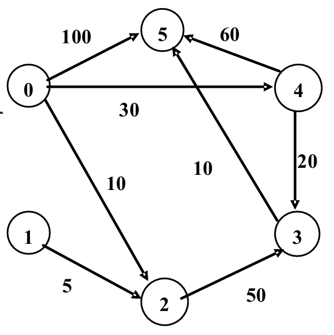
#### 四、Dijkstra 例题 1：课件小例子

起点为 $v_{0}$，初始可直接到达：

$$
v_{2} = 10,v_{4} = 30,v_{5} = 100
$$

不能直接到达的记为 $\infty$。

| 步骤 | 选中节点  | 当前确定集合 $\mathbf{S}$                          | 更新结果                                                           |
|------|-----------|----------------------------------------------------|--------------------------------------------------------------------|
| 初始 | —         | $\left\{ v_{0} \right\}$                         | $D(v_{2}) = 10,\ D(v_{4}) = 30,\ D(v_{5}) = 100$                 |
| 1    | $v_{2}$ | $\left\{ v_{0},v_{2} \right\}$                   | $v_{3} = 10 + 50 = 60$                                           |
| 2    | $v_{4}$ | $\left\{ v_{0},v_{2},v_{4} \right\}$             | $v_{3} = \min(60,30 + 20) = 50;\ v_{5} = \min(100,30 + 60) = 90$ |
| 3    | $v_{3}$ | $\left\{ v_{0},v_{2},v_{4},v_{3} \right\}$       | $v_{5} = \min(90,50 + 10) = 60$                                  |
| 4    | $v_{5}$ | $\left\{ v_{0},v_{2},v_{4},v_{3},v_{5} \right\}$ | 结束                                                               |

最终结果：

| **终点**  | **最短距离** | **最短路径**                                                    |
|-----------|--------------|-----------------------------------------------------------------|
| $v_{1}$ | $\infty$   | 不可达                                                          |
| $v_{2}$ | 10           | $v_{0} \rightarrow v_{2}$                                     |
| $v_{3}$ | 50           | $v_{0} \rightarrow v_{4} \rightarrow v_{3}$                   |
| $v_{4}$ | 30           | $v_{0} \rightarrow v_{4}$                                     |
| $v_{5}$ | 60           | $v_{0} \rightarrow v_{4} \rightarrow v_{3} \rightarrow v_{5}$ |

### 五、Dijkstra 例题 2

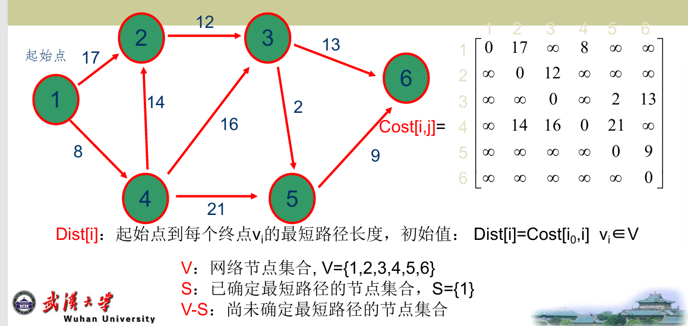

起点为节点 1。初始状态：$S = \{ 1\}$从 1 能直接到达：

$$
D(2) = 17,D(4) = 8
$$

其他节点暂时不可达：$D(3) = \infty,D(5) = \infty,D(6) = \infty$

| **节点** | **2** | **3**      | **4** | **5**      | **6**      |
|----------|-------|------------|-------|------------|------------|
| 初始距离 | 17    | $\infty$ | 8     | $\infty$ | $\infty$ |
| 前驱     | 1     | —          | 1     | —          | —          |

#### 第一步：选节点 4

因为当前未确定节点中，节点 4 距离最小：

$$
D(4) = 8
$$

所以：$S = \{ 1,4\}$

用节点 4 更新邻接节点：

$$
\begin{aligned}
D(3) &= 8 + 16 = 24 \\
D(5) &= 8 + 21 = 29
\end{aligned}
$$

结果：

| **节点** | **2** | **3** | **4** | **5** | **6**      |
|----------|-------|-------|-------|-------|------------|
| 当前距离 | 17    | 24    | 8     | 29    | $\infty$ |
| 前驱     | 1     | 4     | 1     | 4     | —          |

#### 第二步：选节点 2

未确定节点中，节点 2 最小：

$$
D(2) = 17
$$

所以：$S = \{ 1,4,2\}$

从节点 2 出发没有得到更短路径，所以结果不变。

| **节点** | **2** | **3** | **4** | **5** | **6**      |
|----------|-------|-------|-------|-------|------------|
| 当前距离 | 17    | 24    | 8     | 29    | $\infty$ |
| 前驱     | 1     | 4     | 1     | 4     | —          |

#### 第三步：选节点 3

未确定节点中，节点 3 最小：

$$
D(3) = 24
$$

所以：$S = \{ 1,4,2,3\}$

用节点 3 更新：

$$
D(5) = \min(29,\ 24 + 2) = 26
$$

所以节点 5 被更新为 26，前驱改为 3。

$$
D(6) = 24 + 13 = 37
$$

结果：

| **节点** | **2** | **3** | **4** | **5** | **6** |
|----------|-------|-------|-------|-------|-------|
| 当前距离 | 17    | 24    | 8     | 26    | 37    |
| 前驱     | 1     | 4     | 1     | 3     | 3     |

#### 第四步：选节点 5

未确定节点中，节点 5 最小：

$$
D(5) = 26
$$

所以$S = \{ 1,4,2,3,5\}$

用节点 5 更新节点 6：

$$
D(6) = \min(37,\ 26 + 9) = 35
$$

所以节点 6 更新为 35，前驱改为 5。

| **节点** | **2** | **3** | **4** | **5** | **6** |
|----------|-------|-------|-------|-------|-------|
| 当前距离 | 17    | 24    | 8     | 26    | 35    |
| 前驱     | 1     | 4     | 1     | 3     | 5     |

#### 第五步：选节点 6

最后选节点 6：$S = \{ 1,4,2,3,5,6\}$

算法结束。最终最短路径为：

| **终点** | **最短距离** | **最短路径**                                                  |
|----------|--------------|---------------------------------------------------------------|
| 2        | 17           | $1 \rightarrow 2$                                           |
| 4        | 8            | $1 \rightarrow 4$                                           |
| 3        | 24           | $1 \rightarrow 4 \rightarrow 3$                             |
| 5        | 26           | $1 \rightarrow 4 \rightarrow 3 \rightarrow 5$               |
| 6        | 35           | $1 \rightarrow 4 \rightarrow 3 \rightarrow 5 \rightarrow 6$ |

这道题最容易错在：**节点 5 一开始通过 4 是 29，但后来通过 3 变成 26，所以要更新前驱。节点 6 一开始通过 3 是 37，后来通过 5 变成 35，也要更新。**

### 六、最小耗费路径分析：栅格计算重点

网络分析是在“线网络”上算；最小耗费路径分析是在“栅格表面”上算。

课件定义：

最小耗费路径分析用**耗费栅格**定义通过每个像元所需的耗费，寻找像元间最小累积耗费路径。

它需要四个要素：**源栅格、耗费栅格、耗费距离量测、生成最小累积耗费路径的算法**。

#### 1. 源栅格和耗费栅格

| 栅格     | 作用                                       |
|----------|--------------------------------------------|
| 源栅格   | 定义源像元，只有源像元有值，其他像元不赋值 |
| 耗费栅格 | 定义穿过每个像元的耗费或阻抗               |

耗费可以来自多个因素，比如土地利用、坡度等。不同因素单位不同，不能直接相加，所以要先**重分类到统一尺度**，再按权重合成最终耗费栅格。

例如课件中坡度和土地利用可按 1—10 重分类，再按：

$\text{最终耗费} = 0.66 \times \text{坡度耗费} + 0.34 \times \text{土地利用耗费}$,合成最终成本栅格。

#### 2. 像元间耗费距离的计算

##### 横向/纵向相邻

- 两个像元上下左右相邻时：$\text{耗费距离} = \frac{C_{1} + C_{2}}{2}$

- 例如两个像元耗费值为 1 和 2：$\frac{1 + 2}{2} = 1.5$

##### 对角线相邻

两个像元对角相邻时：$\text{耗费距离} = 1.414 \times \frac{C_{1} + C_{2}}{2}$

例如两个像元耗费值为 1 和 5：$1.414 \times \frac{1 + 5}{2} = 1.414 \times 3 = 4.2$

这里的 1.414 本质是：$\sqrt{2} \approx 1.414$

### 七、最小累积耗费例题

课件给出的耗费栅格为：

$$
\begin{matrix}
1 & 2 & 2 & 1 \\
1 & 4 & 5 & 1 \\
2 & 3 & 7 & 6 \\
1 & 3 & 4 & 4
\end{matrix}
$$

有两个源像元：**右上角和左下角**。源像元的累计耗费均为 0。

找最小累积耗费路径是基于 Dijkstra 算法的迭代过程。

#### 1. 从源像元开始计算邻近像元

左下角源像元耗费为 1，累计耗费为 0。

它右侧像元耗费为 3：$0 + \frac{1 + 3}{2} = 2.0$,所以右侧像元累计耗费为 2.0。

它上方像元耗费为 2：$0 + \frac{1 + 2}{2} = 1.5$,所以上方像元累计耗费为 1.5。

它右上对角像元耗费为 3：

$$
0 + 1.414 \times \frac{1 + 3}{2} = 1.414 \times 2 = 2.8
$$

所以右上对角像元累计耗费为 2.8。

#### 2. 右上角源像元计算邻近像元

右上角源像元耗费为 1，累计耗费为 0。

左侧像元耗费为 2：$0 + \frac{1 + 2}{2} = 1.5$,所以左侧像元累计耗费为 1.5。

下方像元耗费为 1：$0 + \frac{1 + 1}{2} = 1.0$,所以下方像元累计耗费为 1.0。

左下对角像元耗费为 5：

$$
0 + 1.414 \times \frac{1 + 5}{2} = 4.2
$$

所以左下对角像元初始累计耗费为4.2。

但注意：这个 4.2 后面会被更新。

#### 3. 为什么会从 4.2 更新成 4.0？

右上角源像元左下对角的像元，也就是第二行第三列，初始通过对角线得到$4.2$但是它还可以从右侧像元过来。右侧像元累计耗费是1.0，右侧像元耗费为 1，目标像元耗费为 5：$1.0 + \frac{1 + 5}{2} = 1.0 + 3.0 = 4.0$

因为：

$$
4.0 < 4.2
$$

所以该像元累计耗费更新为 4.0。

这正是最小耗费路径分析的核心：

**每个像元不是只算一次，而是不断比较“新路径是否更便宜”。**

#### 4. 最终结果怎么理解？

最终累计耗费栅格：

$$
\begin{matrix}
4.0 & 3.5 & 1.5 & 0 \\
3.0 & 5.5 & 4.0 & 1.0 \\
1.5 & 2.8 & 6.7 & 4.5 \\
0 & 2.0 & 5.5 & 9.5
\end{matrix}
$$

其中每个值表示：

从该像元回到最近源像元的最小累计耗费。

例如右下角为 9.5，表示它回到最近源像元的最低耗费是 9.5。

#### 5. 回溯链接栅格

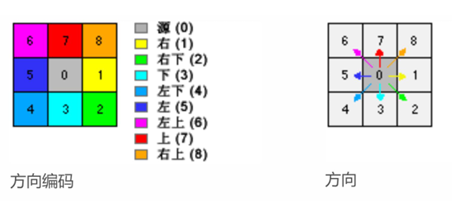

- 如果某像元值为 5，则路径应向左侧相邻像元移动；

- 如果值为 7，则路径应向北方移动。

**累计耗费栅格告诉你最低耗费值；回溯链接栅格告诉你沿哪条方向走回源。**

### 八、最小耗费路径分析的影响因素

最小耗费路径结果受两个东西直接影响：

**因素选择**和**因素权重**。

课件强调，因素权重甚至更关键，因此最小耗费路径常与多标准评估结合。

主要影响因素包括：

| **因素**        | **含义**                               |
|-----------------|----------------------------------------|
| **地表距离**    | 考虑真实地形表面的距离，而不是平面距离 |
| **水平因子 HF** | 考虑不同水平方向移动难度               |
| **垂直因子 VF** | 考虑坡度造成的移动难度                 |
| **权重**        | 不同因素的重要性比例                   |

#### 1. 水平因子 HF

水平因子考虑的是：**向不同方向移动的难度不同**。

例如风向、水流方向、坡面方向都可能导致某些方向更容易走，某些方向更难走。关键概念是 **HRMA**，即水平相对移动角度：

$$
HRMA = \text{目标方向与主导水平方向之间的夹角}
$$

#### 2. 垂直因子 VF

垂直因子考虑的是：**上坡、下坡带来的移动难度不同**。

关键概念是 **VRMA**，即垂直相对移动角度。

计算思路：$\text{斜率} = \frac{\text{目标像元高程} - \text{起始像元高程}}{\text{水平距离}}$

再把斜率换成角度，得到 VRMA。课件强调，VRMA 范围为：

$$
-90^{\circ} \sim + 90^{\circ}
$$

再根据垂直系数图确定 VF。系数越大，移动难度越大。

### 九、考试计算题抓手

#### 1. Dijkstra 题怎么做

按这个模板写：

1.  写初始集合： $S = \{\text{起点}\}$

<!-- -->

2.  写初始距离： $Dist\lbrack i\rbrack = Cost\lbrack\text{起点},i\rbrack$

<!-- -->

3.  每轮选 $V - S$中 $Dist$最小的点加入 $S$。

4.  用新加入的点更新邻接点：

$$
Dist\lbrack k\rbrack = \min(Dist\lbrack k\rbrack,Dist\lbrack j\rbrack + Cost\lbrack j,k\rbrack)
$$

5.  最后根据前驱节点反推路径。

最容易错的地方：

| **易错点**       | **正确处理**                       |
|------------------|------------------------------------|
| 忘记更新前驱     | 只要距离变小，前驱也要改           |
| 把不可达当成 0   | 不可达是 $\infty$，不是 0          |
| 不区分有向边     | 有向图只能按箭头方向走             |
| 选错节点         | 每轮必须选 $V - S$中 Dist 最小的点 |
| 只求距离不写路径 | 最后要根据前驱反推完整路径         |

#### 2. 最小耗费路径题怎么做

按这个模板写：

1.  源像元累计耗费设为 0。

2.  计算邻近像元链接耗费：

横向/纵向：

$$
\frac{C_{1} + C_{2}}{2}
$$

对角线：

$$
1.414 \times \frac{C_{1} + C_{2}}{2}
$$

3.  新累计耗费：

$$
\text{新累计耗费} = \text{当前像元累计耗费} + \text{链接耗费}
$$

4.  如果新累计耗费更小，就更新该像元。

5.  重复直到所有像元获得最小累计耗费。

最容易错的地方：

| 易错点                     | 正确处理                     |
|----------------------------|------------------------------|
| 对角线忘乘 1.414           | 对角线移动距离更长           |
| 用目标像元耗费代替平均耗费 | 链接耗费取两个像元耗费平均值 |
| 忘记比较旧值和新值         | 只保留更小的累计耗费         |
| 把源像元耗费当成累计耗费   | 源像元累计耗费为 0           |
| 只算一次邻居               | 要迭代更新，类似 Dijkstra    |

## 第18章 GIS 模型与建模

### 1. 全章主线

**如何用 GIS 数据建立模型，表达、筛选、评价或预测空间现象。**

**先理解模型是什么 → 再理解 GIS 如何参与建模 → 再掌握几类常见模型：二值模型、指数模型、回归模型。**

### 2. GIS 建模的基本元素

#### 2.1 模型的概念

**模型**是一种现象或一个系统的简化表示。

如果模型使用地理参考数据，就常称为空间显示模型，即 **spatially explicit models**。

#### 2.2 模型的分类

| 分类              | 含义                                                         |
|-------------------|--------------------------------------------------------------|
| 描述模型/规则模型 | 描述模型描述现有情况；规则模型预测将会出现的情况             |
| 确定模型/随机模型 | 确定模型假定变量有特定值；随机模型假设变量服从一定概率分布   |
| 静态模型/动态模型 | 静态模型研究某一时刻状态；动态模型强调时间变化和变量相互作用 |
| 推论模型/归纳模型 | 推论模型以科学理论为基础；归纳模型结果来自实验数据           |

- **描述 vs 规则**：现在还是未来。

- **确定 vs 随机**：固定值还是概率分布。

- **静态 vs 动态**：是否考虑时间变化。

- **推论 vs 归纳**：理论出发还是数据出发。

#### 2.3 建模过程

1.  **明确建模目的**：先确定模型要解决什么问题。

2.  **分解模型元素**：确定变量、属性及其相互作用。

3.  **模型应用与校准**：用数据运行模型，比较输出结果与观测结果，不断调整参数。

4.  **模型验证**：用不同于校准条件的数据检验模型稳定性和预测效果。

关键区别：

| 概念 | 含义                                     |
|------|------------------------------------------|
| 校准 | 用数据调整模型参数，使输出更接近观察结果 |
| 验证 | 用另一组数据检查模型是否稳定可靠         |

#### 2.4 GIS 在建模中的作用

GIS 提供数据处理和空间分析能力。

主要作用包括：

- 加工、显示和集成地图、DEM、GPS、影像、表格等不同数据源；

- 支持基于矢量或基于栅格的建模；

- 支持矢量数据与栅格数据相互转换；

- 可以在 GIS 环境中建模，也可以与其他计算机程序链接。

如果空间现象连续变化，或者模型计算复杂，通常更适合使用**栅格模型**，例如土壤侵蚀、积雪等。

### 3. 二值模型

#### 3.1 基本概念

**二值模型**用逻辑表达式从组合要素图层或多重栅格中选择目标区域。输出结果只有两类：

| **输出值** | **含义**   |
|------------|------------|
| 1          | 满足条件   |
| 0          | 不满足条件 |

#### 3.2 基于矢量的二值模型

基本流程：

1.  收集相关图层，例如土地利用、洪水区、道路、坡度图层。

2.  对道路等要素建立缓冲区。

3.  通过相交等叠置操作，把多个图层合并。

4.  在复合要素图层中执行属性查询。

5.  选择满足面积等附加条件的区域。

例如课件中的工业用地选址，需要满足：面积至少 5 英亩、商业区、不受洪涝威胁、距离重型公路不超过 1 mi、坡度小于 10%。

矢量二值模型的核心是：**叠置图层 → 合并属性 → 用查询表达式筛选目标多边形。**

#### 3.3 基于栅格的二值模型

基于栅格的方法要求每种栅格代表一个指标，然后用局部运算逐像元判断是否满足条件。

基本流程：

1.  由 DEM 生成坡度栅格，并生成距重型公路的距离栅格。

2.  将土地利用、洪灾图层等转换为相同分辨率的栅格。

3.  对多个栅格进行局部运算，筛选潜在地点。

4.  根据像元大小和像元个数计算区域面积，选择满足面积要求的区域。

### 4. 指数模型

#### 4.1 基本概念

**指数模型**也是多指标评价模型，但它不是简单输出0或1

而是为每个像元或区域计算一个**指数值**，再根据指数值生成等级地图。

二值模型和指数模型的区别：

| 模型     | 输出             | 特点                               |
|----------|------------------|------------------------------------|
| 二值模型 | 0 / 1            | 判断是否满足条件                   |
| 指数模型 | 连续或等级指数值 | 判断适宜程度、风险程度、脆弱程度等 |

#### 4.2 加权线性综合法

指数模型最常用的方法是**加权线性综合法**。

它包括三个层次：

1.  确定各指标或因素的权重；

2.  对每个指标进行标准化；

3.  计算加权综合指数。

常用标准化公式：

$$
S_{i} = \frac{X_{i} - X_{\min}}{X_{\max} - X_{\min}}
$$

指数值计算公式：

$$
I = \frac{\sum_{i = 1}^{n}w_{i}x_{i}}{\sum_{i = 1}^{n}w_{i}}
$$

其中：

| **符号**  | **含义**               |
|-----------|------------------------|
| $x_{i}$ | 第 $i$个指标的标准化值 |
| $w_{i}$ | 第 $i$个指标的权重     |
| $I$     | 最终指数值             |

例如：某多边形标准化后的两个指标值为 0.5 和 0.8，权重分别为 0.4 和 0.6，则指数值为：

$$
0.5 \times 0.4 + 0.8 \times 0.6 = 0.68
$$

这说明指数模型不仅看是否满足条件，还能比较不同区域之间的优劣程度。

#### 4.3 指数模型应用

- 适宜性分析；

- 脆弱性分析；

- 地下水污染可能性评价；

- 栖息地适宜性指数模型；

- 火灾隐患和风险模型。

**多个指标标准化 → 分配权重 → 加权求和 → 得到适宜性或风险等级。**

### 5. 回归模型

#### 5.1 基本概念

**回归模型**用方程建立一个因变量与多个自变量之间的关系，可用于解释、预测和推算。GIS 中可以通过地图叠置运算，把分析所需的自变量组合起来。课件中回归模型包括：**线性回归、地理加权回归、对数回归**。

回归分析主要用于三类目的：

1.  解释空间现象背后的影响因素；

2.  预测其他地点或其他时间的数值；

3.  探索假设关系，例如某些环境或社会因素是否与某种现象有关。

#### 5.2 线性回归模型

线性回归模型用一个或多个解释变量预测因变量，基本形式可以理解为：

$$
y = \beta_{0} + \beta_{1}X_{1} + \beta_{2}X_{2} + \cdots + \varepsilon
$$

其中：

| **符号**        | **含义**          |
|-----------------|-------------------|
| $y$           | 因变量            |
| $X$           | 自变量 / 解释变量 |
| $\beta$       | 回归系数          |
| $\varepsilon$ | 随机误差          |

重点理解 **R²/R平方**：

- R² 表示回归模型对观测值的拟合程度，范围为 0% 到 100%。

- 如果模型与观测值完全拟合，则 R² = 1.0。

#### 5.3 地理加权回归模型

普通线性回归默认变量关系在整个空间中相同，但空间数据常常存在**空间非平稳性**，即变量之间的关系会随地理位置变化。

地理加权回归模型，也就是$GWR$，**把地理位置加入回归参数中，使回归系数随位置变化：**

$$
y_{i} = b_{0}(u_{i},v_{i}) + \sum b_{k}(u_{i},v_{i})x_{ik} + \varepsilon_{i}
$$

其中 $\left( u_{i},v_{i} \right)$是样本点坐标，$b_{k}(u_{i},v_{i})$ 表示随位置变化的回归系数。

核心区别：

| 模型         | 变量关系                   |
|--------------|----------------------------|
| 普通线性回归 | 假设变量关系在空间上稳定   |
| 地理加权回归 | 允许变量关系随空间位置变化 |

所以 GWR 更适合分析空间非平稳性明显的数据。

#### 5.4 对数回归模型

当因变量是类别数据，例如“出现 / 不出现”，而自变量可以是类别数据、数值变量或二者都有时，可以采用**对数回归模型**。课件以红松鼠栖息地模型作为例子。

**线性回归适合连续因变量；对数回归适合类别型因变量。**

### 6. 本章最终框架

| 模型         | 核心作用               | 输出结果             | 典型用途                 |
|--------------|------------------------|----------------------|--------------------------|
| 二值模型     | 判断是否满足条件       | 0 / 1                | 选址分析                 |
| 指数模型     | 评价适宜程度或风险等级 | 指数值 / 等级图      | 适宜性、脆弱性、风险评价 |
| 线性回归     | 建立变量间整体关系     | 预测值、回归系数、R² | 解释和预测空间现象       |
| 地理加权回归 | 表达变量关系的空间差异 | 局部回归系数         | 空间非平稳性分析         |
| 对数回归     | 处理类别因变量         | 出现概率或分类结果   | 栖息地、出现/不出现问题  |
