# 第2章 时间系统和坐标系统

## 2.1 时间系统

### 世界时UT

世界时（UT）是以地球自转为基础建立的时间系统，本质上和太阳时有关；

不均匀的原因：

1.  地球自转轴变化（极移）

2.  自转速度变化，变慢

3.  复杂的短周期变化

改进：

UT0中极移改正→UT1→季节性改正→UT2

### 原子时AT

以原子内部稳定震荡频率为基准建立的时间系统（现代GNSS的时间基础）

特点：稳定、均匀；秒长由原子跃迁频率定义；起点为1958-1-1-0时0分0秒

### 国际原子时TAI

### 协调世界时UTC

本质：以原子时秒长为单位，尽量与世界时接近

跳秒/闰秒、均匀

### GPS时GPST

由GPS地面系统的原子钟建立和维持。

1.  起点为1980-1-6-0时0分0秒；

2.  起始时刻与UTC对齐，与TAI相差19秒

3.  GPST不跳秒，会逐渐与UTC拉开差距。

### 其他GNSS时间

- **GLONASS时**：与莫斯科时有关，与UTC存在3小时偏差

- **北斗时BDT**:起点为2006-1-1-0时0分0秒（与UTC一致）；

- UTC（BDT）与TAI相差33秒

## 2.2 GPS时间的表示与转换

### GPS时间常见表示方式

1.  GPS周+GPS周秒 一天=86400秒，一周=605800秒

2.  年+年积日（DOY） 年积日就是一年中的第几天

### 转换关系

儒略日JD：

从公元前4713年1月1日12h开始，连续利于数学表达，但不直观；

简化儒略日MJD：儒略日中减去2400000.5天，从1858年11月17日平子夜开始

$$MJD = JD - 2400000.5$$

### GPS时间计算公式

GPS周$= INT\lbrack(JD - 2444244.5)/7\rbrack$

GPS周秒$= mod\{ JD - 2444244.5,7\}*86400$

## 2.3 常用坐标系统

### 两大类坐标系统

天球坐标系CRS→不随地球自转，描述自然天体、人造卫星在空间中的位置或方向

地球坐标系TRS→地固坐标系，随地球自转，描述近地点位置

### 瞬时与协议地球坐标系

**瞬时地球坐标系**：与瞬时地极对应，但由于极移影响，坐标轴会不断变化，不利于全球统一。

**协议地球坐标系（CTRS）**：与地球本体固连，使地面点坐标保持稳定，更适合全球统一应用。

### WGS-84

**WGS-84** 是 GPS 导航定位中采用的大地坐标系统。  
特点：

- 原点在**地心**；

- Z轴指向 IERS 参考极方向；

- X轴指向 IERS 参考子午线方向；

- Y轴与 X、Z 构成右手系。

**利用广播星历计算得到的卫星坐标和用户定位坐标，属于 WGS-84。**

### ITRS/ITRF

**ITRS** 是国际地球参考系统，**ITRF** 是它的具体实现框架。  
它是国际大地测量和地球动力学界广泛采用的高精度参考框架。

- IERS 利用 **VLBI、SLR、GPS、DORIS** 等技术建立和维持 ITRF；

- 利用 **IGS精密星历** 计算得到的卫星坐标和定位结果，属于 **ITRF**。

### CGCS2000

1.  原点在**地心**；

2.  坐标轴定义与 IERS 参考极、参考子午面一致；

3.  以 **ITRF97参考框架、2000.0历元** 为基准实现；

4.  通过 2000 国家 GPS 大地网实现；

5.  是一个**区域、静态坐标系**。

# 第3章 GNSS系统的组成及信号

## 3.1 GNSS总框架

空间星座部分：卫星星座-发射信号；

地面控制部分：主控站、监测站、注入站；

用户部分：各类接收机与用户设备；

## 3.2 空间星座部分

### 参数：

卫星数量、轨道面数、轨道高度、轨道倾角；

**基本原则：**

1.  满足性能前提下，减少卫星数量和轨道面数，降低成本；

2.  轨道高度兼顾稳定和重复；

3.  轨道倾角要兼顾重点区域覆盖，尤其是中低纬度地区

### 性能规律：

1.  定位精度，随卫星数量增加而提高；

2.  轨道高度增加，定位性能提高

### 典型GNSS星座参数

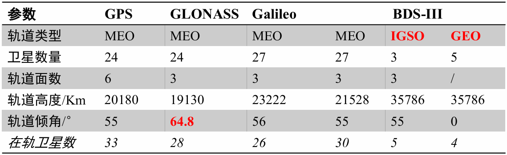

**为什么GLONASS轨道倾角更大？**

因为**俄罗斯所处地理纬度较高**，为了改善高纬地区的可见性与覆盖效果，GLONASS采用了更大的轨道倾角。

## 3.3 GPS空间部分

### GPS星座参数：

6个轨道面、轨道高度20200km，倾角55度、周期11h58min、几何关系每天提前4min重复一次

### 设计星座：

设计星座：21+3（工作+备用）；

目前在轨卫星已多于最初设计。

### GPS卫星主要载荷与功能

**主要载荷**：

- 太阳能电池帆板

- 原子钟

- 信号生成部件

- 发射天线

- 全向遥测遥控天线

- 推进装置等

**主要功能**：

- 接收并存储导航电文

- 发射导航定位信号

- 接收并执行地面控制指令。

### GPS卫星发展型号

**Block II**：星历存储能力14天，具备SA和AS能力；

**Block IIA**：卫星间可通信，星历存储能力提升到180天；

**Block IIR**：可实现卫星间相互跟踪、相互通信；

**Block IIF**：增加第三民用频率，并增强星间链路控制；

**Block III**：属于GPS现代化的重要阶段。

## 3.4北斗空间星座特点

### 北斗三号：

混合轨道星座：

MEO-中圆轨道；IGSO-倾斜地球同步轨道；GEO-地球同步轨道。

### 为什么采用混合轨道星座：

1中国及亚太区域增强服务2全球覆盖能力3区域可见性与连续性优化。

### 星间链路技术

星间测距、通信、数据处理

实现**导航星历自主更新**，从而减少对地面监测站的依赖，缓解“全球地面站难以均匀部署”的问题。北斗通过星间链路实现“一星通、星星通”，增强系统自主运行能力，有效弥补地面测站分布稀疏的缺陷。

## 3.5地面控制部分（⭐）

### 地面控制部分组成

| 主控站 | 运行管理与控制 |
|--------|----------------|
| 监测站 | 数据采集与监测 |
| 注入站 | 数据和指令发送 |

### 监测站

1.  接收卫星观测数据

2.  采集气象信息

3.  将采集数据预处理、压缩后发给主控站

### 主控站

- 管理和协调整个地面监控系统；

- 收集监测站数据；

- 编制导航电文；

- 将星历等信息送往注入站，再注入卫星；

- 监控卫星状态并下达控制指令；

- 处理卫星维护和异常情况。

### 注入站

将导航电文注入卫星

## 3.6 用户部分

### 组成

用户+接收设备（导航信号接收机）+辅助设备

### 用户部分主要功能

接收机任务：

1.  接受GNSS卫星信号

2.  对信号进行处理与量测

3.  完成导航、定位、授时解算

### 接收机分类

- **按可跟踪信号**：C/A码、P码

- **按频率数**：单频、双频、多频

- **按功能**：授时型、测量型、导航型

- **按载体**：手持、车载、船载、机载、弹载、星载

- **按系统能力**：单系统、双系统、多系统。

应用数量最多的是**单频C/A码民用导航接收机**。

### GPS接收机

| 天线单元 | 接收天线、前置放大器                     | 把卫星发来的无线电信号电磁波能量，转换成接收机可处理的电流 |
|----------|------------------------------------------|------------------------------------------------------------|
| 接收单元 | 信号通道、微处理器、存储器、输入输出设备 | 跟踪处理量测卫星信号，完成数据处理和控制。                 |

## 3.7 GPS信号组成

载波（Carrier）+测距码（Ranging Code）+导航电文（Navigation Message）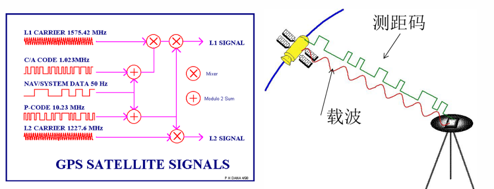

## 3.8 载波

### 基本物理量关系

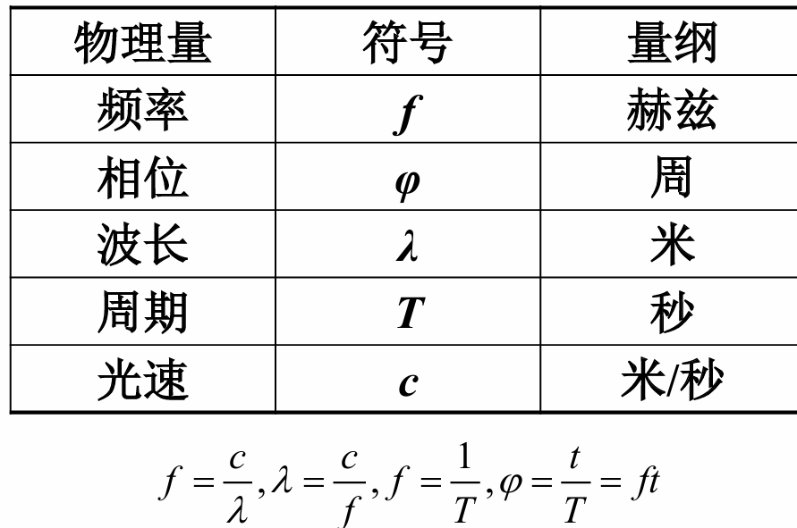GNSS信号时电磁波，由卫星振荡器产生：

### 为什么选L波段

GPS采用L波段（1-2GHz）作为载波

原因：

- 有利于测多普勒频移；

- 有利于减弱电离层延迟影响；

- 选双频/三频更便于消除电离层延迟；

- 大气衰减较小，也便于接收机研制。

### GPS基准频率与三大载波

GPS卫星基准频率为 **10.23 MHz**，其他信号成分都是它的<u>倍频或分频</u>。  
重点载波：

- **L1 = 1575.42 MHz，波长 19.03 cm**

- **L2 = 1227.60 MHz，波长 24.42 cm**

- **L5 = 1176.45 MHz，波长 25.48 cm**

另外：

- C/A码速率：**1.023 MHz**

- P码速率：**10.23 MHz**

- 导航电文速率：**50 bps**。

### 载波作用

<u>搭载调制信号</u>、<u>高精度测距</u>、<u>测定多普勒频移</u>

## 3.9测距码

用于测定<u>卫星到接收机距离</u>的<u>二进制码</u>——用于测距

### 为什么用PRN码

随机噪声码虽然自相关好，但**真正随机、不能复制，所以无法实际使用**。  
因此GPS采用的是**伪随机噪声码（PRN码）**：

- 按规律生成；

- 可复制；

- 但仍具有类似随机噪声的良好相关特性；

- 周期性码序列。

这就是 PRN 码既**能测距**、又能**区分卫星**的原因。

<u>一句话总结为什么PRN用于GNSS测距：</u>

因为PRN码可复制且具有良好的**自相关**和**低互相关**特性。对齐时相关系数接近1，不同码或未对齐时相关很小，因此接收机可以利用<u>相关峰</u>完成信号捕获、同步和卫星识别。

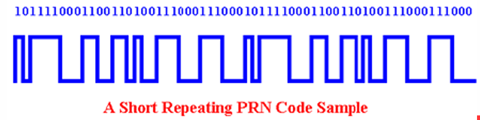

### 码的几个基础概念

码元——码序列的一个二进制位

码元宽度——一个码元持续的时间或对应的距离

码速率——每秒输出的码元数

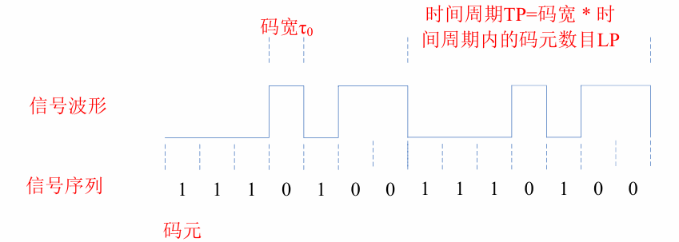

### 自相关与互相关

**自相关与互相关**

- **自相关**：信号与自身延迟版本的相关；

- **互相关**：两个不同信号之间的相关；

- **相关系数 R**：表示两个信号相似程度。

PRN码要求：

- **同一组码对齐时，相关系数 = 1**；

- **不同码，或未对齐的同一码，相关系数很小（接近0或1/n（码元数））**。

所以接收机正是利用这个特性来：

- **捕获信号**

- **同步码相位**

- **区分不同卫星**。

### GPS接收机如何识别卫星

接收机内部会生成本地PRN码，并与接收到的各颗卫星 PRN 码做相关。  
当相关峰值最大、相关系数接近 1 时，就说明本地码与某颗卫星的码对齐了，从而实现：

- 卫星识别

- 码同步

- 测距。

## 3.10 各种GPS测距码的区别

| 测距码 | 类型 | 码长度 (chip) | 码速率 (Mbps) | 周期 | 码宽 | 主要特点与功能 |
| --- | --- | --- | --- | --- | --- | --- |
| C/A 码 | L1 民用粗捕获码 | 1023 | 1.023 | 1 ms | 293.05 m | • 快速捕获信号 • 粗略测距（米级精度） • 各卫星码不同且正交（CDMA） |
| P(Y) 码 | L1/L2 精码（军用） | 极长 | 10.23 | ≈266.4 天 | 29.3 m | • 高精度测距（约 0.3 m） • Y码是P码经AS反欺骗加密后的军用保密码 • 授权用户使用 |
| L2C 码 | L2 民用码 | 10230 | 1.023 | 10 ms | 293.05 m | • 第二民用码 • 更长积分时间 • 弱信号环境（树林、城市峡谷）性能更好 |
| L5 码 | L5 民用码 | 10230 | 10.23 | 10 ms | 29.3 m | • 第三民用码 • 高码速率，高测距精度（接近P码） • 抗干扰能力强 • 弱信号下捕获跟踪性能优异 |
| L1C 码 | L1 民用码 | 10230 | 1.023 | 10 ms | 293.05 m | • 新一代L1民用码（L1CD 数据 + L1CP 导频） • 采用BOC/TMBOC调制 • 与Galileo E1等系统**互操作性最佳** • 更高发射功率、更好跟踪性能 • 对城市峡谷、树林等复杂环境更友好 |
| M 码 | L1/L2 军用保密码 | 不公开 | 不公开 | 不公开 | 不公开 | • 军用专用信号（现代化军用码） • **发射功率更大**（可使用点波束进一步增强） • 捕获更快、更稳定 • **抗干扰、抗欺骗能力极强** • 可独立于C/A码直接捕获 • 结构、生成方式和加密细节**完全不公开**，仅授权军方使用 |

## 3.11 导航电文（数据码）

### 1.导航电文是什么

是由GPS卫星向用户播发的一组反映卫星在空间的运行轨道、<u>卫星钟的改正参数</u>、、<u>电离层延迟改正参数</u> 及<u>卫星工作状态</u>的等信息的二进制编码数据，也称为数据码

导航电文是 GPS 卫星向用户播发的一组二进制编码数据。  
本质上告诉接收机：

卫星在哪里？卫星钟怎么改？电离层怎么改？卫星现在健康不健康？

### 2. 导航电文包含什么

主要包括：

- **预报卫星星历**

- **卫星钟差改正参数**

- **电离层延迟改正参数**

- **卫星健康状态信息**

并且它：

- 调制在 **L1 和 L2** 上；

- 传输速率是 **50 bps**。

## 3.12 卫星信号调制

### 1. 为什么必须调制

<u>数字比特流不能直接高效</u>地在自由空间<u>远距离传播</u>，所以必须把<u>低频</u>基带信息调制到<u>高频 RF 载波上。</u>  
这也是卫星导航信号能在空间稳定传播的基础。

### 2. 常见调制方式

课件提到常见数字调制方式有：

- **FSK**

- **BPSK**

- **QPSK**

- **BOC**

考试一般不会推很深，但要知道这些都是 GPS / GNSS 信号体制里的关键词。 、

### 3. 模二和思想

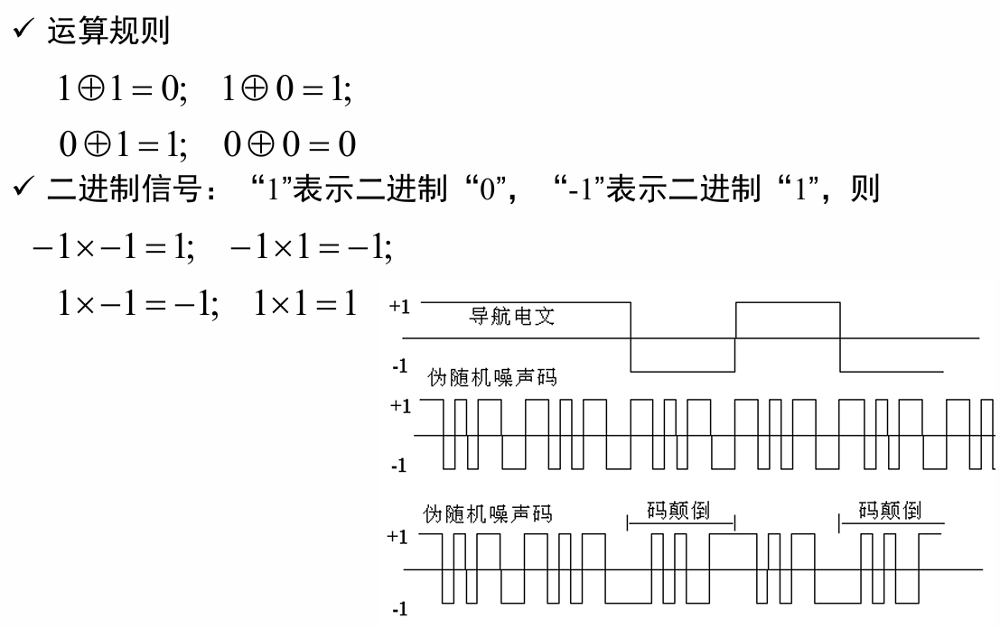

<u>导航电文</u>与<u>伪随机噪声码</u>会先进行**模二和**组合，然后再调制到载波上。  
因此要记住信号形成流程：  
**导航电文 + PRN码 → 组合码 → 调制到载波 → 发射成卫星无线电信号。**

# 第4章 导航电文及卫星位置计算

## 导航电文的结构

导航电文是用户进行定位和计算卫星位置的基础数据来源

### 单位

1个主帧=1500bit=5个子帧；

1个子帧=300bit=10个字；

1个字=30bit，每个字最后 **6 bit 为奇偶校验位。**

### 传输速率和周期

- 导航电文传输速率：**50 bps**

<!-- -->

- 1个字传输时间：**0.6 s**

- 1个子帧传输时间：**6 s**

- 1个主帧传输时间：**30 s**

### 为什么完整导航电文要12.5min

- 第4、5子帧各有 **25个页面**

- 每个主帧都只播发其中一个页面

- 需要 **25次主帧** 才能把第4、5子帧全部内容播完

- 所以一组完整导航电文重复周期为 **750 s = 12.5 min**

## 三大数据块

### 第一数据块——第1子帧

包含（卫星钟改正数据）和部分状态信息。

**前两个字**：TLM（遥测字）和HOW（交接字）

3-10字：

- GPS周数 WN

- L2所调制测距码标识符

- URA（用户测距精度指标）

- SV Health（卫星健康状况）

- TGD（L1/L2群延迟差）

- AODC（钟改正参数龄期）

- 星钟改正参数 a0、a1、a2，分别对应钟偏、钟速、钟漂。

### 第二数据块——第2、3子帧

提供**广播星历参数**，也就是**计算卫星轨道位置**的关键参数

前2字同第1子帧；

3-10字：1个参考时刻，6个开普勒轨道根数，9个摄动改正参数。

### 第三数据块——第4、5子帧

第4、5子帧主要包含：

- **所有卫星的历书（概略星历）**

- 卫星健康状况

- 32颗GPS卫星的AS标识和卫星类型标识

- **GPS时与UTC的关系参数**

- **电离层改正参数（Klobuchar模型8参数）**。

**历书的用途：**

1.  有利于**快速捕获卫星信号**

2.  有利于**制定观测计划**，比如进行 DOP 分析。

## TLM和HOW

### 遥测字TLM

每个子帧/页面的第1个字——长度→30bit、传输时间——0.6s、重复周期——6s

作用：

捕获导航电文前导、帮助接收机同步导航电文

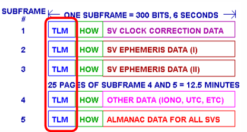

内容：

- 第1～8位：**导言 / 同步码**

- 第9～22位：遥测信息

- 第23位：完好性状态指示

- 第24位：保留位

- 第25～30位：奇偶校验位。

### 交接字HOW

每个子帧/页面的第2个字——长度→30bit、传输时间——0.6s、重复周期——6s

作用：

1.  帮助用户在解调出导航电文后，**迅速捕获 P(Y) 码**

2.  提供与伪距计算相关的重要时间信息。

内容：

- 第1～17位：**TOW（周内时）截断数据**

- 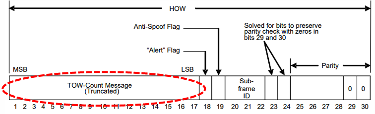第18位：警告标识

- 第19位：AS标识

- 第20～22位：子帧识别标志

- 第23～24位：无信息

- 第25～30位：校验位

## GPS计时方法：Z计数

### 定义：

Z计数是GPS时间的一种特殊表示方式

是以某种特定格式表示自零时间基准（每周日UTC0时）以 来经过的1.5s间隔（周期）数的计数器，给出了GPS信号离开卫星的钟面。

### 编码方式：

GPS时间用29bit序列表示：

前$10bit \rightarrow GPS\ Week（0 - 1023）$；从1980年1月6日0时（UTC） 至观测时刻的星期数

后$19bit \rightarrow TOW（0 - 403199）$本周内X1码（周期为1.5s）的 周期数Time of Week

因为 $604800\ s\ /\ 1.5\ s\  = \ 403200\ $个周期

### 与HOW关系

完整 TOW 是 19 bit，但 HOW 中只放了它的 **17个高位**，这是为了帮助接收机更快完成P码锁定和时间确定。

### 计算

> Z计数本质上表示自零时间基准以来经过了多少个 **1.5 s** 周期；
>
> HOW里放的是 **TOW 的高17位截断数据**。

1.  **为什么TOW能用来辅助伪距计算？**  
    因为它说明了**子帧发射起始时刻**。

## GPS周数翻转问题

### 为什么发生周数翻转？

GPS week只能到1023，从1023再加1.就会回到0——周期为19.6年

### 影响：

如果接收机没有预处理或固件没有更新，就可能把当前时间误判成大约 **19年前**，严重影响定位与授时服务。

### 北斗：

因为北斗周计数使用 **13 bit**，翻转周期为 **8192周**，大约 **160年**，所以大大减轻了这一问题。

## 卫星钟改正

第1子帧给出星钟改正参数 **a0、a1、a2**，它们分别表示：

- $a_{0}$：钟偏

- $a_{1}$：钟速

- $a_{2}$：钟漂

卫星钟差改正公式直接背：

$$\Delta t_{SV} = a_{0} + a_{1}(t - t_{oc}) + a_{2}(t - t_{oc})^{2}
$$

这里：

- $t$是观测时刻

- $t_{oc}$是钟参数参考时刻。

## 广播星历计算卫星位置

| 阶段               | 步骤 | 计算内容                                       | 本步得到的结果 / 目的                    |
|--------------------|------|------------------------------------------------|------------------------------------------|
| 前期计算           | ①    | 计算参考时刻卫星运行平均角速度                 | 为后续计算卫星在轨道上的运动位置做准备   |
|                    | ②    | 计算观测时刻的平近点角 (M)                     | 得到卫星在理想均匀圆周运动下的角位置     |
|                    | ③    | 通过开普勒方程迭代求偏近点角 (E)               | 为进一步求真近点角提供基础               |
| 求轨道平面中的位置 | ④    | 计算真近点角 (f)                               | 得到卫星在椭圆轨道上的真实角位置         |
|                    | ⑤    | 计算未经改正的升交距角                         | 确定卫星在轨道平面中的角位置参数         |
|                    | ⑥    | 计算未经改正的卫星向径 (r)                     | 得到卫星到轨道焦点的距离                 |
| 摄动改正           | ⑦    | 计算摄动改正项                                 | 为改正轨道参数中的摄动影响做准备         |
|                    | ⑧    | 对升交距角、卫星向径、轨道倾角等进行改正       | 得到更接近实际轨道的参数                 |
|                    | ⑨    | 计算卫星在轨道平面坐标系 (xoy) 中的位置        | 得到轨道平面内的卫星坐标                 |
| 坐标变换           | ⑩    | 计算观测瞬间的升交点经度                       | 为从轨道平面坐标系转换到地固坐标系做准备 |
|                    | ⑪    | 计算卫星在瞬时地心地固坐标系下的坐标           | 得到卫星在地固参考系中的位置             |
|                    | ⑫    | 再做极移改正，得到卫星在协议地球坐标系下的坐标 | 得到最终用于高精度定位的卫星坐标         |

### 1. 总体思路

<u>先求轨道平面坐标系下的卫星位置，再把它经过旋转变换到地心地固坐标系；</u>如果还要求更严，还可以继续做极移改正，得到协议地球坐标系下的坐标。具体是：

- 先绕 X 轴转 $- i$

- 再绕 Z 轴转 $- \Omega_{k}$（升交点经度）  
  最后得到地心地固坐标。

### 2. 开普勒轨道根数

**理想正常轨道：6个开普勒根数**

- $a$：长半径

- $e$：偏心率

- $\Omega$：升交点赤经

- $i$：轨道倾角

- $\omega$：近地点角距

- 过近地点时刻（对应真近点角随时间变化）。

**物理意义**

- $a,e$：决定轨道形状和大小

- $\Omega,i$：决定轨道平面的空间指向

- $\omega$：决定椭圆在轨道平面内的定向

- 真近点角 $f$：决定卫星在轨道上的瞬时位置。

**实际广播星历**

实际不是只给6个根数，而是：

**1个参考时刻 + 6个轨道根数 + 9个摄动改正参数**

也就是一共16个参数。课件列出的轨道参数包括：$M_{0},\Delta n,e,\sqrt{A},\Omega_{0},i_{0},\omega,\dot{\Omega},\dot{i},C_{uc},C_{us},C_{rc},C_{rs},C_{ic},C_{is},t_{oe},IODE$ 等。

## 广播星历算卫星位置：标准计算步骤

### Step 1：由 $\sqrt{\mathbf{A}}$求长半轴 $\mathbf{A}$

广播星历通常给的是 $\sqrt{A}$，所以先求：

$$A = (\sqrt{A})^{2}
$$

这是后面一切计算的起点。

### Step 2：求参考平均角速度，再求修正后的平均角速度

参考平均角速度：

$$n_{0} = \sqrt{\frac{\mu}{A^{3}}}
$$

其中 $\mu$为地球引力常数。  
考虑摄动后：

$$n = n_{0} + \Delta n
$$

这对应课件中的“①计算参考时刻卫星运行的平均角速度”。

### Step 3：求历元差 $\mathbf{t}_{\mathbf{k}}$

通常写成：

$$t_{k} = t - t_{oe}
$$

这里 $t_{oe}$是星历参考时刻。  
课件特别提醒：如果跨周了，要做周界修正。也就是当 $t_{k}$超过半周时，要进行 $\pm 604800s$的修正，避免把时间差算错。

**易错点**  
如果不做周界修正，后面 $M,E,f$全会错。

### Step 4：求平近点角 $\mathbf{M}$

公式：

$$M(t) = M_{0} + n(t - t_{oe}) = M_{0} + nt_{k}
$$

这一步对应“②计算观测瞬间 $t$时刻的平近点角”。

### Step 5：迭代求偏近点角 $\mathbf{E}$

开普勒方程：

$$E(t) = M(t) + e\sin E(t)
$$

这不是直接显式解出来的，一般要用迭代法。常见写法：

$$E^{\left( k+1 \right)} = M + e\sin E^{(k)}
$$

直到前后两次结果足够接近。

课件明确说卫星瞬时位置计算的关键是求**真近点角**，而为了得到真近点角，要先引入**平近点角**和**偏近点角**。

**必须记住的角度顺序**

$$M \rightarrow E \rightarrow f
$$

别把这三个角混了。

### Step 6：由偏近点角求真近点角 $\mathbf{f}$

$$f(t) = \arctan\left( \frac{\sqrt{1 - e^{2}}\sin E(t)}{\cos E(t) - e} \right)$$

把“辅助圆上的角”转成“椭圆轨道上的真实位置角”。

这里最容易错的是**象限**。

不是简单算个 arctan 就完了，要考虑分子分母符号对应的实际象限。

### Step 7：求未经改正的升交距角和向径

先求：

$${u^{'}(t) = f(t) + \omega
}{r^{'}(t) = A(1 - e\cos E(t))
}$$

其中：

- $u^{'}$是未经改正的升交距角

- $r^{'}$是未经改正的卫星向径。

### Step 8：求摄动改正项

课件给出三类改正：

- $\delta i = C_{ic}\cos 2u^{'} + C_{is}\sin 2u^{'}$ 倾角改正

- $\delta r = C_{rc}\cos{2u^{'}} + C_{rs}\sin{2u^{'}}\ \ \ \ \ \ \ \ \ 半径改正$

- $\delta u = C_{uc}\cos{2u^{'}} + C_{us}\sin{2u^{'}}\ \ \ \ \ \ \ \ $升交距角改正

### Step 9：得到改正后的 $\mathbf{u,r,i}$

把摄动改正加进去：

$${u = u^{'} + \delta u
}{r = r^{'} + \delta r
}{i = i_{0} + \dot{i}(t - t_{oe}) + \delta i
}$$

这一步以后，轨道平面里的位置才算真正“修正到实际轨道”。

### Step 10：求轨道平面坐标系中的坐标

在轨道平面 xoy 下：

$${x = r\cos u
}{y = r\sin u
}$$

注意这里得到的只是**轨道平面坐标**，还不是地心地固坐标。

### Step 11：求升交点经度 $\mathbf{L(t)}$

课件给出的关系是观测时刻的升交点经度要结合升交点赤经和格林尼治恒星时来算，本质上是把轨道平面相对于地球自转修正进去。它强调广播星历并不是直接给出“参考时刻的升交点赤经”，而是给出与本周起始时刻格林尼治恒星时相关的量。

$$L(t) = \Omega_{0} + (\dot{\Omega} - \omega_{e})(t - t_{oe}) - \omega_{e}t_{oe}
$$

这里 $\omega_{e}$是地球自转角速度

**为什么要算这一步**：因为地球在转，轨道平面坐标要转到地固系必须考虑地球自转。

### Step 12：转到瞬时地心地固坐标系

最后一组最常见公式：

$${X = x\cos L - y\cos i\sin L
}{Y = x\sin L + y\cos i\cos L
}{Z = y\sin i
}$$

这就是课件第11步“计算卫星在瞬时地心地固坐标系下的坐标”。

### 

### Step 13：如有需要，再做极移改正

## 精密星历和广播星历

### 1. 什么是精密星历

精密星历由实测数据经过后处理获得。  
它按一定时间间隔，给出卫星在<u>地固坐标系</u>中的：

- 三维位置

- 钟差。

### 2. 任意时刻如何用精密星历求位置

原理是**插值法**。

- 拉格朗日插值法

- 切比雪夫多项式拟合

- 牛顿插值等。

### 3. 广播星历和精密星历的区别

可以这样记：

- **广播星历**：实时播发，便于实时定位，但精度较低

- **精密星历**：后处理获得，精度更高，但不强调实时性。

 **广播星历：参数法，解轨道**

 **精密星历：坐标表，做插值**。

## 综合

**1. GPS导航电文的结构是怎样的？**

答：GPS导航电文以帧为单位播发，一个主帧长1500 bit，包含5个子帧，每个子帧300 bit，每个子帧又包含10个字，每个字30 bit，其中最后6 bit为校验位。传输速率为50 bps，完整导航电文每12.5分钟重复一次。

**2. TLM和HOW各有什么作用？**

答：TLM是每个子帧的第1个字，主要用于导航电文的前导捕获和同步；HOW是每个子帧的第2个字，包含TOW截断数据等信息，用于帮助接收机迅速捕获P(Y)码，并为伪距计算提供重要时间基准。

**3. 第1、2、3、4、5子帧分别主要包含什么？**

答：第1子帧主要包含卫星钟改正参数和部分状态信息；第2、3子帧主要包含广播星历参数；第4、5子帧主要包含历书、GPS与UTC关系参数、电离层改正参数、卫星健康状态等信息。

**4. 利用广播星历计算卫星位置的基本思路是什么？**

答：先根据广播星历参数求卫星在轨道平面坐标系下的位置，再结合轨道倾角和升交点经度等参数进行坐标旋转，得到卫星在地心地固坐标系中的位置，并可进一步做极移改正得到协议地球坐标系下的坐标。

**5. 广播星历与精密星历有什么区别？**

答：广播星历由卫星实时播发，便于实时定位，但精度相对较低；精密星历由实测数据后处理获得，精度更高，常用于高精度定位和作为参考真值。

**6. 为什么第2、3子帧最重要？**

因为它们装的是广播星历参数，也就是后面求卫星位置的直接依据。没有这部分，就没法完成 $M \rightarrow E \rightarrow f \rightarrow X,Y,Z$的整个计算。

**7. 为什么HOW和伪距计算有关？**

因为 HOW 给出了子帧发射起始时刻的时间信息，接收机正是利用这个时间基准，结合不同卫星信号到达接收机的时刻差，开始估计各颗卫星对应的伪距。

**8. 为什么精密星历精度更高？**

因为它是后处理产品，直接由观测数据解算得到坐标和钟差，而不是依赖广播星历的简化轨道模型。课件还给出作业要求：用广播星历计算结果和精密星历做 5 min 间隔对比，评估轨道误差。

# 距离测量

## 整体框架

| 观测量   | 本质       | 测什么              | 优点                                     | 核心问题                           |
|----------|------------|---------------------|------------------------------------------|------------------------------------|
| 测码伪距 | 码相位延迟 | 距离                | 能直接得到完整距离、无整周模糊度、定位快 | 精度较低，受钟差和大气影响大       |
| 载波相位 | 载波相位差 | 高精度距离          | 精度高到 mm 级                           | 有整周模糊度、会发生周跳、处理复杂 |
| 多普勒   | 频移       | 距离变化率/径向速度 | 适合测速，也可辅助定位和跟踪             | 反映的是速度，不是直接距离         |

## 测距的目标是什么？

即—精确测量测站到卫星之间的几何距离:

测距方法分为两类：

双程测距——电磁波测距，激光测距；

单程测距——GPS

**GNSS为什么采用单程测距？**

卫星-发射信号，接收机-接受处理信号，因此只能**单程**。

## 为什么可以用测距码？

GNSS采用伪随机噪声码——PRN码：良好的自相关特性，可以复制，周期性序列。

卫星发 PRN 码 → 接收机本地生成同结构 PRN 码 → 不断平移本地码 → 找到最大相关位置 → 这个时间延迟就是传播时间。

## 测码伪距的核心原理

**如果卫星钟和接收机钟完全同步，并且知道信号离开卫星的时刻，那么传播时间就能直接得到。**在这个理想条件下：

$$D = c \cdot \tau$$

其中：

- $D$：卫星到接收机的距离

- $c$：光速

- $\tau$：信号传播时间。

通过相关函数，调整本地复制码的时延，直到它和接收到的卫星码完全对齐；此时相关性最大，信号功率也最大。这个最大相关对应的延迟量，就是传播时间。

你可以把这一段压成一条主线去背：

**复制码搜索 → 相关峰出现 → 得到传播时间** $\Delta t$**→ 伪距** $\rho = c\Delta t$。

### 为什么叫“伪距”，而不是真实距离

**用测距码测得的距离并不是真实卫地距，而是“伪距”**。原因有两个：

1.  **卫星钟和接收机钟存在误差**

2.  **卫星信号传播会受到电离层、对流层折射影响，传播速度不再严格等于** $c$。

所以实际测得的量是：

$$\rho \neq D$$

更完整地说，测码伪距观测值里包含：

- 几何距离

- 接收机钟差

- 卫星钟差

- 电离层延迟

- 对流层延迟。

复习时建议你用**标准形式**记这个观测方程：

$$P = \rho + c(\delta t_{r} - \delta t_{s}) + I + T + \varepsilon$$

其中：

- $P$：伪距观测值

- $\rho$：真实几何距离

- $\delta t_{r}$、$\delta t_{s}$：接收机钟差、卫星钟差

- $I$：电离层延迟

- $T$：对流层延迟

- $\varepsilon$：其他误差。

课件里虽然公式符号写法略有差异，但核心意思就是：

**伪距 = 几何距离 + 钟差项 + 大气延迟项 + 误差项**。

### 为什么 GNSS 非要用测距码

这一部分很容易出简答题，课件给了四条原因：

**（1）便于识别不同卫星**

GPS 采用 **CDMA（码分多址）** 技术，每颗卫星分配一个特定 PRN 码。不<u>同卫星的码彼此正交</u>，接收机通过相关性就能区分“这是哪颗卫星”的信号。

**（2）便于在强噪声中捕获微弱信号**

GPS 信号很弱，课件专门提到其强度远低于噪声背景。正因为 <u>PRN 码有结构、有规律</u>，接收机才能依赖相关处理把它从噪声中“捞出来”。

**（3）可以提高测距精度**

测距并不是只靠一个码片，而是在积分区间内利用全部码序列共同估计。课件指出：测距精度大约能达到**码元宽度的 1/100**，采用窄相关时可到 **1/1000**。

**（4）便于系统管理和控制**

比如 C/A 码公开、Y 码保密，系统就能通过“公开哪种码、加密哪种码”来区分民用和授权用户。

### C/A码和P码：必须学会比较

| 项目     | C/A码                 | P码                  |
|----------|-----------------------|----------------------|
| 类型     | Gold 码，民用粗捕获码 | 精码                 |
| 长度     | 1023 bit              | 极长码序列           |
| 码速率   | 1.023 Mbps            | 10.23 Mbps           |
| 周期     | 1 ms                  | 266天9小时44分55.5秒 |
| 码元宽度 | 约 300 m              | 约 30 m              |
| 测距精度 | 约 3 m                | 约 0.3 m             |

码速率越高 → 码元越窄 → 可分辨的时间越细 → 测距精度越高

## 载波相位测量：为什么还要再测一次“距离”

### 1. 为什么需要载波相位测量

**伪距精度不够。**  
课件指出，测距码伪距的精度大约只是码元宽度的 $1\% \sim 1\text{‰}$，而载波相位的测距精度能到**2～3 mm**，比伪距高 **2～3 个数量级**。

为什么会这么高？因为 GPS L1 载波波长约 19 cm，而如果能把相位测到 $0.01$周甚至 $0.001$周，那对应的距离分辨率自然就到了毫米级。

所以这一节的核心逻辑是：

**伪距解决“能不能快速得到距离”**，  
**载波相位解决“能不能把距离测得非常精确”**。

### 2.先重建载波

GPS 信号不是裸载波，而是经过**二进制相位调制**的。课件讲得很清楚：

- 调制信号为 0 时，载波相位不变

- 调制信号为 1 时，载波相位翻转 $180^{\circ}$。

因此，接收机收到的“调制波”已经不是连续相位的纯载波，而是一个**相位会突变的不连续信号**。如果你直接测它的相位，就没法拿到稳定的载波相位观测值。

所以必须先做一件事：

**把调制在载波上的测距码和导航电文去掉，把不连续的调制波恢复成连续载波。**

这一步就叫**重建载波（载波重建）**。

**3. 载波重建方法：一定要会比较**

| **方法** | **思想** | **优点** | **缺点** | **复习结论** |
| --- | --- | --- | --- | --- |
| 码相关法 | 接收信号与本地复制码相乘，再滤波分离导航电文和载波 | 可同时得到伪距和导航电文； 能恢复全波长载波； 信噪比较好 | 需要知道码结构 | **最重要、最常用** |
| 平方法 | 接收信号自乘 | 不需要知道码结构 | 载波波长减半； 无法得到伪距和导航电文； 信噪比差，约降30 dB | **了解即可，已淘汰** |
| 互相关法 | 不同频率信号做相关处理 | 可恢复全波长载波 | 信噪比仍较差，但比平方法好 | **知道原理和特点** |
| Z跟踪技术 | 把 Y 码重新分解出 P 码和 W 码，再用码相关法处理 | 不需知道 Y 码结构； 可双频测距； 能获得导航电文；抗 AS 影响 | 技术较复杂 | **重点理解用途** |

这四种方法里，复习时最重要的是掌握两层逻辑：  
第一层：**为什么要重建载波**；  
第二层：**码相关法最核心，平方法基本淘汰，Z 跟踪是为减弱 AS 影响。**

## 4载波相位测量的基本原理

接收机本机振荡器产生一个与卫星载波**频率相同、初相一致**的参考载波（复制载波），然后测量“接收到的载波”和“本地复制载波”之间的相位差。

于是有关系：

$$\rho = \lambda(\phi^{S} - \phi_{R})$$

或从接收机观测角度写成：

$$\Phi = \frac{\rho}{\lambda} + \text{其他项}$$

这里：

- $\lambda$：载波波长

- $\phi^{S}$：卫星处相位

- $\phi_{R}$：接收机处相位

- $\Phi$：载波相位观测值。

这一步一定要理解：  
**伪距是把“传播时间”乘以光速；载波相位是把“距离”表示成多少个波长。**

### 为什么载波相位会有“整周模糊度”

这是这节最核心的难点。

接收机在任意时刻，并不能直接知道“从卫星到接收机，一共经历了多少整周波长”；它能直接测到的，只是**当前这一周内的小数相位部分**。课件把它拆成：

- **整数部分**：整周计数

- **小数部分**：不足一周的小数相位。

于是，完整的载波相位观测值必须写成：

$${\widetilde{\phi}}_{i} = \phi_{i} + N_{0}
$$

对应到米的形式，就是：

$$L = \rho + c(\delta t_{r} - \delta t_{s}) - I + T + \lambda N + \varepsilon
$$

这里最关键的是 $N$：  
**它就是整周模糊度（整周未知数）**。只要对同一颗卫星连续跟踪不中断，这个 $N$就保持常数；一旦失锁或计数中断，就可能发生**周跳**。

复习时把这两句话背熟：

1.  **载波相位精度高，但不能直接给完整距离，因为有整周未知数** $N$；

2.  **一旦发生周跳，模糊度可能变化，需要重新修复或重新初始化。**

## 载波相位与伪距的本质差别

| 项目                   | 伪距测量             | 载波相位测量              |
|------------------------|----------------------|---------------------------|
| 观测本质               | 码延迟               | 载波相位差                |
| 公式主形态             | $$\rho = c\Delta t$$ | $$L = \lambda(\phi + N)$$ |
| 精度                   | dm～m级              | mm级                      |
| 是否可直接得到完整距离 | 可以                 | 不可以，因有整周模糊度    |
| 主要难点               | 精度不高             | 整周未知数、周跳          |
| 优势                   | 参数少、定位快       | 高精度                    |

## 多普勒测量

### 1. 多普勒的物理含义

多普勒效应来自**发射源与接收源相对运动导致接收频率变化**。在 GNSS 里，卫星和接收机之间存在相对径向速度，所以接收机观测到的频率会偏离发射频率。

课件给出的基本关系是：

$$f_{r} = f_{t} \pm \frac{v}{c}f_{t}$$

其中：

- $f_{r}$：接收频率

- $f_{t}$：发射频率

- $v$：径向速度。

所以要抓住一句话：

**多普勒观测值本质上反映的是卫星与接收机之间几何距离的变化率。**

### 2. 多普勒和几何关系怎么对应

课件把多普勒直接联系到距离变化率：

$$D = - \frac{1}{\lambda}\dot{\rho}
$$

这里符号正负和具体定义有关，但本质不变：  
**多普勒 = 距离变化率 / 波长**。

进一步，课件用卫星和接收机速度向量说明：多普勒与**视线方向上的相对速度投影**有关，也就是只有沿卫星—接收机连线方向的速度分量，才会引起多普勒频移。

### 3. 多普勒观测方程要掌握到什么程度

这部分复习时不用死抠所有符号细节，但一定要知道它包含哪些物理量。课件的观测方程体现出，多普勒观测值由以下几部分组成：

- 卫星速度

- 接收机速度

- 接收机钟速

- 卫星钟速

- 电离层延迟变化率

- 对流层延迟变化率

- 噪声项。

你可以把它记成一个标准逻辑式：

$$D\lambda = - \mathbf{e} \cdot (\mathbf{v}_{s} - \mathbf{v}_{r}) + c(\dot{\delta t_{r}} - \dot{\delta t_{s}}) - \dot{I} + \dot{T} + \varepsilon
$$

不必死抠每个符号，但一定知道：  
**多普勒观测不是距离，而是“距离变化率 + 钟漂 + 大气延迟变化率”等项的组合。**

### 4. 多普勒主要有什么用

课件强调两点：

1.  **主要用来测速**

2.  **也可以通过积分得到相位差，从而辅助定位和测速**。

所以多普勒在三类观测量中的定位是：

**伪距负责“粗而完整的距离”**  
**载波相位负责“高精度距离”**  
**多普勒负责“速度和动态变化”**。

# 第四章 GPS误差源-空间段

## 准确度和精密度

**准确度 Accuracy**：反映与真值的偏离程度，主要由**系统误差**决定；

**精密度 Precision**：反映结果的离散程度，主要由**偶然误差**决定。

可以这样理解：

- 如果一组观测值都很集中，但整体偏离真值，那是**精密度高、准确度低**；

- 如果观测值平均位置接近真值，但分布很散，那是**准确度高、精密度低**。

## GPS误差来源

| 类别           | 主要误差                                   |
|----------------|--------------------------------------------|
| 与卫星有关     | 卫星轨道误差、卫星钟差、相对论效应         |
| 与传播路径有关 | 电离层延迟、对流层延迟、多路径效应         |
| 与接收设备有关 | 接收机钟差、接收机天线偏差、接收机内部噪声 |

## 误差处理方法

| 方法 | 核心思想 | 适合的情况 | 适用的误差源 | 局限性 |
| --- | --- | --- | --- | --- |
| 模型改正法 | 利用理论或经验模型计算误差并直接改正观测值 （改正值=原始观测+模型改正） | 当误差机理清楚、可建模时 | 相对论效应 卫星钟差 电离层延迟 对流层延迟 | 难以模型化的时候 |
| 求差法 （差分法） | 通过观测值间求差，消去共性误差 | 当误差具有空间或时间相关性时 | 卫星钟差 电离层延迟 对流层延迟 卫星轨道误差 接收机误差 | 空间和时间相关性，随测站间距离和观测时间增加而减弱 |
| 参数估计法 | 把误差作为未知参数联立求解 | 当误差可估、且模型允许时 | 钟差、对流层 电离层延迟误差 | 不能同时将所有误差均作为参数来估计 |
| 线性组合法 | 对不同观测值做线性组合以削弱误差 | 当不同频率/类型观测对误差有相关性时 | 电离层、对流层、卫星钟差、接收机钟差 |  |
| 规避法 | 通过选点、设备和观测条件主动避开误差 | 适合干扰、多路径等环境性误差 | 电磁波干扰 多路径效应 | 无法完全避免误差的影响，具有一定盲目性，对设备要求较高 |
| 忽略 | 当误差足够小或对当前精度要求影响不大时忽略 | 低精度场景或小量项 |  |  |

## 相对论效应

### 解释：

由于**（接收机钟）**和**（卫星钟）**运动速度不同，以及（**两者所处重力位不同）**，

引起两台钟出现相对钟误差的现象。并且相对论效应对测码伪距观测值和载波相位观测值的影响相同。

### 两部分：

**<u>狭义相对论效应</u>**

原理：时间膨胀，钟的频率与其运动速度有关。  
对 GPS 卫星钟的影响是：**<u>卫星运动速度高，因此卫星钟变慢</u>。** 课件给出的频率变化量量级约为：

$$\frac{\Delta f}{f} \approx - 0.835 \times 10^{- 10}$$

也就是说，狭义相对论单独作用时，星钟会“慢”。

**<u>广义相对论效应</u>**

原理：钟的频率与其所处重力位有关。  
GPS 卫星处在较高轨道上，重力位不同，因此表现为：**卫星钟变快。** 课件给出的量级约为：

$$\frac{\Delta f}{f} \approx + 5.28382 \times 10^{- 10}$$

所以广义相对论单独作用时，星钟会“快”。

**<u>合成结论</u>**

两者叠加后，总效果是：

$$\frac{\Delta f}{f} = + 4.443 \times 10^{- 10}$$

也就是说：  
**狭义相对论使卫星钟变慢，广义相对论使卫星钟变快，而且广义效应更大，因此总效果是卫星钟变快。**

### 如何处理：

“模型改正法”，它分两步：

第一步，**预置频率改正**。  
课件指出，在地面上先把将要送上星的钟频率调低，调成：

$$10.23(1 - 4.443 \times 10\hat{}( - 10))MHz = 10.22999999545MHz\ $$

这样卫星上星后，在相对论综合作用下，反而能接近地面定义的系统频率。

第二步，**对椭圆轨道附加改正**。  
因为真实轨道不是理想圆轨道，所以还要在卫星钟改正模型中加入相对论修正项：

$$\Delta t_{r} = Fe\sqrt{A}\sin E$$

其中 $F = - 4.442807633 \times 10^{- 10}$。这项在广播星历和卫星钟改正中非常常见。  
**采用模型改正法。先在地面预调星钟频率，再在广播星历钟差改正中加入椭圆轨道的相对论附加项。**

### 相对论影响量级

对于 GPS 卫星，当 $GPS卫星偏心率e = 0.01$时，第二项引起的最大时间误差可达 **22.9 ns**，对应距离误差可达 **6.864 m**。并且明确指出：

- 在**单点定位**中必须顾及相对论效应；

- 在**相对定位**中可通过差分消除。

这句话很关键，因为它把“误差量级”和“处理策略”连起来了。应试时你这样答会更完整：

**相对论效应在单点定位中不可忽略，因为会引起米级距离误差；**

**在相对定位中，由于属于共性误差，可通过差分削弱或消除。**

### 地面接收机钟相对论效应

地面接收机钟随地球自转，也会受到狭义相对论影响。但在 GPS 测量中，这部分影响通常会**吸收到接收机钟差项中**。

**卫星钟的相对论效应要专门改正，而接收机钟对应影响通常并入接收机钟差参数。**

## 钟误差

### 钟误差的敏感

- 传播时延误差 $\mathbf{1.0\ ns}$ → 测距误差 $\mathbf{0.30\ m}\ $

- 传播时延误差 $\mathbf{1.0\ \mu s}$ → 测距误差 $\mathbf{300\ m}$

因为 GNSS 测距采用**单程被动测距，**本质是**传播时间×光速，时间误差会按光速放大成距离误差。**

### 卫星钟差的分类

卫星钟差包括**物理同步误差**和**数学同步误差**。

前者是卫星钟表面时与 GPS 系统时间之间的原始偏差，可通过导航电文中的钟差参数进行改正；

后者是在改正后仍残留的时间偏差，主要来源于星钟稳定度和预报误差。

1.  **物理同步误差**

定义：<u>某时刻 GPS 卫星钟表面时，与相应 GPS 系统时间之间的差值</u>。  
确定方法：

- <u>GPS 时间系统</u>由主控站的一组<u>原子钟</u>维持，

- 再通过全球监测站观测数据来计算各卫星的物理同步误差。

量级：**小于 1 ms**。  
消除方法：利用多项式拟合，

$$\Delta t = a_{0} + a_{1}(t - t_{0}) + a_{2}(t - t_{0})^{2}$$

其中 $a_{0},a_{1},a_{2}$分别对应<u>钟差、钟速和钟漂</u>，这些参数会<u>写入导航电文</u>中供用户改正。

**②数学同步误差**

定义：在做完物理同步误差改正后，卫星钟读数与 GPS 系统时间之间剩余的误差。  
原因：主要来自星钟稳定度有限，以及导航电文中钟差参数预报不完美。

量级：

- 无 SA 时约 **2–5 ns**

- 有 SA 时可达**几百 ns**。

对应测距影响大致为 **0.6–1.5 m**（无 SA 条件下）。

### TGD

同一卫星的不同频率信号，并不是严格同时离开卫星天线相位中心，因为不同频率在卫星内部的延迟不同，所以需要考虑**群延差改正 TGD（Timing Group Delay）**。导航电文给出的钟差参数是基于特定观测组合确定的，单频用户不能直接照搬，还要加上 TGD 改正。

- 单频用户使用广播钟差参数时，应考虑 TGD 改正

- 卫星钟差并不是一个对所有频率完全相同的统一改正量，不同频率还会有群延差问题

### 卫星钟差处理方法

- **模型改正法**：利用导航电文中的 $a_{0},a_{1},a_{2}$参数进行改正；

- **精密产品法**：高精度用户可采用 IGS 精密卫星钟差产品；

- **差分法**：相对定位中可通过站间单差消除卫星钟差。

所以题目如果问“卫星钟差如何处理”，在总结中就直接形成这个标准表达：

卫星钟差可采用<u>模型改正法</u>、<u>精密钟差产品</u>和<u>差分法</u>处理。

其中<u>导航电文参数</u>主要<u>改正物理同步误差</u>，<u>高精度应用</u>常用 <u>IGS 精密钟差产品</u>，<u>相对定位</u>中则可通过<u>差分法</u>消除卫星钟差。

## 接收机钟差

接收机钟差是接收机钟表面时与 GPS 标准时间之间的差值。  
它有两个重要特性：

- 同步跟踪 4 颗以上卫星时，可自动解算接收机钟差；

- 当接收机钟差绝对值大于 **1 ms** 时，有些接收机会自动调整，产生**钟跳（Receiver Clock Jump）**。

***两种典型钟跳：***

- 频繁跳跃（every second jump）

- 毫秒跳跃（millisecond jump）。

> 为什么单点定位至少要 4 颗卫星——因为除了三维坐标，还要解一个接收机钟差；
>
> 接收机钟差如何处理——单点定位中把接收机钟差作为未知数估计；相对定位中可通过差分法消除。

## 卫星星历误差（轨道误差）

### 星历误差是什么 星历误差是由卫星星历给出的卫星位置和速度，与卫星真实位置和速度之间的差。 并且把它分成三个方向分量：

- 径向分量（radial）

- 沿轨分量（along-track）

- 跨轨分量（cross-track）。

**在数小时尺度内，星历误差主要表现为系统误差特性。**

### 2. 星历误差主要取决于什么

课件总结了五个因素：

- 定轨站数量及分布

- 观测值数量及精度

- 采用的数学和力学模型

- 定轨软件完善程度

- 外推时间间隔。

### 3. 广播星历与精密星历的区别

| **项目** | **广播星历**                                             | **精密星历**               |
|----------|----------------------------------------------------------|----------------------------|
| 性质     | 预报星历，写入导航电文实时播发                           | 后处理高精度产品           |
| 生成方式 | 主控站根据监测站数据估计并预报后续轨道，再拟合成导航参数 | IGS 等机构高精度后处理计算 |
| 精度     | 无 SA 时约 ±1 m；有 SA 时约 ±100 m                       | 可达 2–3 cm                |
| 典型用途 | 普通导航定位                                             | 高精度定位、PPP、精密测量  |

监测站跟踪卫星 → 主控站利用 P 码观测值估计卫星位置、速度、太阳光压系数、钟差、钟速和钟漂 → 预报未来时刻 → 拟合成导航电文播发。

广播星历是由地面控制系统根据跟踪观测数据估计和预报得到的导航电文产品。

### 4. 星历误差对定位有什么影响

对**单点定位**，星历误差影响主要取决于误差在接收机—卫星方向上的投影以及卫星几何结构，一般单点定位误差量级与星历误差大体相当。  
对**相对定位**，星历误差影响与基线长度、观测时段、卫星几何分布等有关，但可通过差分法削弱。

可以直接把答题逻辑记成：

1.  普通定位一般使用广播星历；

2.  高精度定位一般使用精密星历；

3.  相对定位还可通过差分法削弱星历误差。

### 5. IGS 精密产品为什么重要

课件介绍了 IGS（International GNSS Service），它不仅提供精密星历，还提供：

- 卫星和跟踪站钟差

- 地球自转参数

- 站坐标和速度

- 对流层延迟参数

- 全球电离层图等。

并给出了不同产品精度：  
Final 轨道产品可到 **2.5 cm** 左右，钟差精度优于 **0.075 ns**。

精密星历、精密钟差来自哪里  
——来自 IGS 等国际高精度 GNSS 产品服务机构。

### 6. SISRE：

**空间信号测距误差 SISRE**（Signal-In-Space Range Error）。

它的作用是：

综合反映不同轨道误差和钟误差对导航定位影响的程度**。**

## 空间段总结

1.  **观测值不等于几何距离**，因为带有误差项。

2.  误差先按性质分：**系统误差、随机误差、粗差**。

3.  再按来源分：**卫星、传播路径、接收设备**。

4.  处理误差的方法包括：**模型改正、差分、参数估计、线性组合、规避、忽略**。

5.  空间段最重要的三类误差是：**相对论效应、卫星钟差、星历误差**。

6.  相对论效应说明：**卫星上的钟天然和地面不一样**。

7.  卫星钟差说明：**测距本质上对时间极其敏感**。

8.  星历误差说明：**如果卫星位置给错了，定位就一定跟着错**。

9.  高精度定位之所以能更准，是因为它会更多依赖：**精密星历、精密钟差、差分技术和更精细的误差模型。**

# 第四章 GPS误差源—传播段

**卫星信号在从卫星飞到接收机的路上，穿过地球大气并与周围环境相互作用时，会发生什么变化？这些变化又会怎样影响定位？**

传播段误差主要分成三类：

- **电离层延迟误差**

- **对流层延迟误差**

- **多路径误差**。

所以这一章真正的主线是：

**信号传播环境不同 → 传播速度和路径发生变化 → 观测值偏离真实几何距离 → 需要模型、组合、差分或规避手段来改正**

## 大气结构

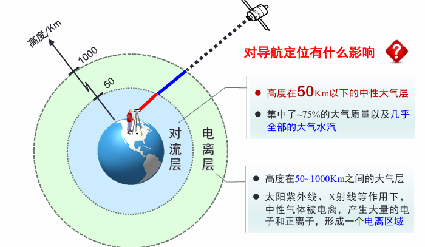

**GNSS 信号不是在真空里传播，而是在一个分层、非均匀、随时间变化的大气环境里传播。**

因此，传播段误差本质上都是“电磁波传播条件变化”的结果，只不过：

- 在**电离层**里，关键角色是**自由电子**；

- 在**对流层**里，关键角色是**气压、气温和水汽**；

- 在**多路径**里，关键角色是**反射体和环境几何结构**。

## 大气延迟

GPS 信号在穿过大气时，传播速度会变化，传播路径也可能发生弯曲。

在 GPS 定位里，通常首先主要考虑的是**传播速度变化**所带来的影响。

两类介质：

- **色散介质**：传播速度与频率有关

- **非色散介质**：传播速度与频率<u>无关</u>。

它直接决定了电离层和对流层处理方法为什么完全不同：

| **介质** | **是否色散** | **对不同频率信号影响是否相同** | **处理特征**       |
|----------|--------------|--------------------------------|--------------------|
| 电离层   | 色散介质     | 不同频率影响不同               | 可利用双频观测改正 |
| 对流层   | 非色散介质   | 不同频率影响基本相同           | 双频不能直接消除   |

**电离层“看频率”，对流层“不看频率”。**

## 电离层延迟

### 1. 电离层是什么 电离层是高度大约 50–1000 km 之间的大气层，在太阳紫外线、X 射线和高能粒子作用下，中性气体被电离，形成大量电子和正离子。

电磁波穿过电离层时，<u>传播速度会变化</u>，而且变化程度取决于**<u>电子密度</u>**和**<u>信号频率</u>**。

电离层延迟的量级并不小：

- 天顶方向可达**十几米**

- 高度角 5° 时可超过 **50 米**

- 中纬度地区一般在 **9–45 m** 范围内。

### 2. 为什么电离层对测距码和载波相位影响不同

- **相速**：波的相位传播速度

- **群速**：波包、振幅包络的传播速度。

GNSS 中：

- **载波**在电离层中按**<u>相速</u>**传播

- **测距码**在电离层中按**<u>群速</u>**传播。

这就导致一个极其重要的结论：

电离层误差对测码伪距观测值和载波相位观测值的影响大小相同，但符号相反。

- 对<u>测距码</u>来说，群速减慢，所以看起来“多走了一段”，表现为**伪距增加**；

- 对<u>载波相位</u>来说，相速变化的表现方向相反，所以相位观测量里呈现出**相反符号的效应**。

这也是为什么双频组合、码相结合的方法在电离层处理中非常有效。

### 3. 电离层延迟与频率、TEC 的关系

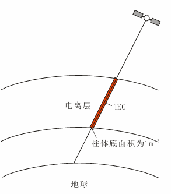课件给出了电离层延迟的核心公式结构：

$$\Delta^{iono} \propto \frac{TEC}{f^{2}}$$

更具体地写，电离层相位延迟可表示为：

$\Delta_{ph}^{iono} = \frac{40.3}{f^{2}} \cdot TEC$

这里：

- $f$是信号频率

- $TEC$是总电子含量。

这条式子背后有两个非常重要的知识点：

**第一，电离层延迟与频率平方成反比**

频率越高，电离层延迟越小。  
所以同样穿过电离层，L1 和 L2 所受影响不同，这就是双频改正能成立的基础。

**第二，电离层延迟本质上由 TEC 决定**

TEC（Total Electron Content，总电子含量）表示沿信号传播路径贯穿整个电离层的电子总数。课件还给出：

- **VTEC**：天顶方向的总电子含量

- **1 TECU =** $10^{16}$**个电子/m²**。

所以电离层延迟问题，归根结底可以看成：  
**只要你能得到 TEC，就能估计电离层延迟。**  
但麻烦在于，TEC 本身是随时间、地点和太阳活动复杂变化的。

### 4. TEC 为什么这么难建模

课件后面用了很多图来说明 TEC 不是常数，而是一个很“活”的量。

**（1）与高度有关**

电子密度最大值通常出现在 **300–400 km** 高度附近，而且白天和夜晚分布不同。

**（2）与地方时有关**

电子含量随地方时变化明显，一般白天高、夜间低，峰值常出现在下午前后。课件第 14 页的图就展示了这种日变化。

**（3）与太阳活动有关**

电子含量和太阳活动密切相关，太阳活动剧烈时，电子含量增加；太阳活动周期约 **11 年**。课件第 15–16 页专门用太阳黑子数和 11 年周期图来说明这一点。

**（4）与季节有关**

VTEC 还会随地球公转和太阳入射方向产生季节性变化。

**（5）与地理位置有关**

不同纬度、经度的电离层电子含量分布差异很大，课件第 18 页用全球地图直观展示了这一点。

所以课件最后总结说：  
**虽然根据 TEC 可以求电离层延迟，但由于 TEC 与时间、地点、太阳活动等因素关系复杂，尚不能建立绝对严格完备的理论计算公式。**

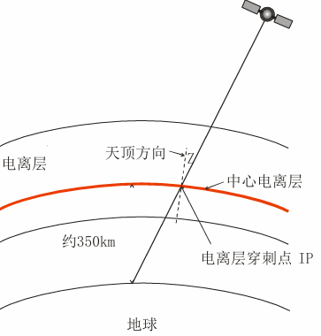这句话很重要，因为它解释了为什么 GNSS 电离层处理方法会同时存在“经验模型、双频组合、实测格网模型、参数估计”等多种方案。不是因为谁多余，而是因为电离层本身就太复杂。

## 电离层延迟处理方法

电离层改正方法总结为四类：

- **经验模型改正**

- **双频观测值组合**

- **求差法（相对定位）**

- **参数估计**。

### 1. Klobuchar 模型：单频用户最经典的经验模型

Klobuchar 模型是美国 J.A. Klobuchar 在 1975 年提出的，广泛用于 GPS 单频用户。

它的核心思想是把整个电离层简化成离地面约 **350 km** 的一个**单层壳层**，也就是课件说的“中心电离层”。

模型使用导航电文播发的 $\alpha_{0} \sim \alpha_{3}$、$\beta_{0} \sim \beta_{3}$ 等参数，再结合时间、测站位置、卫星高度角和方位角，先求信号在电离层单层上的**穿刺点（IPP）**，再计算该点的天顶电离层延迟，最后通过投影函数转成斜路径延迟。

它的物理理解并不难：  
真实电离层是一个厚厚的三维分布层，但建模太复杂，于是先把它“压缩”到 350 km 的单层上，再在这层上估算延迟。这样做虽然粗糙，但实用。

课件指出，Klobuchar 模型大约只能改正实际电离层延迟的 **60%** 左右。它的**<u>最大优点</u>**不是精度高，而是：  
**单频用户无需额外系统支持，只靠导航电文就能得到一个近似的电离层改正数。**

所以你要对它形成的认识是：  
**Klobuchar 模型不是最精的，但它是最方便、最有代表性的单频经验模型。**

### 2. 双频改正：为什么这是最有效的方法

因为**<u>电离层是色散介质</u>**，不同频率受影响不同，所以只要接收机同时观测 L1、L2（或其他双频），就可以通过组合把电离层项消掉。

从理解上说，双频改正最重要的不是公式本身，而是这个逻辑：

**两条不同频率**的观测值包含**同一个几何距离**，但**电离层项大小不同**。

把它们按**适当系数组合**，就能把**电离层项抵消**。

课件给出的结论也很明确：

- 用双频进行电离层延迟改正，精度最好；

- 对载波相位来说，误差一般不会超过几个厘米；

- 对码观测值来说，改正效果受码噪声限制，会差一些；

- 这种方法只适合双频数据，不能用于单频。

**电离层延迟之所以能被双频有效处理，根本原因是电离层“看频率”。**

### 3. 半和组合：单频观测中的一个有意思思路

它利用**码和相位的组合关系**消除电离层延迟。  
这个部分你初学时不需要硬推公式，但要知道它体现了一个重要思想：

**除了简单用同类观测值组合，还可以把**<u>不同类型观测值（码和相位）</u>**结合起来利用。**

这类方法的本质还是：  
利用不同观测量对同一误差项响应不同这一点，构造组合，把某些误差消掉。

### 4. 电离层格网改正法

经验模型的问题在于太粗略，双频又要求接收机必须双频。

它的基本思想是：

1.  用基准站的**双频观测数据**计算电离层延迟；

2.  由这些实测延迟反演出某一区域或全球范围的 **TEC/VTEC 模型**；

3.  把结果放到人为定义的格网点上；

4.  用户根据自己信号穿刺点所在位置，对格网值做内插，得到延迟改正。

| 方法      | 本质                                   | 优点                         | 局限                 |
|-----------|----------------------------------------|------------------------------|----------------------|
| Klobuchar | 长期统计经验模型                       | 不依赖外部实时系统，单频可用 | 精度有限             |
| 格网改正  | 基于双频实测数据构建局部/全球 TEC 模型 | 改正效果较好，更贴近真实状态 | 依赖基准站和外部服务 |

这也说明了一个更深的认识：  
**电离层改正的发展方向，本质上是从“经验近似”逐渐走向“基于实测的动态建模”。**

### 5. 电离层改正方法之间的整体关系

| 方法         | 思路                                   | 效果               |
|--------------|----------------------------------------|--------------------|
| 经验模型改正 | 根据长期资料建立经验模型               | 效果一般           |
| 双频改正     | 直接利用双频观测构成改正或无电离层组合 | 效果最好           |
| 实测模型改正 | 利用双频实测资料建立区域或全球模型     | 效果较好           |
| 求差法       | 利用电离层延迟在空间上的相关性         | 基线越长，效果越弱 |

- 最方便的是**经验模型**；

- 最根本最强的是**双频改正**；

- 最工程化的是**格网/实测模型**；

- 相对定位里则常利用**差分的空间相关性**。

## 对流层延迟

### 1. 对流层延迟的本质

对流层是 50 km 以下的中性大气层，集中了绝大部分大气质量和几乎全部水汽。

电磁波穿过对流层时，会发生<u>传播速度变化和路径弯曲</u>，这种由对流层引起的信号延迟就是**对流层延迟**。

与电离层最根本的不同在于：  
**对流层是<u>非色散介质</u>。**

课件第 44 页甚至给了不同波长下折射指数 $N$的数值，说明对 GNSS 的 L1 和 L2 来说，折射效应几乎相同，所以：

**<u>不同频率 GNSS 信号在对流层中的折射效应相同</u>。**

这意味着双频对流层改正不能像电离层那样直接“频率相消”。

### 2. 对流层延迟的表达式与组成

课件通过折射系数 $n$和折射指数 $N$给出了对流层延迟的基本表达式，最终常写成：

$$\rho^{trop} = \int_{s}^{}{(n - 1)\text{ }ds =}10^{- 6}\int_{s}^{}{N\text{ }ds}$$

并进一步把折射指数写成干、湿两部分：

$$N = N_{d} + N_{w}$$

其中主要与气压 $P$、温度 $T$、水汽压 $e$有关。

这说明**对流层延迟的决定因素**不再是电子，而是**气象元素**。  
所以你可以把电离层和对流层对比成：

| 层次   | 关键物理量          |
|--------|---------------------|
| 电离层 | 电子密度、TEC、频率 |
| 对流层 | 气压、气温、水汽压  |

同时课件把对流层延迟分成：

- **干分量（dry）**

- **湿分量（wet）**。

<!-- -->

- <u>干分量占总延迟的大头</u>，比较稳定；

- 湿分量虽然小一些，但变化剧烈、建模更难。

- 后面很多模型之所以要分干湿，就是因为这两部分的性质差很多。

### 3. 对流层延迟有多大

- 天顶方向可达约 **2.5 m**

- 在低高度角时可达 **30–40 m**。

所以对流层延迟和电离层延迟一样，也绝对不能忽略。  
尤其低高度角时，延迟会迅速增大，这也是为什么很多数据处理都会对低高度角卫星降权。

### 4. 对流层延迟如何影响定位

了对定位误差的直观影响：

- **<u>平面定位</u>**误差大约 **±2 m** 左右，且呈**<u>随机性变化</u>**；

- **<u>高程方向偏差</u>**可达到约 **10 m**，且更多表现为**<u>系统误差</u>**。

这说明一个很重要的经验事实：

对流层延迟对高程分量的破坏往往比对平面分量更严重。

所以高精度 GNSS 处理中，对流层延迟之所以被高度重视，很大程度上也是因为它是高程精度的重要限制因素

## 对流层延迟处理方法

### 1. 模型改正：先从气象参数出发

课件讲了两种经典的对流层改正模型：

- **Hopfield 模型**

- **Saastamoinen 模型**。

它们的建模思路其实是相同的：

1.  建立折射指数与高度的函数关系；

2.  沿高度积分，得到**天顶方向延迟**；

3.  通过投影函数，把天顶延迟变成**斜路径延迟**。

这条思路很重要，因为后面你会发现：  
无论是哪种模型，核心都绕不开两个东西：

- **天顶延迟**

- **映射函数（投影函数）**。

**Hopfield 模型**

输入参数主要有：

- 气压 $P$

- 温度 $T$

- 水汽压 $e$

- 卫星高度角 $E$

- 测站高度 $h_{s}$。

它把总延迟分为干分量和湿分量，课件指出干分量一般占总延迟的 **80%–90%**，模型精度大致为**分米级**。

**Saastamoinen 模型**

它与 Hopfield 一样处理对流层延迟，但进一步考虑了**测站纬度**差异，因此改正效果通常更好，与探空资料吻合更好。

你现在不必强行背全公式，但要知道：  
**Saastamoinen 模型通常被认为比 Hopfield 更精细、更常用。**

**两个模型怎么比较**

课件第 53 页给了一个很实用的结论：

- 在平原地区，两种模型算出的天顶延迟差别仅 **毫米级**；

- 在高山地区，ZTD 差异可能达到 **厘米到分米级**，因此更推荐 Saastamoinen；

- 低高度角时，不同投影函数会让斜路径延迟 STD 差异达到**分米到米级**；高度角大于 15° 时，差异通常只有毫米级。

所以对流层模型的差异，很多时候不是出在“天顶延迟本身”，而是出在**斜路径投影**上。

### 2. 参数估计

<u>如何提高对流层改正精度</u>，核心思路就是：

**把对流层延迟当作未知参数估计**

因为经验模型对干分量效果通常不错，但湿分量受水汽不规则变化影响很大，模型可信度有限。所以在高精度处理中，常常会：

- 先用经验模型改正掉大部分已知部分；

- 再把剩余的对流层延迟，尤其是<u>湿延迟</u>，作为参数估计。

课件第 54–56 页讲了几种处理方式：

- 整个时段给一个参数

- 分时段给多个参数

- 用线性函数描述

- 用随机模型描述。

特别是随机模型部分，课件指出：  
大量研究表明，用一阶 **Gauss-Markov** 过程描述湿延迟，是目前较理想的方法之一，并已被多个高精度 GPS 软件采用。

这说明一个很重要的认识：

**对流层延迟，尤其湿延迟，并不是总能靠“一个公式”很好解决，很多时候必须边观测边估计。**

### 3. 投影函数（映射函数）为什么这么重要 对流层总延迟常写成：

$$\Delta D^{trop} = \Delta D_{z,dry}M_{dry}(E) + \Delta D_{z,wet}M_{wet}(E)$$

其中 $M(E)$就是投影函数或映射函数。它把<u>天顶方向延迟</u>映射到<u>卫星斜路径方向</u>。

课件明确说：  
**映射函数的好坏，直接影响对流层延迟改正效果**

这句话特别关键。因为很多初学者会以为“对流层模型主要就是气压温度公式”，其实高精度处理中，**映射函数往往才是最关键的部分之一。**

课件还列举了几类映射函数：

- 经验型：Marini、Chao、Ifadis、Davis、Herring、**NMF**、**GMF**

- 需要实际气象资料的：**VMF1**。

### 4. NMF、VMF1、VMF3、GMF：怎么理解它们的关系

这一部分初学时最容易看晕，其实你可以把它们看成“映射函数的发展脉络”。

**NMF**

Neill 利用全球探空气球站资料建立的经验型全球映射函数。曾被广泛使用，在中纬度地区表现不错，但在高纬和赤道地区效果欠佳。

**VMF1**

Vienna 动态映射函数，由维也纳理工大学建立，利用 ECMWF 提供的数值天气资料动态生成，精度明显优于经验映射函数，但会有一定时延。

**VMF3**

是在 VMF1 基础上发展的新一代模型，基于更高分辨率的 ERA5 再分析资料，时间分辨率和空间分辨率更高，对低高度角表现尤其更好。

**GMF**

全球映射函数，也是基于长期数值天气资料构建的经验模型，精度与 VMF1 相近，但**没有时延问题**。

你可以把它们总结成一个很清楚的认识：

| 模型 | 特点                                      |
|------|-------------------------------------------|
| NMF  | 老牌经验模型，应用广，但区域适应性有限    |
| VMF1 | 基于实测数值天气资料，动态、精度高        |
| VMF3 | VMF1 的升级版，精度更高、低高度角表现更好 |
| GMF  | 无时延的全球经验模型，精度接近 VMF1       |

## 多路径误差

**1. 多路径是什么**  
多路径效应指的是：接收机除了接收到卫星的**直达信号**，还接收到<u>被周围物体反射后从其他路径到达的信号</u>。由这些多路径信号干涉产生的时延效应，就叫**多路径效应**；由此导致观测值偏离真值，称为**多路径误差**。

所以多路径和电离层、对流层不一样：

- 电离层和对流层是**介质传播问题**；

- 多路径是**反射与环境几何问题**。

### 2. 多路径误差为什么难处理

- 与测站周围环境有关

- 与反射体介质属性有关

- 与接收机结构和性能有关

- 低高度角信号更容易受影响

- 短时间内常表现为系统性

- **没有通用模型**

- **<u>不能通过站间差分消除或削弱</u>**。

为什么多路径通常比电离层、对流层更“烦”？  
因为它不像大气延迟那样是大范围、可描述的场，而是高度依赖测站附近的局部几何环境。你站在建筑物边、山谷里、水面旁、金属反射面附近，误差特征都完全不同。

所以多路径本质上是一个**局地环境问题**，不像大气那样可以依靠一个全球统一模型大体解决。

### 3. 多路径怎么应对

“**前端尽量避免，后端尽量抑制**”。

**（1）观测环境上避免**

测站应尽量避开易产生多路径的环境，例如：

- 山坡、山谷、盆地

- 高层建筑物附近

- 明显反射面附近。

本质上就是一句话：  
**不要让接收机周围有大量能把卫星信号反弹回来的东西。**

**（2）硬件上抑制**

- 使用抗多路径天线，如带抑径板、抑径圈的天线，极化天线

- 使用抗多路径接收机技术，如窄相关、MEDLL 等。

这说明硬件设计本身就是多路径抑制的重要一环。

**（3）外业观测策略**

- 适当延长观测时间。

因为多路径随卫星几何变化而变化，延长观测能在一定程度上平均和削弱它的影响。

**（4）数据处理中抑制**

- 给低高度角卫星降权

- 参数法

- 滤波法

- 信号分析法。

其中“低高度角降权”尤其容易理解：  
因为低高度角信号更容易受到地面和周围物体反射影响，所以应少信它一点。

## 三类传播段误差

| **误差类型** | **根本来源**                     | **是否与频率有关**      | **量级特点**                       | **主要处理方式**                                    |
|--------------|----------------------------------|-------------------------|------------------------------------|-----------------------------------------------------|
| 电离层延迟   | 自由电子引起的色散传播           | 有关，$\propto 1/f^{2}$ | 天顶十几米，低高度角可超 50 m      | 双频组合、经验模型、格网改正、差分、参数估计        |
| 对流层延迟   | 中性大气折射，受气压温度水汽影响 | 基本无关                | 天顶约 2.5 m，低高度角可达 30–40 m | 模型改正、映射函数、参数估计、差分                  |
| 多路径误差   | 周围反射体造成的反射干涉         | 不是核心区分点          | 高度依赖环境，局部性强             | 选点规避、抗多路径天线/接收机、延长观测、降权、滤波 |

这张表背后的理解比单独背概念更重要。因为它告诉你：

- **电离层**：是“电子—频率”问题

- **对流层**：是“气象—折射”问题

- **多路径**：是“环境—反射”问题。

# 第4章 **GPS误差源——其他误差**

## 一、本讲知识框架

**第一块：具体误差源**

1.  地球自转改正

2.  接收机天线安置误差

3.  天线相位中心偏差

4.  天线相位缠绕误差

**第二块：误差的总分类与处理思路**

1.  误差怎么分类

**误差从哪里来 → 对观测量/定位结果有什么影响 → 能否建模 → 该用什么策略处理**

## 二、四类其他误差

### 1. 地球自转改正

**1）本质**

卫星坐标通常表示在**地固坐标系**中，但地固系会随地球自转而旋转。  
因此，信号从<u>卫星发射到接收机接收</u>的传播过程中，地球已经转过一个小角度，如果直接用“卫星发射时刻坐标”和“测站接收时刻坐标”算几何距离，就会产生误差。

**所有定位解算是在信号接收时刻对应的协议地球坐标系中进行的**

**2）为什么会出现**

因为信号传播并不是瞬时完成的，传播时间大约可达 **0.07 s**，在这段时间内地球已经发生旋转，所以站星几何关系在“发射时刻”和“接收时刻”并不完全一致。

**3）处理思路**

| **方法** | **核心思想**                               | **处理对象** |
|----------|--------------------------------------------|--------------|
| 方法一   | 把卫星坐标旋转改正到接收时刻对应的坐标系   | 改正卫星位置 |
| 方法二   | 直接把地球自转带来的影响折算到距离观测值上 | 改正观测距离 |

两种方法本质一致，都是为了解决：  
**“卫星在发射时刻的位置”和“接收机在接收时刻所在坐标系”不统一的问题。**

**4）影响大小**

地球自转改正不能忽略，尤其在<u>单点定位</u>中影响明显。

- 对**两极测站**：影响为零

- 对**赤道测站**：影响可达**数十米**

- **单点定位**：误差可达**数十米**，且主要体现在**东西方向**

- **相对定位**：若两站间距 10 km，基线分量影响可达 **1.55 cm**

**5）一句话记忆**

**地球自转改正 = 因“地球在信号传播期间转动”而必须做的几何改正。**

### 2. 接收机天线安置误差

**1）定义**

接收机天线安置误差，是指**<u>接收机天线参考点</u>相对于<u>测站标石中心</u>的位置偏差**。  
也就是说，真正用于观测的天线，并不一定正好严格对准地面测站中心；如果对中不准、天线高量取不准，就会引入误差。

**2）误差来源**

主要来自两类操作问题：

- **对中误差**：天线没有精确对准测站中心

- **量高误差**：天线高是相对于天线参考点量取的，如果量错，就会传递到站点坐标中

**3）应对方法**

- 正确量取天线高和偏心改正

- 正确对中整平

- 采用强制对中装置（如变形监测、连续运行系统）

**4）一句话记忆**

**安置误差是“人把天线放得不够准”造成的误差。**

### 3. 天线相位中心偏差

**3.1 先理解两个关键词：PCO 和 PCV**

| **名称** | **英文**               | **含义**     | **本质**                           |
|----------|------------------------|--------------|------------------------------------|
| PCO      | Phase Center Offset    | 相位中心偏差 | 两个“平均中心”之间的固定偏移       |
| PCV      | Phase Center Variation | 相位中心变化 | 瞬时相位中心相对平均相位中心的变化 |

可直接理解为：

- **PCO**：偏在哪儿，偏了多少

- **PCV**：这个偏差会不会随方向、角度继续变化

**3.2 卫星天线相位中心偏差**

卫星端要区分两个中心：

- **卫星相位中心**

- **卫星质量中心**

其中：

- 广播星历给出的是**卫星相位中心**位置

- 精密星历给出的是**卫星质量中心**位置

所以卫星端的 **PCO** 就是：

**卫星天线相位中心 与 卫星质心 不重合所产生的偏差**

而 **PCV** 则表示：

**瞬时相位中心 与 平均相位中心 的差异**

这说明：卫星发射信号的“等效参考点”不是一个绝对固定不变的点，而会受方向等因素影响。

**3.3 接收机天线相位中心偏差**

接收机端也有两个中心：

- **天线相位中心**

- **天线参考点 ARP（Antenna Reference Point）**

平时天线对中、量天线高，都是相对于 **ARP** 来做的。  
因此接收机端的 **PCO** 就是：

**接收机天线相位中心 与 天线参考点 ARP 的不重合**

而 **PCV** 同样表示：

**瞬时相位中心 与 平均相位中心 的差异**

**3.4 为什么它会影响测距**

GPS 实际测量的是 **<u>卫星天线相位中心</u> 到 <u>接收机天线相位中心</u>** 的距离。

所以如果我们在计算中用的是“质心”或“参考点”，而观测值对应的却是“相位中心”，就会造成**信号参考点不一致**。PCO 和 PCV 的本质影响就在这里。

**3.5 改正方法**

**方法一：<u>模型改正</u>**

采用 **IGS 绝对天线相位中心模型**，同时考虑：

- PCO

- PCV

- 卫星信号发射角

- 入射方位角

课件还给出使用关系：

- **天线参考点位置 = 天线相位中心位置 - PCO**

- **几何距离 = 观测距离 - PCV**

**方法二：<u>相对定位中尽量统一天线条件</u>**

- 使用相同类型天线

- 进行天线定向  
  这有助于减弱相位中心偏差的影响，但主要限于**相对定位**。（第13页）

**3.6 一句话记忆**

**天线相位中心偏差的本质，是“观测参考点”和“计算参考点”不一致。**

### 4. 天线相位缠绕误差

**1）定义**

当卫星天线和接收机天线发生**相对旋转**时，载波相位观测值会随之变化，这种变化就称为**相位缠绕误差**。（第14页）

**2）为什么会旋转**

- 卫星太阳能帆板始终要对准太阳

- 卫星绕地球运动，发射天线方向会缓慢旋转

- 卫星进出地影时，旋转可能加快

**3）影响大小**

- **单点定位**：影响可达**分米级**

- **短距离相对定位**：一般可忽略

- **两站相距 4300 km** 时，对基线向量影响最大可达 **4 cm**

**4）处理方法**

一般采用**模型改正卫星端相位缠绕**。（第14页）

**5）一句话记忆**

**相位缠绕误差不是几何点位偏差，而是“天线相对旋转引起的载波相位变化”。**

**三、最容易混淆的知识点对比**

**1. 天线安置误差 vs 天线相位中心偏差**

| **对比项**         | **天线安置误差**             | **天线相位中心偏差**                      |
|--------------------|------------------------------|-------------------------------------------|
| 本质               | 天线没放准、量高没量准       | 天线本身的电学相位中心与参考点/质心不一致 |
| 来源               | 外业操作误差                 | 天线物理/电学特性                         |
| 是否人为可直接避免 | 较大程度可以                 | 不能完全靠操作消除                        |
| 主要处理方法       | 对中整平、正确量高、强制对中 | PCO/PCV模型改正、统一天线类型             |

一句话区分：  
**安置误差是“放错了”，相位中心偏差是“天线本来就不是理想点”。**

**2. PCO vs PCV**

| **对比项** | **PCO**                   | **PCV**                    |
|------------|---------------------------|----------------------------|
| 中文       | 相位中心偏差              | 相位中心变化               |
| 参考对象   | 平均相位中心与参考点/质心 | 瞬时相位中心与平均相位中心 |
| 特征       | 更偏“固定偏移”            | 更偏“随方向变化”           |
| 处理方式   | 建模改正                  | 建模改正                   |

**PCO 解决“中心偏了多少”，PCV 解决“这个中心还会怎么变”。**

**3. 地球自转改正 vs 相位缠绕误差**

| **对比项** | **地球自转改正**               | **相位缠绕误差**             |
|------------|--------------------------------|------------------------------|
| 原因       | 地球在信号传播期间发生旋转     | 卫星/接收机天线发生相对旋转  |
| 影响对象   | 几何距离                       | 载波相位观测值               |
| 主要表现   | 单点定位可达数十米，东西向明显 | 单点定位分米级，长基线更明显 |
| 处理方式   | 几何改正/距离改正              | 相位缠绕模型改正             |

**前者改“几何关系”，后者改“相位观测”。**

## 四、全章误差分类总结

**1. 按误差性质分类**

| **类别** | **典型例子**              |
|----------|---------------------------|
| 粗差     | 周跳                      |
| 系统误差 | GPS观测误差大部分属于此类 |
| 随机误差 | 观测噪声                  |

**2. 按误差来源分类**

| **来源**       | **典型误差**                                      |
|----------------|---------------------------------------------------|
| 与卫星有关     | 轨道误差、卫星钟差、相对论效应、卫星天线PCO/PCV   |
| 与传播途径有关 | 电离层延迟、对流层延迟、多路径                    |
| 与接收设备有关 | 接收机天线PCO/PCV、接收机钟差、硬件延迟、观测噪声 |
| 与测站有关     | 固体潮、海潮、大气负荷                            |

**3. 按与信号频率关系分类**

| 类别       | 典型误差                                                     |
|------------|--------------------------------------------------------------|
| 与频率有关 | 电离层延迟、硬件延迟、相位中心偏差及变化、卫星钟误差、多路径 |
| 与频率无关 | 对流层延迟、卫星轨道误差                                     |

**4. 按时变特性分类**

| **类别**     | **典型误差**                       |
|--------------|------------------------------------|
| 常数误差     | 天线相位中心偏差、短时间内硬件延迟 |
| 缓慢变化误差 | 电离层、对流层、轨道误差、卫星钟差 |
| 快速变化误差 | 接收机钟差、电离层闪烁             |

**5. 按能否精确建模分类**

| **类别**     | **典型误差**                                                                  |
|--------------|-------------------------------------------------------------------------------|
| 能精确建模   | 天线相位中心偏差及变化、相对论效应、地球自转改正、对流层干延迟、固体潮/海潮等 |
| 不能精确建模 | 多路径、对流层湿延迟、电离层延迟、接收机钟差                                  |

**五、误差处理方法总表**

课件第22-27页总结了几种误差处理策略，本质上是在回答：**不同误差该怎么消除或削弱？**

| **处理方法** | **原理**                         | **适用条件**                      | **典型对象**                     |
|--------------|----------------------------------|-----------------------------------|----------------------------------|
| 模型改正法   | 建立误差模型，直接改观测值       | 误差机理清楚、可建模              | 对流层、钟差、地球自转、相对论等 |
| 求差法       | 利用观测值之间相同或相似误差抵消 | 误差具有空间/时间相关性           | 钟差、电离层、对流层、轨道误差   |
| 线性组合法   | 利用不同频率组合削弱误差         | 误差与频率有关，且有双频/三频观测 | 电离层延迟等                     |
| 参数法       | 把系统误差当未知参数估计         | 适用于多数系统偏差                | 接收机钟差、部分大气延迟等       |
| 回避法       | 通过选址、设备、观测方式避开误差 | 对误差环境有认识                  | 多路径、电磁干扰                 |
| 精密产品     | 使用更高精度外部产品替代广播值   | 适用于高精度处理                  | 精密星历、精密钟差               |

**六、课件最后思考题，建议直接背的对应关系**

课件第29页给了参考答案，这部分很适合期末选择/填空。

| **误差**       | **推荐处理方法**                                 |
|----------------|--------------------------------------------------|
| 卫星轨道误差   | **求差、采用精密产品**                           |
| 卫星钟误差     | **模型改正、求差、采用精密产品**                 |
| 接收机钟差     | **求差、附加参数估计**                           |
| 相对论效应     | **模型改正、求差**                               |
| 电离层延迟误差 | **模型改正、线性组合、求差、精密产品、参数估计** |
| 对流层延迟误差 | **模型改正、求差、精密产品、参数估计**           |
| 地球自转效应   | **模型改正**                                     |
| 多路径误差     | **通常难以有效改正，常通过忽略/回避其影响处理**  |

# 第5章 GPS单点定位与测速

## 一、本讲总体框架

这一讲围绕卫星导航最核心的输出展开，即：

- **位置 Position**

- **速度 Velocity**

- **时间 Time**

也就是通常所说的 **PVT**。  
进一步看，PVT 解算是卫星导航系统实现 **PNT（定位、导航、授时）**功能的基础。

**GNSS 接收机如何从观测值中解出位置、速度和时间，并评价结果精度与可靠性。**

## 二、PNT 与 PVT 的基本概念

### 1. PNT 的含义

**PNT = Positioning, Navigation and Timing**，即**定位、导航、授时**。  
它强调的是卫星导航系统向用户提供的基本服务能力。

也就是说：

- **定位**：给出用户所在位置

- **导航**：支持路径引导和运动过程控制

- **授时**：给出统一精确时间

所以 PNT 是从“系统功能”角度来定义卫星导航的。

### 2. PVT 的含义

**PVT = Position, Velocity and Time**，即**位置、速度和时间**。  
它强调的是接收机解算时所要求得的基本状态量。

从算法角度看：

- Position 对应位置解算

- Velocity 对应速度解算

- Time 对应接收机时间与钟差估计

因此：

**PNT 是功能，PVT 是实现这些功能时解出的状态参数。**

**3. 综合 PNT、弹性 PNT、智能 PNT**

这一讲还提到了更广义的 PNT 发展方向，即建设更安全、更可靠、更泛在的国家 PNT 体系。核心可以理解为三类能力：

**综合 PNT**

强调多源融合、多系统协同，不只依赖单一 GNSS，而是将卫星导航、地基系统、低轨增强、惯导等信息统一起来，形成更广覆盖、更高可用的 PNT 体系。

**弹性 PNT**

强调在复杂环境、干扰环境、遮挡环境下，系统仍然具有持续工作的能力。  
“弹性”可以理解为：即便主系统受影响，仍能靠其他手段维持基本 PNT 服务。

**智能 PNT**

强调利用智能化方法提升 PNT 服务能力，包括智能感知、智能融合、智能服务模式等。

这三者的共同目标是：

**提高 PNT 的安全性、连续性、完好性、可靠性和生存能力。**

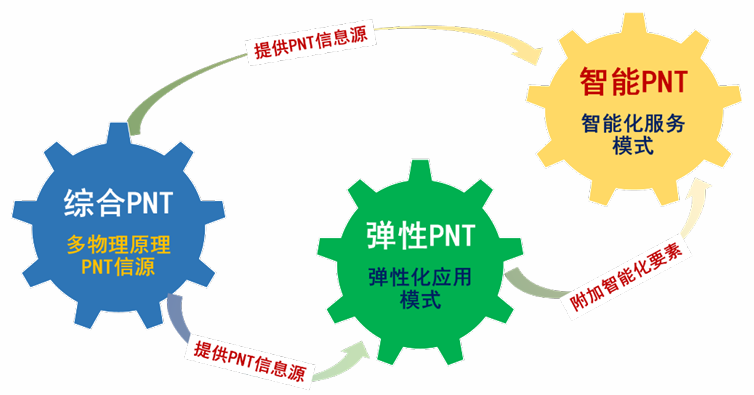

## 三、GPS 测量定位方法的分类

理解单点定位前，先把 GNSS 定位的几种分类方式理清。

### 1. 按定位模式分

- **绝对定位（单点定位）**

- **相对定位**

**绝对定位**

只利用一台接收机直接求测站坐标。

**相对定位**

利用两台或多台接收机，通过相对观测求基线或相对坐标。

### 2. 按接收机运动状态分

- **静态定位**

- **动态定位**

**静态定位**

接收机位置固定不动，常用于控制测量。

**动态定位**

接收机在运动过程中实时或事后求位置。

### 3. 按结果获取时间分

- **事后定位**

- **实时定位**

**事后定位**

观测结束后统一处理。

**实时定位**

观测同时解算结果。

### 4. 按观测值类型分

- **伪距定位**

- **载波相位定位**

**伪距定位**

实现简单，适合导航定位。

**载波相位定位**

精度高，但模型更复杂。

这一分类的意义在于：本讲单点定位主要从**伪距单点定位**展开，但后面又会扩展到 **PPP**，也就是将伪距和相位结合起来做更高精度的单点定位。

## 四、单点定位的概念与分类

### 1. 单点定位的定义

单点定位通常指：

**只利用一台 GNSS 接收机，直接确定观测站在地心地固坐标系中绝对坐标的定位方法。**

因此它也叫**绝对定位**。

### 2. 单点定位的两种典型形式

| **类型** | **观测值**  | **轨道与钟差产品** | **误差处理** | **典型精度** |
|----------|-------------|--------------------|--------------|--------------|
| SPP      | 伪距        | 广播星历           | 粗略误差模型 | 米级到十米级 |
| PPP      | 伪距 + 相位 | 精密星历、精密钟差 | 精密误差模型 | 厘米级       |

**SPP：标准单点定位**

- 用伪距观测值

- 用广播星历

- 用较粗略的误差改正

- 主要用于一般导航定位

**PPP：精密单点定位**

- 用伪距和载波相位

- 用高精度轨道和钟差产品

- 对误差进行精细建模

- 主要用于高精度单机定位

**SPP 解决“能定位”，PPP 解决“高精度单机定位”。**

## 五、伪距单点定位的几何原理

### 1. 一个站星距离

若已知接收机到某颗卫星的距离，则接收机必定位于一个球面上：

- 球心：卫星位置

- 半径：站星距离

### 2. 两个站星距离

若已知到两颗卫星的距离，则两个球面相交为一个圆，接收机位于这个圆上。

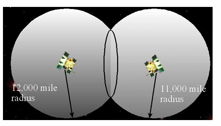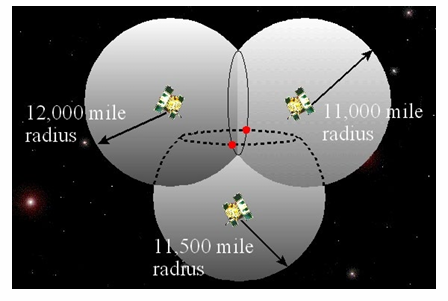

**3. 三个站星距离**

若已知到三颗卫星的距离，则三个球面交会后，理论上会得到两个候选点。

通常：

- 一个点远离地球，不符合实际

- 一个点靠近地球，是接收机真实位置

**4. 单点定位本质**

因此，单点定位的本质就是：

**通过多个卫星到接收机的距离进行空间后方交会，反求测站坐标。**

这个几何图像一定要记住，因为后面的数学模型本质上就是把这个几何交会过程写成方程组。

## 六、为什么实际至少需要 4 颗卫星

几何上看，三颗卫星似乎已经能定点；但 GNSS 实际观测的不是纯几何距离，而是**伪距**。

伪距中除了几何距离外，还包含时间误差，尤其是**接收机钟差**。  
因此未知数有：

- 接收机三维坐标 $X,Y,Z$

- 接收机钟差 $dt_{r}$

总共 4 个未知数。  
所以至少需要 **4 颗卫星** 提供 4 个独立观测方程，才能解出这 4 个参数。

## 七、伪距单点定位的观测方程

### 1. 伪距的组成

伪距观测值可以理解为：

**伪距 = 卫星到接收机的几何距离 + 接收机钟差影响 − 卫星钟差影响 + 其他误差项**

其中：

- 几何距离由卫星坐标和测站坐标决定

- 卫星钟差可由导航电文或外部产品改正

- 接收机钟差一般作为未知数求解

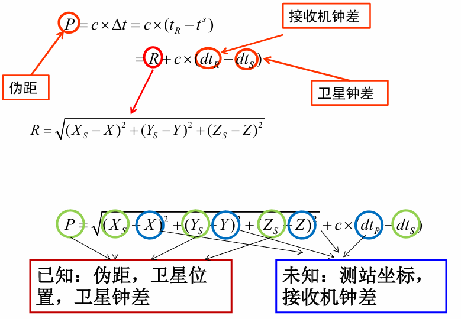

### 2. 单点定位的已知与未知

**已知量**

- 伪距观测值

- 卫星位置

- 卫星钟差

**未知量**

- 接收机坐标 $X,Y,Z$

- 接收机钟差 $dt_{r}$

因此单点定位的核心任务就是：

**利用多颗卫星的伪距观测联立方程，求解接收机三维坐标和接收机钟差。**

## 八、伪距单点定位的数学模型

### 1. 非线性特征

伪距观测方程中的几何距离包含平方根，所以这是一个**非线性方程组**。  
而直接求解非线性方程比较困难，因此通常采用：

- 先选定一个近似坐标

- 在近似点处线性化

- 得到误差方程

- 用最小二乘迭代求解

### 2. 线性化思想

设接收机坐标初值为：

- $X_{0}$

- $Y_{0}$

- $Z_{0}$

真实坐标写成：

- $X = X_{0} + dX$

- $Y = Y_{0} + dY$

- $Z = Z_{0} + dZ$

其中 $dX,dY,dZ$是待求改正数。  
同时还要求接收机钟差改正量。

### 3. 方向余弦

线性化后，方程中出现的 $l,m,n$实际上就是站星方向在三个坐标轴上的投影系数，也叫**方向余弦**。

方向余弦有两个作用：

1.  反映卫星与接收机的几何关系

2.  构成设计矩阵 $B$

因此方向余弦是把“卫星空间分布”转化成“数学解算结构”的桥梁。

### 4. 四颗星与多颗星两种情况

**四颗星**

4 个方程，4 个未知数，理论上可以直接求解。

**五颗及以上卫星**

观测方程个数多于未知数个数，形成超定方程组，此时需要用**最小二乘法**求最优解。

### 5. 最小二乘解算的意义

最小二乘解算后不仅得到参数估计值，还能得到：

- 残差

- 单位权中误差

- 协因数阵

- 各参数的精度评价

也就是说：

**最小二乘不仅能“算出结果”，还能“评价结果质量”。**

## 九、单点定位的迭代过程与实现流程

### 1. 为什么要迭代

因为接收机真实坐标事先未知，而线性化又必须先有一个近似坐标。  
因此只能：

- 先假设一个初值

- 计算改正数

- 更新坐标

- 再次迭代

- 直到收敛

### 2. 初始值怎么选

常见做法是直接取地心坐标：

- $X_{0} = 0$

- $Y_{0} = 0$

- $Z_{0} = 0$

然后通过迭代逐步逼近真实位置。

### 3. 为什么三球交会会有两个候选点

从几何上，三颗卫星对应三个球面，常会交于两个点。  
消除歧义的方法有两类：

- 根据地理常识排除远离地球的点

- 通过合理初值和迭代收敛到靠近地球的一侧

### 4. 单点定位完整实现过程

工程实现时，不是直接把伪距丢进最小二乘就结束了，而是要经历一整套流程：

**第一步：根据接收时刻和伪距确定信号发射时刻**

因为卫星位置应该取**信号发射时刻**的位置，而不是接收时刻的位置。

**第二步：根据卫星钟差修正信号发射时刻**

卫星钟和系统时间并不完全一致，因此要进行钟差改正，得到更准确的发射时刻。

**第三步：计算卫星在发射时刻的位置和速度**

这是建立观测方程的基础。

**第四步：进行必要改正**

包括：

- 地球自转改正

- 卫星相位中心偏差改正

- 以及其他模型改正

**第五步：建立伪距观测方程**

用卫星坐标、伪距观测值、近似站坐标建立线性化误差方程。

**第六步：最小二乘求解**

解出：

- $dX,dY,dZ$

- 接收机钟差改正量

**第七步：更新接收机坐标并迭代**

把求得的改正数加入近似坐标，再重新解算。

**第八步：判断是否收敛**

当坐标改正数的模足够小，即满足阈值要求时，停止迭代。

这一整套流程必须作为“工程实现链条”记住：

伪距  
→ 发射时刻  
→ 卫星位置/速度  
→ 各类改正  
→ 建立观测方程  
→ 最小二乘  
→ 更新坐标  
→ 迭代收敛

## 十、单点定位的结果及所属参考系

### 1. 单点定位直接输出什么

最直接的结果通常是空间直角坐标：

- $X,Y,Z$

但工程上常常要转换成用户更容易理解的大地坐标：

- 大地纬度 $B$

- 大地经度 $L$

- 大地高 $H$

所以手机里看到的经纬度和高程，本质上是由空间直角坐标进一步转换得到的。

### 2. SPP 结果属于哪个参考系

**SPP** 使用广播星历，其定位结果通常属于 **WGS-84**。  
WGS-84 是 GPS 系统采用的世界大地坐标系统。

### 3. PPP 结果属于哪个参考系

**PPP** 使用 IGS 精密星历和精密钟差产品，因此其结果通常属于 **ITRF**。  
ITRF 是国际地球参考框架，是国际大地测量领域广泛采用的高精度参考框架。

### 4. 这一点为什么重要

同样是“单点定位结果”，SPP 和 PPP 并不是完全处于同一参考框架下。  
所以在高精度测量中，不仅要关心坐标值本身，还要关心：

- 它属于哪个坐标系统

- 它对应哪个时间系统

- 是否与其他数据在同一参考框架中

这一点非常适合出概念题。

## 十一、单点定位精度评定

这一部分是本讲最核心的考试重点之一。

### 1. 精度评定的基础

最小二乘解算后，可得到参数协因数阵 $Q_{xx}$，再结合单位权中误差 $m_{0}$，就可以求各参数的精度。

### 2. 在空间直角坐标系中的精度

可以得到：

- $X$方向中误差

- $Y$方向中误差

- $Z$方向中误差

- 时间参数中误差

还可进一步组合得到空间位置误差。

### 3**. 在站心地平坐标系中的精度**

将空间直角坐标系的协因数阵转换到站心坐标系后，可得到：

- 北向精度 $N$

- 东向精度 $E$

- 天顶向精度 $U$

进而得到：

- **水平精度**

- **垂直精度**

所以：

**空间直角坐标系适合计算，站心坐标系更适合解释定位精度。**

## 十二、DOP：精度衰减因子

### 1. DOP 的本质

DOP（Dilution of Precision）表示**几何分布对定位精度的影响程度**。  
它不是观测误差本身，而是卫星几何条件对误差传播的放大倍数。

### 2. 常见 DOP 指标

| **指标** | **含义**     |
|----------|--------------|
| GDOP     | 几何精度因子 |
| PDOP     | 位置精度因子 |
| TDOP     | 时间精度因子 |
| HDOP     | 水平精度因子 |
| VDOP     | 垂直精度因子 |

### 3. DOP 由什么决定

DOP 只取决于：

- 卫星数量

- 卫星与测站之间的几何分布

也就是说，DOP 由设计矩阵决定，而设计矩阵来自方向余弦。

这条逻辑链一定要记住：

方向余弦  
→ 设计矩阵 B  
→ 协因数阵 Qxx  
→ DOP  
→ 精度评价

### 4. DOP 的规律

**卫星分布越均匀**

DOP 越小，定位精度越高。

**卫星集中在某一方向**

DOP 越大，定位精度越差。

**卫星数增加**

一般有助于减小 DOP，但并不是“卫星越多，精度一定越高”，因为还要看分布是否合理。

这句话很适合直接背：

**卫星多不等于精度一定高，关键还要看几何分布。**

## 十三、影响定位精度的另一核心量：UERE

### 1. UERE 的含义

UERE = **用户等效距离误差**。  
它反映的是各种误差在站星连线方向上的综合作用。

### 2. UERE 的主要来源

通常包括：

- 卫星轨道误差

- 卫星钟误差

- 电离层延迟

- 对流层延迟

- 多路径误差

- 接收机观测噪声

这些误差在伪距上共同作用，形成用户所感受到的等效距离误差。

### 3. 精度公式

位置精度可概括为：

**定位精度 = UERE × DOP**

更具体地：

- 平面定位精度与 HDOP 有关

- 三维定位精度与 PDOP 有关

- 垂直定位精度与 VDOP 有关

### 4. 提高定位精度的两条基本路径

**路径一：减小 UERE**

也就是提高观测质量、减弱误差影响，例如：

- 更好的轨道钟差产品

- 更好的电离层、对流层模型

- 更小的多路径

- 更好的接收机质量

**路径二：减小 DOP**

也就是改善卫星几何分布条件。

所以定位精度的本质来源就是：

**观测误差大小 × 几何条件好坏。**

## 十四、SPP 与 PPP 的完整对比

### 1. SPP 的特点

SPP 是最基础的单点定位形式，其特征是：

- 观测值主要为伪距

- 卫星轨道和钟差用广播产品

- 误差模型比较粗略

- 精度通常约 10 m 左右

适合：

- 一般导航

- 车载定位

- 手机定位

- 普通授时

### 2. PPP 的特点

PPP 是高精度单机定位，其特征是：

- 同时利用伪距和载波相位

- 采用 IGS 等机构提供的精密星历和精密钟差产品

- 对各类误差进行精细改正

- 精度可达厘米级

适合：

- 高精度测量

- 精密导航

- 科学应用

- 高精度授时

### 3. PPP 的数学模型思想

PPP 不再只使用单一伪距方程，而是联合使用：

- 伪距观测方程

- 相位观测方程

通常还会构造**电离层无关组合**，以削弱或消除电离层一阶效应。

### 4. PPP 中的主要参数

PPP 解算时常见待估参数包括：

- 站坐标

- 接收机钟差

- 对流层天顶延迟参数

- 载波相位模糊度

- 动态情况下的历元坐标参数

这说明 PPP 比 SPP 更复杂，原因就在于：

**PPP 不仅要定位，还要把更多高精度误差项和相位参数一起建模求解。**

### 5. SPP 与 PPP 的总对比

| **对比项** | **SPP**    | **PPP**                      |
|------------|------------|------------------------------|
| 观测值     | 伪距       | 伪距 + 相位                  |
| 卫星产品   | 广播星历   | 精密星历、精密钟差           |
| 模型精度   | 粗略       | 精密                         |
| 待估参数   | 坐标、钟差 | 坐标、钟差、模糊度、对流层等 |
| 精度       | 米级       | 厘米级                       |
| 参考框架   | WGS-84     | ITRF                         |

## 十五、单点测速原理

这一部分回答的是：

**GNSS 除了能定位置，为什么还能测速度？**

### 1. 多普勒观测值

单点测速主要依赖**多普勒观测值**。  
多普勒本质上反映的是卫星与接收机之间距离变化率，因此天然与速度有关。

### 2. 两类多普勒观测值

| **类型**   | **来源**           | **特点**               |
|------------|--------------------|------------------------|
| 原始多普勒 | 接收机直接输出     | 噪声较大，得到瞬时速度 |
| 导出多普勒 | 由载波相位差分构造 | 噪声较小，得到平均速度 |

### 3. 导出多普勒怎么构造

导出多普勒通常利用载波相位观测值，通过一阶中心差分近似得到。  
本质上是用前后历元相位变化速率来近似多普勒频移。

### 4. 多普勒观测方程的含义

多普勒观测方程本质上表达的是：

**站星视线方向上的相对运动速度 + 接收机钟速与卫星钟速影响 + 电离层/对流层延迟变化率 + 噪声**

通过多颗卫星的多普勒观测，可联立求出：

- 接收机速度分量

- 接收机钟速

### 5. 位置解算与速度解算的对应关系

| **解算类型** | **主要观测值** | **主要未知量**    |
|--------------|----------------|-------------------|
| 位置解算     | 伪距           | 坐标 + 接收机钟差 |
| 速度解算     | 多普勒         | 速度 + 接收机钟速 |

这两者结构很像，只是一个求位置，一个求速度。

### 6. 原始多普勒与导出多普勒精度比较

讲义给出的结论非常明确：

- 原始多普勒测速可达 **cm/s 量级**

- 导出多普勒测速可达 **mm/s 量级**

- 导出多普勒比原始多普勒精度高一个数量级

原因很简单：

**载波相位精度远高于原始多普勒直接输出，因此由相位构造的导出多普勒更精确。**

## 十六、完备性与 RAIM

这一部分解决的是“结果靠不靠谱”的问题。

### 1. 什么是完备性

完备性指：

**当导航系统发生故障或误差超限、结果不适用于导航时，系统能够及时向用户发出警报的能力。**

所以完备性关注的不是“精度有多高”，而是：

**一旦结果不可信，系统能不能及时发现并报警。**

### 2. 完备性的四个指标

| **指标** | **含义**                       |
|----------|--------------------------------|
| 报警限值 | 误差超过该限值时应报警         |
| 示警耗时 | 误差超限到发出警报之间的时间差 |
| 示警能力 | 系统无法发出警报的区域比例     |
| 失误几率 | 应报警却未报警的概率           |

这四个指标一定要会区分，尤其前两个最常考。

### 3. 什么是 RAIM

**RAIM = Receiver Autonomous Integrity Monitoring**，即**接收机自主完备性监测**。  
它的特点是：

- 不依赖外部系统

- 只利用接收机接收到的冗余观测值

- 对观测一致性进行检测

- 若发现故障，则及时报警

### 4. RAIM 的工作流程

RAIM 一般分两步：

**第一步：判断 RAIM 是否可用**

先看当前可见卫星数量和几何条件能否支持自主完备性监测。

**第二步：进行故障检测**

若满足条件，则利用冗余观测进行一致性检验，发现异常时向用户报警。

### 5. RAIM 的理论基础与方法

RAIM 的理论基础是：

- 粗差探测

- 粗差分离

常用算法有：

- 伪距比较法

- 最小二乘残差法

- 奇偶矢量法

### 6. RAIM 的本质作用

RAIM 的作用不是提高精度，而是：

**发现结果中的异常和故障，保证导航结果具有足够可靠性和安全性。**

所以必须把它和“精度提升方法”区分开。

## 十七、本讲最重要的联系与区别

**1. PNT 与 PVT**

- PNT：系统功能

- PVT：接收机解算状态

**2. 单点定位与相对定位**

- 单点定位：单机求绝对坐标

- 相对定位：多机求相对坐标或基线

**3. SPP 与 PPP**

- SPP：伪距、广播产品、米级

- PPP：伪距+相位、精密产品、厘米级

**4. 位置解算与速度解算**

- 伪距解位置与钟差

- 多普勒解速度与钟速

**5. UERE 与 DOP**

- UERE：观测误差综合水平

- DOP：几何分布质量

- 两者共同决定定位精度

**6. 精度与完备性**

- 精度：误差有多大

- 完备性：出错时能不能及时报警

## 思考题

**① 定位结果所属参考系（坐标系统、时间系统）？**

**坐标系统**

- **标准单点定位 SPP** 一般采用广播星历，定位结果通常属于 **WGS-84 坐标系**

- **精密单点定位 PPP** 采用精密星历和精密钟差产品，结果通常属于 **ITRF 参考框架**

**时间系统**

- 单系统 GPS 定位时，解算结果通常与 **GPS 时间系统**相关

- 若是多系统联合定位，如 GPS + BDS，由于不同系统有各自时间基准，解算时通常要处理**系统间时间偏差**

**一句话总结**

**坐标上要分 WGS-84 和 ITRF，时间上要分 GPS 时、BDS 时以及系统间时间差。**

**② 利用 GPS 和 BDS 进行定位至少需要多少颗卫星？**

**单系统情况**

若只用一个系统做伪距单点定位，未知参数一般为：

- $X,Y,Z$

- 接收机钟差

共 **4 个未知数**，因此至少需要 **4 颗卫星**。

**GPS + BDS 联合情况**

联合定位时，除了位置和接收机钟差外，还要考虑 **系统间时间偏差**。  
这样未知数通常变成：

- $X,Y,Z$

- 接收机钟差

- GPS 与 BDS 的系统间偏差

共 **5 个未知数**，因此通常至少需要 **5 颗卫星**，并且两套系统都要有观测量。

**一句话总结**

**单系统至少4颗；GPS+BDS联合定位通常至少5颗。**

**③ GNSS 除了定位，还能测速与授时，速度和时间是如何计算的？**

**速度如何计算**

GNSS 测速主要依赖 **多普勒观测值**。

基本思想是：

- 卫星与接收机之间如果存在相对运动，就会引起载波频率变化

- 这种频率变化反映了**站星视线方向上的距离变化率**

- 利用多颗卫星的多普勒观测值，可联立解出接收机的三维速度和接收机钟速

此外，还可由载波相位构造**导出多普勒**，其精度通常高于原始多普勒。

**时间如何计算**

GNSS 授时的本质是**解算接收机钟差**。

因为接收机本地时钟与卫星系统时间并不完全一致，所以在定位方程中需要同时估计：

- 接收机位置

- 接收机钟差

当接收机钟差解出后，就可以用它去修正本地时钟，使接收机时间与卫星系统时间对齐，从而实现授时。

**一句话总结**

**测速靠多普勒，授时靠钟差。**

**④ 伪距单点定位精度只有米级，如何提高单机定位精度？**

提高单机定位精度，核心有三条路：

**1. 从 SPP 提升到 PPP**

SPP 只用伪距和广播星历，精度通常是米级；  
PPP 联合使用伪距和载波相位，并采用精密星历、精密钟差和更精细的误差模型，可把单机定位提升到高精度水平。

**2. 减小 UERE**

也就是减小用户等效距离误差，主要包括：

- 更高精度轨道和钟差产品

- 更好的电离层、对流层改正

- 减弱多路径影响

- 提高接收机观测质量

**3. 改善卫星几何条件**

定位精度不仅受观测误差影响，还受卫星空间分布影响。  
卫星分布越均匀，DOP 越小，定位精度越高。

**⑤PVT 解算精度与哪些因素有关?**

**PVT 解算精度主要与观测精度和卫星几何条件有关。**  
其中，观测精度可用 UERE 表示，包含轨道误差、钟差、电离层、对流层、多路径和接收机噪声等；几何条件可用 DOP 表示，取决于卫星数量及其空间分布。对于测速，速度精度还与多普勒观测值的质量和类型有关，例如导出多普勒通常优于原始多普勒。

# GPS观测值及其组合

## 一、整体思维导图

GPS观测值及其组合  
├─ 1. GPS基本观测值  
│ ├─ 伪距观测值 P：测码得到，精度较低，无整周模糊度  
│ └─ 载波相位 L/φ：精度高，但有整周模糊度 N  
│  
├─ 2. 同频率同类型组合：差分观测值  
│ ├─ 单差：站间差分，主要消卫星钟差  
│ ├─ 双差：站间 + 星间差分，消卫星钟差和接收机钟差  
│ └─ 三差：双差 + 历元间差分，进一步消整周模糊度  
│  
├─ 3. 同类型不同频率组合  
│ ├─ 宽巷 WL：波长长，利于模糊度固定  
│ ├─ 窄巷 NL：波长短，模糊度较难固定  
│ ├─ 消电离层组合 IF：消一阶电离层，常用于长基线/PPP  
│ └─ 消几何组合 GF：消几何距离，常用于TEC和周跳探测  
│  
└─ 4. 不同类型组合  
├─ MW组合：消几何、钟差、电离层、对流层，只剩宽巷模糊度为主  
└─ 半和组合：单频伪距 + 相位，消电离层影响

## 二、GPS基本观测方程

### 1. 伪距观测值

伪距是通过测量卫星信号传播时间得到的距离，因为包含误差，所以叫“伪距”。

简化形式可写为：

$$P_{r,f}^{s} = \rho_{r}^{s} + c(\delta t_{r} - \delta t^{s}) + I_{r,f}^{s} + T_{r}^{s} + \text{硬件延迟} + \text{轨道误差} + \varepsilon_{P}
$$

其中：

| **符号**                           | **含义**                                             |
|------------------------------------|------------------------------------------------------|
| $$P_{r,f}^{s}$$                    | 接收机 $r$对卫星 $s$在频率 $f$上的伪距观测值         |
| $$\rho_{r}^{s}$$                   | 卫星到接收机的<u>几何距离</u>                        |
| $$c(\delta t_{r} - \delta t^{s})$$ | <u>接收机钟差</u>与<u>卫星钟差</u>                   |
| $$I$$                              | 电离层延迟，对伪距为正影响 |
| $$T$$                              | 对流层延迟                                           |
| 硬件延迟                           | 接收机端和卫星端硬件延迟                             |
| $$\varepsilon_{P}$$                | 观测噪声、多路径等                                   |

伪距的特点是：**<u>无整周模糊度，观测简单，但精度较低，噪声较大</u>。**

### 2. 载波相位观测值

载波相位是把接收机产生的载波与卫星接收到的载波进行相位比较，得到相位差。

若以距离为单位，可写为：

$$L_{r,f}^{s} = \lambda_{f}\Phi_{r,f}^{s} = \rho_{r}^{s} + c(\delta t_{r} - \delta t^{s}) - I_{r,f}^{s} + T_{r}^{s} + \lambda_{f}N_{r,f}^{s} + \text{硬件延迟} + \text{轨道误差} + \varepsilon_{L}
$$

注意：载波相位中的电离层项与伪距相反，伪距是 $+ I$，载波相位是 $- I$。

| **对比项**       | **伪距观测值**           | **载波相位观测值**   |
|------------------|--------------------------|----------------------|
| 测量对象         | 测码传播时间             | 载波相位差           |
| 精度             | 米级到分米级             | 毫米到厘米级         |
| 是否有整周模糊度 | 无                       | 有                   |
| 电离层影响       | $$+ I$$                  | $$- I$$              |
| 主要用途         | 单点定位、辅助模糊度解算 | 高精度定位、RTK、PPP |
| 难点             | 噪声大                   | 整周模糊度和周跳     |

一句话记忆：

**伪距粗但直接，载波准但有模糊度。**

## 三、为什么要做观测值线性组合？

PPT中线性组合的核心目的有两个：

1.  **消除或削弱误差，提高定位精度。**  
    比如消除卫星钟差、接收机钟差，削弱电离层、对流层、轨道误差。

2.  **减少待估参数个数，降低解算复杂度。**  
    原始观测方程中有测站坐标、卫星钟差、接收机钟差、对流层延迟、模糊度等大量未知量，直接解算非常复杂。

线性组合主要分为四类：

| **组合类型**         | **代表组合**          |
|----------------------|-----------------------|
| 同类型同频率组合     | 单差、双差、三差      |
| 同类型不同频率组合   | 宽巷、窄巷、IF、GF    |
| 不同类型相同频率组合 | 半和组合              |
| 不同类型不同频率组合 | Melbourne-Wübbena组合 |

## 四、同频率相位的差分组合

### 1. 差分观测值的本质

差分观测值就是把<u>若干个原始观测值按一定规则相减，形成新的“虚拟观测值”</u>。

它不是直接测出来的，而是由原始伪距或载波相位组合得到的。

差分主要利用不同参数的不同特性：

| **参数类型**               | **特性**           | **可用什么差分处理**                       |
|----------------------------|--------------------|--------------------------------------------|
| 卫星钟差、卫星硬件延迟     | 与卫星有关         | 站间差分可消除                             |
| 接收机钟差、接收机硬件延迟 | 与接收机有关       | 星间差分可消除                             |
| 整周模糊度                 | 无周跳时不随时间变 | 历元间差分可消除                           |
| 电离层、对流层、轨道误差   | 具有空间相关性     | 短基线差分可削弱 |
| 噪声、多路径               | 随机性、局部性强   | 一般不能消除，差分后反而增大               |

### 2. 单差：站间一次差分

PPT中“单差”主要指**站间一次差分**。

设两个测站 $K$、$L$ 同时观测同一颗卫星 $i$，则单差为：

$$\Delta\Phi_{KL}^{i} = \Phi_{L}^{i} - \Phi_{K}^{i}
$$

**单差的特点**

| **项目** | **内容**                                 |
|----------|------------------------------------------|
| 求差对象 | 两个测站对同一颗卫星的同步观测值         |
| 主要消除 | 卫星钟差、卫星端硬件延迟                 |
| 主要削弱 | 电离层延迟、对流层延迟、卫星轨道误差     |
| 仍然存在 | 接收机钟差差值、接收机端误差、模糊度差值 |
| 适用条件 | 必须同步观测同一颗卫星                   |

记忆口诀：

**站间单差，同星不同站，主要消卫星项。**

### 3. 星间一次差分

设同一个测站 $K$同时观测两颗卫星 $i$、$j$，则星间差分为：

$$\nabla\Phi_{K}^{ij} = \Phi_{K}^{i} - \Phi_{K}^{j}
$$

**星间差分的特点**

| **项目** | **内容**                             |
|----------|--------------------------------------|
| 求差对象 | 同一测站对两颗卫星的同步观测值       |
| 主要消除 | 接收机钟差、接收机端硬件延迟         |
| 主要削弱 | 电离层延迟、对流层延迟               |
| 仍然存在 | 卫星钟差差值、卫星端误差、模糊度差值 |

记忆口诀：

**星间差分，同站不同星，主要消接收机项。**

### 4. 历元间差分

设同一测站、同一卫星在两个相邻历元 $t_{1}$、$t_{2}$ 的观测值相减：

$$\delta_{t}\Phi^{i}(t_{1},t_{2}) = \Phi^{i}(t_{2}) - \Phi^{i}(t_{1})
$$

**历元间差分的特点**

| **项目** | **内容**                                       |
|----------|------------------------------------------------|
| 求差对象 | 不同历元的观测值                               |
| 主要消除 | 无周跳时的整周模糊度                           |
| 用途     | 周跳探测、三差解、初值获取                     |
| 注意     | 如果发生周跳，模糊度不再相同，历元差会出现异常 |

记忆口诀：

**历元间差分，同星同站不同时，主要消时间不变项。**

## 五、双差与三差

### 1. 双差：站间 + 星间差分

双差是先做站间差分，再做星间差分，或者先做星间差分再做站间差分，结果等价。

$$\nabla\Delta\Phi_{KL}^{ij} = (\Phi_{L}^{i} - \Phi_{K}^{i}) - (\Phi_{L}^{j} - \Phi_{K}^{j})
$$

也可以理解为四个观测值组合：

$$\nabla\Delta\Phi_{KL}^{ij} = \Phi_{L}^{i} - \Phi_{K}^{i} - \Phi_{L}^{j} + \Phi_{K}^{j}
$$

**双差的特点**

| **项目**   | **内容**                               |
|------------|----------------------------------------|
| 求差次数   | 两次：站间一次、星间一次               |
| 消除误差   | 卫星钟差、接收机钟差、部分硬件延迟     |
| 削弱误差   | 电离层、对流层、卫星轨道误差           |
| 保留内容   | 基线向量、双差整周模糊度               |
| 模糊度特性 | 对原始载波相位双差而言，仍保持整数特性 |
| 主要用途   | RTK、相对定位、模糊度固定              |

双差观测方程可概括为：

$$\nabla\Delta L_{KL}^{ij} = \nabla\Delta\rho_{KL}^{ij} + \lambda\nabla\Delta N_{KL}^{ij} + \text{残余误差}
$$

短基线情况下，<u>若基线长度小于约 20 km，大气误差和轨道误差具有很强空间相关性</u>，可近似认为被差分削弱甚至消除。此时双差模型主要估计：

$$\text{基线向量} + \text{双差整周模糊度}
$$

**基准星选择**

双差时通常选一颗卫星作为基准星，然后其他卫星与基准星作星间差分。

基准星一般选择：

| **原则**     | **原因**             |
|--------------|----------------------|
| 高度角较大   | 多路径和大气延迟较小 |
| 观测时间较长 | 保证连续性好         |
| 信号质量好   | 减小噪声和周跳风险   |

### 2. 三差：双差 + 历元间差分

三差是在双差基础上，再对相邻历元求差：

$$\delta_{t}\nabla\Delta\Phi_{KL}^{ij} = \nabla\Delta\Phi_{KL}^{ij}(t_{k + 1}) - \nabla\Delta\Phi_{KL}^{ij}(t_{k})
$$

**三差的特点**

| **项目** | **内容**                                                                   |
|----------|----------------------------------------------------------------------------|
| 求差次数 | 三次：站间、星间、历元间                                                   |
| 消除内容 | 双差模糊度                                                                 |
| 优点     | 不需要直接估计整周模糊度，适合初值求解、周跳检测 |
| 缺点     | 观测噪声进一步增大，几何结构变差                                           |
| 解的性质 | 一般是浮点解                                                               |
| 常见用途 | 初值解算、周跳探测与修复、长基线难以固定模糊度时的解算                     |

记忆口诀：

**双差保整数模糊度，三差把模糊度消掉。**

## 六、单差、双差、三差对比表

| **类型** | **数学形式**                                                                   | **主要消除**         | **是否保留整周模糊度** | **典型用途**   |
|----------|--------------------------------------------------------------------------------|----------------------|------------------------|----------------|
| 单差     | $$\Phi_{L}^{i} - \Phi_{K}^{i}$$                                                | 卫星钟差             | 保留单差模糊度         | 相对定位基础   |
| 星间差   | $$\Phi_{K}^{i} - \Phi_{K}^{j}$$                                                | 接收机钟差           | 保留星间模糊度         | 构造双差       |
| 双差     | $$\left( \Phi_{L}^{i} - \Phi_{K}^{i}) - (\Phi_{L}^{j} - \Phi_{K}^{j} \right)$$ | 卫星钟差、接收机钟差 | 保留整数双差模糊度     | RTK、相对定位  |
| 三差     | 双差在历元间再差分                                                             | 双差模糊度           | 不保留                 | 初值、周跳检测 |

核心记忆：

单差：消一类钟差  
双差：接收机钟差和卫星钟差都消掉  
三差：在双差基础上再消模糊度

## 七、差分观测方程数与未知数

PPT假设：

- 有 $i$个测站；

- 有 $j$颗卫星；

- 同步观测 $k$个历元；

- 静态观测；

- 不考虑周跳；

- 载波相位测量。

| **差分类型** | **观测方程数**                         | **未知参数数**                     | **未知参数类型**               |
|--------------|----------------------------------------|------------------------------------|--------------------------------|
| 站间单差     | $$(i - 1)jk$$                          | $$3(i - 1) + (i - 1)j + (i - 1)k$$ | 坐标参数、模糊度参数、钟差参数 |
| 站星双差     | $$(i - 1)(j - 1)k$$                    | $$3(i - 1) + (i - 1)(j - 1)$$      | 坐标参数、模糊度参数           |
| 三差         | $$\left( i - 1)(j - 1)(k - 1 \right)$$ | $$3(i - 1)$$                       | 坐标参数                       |

理解“减一”的原因：

| **项目**  | **为什么减一**             |
|-----------|----------------------------|
| $$i - 1$$ | 选一个测站作参考站         |
| $$j - 1$$ | 选一颗卫星作基准星         |
| $$k - 1$$ | 历元间差分需要相邻历元相减 |

| **类型**   | **数量** | **含义**                              |
|------------|----------|---------------------------------------|
| 坐标参数   | (3(i-1)) | 每个非参考站有 (X,Y,Z) 三个坐标未知数 |
| 模糊度参数 | ((i-1)j) | 每条基线、每颗卫星一个单差模糊度      |
| 钟差参数   | ((i-1)k) | 每条基线、每个历元一个接收机钟差      |

| **类型**       | **数量**     | **含义**                               |
|----------------|--------------|----------------------------------------|
| 坐标参数       | (3(i-1))     | 非参考站坐标                           |
| 双差模糊度参数 | ((i-1)(j-1)) | 每条基线、每颗非参考卫星一个双差模糊度 |

## 八、采用差分观测值的优点与缺陷

### 1. 优点

| **优点**           | **解释**                               |
|--------------------|----------------------------------------|
| 消除部分误差       | 如卫星钟差、接收机钟差等               |
| 削弱相关误差       | 如短基线中的电离层、对流层、轨道误差   |
| 减少未知参数       | 例如双差后不再估计接收机钟差和卫星钟差 |
| 降低数据处理复杂度 | 参数少，模型更适合高精度相对定位       |

### 2. 缺陷

| **缺陷**         | **解释**                                 |
|------------------|------------------------------------------|
| 数据利用率降低   | 只有同步观测值才能差分                   |
| 得到的是基线向量 | 差分定位通常解的是相对坐标，不是绝对坐标 |
| 观测值相关性增强 | 差分后协方差阵出现非对角线元素           |
| 某些参数无法估计 | 被差分消掉的参数无法再恢复               |
| 观测噪声增大     | 多个观测值相减会传播误差                 |

一句话总结：

差分的本质是“用信息损失换误差削弱和模型简化”。

## 九、同类型不同频率线性组合

### 1. 一般形式

以双频载波相位为例，设 $L_{1}$、$L_{2}$ 为两个频率上的相位观测值，则一般组合为：

$$\Phi_{n,m} = n\Phi_{1} + m\Phi_{2}
$$

其中 $n,m$可以是实数，但若要保持整周模糊度整数特性，通常要求 $n,m$为整数。

组合后的频率为：

$$f_{n,m} = nf_{1} + mf_{2}
$$

组合后的波长为：

$$\lambda_{n,m} = \frac{c}{nf_{1} + mf_{2}}
$$

组合后的模糊度为：

$$N_{n,m} = nN_{1} + mN_{2}
$$

若 $n,m$是整数，则 $N_{n,m}$仍为整数；若 $n,m$不是整数，一般不再具有整数特性。

### 2. 选择线性组合的标准

PPT中给出的选择原则可以总结为四点：

| **标准**       | **含义**                     |
|----------------|------------------------------|
| 模糊度整数特性 | 最好保留整数模糊度，便于固定 |
| 波长           | 波长越长，模糊度越容易固定   |
| 电离层影响     | **不受或基本不受**电离层误差 |
| 观测噪声       | 希望组合后噪声较小           |

这四个标准往往相互矛盾。例如：

- 宽巷波长长，模糊度容易固定，但噪声被放大；

- 消电离层组合能消电离层，但模糊度不再是整数，噪声也变大。

## 十、几种重要线性组合

### 1. 宽巷组合 WL

宽巷组合取：

$$n = 1,m = - 1
$$

即：

$$\Phi_{WL} = \Phi_{1} - \Phi_{2}
$$

频率为：

$$f_{WL} = f_{1} - f_{2}
$$

对于 GPS L1/L2：

$$f_{WL} = 347.82\text{~MHz}
$$

波长为：

$$\lambda_{WL} = \frac{c}{f_{1} - f_{2}} \approx 86.19\text{~cm}
$$

模糊度为：

$$N_{WL} = N_{1} - N_{2}
$$

**宽巷组合特点**

| **项目** | **内容**                         |
|----------|----------------------------------|
| 波长     | 长，约 86 cm                     |
| 模糊度   | 具有整数特性                     |
| 优点     | 模糊度容易固定                   |
| 缺点     | 观测噪声被放大                   |
| 用途     | 宽巷模糊度解算、MW组合、周跳检测 |

记忆：

宽巷：波长宽，模糊度好固定，但噪声大。

### 2. 窄巷组合 NL

窄巷组合取：

$$n = 1,m = 1
$$

即：

$$\Phi_{NL} = \Phi_{1} + \Phi_{2}
$$

频率为：

$$f_{NL} = f_{1} + f_{2}
$$

对于 GPS L1/L2：

$$f_{NL} = 2803.02\text{~MHz}
$$

波长为：

$$\lambda_{NL} = \frac{c}{f_{1} + f_{2}} \approx 10.70\text{~cm}
$$

模糊度为：

$$N_{NL} = N_{1} + N_{2}
$$

**窄巷组合特点**

| **项目** | **内容**                           |
|----------|------------------------------------|
| 波长     | 短，约 10.70 cm                    |
| 模糊度   | 具有整数特性                       |
| 优点     | 可与宽巷组合配合确定 $N_{1},N_{2}$ |
| 缺点     | 波长短，模糊度固定困难             |

宽巷和窄巷确定后，可反求：

$${N_{1} = \frac{N_{NL} + N_{WL}}{2}
}{N_{2} = \frac{N_{NL} - N_{WL}}{2}
}$$

### 3. 消电离层组合 IF

消电离层组合的目标是消除一阶电离层延迟。

**伪距消电离层组合**

$$P_{IF} = \frac{f_{1}^{2}}{f_{1}^{2} - f_{2}^{2}}P_{1} - \frac{f_{2}^{2}}{f_{1}^{2} - f_{2}^{2}}P_{2}
$$

对于 GPS L1/L2：

$$P_{IF} \approx 2.54573P_{1} - 1.54573P_{2}
$$

**相位消电离层组合**

若 $L_{1},L_{2}$以米为单位：

$$L_{IF} = \frac{f_{1}^{2}}{f_{1}^{2} - f_{2}^{2}}L_{1} - \frac{f_{2}^{2}}{f_{1}^{2} - f_{2}^{2}}L_{2}
$$

**IF组合特点**

| **项目**         | **内容**                                                                       |
|------------------|--------------------------------------------------------------------------------|
| 主要作用         | 消除一阶电离层延迟                                                             |
| 是否保留几何距离 | 保留                                                                           |
| 模糊度整数特性   | 不保留                                                                         |
| 噪声             | 明显放大，相位噪声约为 L1 的 3 倍                                              |
| 用途             | 长距离相对定位、精密单点定位 PPP                                               |
| 不适合           | 短基线高精度定位，因为短基线电离层本来就可通过差分削弱，没必要牺牲噪声和整数性 |

记忆：

IF：去电离层，但丢整数性、噪声变大。

### 4. 消几何组合 GF

消几何组合又称“电离层残差组合”。

载波相位形式为：

$$L_{GF} = L_{1} - L_{2} = \lambda_{1}\Phi_{1} - \lambda_{2}\Phi_{2}
$$

伪距形式为：

$$P_{GF} = P_{1} - P_{2}
$$

注意：这里的 $L_{1},L_{2}$是以米为单位的相位距离。

**GF组合特点**

| **项目**       | **内容**                                             |
|----------------|------------------------------------------------------|
| 消除内容       | 几何距离、卫星钟差、接收机钟差、对流层延迟、轨道误差 |
| 保留内容       | 电离层残差、模糊度项、噪声、多路径                   |
| 模糊度整数特性 | 不保留                                               |
| 用途           | 电离层 TEC 计算、数据编辑、周跳检测                  |

特别容易混淆：

| **组合**  | **表达式**                                    | **本质**             |
|-----------|-----------------------------------------------|----------------------|
| 宽巷 WL   | $$\Phi_{1} - \Phi_{2}$$                       | 相位以“周”为单位组合 |
| 消几何 GF | $$\lambda_{1}\Phi_{1} - \lambda_{2}\Phi_{2}$$ | 相位以“米”为单位组合 |

一句话记忆：

IF 是“去电离层、留几何”；GF 是“去几何、看电离层”。

## 十一、Melbourne-Wübbena组合

MW组合是不同类型、不同频率观测值的组合，既用载波相位，也用伪距。

常见形式可写为：

$$L_{MW} = \frac{f_{1}L_{1} - f_{2}L_{2}}{f_{1} - f_{2}} - \frac{f_{1}P_{1} + f_{2}P_{2}}{f_{1} + f_{2}}
$$

组合结果主要为：

$$L_{MW} = \lambda_{WL}(N_{1} - N_{2}) + \text{噪声与多路径}
$$

其中：

$$\lambda_{WL} = \frac{c}{f_{1} - f_{2}} \approx 0.86\text{~m}
$$

**MW组合特点**

| **项目**             | **内容**                     |
|----------------------|------------------------------|
| 消除几何距离         | 是                           |
| 消除电离层延迟       | 是                           |
| 消除对流层延迟       | 是                           |
| 消除卫星钟差         | 是                           |
| 消除接收机钟差       | 是                           |
| 主要剩余             | 宽巷模糊度、观测噪声、多路径 |
| 波长                 | 长，约 86 cm                 |
| 用途                 | 宽巷模糊度确定、周跳检测     |
| 是否适合最终精密定位 | 不适合，因为噪声较大         |

重点理解：

**MW组合看起来消除了很多误差，但并不意味着它适合直接用于最终精密定位，因为伪距噪声和多路径会显著影响它**。

周跳检测时：

- 若 $L_{1}$、$L_{2}$ 周跳不同，MW容易检测；

- 若 $L_{1}$、$L_{2}$ 发生相同周跳，则 $N_{1} - N_{2}$不变，MW可能检测不出来。

## 十二、半和组合

半和组合属于不同类型、相同频率观测值组合。

以 L1 频率为例：

$$H_{1} = \frac{P_{1} + L_{1}}{2}
$$

其中 $P_{1}$是伪距，$L_{1} = \lambda_{1}\Phi_{1}$ 是以米为单位的载波相位。

因为：

- 伪距中电离层为 $+ I$；

- 相位中电离层为 $- I$；

所以相加后电离层项抵消。

**半和组合特点**

| **项目**   | **内容**                           |
|------------|------------------------------------|
| 使用观测值 | 同一频率上的伪距和载波相位         |
| 主要作用   | 消除电离层延迟                     |
| 剩余问题   | 含有相位模糊度项，也受伪距噪声影响 |
| 适用意义   | 单频情况下可构造消电离层组合       |

## 十三、重要组合总表

| **组合** | **公式核心**                    | **消除/削弱内容**          | **模糊度整数性** | **波长特点**   | **主要用途**               |
|----------|---------------------------------|----------------------------|------------------|----------------|----------------------------|
| 单差     | 站间相减                        | 卫星钟差                   | 保留             | 原频率波长     | 相对定位基础               |
| 双差     | 站间 + 星间                     | 卫星钟差、接收机钟差       | 保留             | 原频率波长     | RTK、模糊度固定            |
| 三差     | 双差 + 历元间                   | 双差模糊度                 | 不保留           | 原频率波长     | 初值、周跳检测             |
| 宽巷 WL  | $$\Phi_{1} - \Phi_{2}$$         | 不专门消几何               | 保留             | 长，约 86 cm   | 模糊度固定                 |
| 窄巷 NL  | $$\Phi_{1} + \Phi_{2}$$         | 不专门消几何               | 保留             | 短，约 10.7 cm | 与宽巷配合求 $N_{1},N_{2}$ |
| IF       | $$2.54573L_{1} - 1.54573L_{2}$$ | 一阶电离层                 | 不保留           | 等效组合       | PPP、长基线                |
| GF       | $L_{1} - L_{2}$米单位           | 几何、钟差、对流层         | 不保留           | 非整数组合     | TEC、周跳检测              |
| MW       | 相位宽巷 - 伪距窄巷             | 几何、钟差、电离层、对流层 | 宽巷整数         | 约 86 cm       | 宽巷模糊度、周跳检测       |
| 半和     | $$(P_{1} + L_{1})/2$$           | 电离层                     | 含半模糊度       | 单频           | 单频消电离层思路           |

## 十四、考点与易错点

### 1. 必背考点

1.  单差、双差、三差的定义。

2.  单差、双差、三差分别消除了什么误差。

3.  双差为什么适合 RTK。

4.  短基线中为什么电离层、对流层、轨道误差可以被削弱。

5.  差分观测方程数和未知参数数公式。

6.  宽巷、窄巷的公式、波长、模糊度特性。

7.  IF、GF、MW组合的公式和用途。

8.  MW组合为什么不适合最终精密定位。

9.  GF和WL的区别。

10. 周跳对组合观测值的影响。

### 2. 高频易错点

| **易错点**                 | **正确理解**                                                                               |
|----------------------------|--------------------------------------------------------------------------------------------|
| 认为差分只带来优点         | 差分会降低数据利用率、引入相关性、增大噪声                                                 |
| 认为三差最好               | 三差消了模糊度，但噪声更大，几何结构更差                                                   |
| 混淆宽巷和消几何组合       | 宽巷是周单位 $\Phi_{1} - \Phi_{2}$，GF是米单位 $\lambda_{1}\Phi_{1} - \lambda_{2}\Phi_{2}$ |
| 认为IF适合所有情况         | IF噪声大、模糊度非整数，短基线不一定适合                                                   |
| 认为MW误差全消所以精度最高 | MW受伪距噪声和多路径影响大，不用于最终定位                                                 |
| 认为GF没有电离层           | GF恰恰保留电离层残差，所以可用于TEC和周跳检测                                              |
| 忽略同步条件               | 差分观测值一般要求同步观测                                                                 |

## 十五、PPT思考题解析

**题1**

某一时刻双频载波相位观测值 $\Phi_{1}$、$\Phi_{2}$ 分别发生了 5 周和 8 周的周跳，问对应的宽巷和窄巷观测值上的周跳数为多少？

宽巷组合：

$$\Delta N_{WL} = \Delta N_{1} - \Delta N_{2} = 5 - 8 = - 3
$$

所以宽巷周跳为 **-3 周**，若只看大小，则为 **3 周**。

窄巷组合：

$$\Delta N_{NL} = \Delta N_{1} + \Delta N_{2} = 5 + 8 = 13
$$

所以窄巷周跳为 **13 周**。

**题2**

关于 MW 组合，下列描述错误的是：

A. 消除了几何距离  
B. 消除了电离层延迟  
C. 误差消除干净，适合精密定位  
D. 波长长，适合模糊度确定  
E. 观测噪声小  
F. 需要双频载波和相位观测值

判断：

| **选项** | **正误**   | **解释**                           |
|----------|------------|------------------------------------|
| A        | 正确       | MW消除了几何距离                   |
| B        | 正确       | MW消除了电离层延迟                 |
| C        | 错误       | MW噪声较大，一般不用于最终精密定位 |
| D        | 正确       | MW对应宽巷波长，约 86 cm           |
| E        | 错误       | MW受伪距噪声和多路径影响，噪声较大 |
| F        | 表述不严谨 | MW需要双频载波相位和双频伪距观测值 |

因此主要错误选项是：

$$\boxed{C\text{、}E}
$$

若 F 原题想表达“需要双频载波相位和伪距观测值”，则 F 是正确的；若只写“载波和相位”，表述不够准确。

# §6.3 周跳的探测与修复

## 一、总体脉络：

周跳的探测与修复  
├─ 1. 周跳是什么？  
│ ├─ 载波相位观测中的整周计数错误  
│ ├─ 小数部分仍然正确  
│ └─ 从发生时刻起，后续历元都带同一系统偏差  
├─ 2. 周跳为什么会发生？  
│ ├─ 信号遮挡  
│ ├─ 高动态运动  
│ ├─ 信噪比过低  
│ ├─ 接收机故障  
│ └─ 卫星瞬时故障  
├─ 3. 为什么必须探测与修复？  
│ ├─ 周跳会破坏载波相位连续性  
│ ├─ 会导致高精度定位结果错误  
│ └─ 高精度GNSS处理需要“干净”的相位数据  
└─ 4. 如何探测？  
├─ 高次差法  
├─ MW组合法  
├─ GF组合法 / 电离层残差法  
├─ 多项式拟合法  
├─ 三差法  
└─ 屏幕扫描法

## 二、周跳的基本概念

**载波相位观测量的特点**

载波相位观测量的优点是精度非常高，其测距精度可达到 **0.1 mm—3 mm量级**；但它的难点在于存在两个核心问题：**<u>整周计数跳变</u>**和**<u>整周未知数确定</u>**。

可以把载波相位观测量理解为：

$$\widetilde{\phi}(t) = N_{0} + Int(\phi(t)) + Fr(\phi(t))$$

其中：

| **符号**         | **含义**           |
|------------------|--------------------|
| $$N_{0}$$        | 初始整周模糊度     |
| $$Int(\phi(t))$$ | 整周计数部分       |
| $$Fr(\phi(t))$$  | 不足一周的小数部分 |

接收机可以很精确地测出“当前相位小数部分”，但不知道一开始已经走过了多少个完整波长，所以就有整周模糊度；如果中途整周计数丢了几周，就产生周跳。

## 三、周跳的定义与特性

### 1. 周跳定义

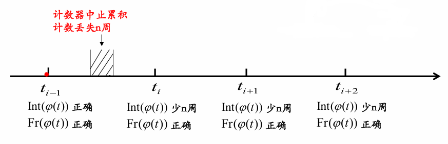**周跳**，全称“整周跳变”，是指接收机进行载波相位测量时，**<u>整周计数出现系统偏差</u>，而小数部分仍然保持正确**的现象。

也就是说：

周跳不是整个观测值都错了，  
而是“整数周数”错了，  
小数相位仍然是对的。

### 2. 周跳的数学表达

若理想观测值为 $\phi$，实际观测值为 $\widetilde{\phi}$，周跳值为 $\Delta N$，则有：

$$\widetilde{\phi} = \phi + \Delta N
$$

其中：

| **符号**             | **含义**               |
|----------------------|------------------------|
| $$\widetilde{\phi}$$ | 实际观测值             |
| $$\phi$$             | 理想观测值             |
| $$\Delta N$$         | 周跳值，单位通常为“周” |

如果用距离单位表示，则周跳造成的距离偏差为：

$$\Delta L = \lambda\Delta N
$$

其中 $\lambda$是载波波长。

### 3. 周跳的两个重要特性

| **特性** | **含义**                                                               | **复习重点**                                                     |
|----------|------------------------------------------------------------------------|------------------------------------------------------------------|
| 阶跃性   | 从周跳发生历元开始，该历元及之后所有载波相位观测值都含有同一个系统偏差 | 图像上表现为曲线突然跳变，然后继续平滑变化                       |
| 整周性   | 周跳值具有整数特性                                                     | 注意可能是**重建载波波长的整数倍，**不一定是原始载波波长的整数倍 |

PPT中特别提醒：如果接收机采用平方法重建载波，重建出的载波波长可能是原始波长的一半，因此可能出现**半周跳**。RINEX文件中可通过 **Wavelength Factor** 判断，若波长因子为2，要考虑半周跳问题。

## 四、周跳、粗差、观测中断的区别

| **类型** | **表现**                       | **是否影响后续历元** | **小数部分是否正确** | **本质**     |
|----------|--------------------------------|----------------------|----------------------|--------------|
| 周跳     | 相位序列出现阶跃，之后整体偏移 | 是                   | 是                   | 整周计数错误 |
| 粗差     | 某一个或少数历元异常突变       | 通常否               | 不一定               | 偶然观测异常 |
| 观测中断 | 数据中间缺失或跟踪中断         | 可能导致重新初始化   | 不一定               | 信号暂时失锁 |

一句话区分：

周跳是“从某一时刻开始，后面都错同样多”；粗差多是“某一点突然错”；观测中断是“数据断了”。

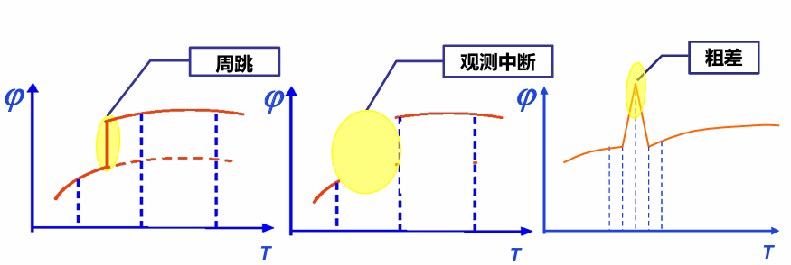

## 五、周跳产生的原因

| **原因**     | **解释**                                           |
|--------------|----------------------------------------------------|
| 信号遮挡     | 如建筑物、树木、山体遮挡，导致卫星信号无法连续跟踪 |
| 高动态运动   | 接收机高速运动，跟踪环可能失锁                     |
| 信噪比过低   | 卫星信号质量差，整周计数容易出错                   |
| 接收机故障   | 差频信号无法正常产生                               |
| 卫星瞬时故障 | 卫星端信号异常                                     |
| 其他因素     | 多路径、环境干扰等                                 |

本质上，这些原因都会导致：

$$\text{整周计数暂时中止或错误}$$

## 六、为什么要探测与修复周跳？

### 1. 周跳探测与修复的定义

**周跳探测与修复**就是：

确定周跳发生的时刻，并确定其大小，然后对发生周跳后的观测值进行改正。

也就是要回答两个问题：

1\. 周跳发生在什么时候？  
2. 周跳跳了多少周？

若检测到从 $t_{i}$开始发生周跳 $\Delta N$，则修复可表示为：

$$\phi_{\text{corr}}(t) = \widetilde{\phi}(t) - \Delta N,t \geq t_{i}
$$

### 2. 为什么必须修复？

因为周跳会使载波相位观测值出现<u>系统偏差</u>，从而导致高精度GNSS数据处理结果错误。对于高精度载波相位处理，需要没有周跳和粗差的“干净”相位数据。

## 七、周跳探测的基本思想

卫星运行轨迹是平滑曲线，卫星到接收机的距离变化也是平缓、有规律的；

周跳会破坏这种规律性。

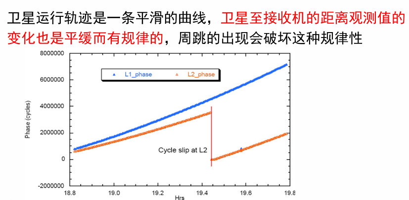

因此，探测思路可以概括为：

正常情况：相位观测值随时间平滑变化  
发生周跳：相位序列突然出现不合理阶跃

探测的关键是构造一种检验量，使其尽可能：

1.  不受接收机钟差影响；

2.  不受卫星钟差影响；

3.  不受几何距离影响；

4.  不受电离层、对流层延迟影响；

5.  对周跳非常敏感。

构建受接收机钟差、电离层延迟误差影响尽可能小，且无几何距离的周跳检测量。

## 八、重点方法一：高次差法

### 1. 基本思想

高次差法利用的是时间序列的平滑性。

设相邻历元载波相位观测值为：

$$\phi_{1},\phi_{2},\phi_{3},\cdots
$$

一阶差分：

$$\nabla\phi_{i} = \phi_{i} - \phi_{i - 1}
$$

二阶差分：

$$\nabla^{2}\phi_{i} = \phi_{i} - 2\phi_{i - 1} + \phi_{i - 2}
$$

三阶差分：

$$\nabla^{3}\phi_{i} = \phi_{i} - 3\phi_{i - 1} + 3\phi_{i - 2} - \phi_{i - 3}
$$

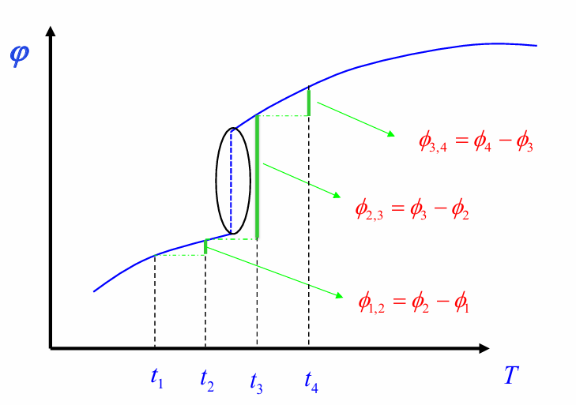一般形式：

$$\nabla^{k}\phi_{i} = \sum_{m = 0}^{k}{( - 1})^{m}C_{k}^{m}\phi_{i - m}
$$

通俗理解：

一阶差分：看变化速度  
二阶差分：看变化速度是否突然改变  
三阶差分：看变化规律是否出现异常尖峰

如果没有周跳，高阶差分序列通常<u>比较平滑</u>；

如果发生周跳，高阶差分中会出现<u>明显尖峰</u>。

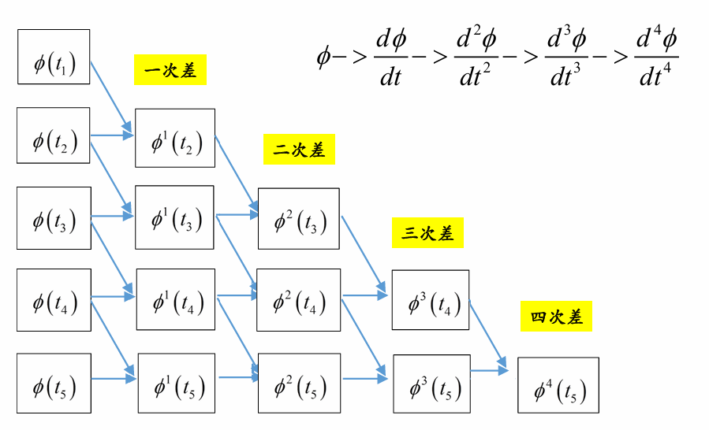PPT用无周跳和人为加入1周周跳的例子说明：

加入周跳后，三次差序列中会出现明显异常。

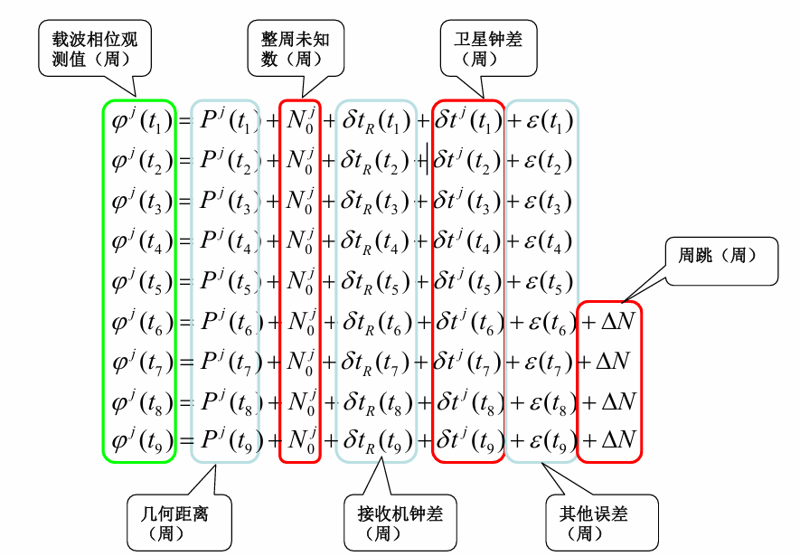

### 2. 周跳在高次差中的表现

如果从某个历元开始发生周跳 $\Delta N$，则观测序列会出现阶跃：

$${\widetilde{\phi}}_{i} = \phi_{i} + \Delta N
$$

高次差分会把这个阶跃变成明显的局部异常。

| **差分阶数**   | **周跳表现**                               |
|----------------|--------------------------------------------|
| 原始序列       | 小周跳可能不明显，尤其在长趋势中不容易看出 |
| 一阶差分       | 周跳附近出现突变                           |
| 二阶差分       | 周跳被进一步放大，出现正负异常             |
| 三阶、四阶差分 | 异常更明显，但噪声和动态影响也会被放大     |

PPT中的实例表明，从第10个历元开始加入1周、5周、10周甚至100周周跳后，非差原始序列中不一定直观明显，但在一阶、二阶、三阶、四阶差分序列中会出现更突出的异常尖峰。

### 3. 高次差法特点

| **优点**                 | **缺点**                               |
|--------------------------|----------------------------------------|
| 直观、容易理解           | 对采样间隔要求严格，通常要求等间隔采样 |
| 阶数越高，周跳放大越明显 | 阶数越高，噪声也可能被放大             |
| 适合平稳、低动态数据     | 不适合动态数据周跳探测                 |
| 可发现明显跳变           | 易受接收机钟差稳定度影响               |

PPT指出，高次差法易受接收机钟差稳定度影响，星间差分可以消除此影响。

## 九、重点方法二：MW组合法

MW组合，也称 Melbourne-Wübbena 组合，是双频GNSS中常用的周跳探测组合。

### 1. 基本思想

MW组合把**<u>双频载波相位观测值</u>**和**<u>伪距观测值</u>**组合起来，

使站星<u>几何距离、对流层延迟、电离层延迟、卫星钟差、接收机钟差</u>等项基本消除，剩下的<u>主要是宽巷模糊度。</u>

常用表达为：

$$L_{MW} = \frac{1}{\lambda_{W}}\left\lbrack \frac{f_{1}L_{1} - f_{2}L_{2}}{f_{1} - f_{2}}-\frac{f_{1}P_{1} + f_{2}P_{2}}{f_{1} + f_{2}} \right\rbrack = N_{1} - N_{2}
$$

其中：

| **符号**        | **含义**                           |
|-----------------|------------------------------------|
| $$f_{1},f_{2}$$ | 两个频率                           |
| $$L_{1},L_{2}$$ | 两个频率的载波相位观测值，单位为米 |
| $$P_{1},P_{2}$$ | 两个频率的伪距观测值               |
| $$N_{1},N_{2}$$ | 两个频率的整周模糊度               |
| $$\lambda_{W}$$ | 宽巷波长                           |

宽巷波长为：

$$\lambda_{W} = \frac{c}{f_{1} - f_{2}}
$$

对于GPS L1/L2，PPT给出：

$$\lambda_{W} \approx 0.86\text{~m}
$$

### 2. MW组合如何判断周跳？

逐历元计算 $B_{MW}$，然后比较相邻历元：

$$\Delta B_{MW} = B_{MW}(t_{i}) - B_{MW}(t_{i - 1})
$$

若：

$$\mid \Delta B_{MW} \mid < \text{阈值}
$$

则认为没有周跳；若超过阈值，则认为可能发生周跳。

PPT中指出，MW组合法周跳探测能力大约为 **2周左右**，低高度角时更差。

### 3. MW组合法特点

| **项目**       | **内容**                                                               |
|----------------|------------------------------------------------------------------------|
| 适用数据       | 静态、动态数据均可                                                     |
| 消除误差       | 几何距离、电离层延迟、对流层延迟、卫星钟差、接收机钟差                 |
| 主要受影响因素 | 伪距噪声、多路径                                                       |
| 探测能力       | 约2周左右，低高度角更差                                                |
| 优点           | 不受采样间隔影响，宽巷波长较长                                         |
| 缺点           | 不能独立判断周跳发生在哪个频率；当两个频率发生相等或相近周跳时可能失效 |

PPT特别指出，采用相位平滑伪距可以进一步提高MW组合法的周跳探测能力。

## 十、重点方法三：GF组合法 / 电离层残差法

GF组合即 Geometry-Free 组合，中文常称为**无几何组合**或**电离层残差法**。

### 1. 基本思想

GF组合<u>只使用双频载波相位观测值</u>：

$$GF = L_{1} - L_{2}
$$

也可写为：

$$GF = \lambda_{1}\phi_{1} - \lambda_{2}\phi_{2}
$$

展开后可理解为：

$$GF = \lambda_{1}N_{1} - \lambda_{2}N_{2} + \text{电离层残差} + \text{噪声与多路径}
$$

GF组合消除了站星几何距离、对流层延迟、卫星钟差、接收机钟差等影响，但保留了电离层残差。PPT指出，其判断基础是假设电离层延迟在短时间内变化平稳。

### 2. GF组合如何判断周跳？

相邻历元作差：

$$\Delta GF = GF(t_{i}) - GF(t_{i - 1})
$$

如果电离层短时间内变化平稳，则 $\Delta GF$应该较小；如果某一历元出现突变，则说明可能发生周跳。

PPT中给出的结论是：

$$\text{GF}\text{组合法周跳探测能力约为}\text{1}\text{周}
$$

### 3. GF组合法特点

| **项目**   | **内容**                                                       |
|------------|----------------------------------------------------------------|
| 适用数据   | 静态、动态数据均可                                             |
| 使用观测值 | 双频载波相位                                                   |
| 消除误差   | 几何距离、对流层延迟、卫星钟差、接收机钟差                     |
| 保留误差   | 电离层残差、观测噪声、多路径                                   |
| 探测能力   | 可探测1—2周小周跳                                              |
| 优点       | 只用高精度载波相位，噪声较小                                   |
| 缺点       | 电离层活跃或变化剧烈时容易误判；不能独立判断具体发生在哪个频率 |

PPT还指出，GF组合对满足或接近

$$\lambda_{1}\Delta N_{1} \approx \lambda_{2}\Delta N_{2}
$$

的周跳组合不敏感。

## 十一、三种重点方法对比表

| **方法** | **核心思想**                             | **使用观测值**         | **探测能力**   | **优点**                                         | **局限**                                   |
|----------|------------------------------------------|------------------------|----------------|--------------------------------------------------|--------------------------------------------|
| 高次差法 | 利用时间序列平滑性，周跳导致高阶差分尖峰 | 单频或多频相位时间序列 | 视数据质量而定 | 直观、易理解                                     | 要求等间隔采样；不适合动态数据；受钟差影响 |
| MW组合法 | 构造宽巷模糊度 $N_{1} - N_{2}$           | 双频相位 + 双频伪距    | 约2周          | 消除几何、电离层、对流层和钟差；不受采样间隔影响 | 受伪距噪声、多路径影响；不能判断具体频率   |
| GF组合法 | 利用无几何组合，假设电离层短时间平稳     | 双频载波相位           | 约1—2周        | 仅用相位，噪声较小                               | 电离层活跃时易误判；对特殊周跳组合不敏感   |

## 十二、重要公式汇总

| **公式**                                                                                                                                                 | **含义**           |
|----------------------------------------------------------------------------------------------------------------------------------------------------------|--------------------|
| $$\widetilde{\phi}(t) = N_{0} + Int(\phi(t)) + Fr(\phi(t))$$                                                                                             | 载波相位观测值组成 |
| $$\widetilde{\phi} = \phi + \Delta N$$                                                                                                                   | 周跳观测模型       |
| $$\Delta L = \lambda\Delta N$$                                                                                                                           | 周跳对应的距离偏差 |
| $$\nabla\phi_{i} = \phi_{i} - \phi_{i - 1}$$                                                                                                             | 一阶差分           |
| $$\nabla^{2}\phi_{i} = \phi_{i} - 2\phi_{i - 1} + \phi_{i - 2}$$                                                                                         | 二阶差分           |
| $$\nabla^{3}\phi_{i} = \phi_{i} - 3\phi_{i - 1} + 3\phi_{i - 2} - \phi_{i - 3}$$                                                                         | 三阶差分           |
| $$\lambda_{W} = \frac{c}{f_{1} - f_{2}}$$                                                                                                                | 宽巷波长           |
| $$B_{MW} = \frac{1}{\lambda_{W}}\left\lbrack \frac{f_{1}L_{1} - f_{2}L_{2}}{f_{1} - f_{2}}-\frac{f_{1}P_{1} + f_{2}P_{2}}{f_{1} + f_{2}} \right\rbrack$$ | MW组合             |
| $$GF = L_{1} - L_{2} = \lambda_{1}\phi_{1} - \lambda_{2}\phi_{2}$$                                                                                       | GF组合             |

## 十三、考试答题模板

**1. 问：什么是周跳？**

答：  
周跳是载波相位观测中，由于接收机整周计数出现系统偏差，而小数部分仍保持正确的一种现象。其特点是从发生历元开始，后续所有载波相位观测值都含有同一大小的系统偏差，可表示为：

$$\widetilde{\phi} = \phi + \Delta N
$$

其中 $\Delta N$为周跳值。

**2. 问：周跳与粗差有什么区别？**

答：  
周跳主要影响整周计数，小数部分仍正确，并且从发生历元起后续观测值都带有系统偏差；粗差通常表现为某一个或少数历元的异常值，不一定影响后续历元。周跳具有阶跃性，粗差多表现为孤立突变。

**3. 问：高次差法为什么能探测周跳？**

答：  
正常情况下，卫星到接收机的几何距离变化是平滑的，因此载波相位时间序列及其差分序列也应较平滑。周跳会破坏这种平滑性，在一阶、二阶、三阶等差分序列中形成异常尖峰。阶数越高，周跳被放大得越明显，但噪声和动态影响也可能被放大。

**4. 问：MW组合法的优缺点？**

答：  
MW组合能消除几何距离、电离层延迟、对流层延迟、卫星钟差和接收机钟差，适用于静态和动态数据，且不受采样间隔影响。但由于使用伪距观测值，容易受伪距噪声和多路径影响；同时它构造的是宽巷模糊度 $N_{1} - N_{2}$，不能独立判断具体哪个频率发生周跳，当两个频率发生相等或相近周跳时可能失效。

**5. 问：GF组合法的优缺点？**

答：  
GF组合利用双频载波相位差，消除了几何距离、对流层延迟和钟差影响，只剩下电离层残差、模糊度和噪声。由于只使用高精度载波相位，噪声较小，可探测1—2周小周跳。但该方法依赖电离层短时间变化平稳的假设，在电离层活跃期或电离层变化剧烈时容易误判。

## 十四、复习重点与易错点

**重点掌握**

1.  周跳定义：整周计数错，小数部分仍正确。

2.  周跳特性：阶跃性、整周性。

3.  周跳修复目的：获得“干净”的相位观测数据。

4.  高次差法：差分放大周跳，但受采样间隔和动态影响。

5.  MW组合：宽巷组合，受伪距噪声影响，探测能力约2周。

6.  GF组合：无几何组合，依赖电离层短时间平稳，探测能力约1—2周。

7.  没有一种方法适用于所有场景，实际处理中要综合使用多种方法。PPT小结也强调，周跳是载波相位数据处理的关键环节，但不存在一种普遍适用于各种场合的方法，应根据目的和环境选择合适方法。

**易错点提醒**

| **易错点**                       | **正确理解**                                 |
|----------------------------------|----------------------------------------------|
| 以为周跳就是粗差                 | 周跳是整周计数系统偏差，粗差通常是偶然异常   |
| 以为周跳只影响一个历元           | 周跳从发生历元开始影响后续所有历元           |
| 以为周跳一定是原始波长整数倍     | 应是重建载波波长的整数倍，可能出现半周跳     |
| 以为高次差阶数越高越好           | 阶数越高周跳越明显，但噪声、动态影响也越明显 |
| 以为MW组合能判断具体哪个频率跳了 | MW只能反映宽巷模糊度变化，不能单独区分频率   |
| 以为GF组合总是可靠               | 电离层活跃时GF组合可能失效或误判             |

# §6.4 伪距差分定位复习总结

## 一、总体脉络

伪距差分定位  
├─ 1. 为什么需要差分GNSS？  
│ ├─ 单点定位误差大  
│ ├─ 相邻测站误差具有相似性  
│ └─ 利用误差空间相关性改正流动站观测值  
├─ 2. 差分GNSS基本概念  
│ ├─ 基准站：坐标已知  
│ ├─ 流动站：坐标未知  
│ ├─ 差分改正数：由基准站计算并播发  
│ └─ 核心依据：误差的空间相关性  
├─ 3. 差分改正数类型  
│ ├─ 位置改正数  
│ └─ 距离改正数 / 伪距改正数 PRC  
├─ 4. 单站伪距差分原理  
│ ├─ 基准站计算真实几何距离  
│ ├─ 计算伪距改正数 PRC  
│ ├─ 播发 PRC 和 RRC  
│ └─ 流动站改正伪距后重新定位  
└─ 5. 其他差分GNSS技术  
├─ 单基准站差分  
├─ 多基准站局域差分 LADGPS  
└─ 广域差分 WADGPS

## 二、为什么需要伪距差分定位？

GNSS实时单点定位会受到多种误差影响，包括卫星轨道误差、卫星钟差、大气延迟误差、电离层延迟、对流层延迟、多路径误差、接收机钟差和伪距观测噪声等。

<u>标准单点定位</u>在无SA情况下，平面精度通常为几米，高程可达十几米，难以满足较高精度定位需求。

PPT中用 GBG2 和 GBG3 两个相距约 29 km 的测站作对比，可以看到两个测站的单点定位误差变化趋势很相似；将两站误差作差后，误差明显减小。这说明相邻测站的部分误差具有**<u>空间相关性</u>**，这正是差分GNSS能够提高定位精度的基础。

一句话理解：

<u>单点定位误差大，但相近区域内很多误差“差不多”，所以可以用已知点的误差去改正未知点的观测值。</u>

| **项目** | **含义**                             |
|----------|--------------------------------------|
| SA 全称  | Selective Availability               |
| 中文     | 选择可用性 / 选择性可用              |
| 作用     | 人为降低民用 GPS 定位精度            |
| 主要影响 | 卫星钟差、星历等误差，使单点定位变差 |
| 目的     | 早期出于军事和安全控制考虑           |
| 现状     | GPS 的 SA 已于 2000 年关闭           |

## 三、差分GNSS的基本概念

差分GNSS，即 Differential Global Navigation Satellite System，简称 **DGNSS**。

它利用两台或两台以上接收机，其中<u>一台放在坐标已知的参考站或基准站上</u>，通过基准站观测值计算差分改正数，再实时发送给流动站，用来改正流动站伪距观测值，从而实时确定流动站坐标。

### 1. 组成

| **组成部分**  | **作用**                         |
|---------------|----------------------------------|
| 基准站/参考站 | 坐标精确已知，负责计算差分改正数 |
| 流动站/用户站 | 坐标未知，接收改正数后进行定位   |
| 数据通讯链    | 将基准站改正数传给流动站         |
| 差分改正数    | 对流动站观测值或定位结果进行修正 |

### 2. 核心依据

$$\text{差分GNSS的依据} = \text{误差的空间相关性}$$

也就是说，基准站和流动站距离越近，它们受到的卫星轨道误差、卫星钟差、电离层延迟、对流层延迟等误差越相似，差分改正效果越好。

## 四、差分改正数的类型

PPT将差分改正数分为两类：**位置改正数**和**距离改正数**。

### 1. 位置改正数

基准站先进行单点定位，得到计算坐标，再用已知真实坐标减去计算坐标，得到坐标改正数。

$${\Delta X = X_{R} - X_{0}
}{\Delta Y = Y_{R} - Y_{0}
}{\Delta Z = Z_{R} - Z_{0}
}$$

其中：

| **符号**                       | **含义**               |
|--------------------------------|------------------------|
| $$X_{R},Y_{R},Z_{R}$$          | 基准站已知坐标         |
| $$X_{0},Y_{0},Z_{0}$$          | 基准站单点定位计算坐标 |
| $$\Delta X,\Delta Y,\Delta Z$$ | 位置差分改正数         |

流动站改正公式为：

$${X_{mc} = X_{m} + \Delta X
}{Y_{mc} = Y_{m} + \Delta Y
}{Z_{mc} = Z_{m} + \Delta Z
}$$

位置差分要求：**流动站和基准站同步观测同一组可视卫星**。

### 2. 距离改正数 / 伪距改正数

距离改正数是指：

$$\text{距离改正数} = \text{计算距离} - \text{观测距离}
$$

在伪距差分中，常称为 **伪距改正数 PRC**。

与位置差分不同，距离差分不是直接改正最终坐标，而是先改正流动站的伪距观测值，再利用改正后的伪距重新解算坐标。

### 3. 位置差分与距离差分对比

| **项目**   | **位置差分**                                         | **距离差分 / 伪距差分**                  |
|------------|------------------------------------------------------|------------------------------------------|
| 改正对象   | 定位结果坐标                                         | 伪距观测值                               |
| 改正数     | $$\Delta X,\Delta Y,\Delta Z$$                       | PRC                                      |
| 数学模型   | 简单                                                 | 较复杂                                   |
| 数据传输量 | 小                                                   | 较大                                     |
| 共视要求   | 必须观测完全相同的一组卫星 | 不要求完全相同 |
| 定位精度   | 较差                                                 | 较好                                     |
| 实际应用   | 简单场景                                             | 更常用、更可靠                           |

## 五、差分GPS的分类

PPT从多个角度给出了差分GPS的分类。

| **分类依据**       | **类型**                                 |
|--------------------|------------------------------------------|
| 根据时效性         | 实时差分、事后差分                       |
| 根据观测值类型     | 伪距差分、相位差分、相位平滑伪距差分     |
| 根据改正数类型     | 位置差分、距离差分                       |
| 根据工作原理和模型 | 单基准站差分、多基准站局域差分、广域差分 |

本节重点是：

$$\boxed{\text{单站伪距差分定位}}$$

## 六、单站伪距差分的基本思想

单站伪距差分的核心是：

利用坐标精确已知的基准站<u>计算具有空间相关性的误差影响</u>，并发送给流动站，用来改正流动站伪距观测值，提高流动站定位精度。

### 1. 伪距观测方程

对于基准站 $R$观测卫星 $j$，伪距观测方程为：

$$P_{R}^{j} = \rho_{R}^{j} + c(dt_{R} - dt^{j}) + d\rho_{R}^{j} + I_{R}^{j} + T_{R}^{j} + \varepsilon_{R}^{j}
$$

对于流动站 $u$：

$$P_{u}^{j} = \rho_{u}^{j} + c(dt_{u} - dt^{j}) + d\rho_{u}^{j} + I_{u}^{j} + T_{u}^{j} + \varepsilon_{u}^{j}
$$

其中：

| **符号**                      | **含义**                             |
|-------------------------------|--------------------------------------|
| $$P_{R}^{j},P_{u}^{j}$$       | 基准站、流动站对卫星 $j$的伪距观测值 |
| $$\rho_{R}^{j},\rho_{u}^{j}$$ | 站星几何距离                         |
| $$c$$                         | 光速                                 |
| $$dt_{R},dt_{u}$$             | 接收机钟差                           |
| $$dt^{j}$$                    | 卫星钟差                             |
| $$d\rho^{j}$$                 | 卫星轨道误差引起的距离误差           |
| $$I^{j}$$                     | 电离层延迟                           |
| $$T^{j}$$                     | 对流层延迟                           |
| $$\varepsilon^{j}$$           | 伪距观测噪声等残差                   |

### 2. 误差相关性分类

| **误差类型** | **例子**                     | **空间相关性**     | **差分效果** |
|--------------|------------------------------|--------------------|--------------|
| 卫星端误差   | 卫星钟差、卫星轨道误差       | 强                 | 容易被削弱   |
| 传播路径误差 | 电离层延迟、对流层延迟       | 较强，距离越近越强 | 可以明显削弱 |
| 接收机端误差 | 接收机钟差、观测噪声、多路径 | 弱或无             | 难以直接消除 |

因此，伪距差分主要能削弱的是：

$$\text{卫星端误差} + \text{传播路径误差}
$$

而接收机噪声、多路径等局部误差不能靠普通单站差分完全消除。

## 七、基准站伪距改正数 PRC 的计算

基准站坐标已知，卫星坐标可由星历获得，因此可以计算出基准站到卫星的几何距离：

$$\rho_{R}^{j} = \sqrt{\left( x^{j} - x_{R})^{2} + (y^{j} - y_{R})^{2} + (z^{j} - z_{R} \right)^{2}}
$$

基准站实际观测到的伪距为：

$P_{R}^{j} = \rho_{R}^{j} + c\left( dt_{R} - dt^{j} \right) + d\rho_{R}^{j}\left. （轨道误差 \right.） + I_{R}^{j} + T_{R}^{j} + \varepsilon_{R}^{j}$（观测噪声）

于是伪距改正数定义为：

$$PRC_{R}^{j} = \Delta\rho_{R}^{j} = \rho_{R}^{j} - P_{R}^{j}
$$

代入可得：

$$\Delta\rho_{R}^{j} = - c(dt_{R} - dt^{j}) - d\rho_{R}^{j} - I_{R}^{j} - T_{R}^{j} - \varepsilon_{R}^{j}
$$

这说明，基准站计算出来的 PRC 中包含了卫星钟差、卫星轨道误差、电离层延迟、对流层延迟以及基准站伪距噪声等影响。

通俗理解：

基准站知道自己在哪里，  
所以它能算出“理论上应该量到多远”。  
实际伪距和理论距离不一致，  
这个差值就是伪距改正数 PRC。

## 八、流动站如何使用 PRC？

流动站收到基准站播发的伪距改正数后，对自己的伪距观测值进行改正：

$$P_{u,corr}^{j} = P_{u}^{j} + \Delta\rho_{R}^{j}
$$

代入展开：

$$P_{u,corr}^{j} = \rho_{u}^{j} + c(dt_{u} - dt_{R}) + (d\rho_{u}^{j} - d\rho_{R}^{j}) + (I_{u}^{j} - I_{R}^{j}) + (T_{u}^{j} - T_{R}^{j}) + (\varepsilon_{u}^{j} - \varepsilon_{R}^{j})
$$

如果基准站和流动站距离较近，则：

$${d\rho_{u}^{j} - d\rho_{R}^{j} \approx 0
}{I_{u}^{j} - I_{R}^{j} \approx 0
}{T_{u}^{j} - T_{R}^{j} \approx 0
}$$

于是近似有：

$$P_{u,corr}^{j} \approx \rho_{u}^{j} + c(dt_{u} - dt_{R}) + \varepsilon
$$

也就是说，大部分空间相关误差被削弱，流动站定位精度提高。

## 九、伪距改正数的播发与外推

### 1. 为什么需要外推？

基准站计算 PRC 后，需要通过数据链发送给流动站。但实际应用中会存在：

1.  时间延迟；

2.  数据链中断；

3.  通信不稳定。

因此，流动站收到的 PRC 往往不是当前时刻的，而是滞后的。

### 2. RRC 的概念

为解决时间延迟问题，基准站除了发送 PRC，还会发送伪距改正数变化率，即：

$$RRC
$$

全称为 **Range Rate Correction**。

其计算公式为：

$$RRC^{j}(t_{k}) = \frac{PRC^{j}(t_{k}) - PRC^{j}(t_{k - 1})}{t_{k} - t_{k - 1}}
$$

流动站可利用 RRC 对当前时刻 PRC 进行外推：

$$PRC^{j}(t) = PRC^{j}(t_{k}) + RRC^{j}(t_{k})(t - t_{k})
$$

其中：

| **符号**           | **含义**                             |
|--------------------|--------------------------------------|
| $$PRC^{j}(t_{k})$$ | 基准站在 $t_{k}$时刻计算的伪距改正数 |
| $$RRC^{j}(t_{k})$$ | $t_{k}$时刻的伪距改正数变化率        |
| $$t$$              | 流动站当前时刻                       |
| $$t - t_{k}$$      | 改正数延迟时间                       |

PPT明确指出：基准站发送 PRC 的同时，也发送 RRC，流动站据此实时获得外推的 PRC。

## 十、为什么不能直接线性外推原始 PRC？

PPT后半部分专门分析了各项误差源的时间变化特性。卫星轨道误差、卫星钟差、电离层延迟、对流层延迟在短时间内一般变化较平滑；但伪距噪声变化频繁，具有明显高频特性。

这就导致一个问题：

$$PRC = \text{平滑误差} + \text{高频伪距噪声}
$$

如果直接对含有噪声的 PRC 做线性外推，就容易把噪声也当成趋势，造成外推误差。PPT在伪距噪声时间序列图中指出，这正是不能利用直接计算的 PRC 进行线性外推的原因。

**解决方法**

核心思想：

滤掉高频伪距噪声，  
让 PRC 中主要保留卫星星历、电离层、对流层等平滑误差。

常用方法：

| **方法**   | **作用**                       |
|------------|--------------------------------|
| 多项式拟合 | 用平滑函数拟合 PRC 变化趋势    |
| Kalman滤波 | 动态估计 PRC，削弱随机噪声影响 |

## 十一、单站伪距差分GPS系统构成

PPT给出的单站伪距差分GPS系统主要包括三部分。

| **部分**   | **内容**                                               |
|------------|--------------------------------------------------------|
| 基准站     | 坐标已知，观测条件良好，一般使用单频接收机             |
| 数据通讯链 | 包括调制器、发射机、发射天线、差分信号接收机、解调器等 |
| 用户设备   | 接收机、计算软件及相应接口                             |

差分GPS数据通讯格式常用：

$$RTCM\text{-}SC\text{-}104
$$

## 十二、单站伪距差分的优缺点

| **优点**     | **缺点**                                       |
|--------------|------------------------------------------------|
| 数学模型简单 | 作用范围有限                                   |
| 系统结构简单 | 通常只适合小范围差分定位                       |
| 算法成熟     | 只能接收一个基准站改正信号，可靠性较差         |
| 实时性较好   | 距离基准站越远，误差相关性越差，精度下降越明显 |

一句话记忆：

单站伪距差分简单、成熟、实时，但距离范围小，可靠性受单个基准站限制。

## 十三、多基准站局域差分 GPS：LADGPS

LADGPS，即 Local Area Differential GPS，中文为**局域差分GPS**。

它是在某一局部区域内布设多个基准站，每个基准站独立观测并计算差分改正数，用户根据多个基准站提供的信息综合求得适合自身位置的改正数。

### 1. 常用算法

**加权平均法**

$$V_{u} = \sum_{i = 1}^{n}P_{i}V_{i}
$$

其中：

| **符号**  | **含义**               |
|-----------|------------------------|
| $$V_{u}$$ | 用户位置处的改正数     |
| $$V_{i}$$ | 第 $i$个基准站的改正数 |
| $$P_{i}$$ | 第 $i$个基准站权重     |

通常距离越近，权重越大，可表示为：

$$P_{i} \propto \frac{1}{D_{i}^{n}}
$$

其中 $D_{i}$是用户到第 $i$个基准站的距离。

**偏导数法**

PPT中给出了类似一阶线性变化模型：

$$V_{u} = V_{1} + \frac{dV}{dL}(L_{u} - L_{1}) + \frac{dV}{dB}(B_{u} - B_{1})
$$

其中：

| **符号**                        | **含义**                   |
|---------------------------------|----------------------------|
| $$L$$                           | 经度                       |
| $$B$$                           | 纬度                       |
| $$V$$                           | 差分改正数                 |
| $$\frac{dV}{dL},\frac{dV}{dB}$$ | 改正数随空间位置变化的梯度 |

### 2. LADGPS特点

| **优点**                   | **缺点**                           |
|----------------------------|------------------------------------|
| 可靠性比单基准站高         | 基准站数量较多，建设成本较高       |
| 顾及位置变化对改正数的影响 | 差分范围仍然有限                   |
| 差分范围增大               | 将误差源合并处理，未区分不同误差源 |
| 精度较高                   | 模型仍有局限                       |

## 十四、广域差分 GPS：WADGPS

WADGPS，即 Wide Area Differential GPS，中文为**广域差分GPS**。

它在大区域内较均匀地布设少量基准站，各基准站独立观测，并将观测值传送至数据处理中心；处理中心统一处理并分离不同误差源，生成卫星星历、卫星钟差、大气延迟模型等改正数，再播发给用户。

### 1. WADGPS结构

| **组成**     | **作用**             |
|--------------|----------------------|
| 基准站网     | 提供观测数据         |
| 数据处理中心 | 统一处理、分离误差源 |
| 数据通讯链   | 播发改正信息         |
| 监测站       | 监测系统运行状态     |
| 用户         | 接收改正信息并定位   |

### 2. WADGPS与普通差分的区别

| **普通差分**               | **广域差分**             |
|----------------------------|--------------------------|
| 把各种误差综合成一个改正数 | 分离不同误差源           |
| 适合局部区域               | 适合大范围区域           |
| 精度随距离增加而下降       | 在网内精度与距离关系较弱 |
| 模型较简单                 | 系统复杂、建设成本高     |

WADGPS重点在于：

$$\text{误差分离建模}
$$

主要分离：

$$\text{卫星轨道误差} + \text{卫星钟差} + \text{电离层延迟}
$$

## 十五、几种伪距定位技术性能对比

PPT给出了几种定位技术的性能比较。

| **定位技术** | **参考站数量** | **精度** | **作用距离** | **响应时间** |
|--------------|----------------|----------|--------------|--------------|
| 单点定位     | 无             | 10—15 m  | 全球         | 实时         |
| 单站差分     | 1个            | 1—5 m    | 10—20 km     | 实时         |
| 局域差分     | 多个           | 1—5 m    | 约150 km     | 实时         |
| 广域差分     | 多个           | 1—5 m    | 约1500 km    | 实时         |

记忆规律：

单点定位：范围最大，但精度较差  
单站差分：结构简单，但距离短  
局域差分：范围扩大，可靠性提高  
广域差分：范围最大，系统最复杂

**十六、重要公式汇总**

| **公式**                                                                                                        | **含义**               |
|-----------------------------------------------------------------------------------------------------------------|------------------------|
| $$P_{R}^{j} = \rho_{R}^{j} + c(dt_{R} - dt^{j}) + d\rho_{R}^{j} + I_{R}^{j} + T_{R}^{j} + \varepsilon_{R}^{j}$$ | 基准站伪距观测方程     |
| $$P_{u}^{j} = \rho_{u}^{j} + c(dt_{u} - dt^{j}) + d\rho_{u}^{j} + I_{u}^{j} + T_{u}^{j} + \varepsilon_{u}^{j}$$ | 流动站伪距观测方程     |
| $$\rho_{R}^{j} = \sqrt{\left( x^{j} - x_{R})^{2} + (y^{j} - y_{R})^{2} + (z^{j} - z_{R} \right)^{2}}$$          | 基准站到卫星的几何距离 |
| $$PRC_{R}^{j} = \rho_{R}^{j} - P_{R}^{j}$$                                                                      | 伪距改正数             |
| $$P_{u,corr}^{j} = P_{u}^{j} + PRC_{R}^{j}$$                                                                    | 流动站伪距改正         |
| $$RRC^{j}(t_{k}) = \frac{PRC^{j}(t_{k}) - PRC^{j}(t_{k - 1})}{t_{k} - t_{k - 1}}$$                              | 伪距改正数变化率       |
| $$PRC^{j}(t) = PRC^{j}(t_{k}) + RRC^{j}(t_{k})(t - t_{k})$$                                                     | PRC线性外推            |
| $$\Delta X = X_{R} - X_{0},\ \Delta Y = Y_{R} - Y_{0},\ \Delta Z = Z_{R} - Z_{0}$$                              | 位置差分改正数         |
| $$X_{mc} = X_{m} + \Delta X,\ Y_{mc} = Y_{m} + \Delta Y,\ Z_{mc} = Z_{m} + \Delta Z$$                           | 流动站位置差分改正     |
| $$V_{u} = \sum_{i = 1}^{n}P_{i}V_{i}$$                                                                          | 多基准站加权平均改正   |
| $$V_{u} = V_{1} + \frac{dV}{dL}(L_{u} - L_{1}) + \frac{dV}{dB}(B_{u} - B_{1})$$                                 | 偏导数法改正模型       |

## 十七、思考题：伪距差分定位精度与哪些因素有关？

PPT最后提出思考题：**伪距差分定位精度与哪些因素有关？** 可以从以下角度回答。

| **影响因素**       | **影响方式**                           |
|--------------------|----------------------------------------|
| 基准站与流动站距离 | 距离越远，误差空间相关性越弱，精度越差 |
| 基准站坐标精度     | 基准站坐标越准，改正数越可靠           |
| 卫星几何分布       | DOP越小，定位精度越好                  |
| 卫星轨道和钟差误差 | 差分可削弱，但残差仍影响精度           |
| 电离层、对流层变化 | 空间变化越剧烈，差分效果越差           |
| 伪距观测噪声       | 噪声越大，PRC越不稳定                  |
| 多路径效应         | 属于局部误差，难以靠差分消除           |
| 数据链延迟         | 延迟越大，PRC外推误差越大              |
| RRC和滤波模型质量  | 外推和滤波越合理，改正效果越好         |
| 基准站数量         | 多基准站可靠性和区域适应性更好         |
| 接收机性能         | 接收机质量越好，观测噪声越小           |

可以总结为一句考试答案：

伪距差分定位精度主要取决于基准站与流动站之间的距离、误差空间相关性、基准站坐标精度、卫星几何分布、伪距观测噪声、多路径效应、大气延迟变化、数据链延迟以及改正数计算和外推模型的精度。

## 十八、考试答题模板

**1. 什么是差分GNSS？**

差分GNSS是利用两台或两台以上GNSS接收机进行定位的技术，其中一台设置在坐标已知的基准站上，通过基准站观测值计算差分改正数，并实时播发给流动站，流动站利用改正数改正伪距观测值或定位结果，从而提高实时定位精度。其理论基础是误差的空间相关性。

**2. 简述伪距差分定位原理。**

基准站坐标已知，可根据卫星星历计算基准站到卫星的几何距离 $\rho_{R}^{j}$，并与实际观测伪距 $P_{R}^{j}$作差，得到伪距改正数：

$$PRC_{R}^{j} = \rho_{R}^{j} - P_{R}^{j}
$$

然后将该改正数播发给流动站，流动站对自身伪距观测值进行改正：

$$P_{u,corr}^{j} = P_{u}^{j} + PRC_{R}^{j}
$$

由于基准站和流动站距离较近时，卫星轨道误差、卫星钟差、电离层延迟、对流层延迟等具有较强空间相关性，因此这些误差可被明显削弱，从而提高流动站定位精度。

**3. 位置差分与距离差分的区别是什么？**

位置差分是基准站计算自身定位坐标与已知坐标之差，形成坐标改正数，再直接加到流动站定位结果上。其模型简单、数据量小，但要求基准站和流动站同步观测完全相同的一组卫星，定位精度较差。

距离差分是基准站计算每颗卫星的伪距改正数，流动站先改正伪距观测值，再重新定位。其模型较复杂、数据量较大，但不要求两站观测完全相同的一组卫星，定位精度较好。

**4. 为什么要播发 RRC？**

由于基准站计算的 PRC 通过数据链发送到流动站时会存在时间延迟，流动站收到的 PRC 通常不是当前时刻的改正数。为了减小延迟影响，基准站同时播发伪距改正数变化率 RRC，流动站利用：

$$PRC^{j}(t) = PRC^{j}(t_{k}) + RRC^{j}(t_{k})(t - t_{k})
$$

对当前时刻 PRC 进行外推。

**5. 为什么不能直接对原始 PRC 线性外推？**

因为 PRC 中不仅包含卫星轨道误差、电离层延迟、对流层延迟等平滑变化误差，还包含伪距观测噪声等高频随机误差。若直接线性外推原始 PRC，容易把噪声误认为趋势，导致外推误差。因此需要采用多项式拟合、Kalman滤波等方法滤除高频伪距噪声，使 PRC 中主要保留平滑误差成分。

**十九、复习重点与易错点**

**重点掌握**

1.  DGNSS的理论基础是**误差空间相关性**。

2.  伪距差分的核心是基准站计算并播发 **PRC**。

3.  PRC的基本公式是：

$$PRC_{R}^{j} = \rho_{R}^{j} - P_{R}^{j}
$$

4.  流动站改正公式是：

$$P_{u,corr}^{j} = P_{u}^{j} + PRC_{R}^{j}
$$

5.  RRC用于解决数据链延迟导致的 PRC 滞后问题。

6.  单站差分简单成熟，但作用范围有限。

7.  LADGPS通过多个基准站提高可靠性和差分范围。

8.  WADGPS通过分离误差源实现大范围差分。

**易错点提醒**

| **易错点**                    | **正确理解**                                       |
|-------------------------------|----------------------------------------------------|
| 以为差分能消除所有误差        | 差分主要削弱空间相关误差，不能完全消除噪声和多路径 |
| 以为基准站越远也一样有效      | 距离越远，误差相关性越差，精度下降                 |
| 混淆位置差分和距离差分        | 位置差分改正坐标，距离差分改正伪距                 |
| 忘记 PRC 的符号               | 本PPT中 $PRC = \rho - P$，应用时是 $P + PRC$       |
| 以为直接线性外推 PRC 总是可靠 | 原始 PRC 含伪距噪声，需滤波或拟合                  |
| 以为WADGPS只是多建几个基准站  | WADGPS核心是误差源分离建模，不只是增加基准站数量   |

# Lecture 13 相对定位复习总结

## 1. 本章主线

**相对定位 = 两台接收机同步观测 → 构造差分观测值 → 消除或削弱共性误差 → 解算基线向量。**

**利用两台GNSS接收机的同步观测数据确定待定点相对于已知点坐标差的定位方法**

**解算的是→基线向量**

核心目标不是直接求绝对坐标，而是求：

$$\mathbf{b}_{AB} = \mathbf{X}_{B} - \mathbf{X}_{A} = \left\lbrack \begin{array}{r}
\Delta X_{AB} \\
\Delta Y_{AB} \\
\Delta Z_{AB}
\end{array} \right\rbrack\left. （基线向量 \right.）$$

若 $A$点坐标已知，则：

$$\mathbf{X}_{B} = \mathbf{X}_{A} + \mathbf{b}_{AB}
$$

所以相对定位也叫**基线解算**。

## 2. 相对定位分类

| **分类依据**   | **类型**         | **特点**                   |
|----------------|------------------|----------------------------|
| 接收机运动状态 | 静态相对定位     | 整个观测时段基线向量固定   |
|                | 动态相对定位     | 每个历元都要求一组基线参数 |
| 观测值类型     | 伪距相对定位     | 精度较低                   |
|                | 载波相位相对定位 | 精度高，是重点             |
| 解算时效       | RTK              | 实时动态定位               |
|                | PPK              | 事后动态定位               |
| 参考站数量     | 单参考站 RTK     | 依赖一个基准站             |
|                | 网络 RTK         | 多个基准站联合改正误差     |

## 3. 数学模型：函数模型 + 随机模型

### 3.1 函数模型

函数模型回答：

观测值和未知参数之间是什么关系？

形式上：

$$\nabla\Delta\varphi_{AB}^{ij} = f(\mathbf{X}_{A},\mathbf{X}_{B})$$

其中：

- $\nabla\Delta\varphi_{AB}^{ij}$：站星双差相位观测值；

- $\mathbf{X}_{A}$：已知点坐标；

- $\mathbf{X}_{B}$：待定点坐标；

- 待估参数通常包括：<u>**基线向量 + 双差模糊度**。</u>

### 3.2 随机模型

随机模型回答：

观测值精度如何？观测值之间是否相关？

核心是方差-协方差阵：

$$cov(\nabla\Delta\varphi_{AB}^{ij})$$

差分会改变观测值精度，并引入相关性，这是本章难点。

## 4. 差分观测值

### 4.1 站间单差

对同一颗卫星 $i$，两个测站 $A,B$作差：

$$\Delta\varphi_{AB}^{i} = \varphi_{B}^{i} - \varphi_{A}^{i}
$$

站间单差载波相位方程为：

$$\lambda\Delta\varphi_{AB}^{i} = \rho_{AB}^{i} - dt_{AB} - I_{AB}^{i} - T_{AB}^{i} - \lambda N_{AB}^{i}
$$

含义：

- 消弱卫星端共性误差；

- 仍含接收机钟差 $dt_{AB}$；

- 仍含电离层、对流层残余；

- 仍含整周模糊度项。

### 4.2 站星双差

在站间单差基础上，再对两颗卫星 $i,j$作差：

$$\nabla\Delta\varphi_{AB}^{ij} = \Delta\varphi_{AB}^{j} - \Delta\varphi_{AB}^{i}
$$

双差方程：

$$\lambda\nabla\Delta\varphi_{AB}^{ij} = \rho_{AB}^{ij} - I_{AB}^{ij} - T_{AB}^{ij} - \lambda N_{AB}^{ij}
$$

双差的作用：

- 消除接收机钟差；

- 大幅削弱共性误差；

- 保留基线几何关系；

- 保留双差模糊度。

### 4.3 短基线模型

短基线一般指：

$$\text{基线长度} < 20\text{~km}
$$

此时电离层、对流层残余误差可近似忽略：

$$\lambda\nabla\Delta\varphi_{AB}^{ij} = \rho_{AB}^{ij} - \lambda N_{AB}^{ij}
$$

待估参数为：

$$\Delta X_{B},\Delta Y_{B},\Delta Z_{B},N_{AB}^{ij}
$$

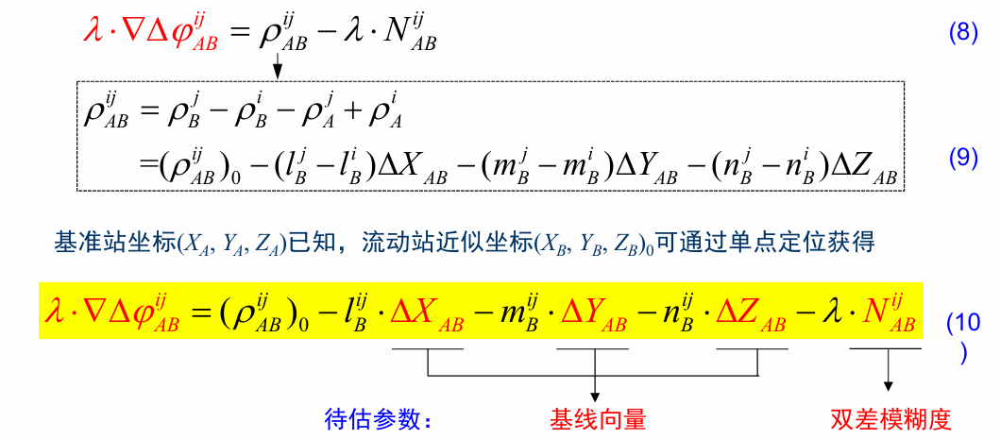

即：

短基线主要解 **基线向量 + 双差整周模糊度**。

### 4.4 长基线模型

当基线长度达到 $50 \sim 100\text{~km}$时，电离层、对流层和星历误差不能忽略。

处理方法：

1.  双频观测构造**无电离层组合**，消除电离层延迟；

2.  引入对流层残余参数，例如 $ZTD$；

3.  模型中额外估计大气误差项。

长基线未知参数比短基线更多：

$$\Delta X_{B},\Delta Y_{B},\Delta Z_{B},N_{IF},ZTD
$$

| **对比项**   | **单频**                                 | **双频**                                    |
|--------------|------------------------------------------|---------------------------------------------|
| 使用频率     | 一个频率，例如 $\left( L_{1} \right)$    | 两个频率，例如 $\left( L_{1},L_{2} \right)$ |
| 观测值符号   | $$\left( L_{\varphi,f},L_{P,f} \right)$$ | $$\left( L_{\varphi,IF},L_{P,IF} \right)$$  |
| 电离层处理   | 不能靠自身消除电离层                     | 可构造无电离层组合消除一阶电离层延迟        |
| 适用场景     | 短基线为主                               | 长基线更常用                                |
| 大气误差处理 | 短基线中常直接忽略残余                   | 电离层用 IF 组合处理，对流层常估计 (ZTD)    |
| 待估参数     | 基线向量 + 模糊度                        | 基线向量 + IF 模糊度 + 对流层残余           |
| 观测值数量   | 少                                       | 是单频的 2 倍                               |
| 模型复杂度   | 简单                                     | 更复杂                                      |
| 长距离能力   | 较弱                                     | 更强                                        |

### 4.5 单频与双频

## 5. 线性化与观测方程结构

由于距离项 $\rho$与坐标非线性相关，需要在近似坐标处线性化。

基本结构：

$$L_{i} = A_{i}{\widehat{X}}_{i}$$

其中：

$${\widehat{X}}_{i} = \left\lbrack \begin{array}{r}
\Delta X_{B} \\
\Delta Y_{B} \\
\Delta Z_{B} \\
N_{12} \\
N_{13} \\
 \vdots \phantom{} \\
N_{1n}
\end{array} \right\rbrack
$$

矩阵 $A_{i}$中主要包含：

- <u>坐标改正数</u>的<u>方向余弦系数</u>；

- <u>模糊度对应的</u> $\lambda$<u>系数</u>；

- 若为长基线，还包括<u>对流层映射函数系数</u>。

记忆重点：

**坐标改正数控制几何距离，模糊度控制相位整周项，大气参数控制长基线残余误差。**

## 6. 差分观测值的相关性

### 6.1 原始观测值

通常假设原始相位观测值相互独立，等精度：

$$cov(\Phi) = \sigma^{2}I
$$**1.** $\mathbf{\Phi}$**是什么？**

这里的 $\Phi$表示**原始非差相位观测值向量**，比如：

$$\Phi = \left\lbrack \begin{array}{r}
\Phi_{A}^{j} \\
\Phi_{B}^{j} \\
\Phi_{A}^{k} \\
\Phi_{B}^{k}
\end{array} \right\rbrack
$$

也就是：

- 测站 $A$对卫星 $j$的相位观测值；

- 测站 $B$对卫星 $j$的相位观测值；

- 测站 $A$对卫星 $k$的相位观测值；

- 测站 $B$对卫星 $k$的相位观测值。

**2. 为什么是** $\mathbf{\sigma}^{\mathbf{2}}\mathbf{I}$**？**

它来自两个基本假设：

**第一：每个原始观测值等精度**

假设每个原始相位观测值的方差都一样：

$$D(\Phi_{A}^{j}) = D(\Phi_{B}^{j}) = D(\Phi_{A}^{k}) = D(\Phi_{B}^{k}) = \sigma^{2}
$$

所以协方差阵主对角线都是 $\sigma^{2}$。

**第二：原始观测值之间相互独立**

也就是任意两个不同原始观测值之间协方差为 0：

$${cov(\Phi_{A}^{j},\Phi_{B}^{j}) = 0
}{cov(\Phi_{A}^{j},\Phi_{A}^{k}) = 0
}{cov(\Phi_{B}^{j},\Phi_{B}^{k}) = 0}$$

因此非主对角线都是 0。

所以：

$$cov(\Phi) = \begin{bmatrix}
\sigma^{2} & 0 & 0 & 0 \\
0 & \sigma^{2} & 0 & 0 \\
0 & 0 & \sigma^{2} & 0 \\
0 & 0 & 0 & \sigma^{2}
\end{bmatrix} = \sigma^{2}I$$

### 6.2 单差相关性

站间单差：

$$SD = C\Phi
$$

若原始观测值独立，则：

$$cov(SD) = Ccov(\Phi)C^{T}
$$

结论：

$$cov(SD) = 2\sigma^{2}I
$$

含义：

- 单差观测值之间仍不相关；

- 但方差变为原来的 2 倍；

- 中误差变为原来的 $\sqrt{2}$倍。

### 6.3 双差相关性

双差以某颗卫星为参考星，例如 $j$为参考星，则：

$$\nabla\Delta\varphi^{jk},\nabla\Delta\varphi^{jl}
$$

由于两个双差都用了同一颗参考星 $j$，所以双差之间相关。

两个双差观测值的协方差阵为：

$$cov(DD) = 2\sigma^{2}\begin{bmatrix}
2 & 1 \\
1 & 2
\end{bmatrix}
$$

结论：

- 双差观测值是数学相关的；

- 主对角线是方差；

- 非主对角线是协方差；

- 相关性的来源是共同参考星。

### 6.4 三差相关性

三差是在双差基础上再作历元间差分。

两个三差观测值的协方差阵为：

$$cov(TD) = 2\sigma^{2}\begin{bmatrix}
4 & 2 \\
2 & 4
\end{bmatrix}
$$

结论：

- 三差进一步放大噪声；

- 可以消除或削弱部分模糊度影响；

- 但精度比双差更差。

## 7. 最小二乘参数估计

观测方程：

$$V = A\widehat{X} - L
$$

法方程：

$$N\widehat{X} = W
$$

其中：

$${N = A^{T}PA
}{W = A^{T}PL
}$$

解为：

$$\widehat{X} = N^{- 1}W
$$

这里：

- $A$：设计矩阵；

- $P$：权阵；

- $L$：观测值常数项；

- $\widehat{X}$：待估参数；

- $V$：残差。

## 8. 精度评定

### 8.1 单位权方差

$${\widehat{\sigma}}_{0}^{2} = \frac{V^{T}PV}{r}
$$

其中 $r$为自由度。

### 8.2 参数协因数阵

$$Q_{\widehat{X}\widehat{X}} = N^{- 1}
$$

坐标参数协方差阵：

$$D_{\widehat{X}\widehat{X}} = {\widehat{\sigma}}_{0}^{2}Q_{\widehat{X}\widehat{X}}
$$

坐标分量中误差：

$${m_{x} = {\widehat{\sigma}}_{0}\sqrt{Q_{xx}}
}{m_{y} = {\widehat{\sigma}}_{0}\sqrt{Q_{yy}}
}{m_{z} = {\widehat{\sigma}}_{0}\sqrt{Q_{zz}}
}$$

### 8.3 基线长度精度

基线长度：

$$S = \sqrt{\Delta X^{2} + \Delta Y^{2} + \Delta Z^{2}}
$$

误差传播系数：

$$f = \left\lbrack \frac{\Delta X}{S},\frac{\Delta Y}{S},\frac{\Delta Z}{S} \right\rbrack
$$

基线长度协因数：

$$Q_{S} = fQ_{XYZ}f^{T}
$$

基线长度中误差：

$$m_{S} = {\widehat{\sigma}}_{0}\sqrt{Q_{S}}
$$

### 8.4 站心坐标系精度

空间直角坐标系可转换到站心地平坐标系：

$$Q_{NEU} = KQ_{XYZ}K^{T}
$$

其中：

- $N$：北向；

- $E$：东向；

- $U$：天向。

对应中误差：

$${m_{N} = {\widehat{\sigma}}_{0}\sqrt{Q_{NN}}
}{m_{E} = {\widehat{\sigma}}_{0}\sqrt{Q_{EE}}
}{m_{U} = {\widehat{\sigma}}_{0}\sqrt{Q_{UU}}
}$$

## 9. RTK

### 9.1 定义

RTK 全称：

$$Real\ Time\ Kinematic
$$

即实时动态定位。

本质：

RTK 是利用**<u>载波相位观测值</u>**进行实时相对定位的技术。

### 9.2 工作流程

1.  基准站坐标已知；

2.  基准站实时播发观测值和已知坐标；

3.  流动站接收基准站数据；

4.  流动站结合自身观测值构造差分模型；

5.  实时解算基线和模糊度；

6.  得到流动站三维坐标。

### 9.3 RTK 特点

- 本质是相对定位；

- 实时解算相位模糊度；

- 初始化完成后可达到厘米级定位；

- 精度一般为：

  - 平面：$1 \sim 3\text{~cm}$

  - 高程：$2 \sim 5\text{~cm}$

### 9.4 RTK 存在的问题

常规 RTK 依赖单参考站，问题主要来自距离增大。

当流动站远离基准站时：

- 电离层误差空间相关性下降；

- 对流层误差空间相关性下降；

- <u>星历误差影响增大</u>；

- 双差残余误差增大；

- 模糊度固定困难；

- 可能出现错误固定解。

所以常规 RTK 作业距离一般小于：

$$10 \sim 15\text{~km}
$$

南方地区有时更短。

## 10. 网络 RTK

### 10.1 产生原因

当站间距离达到：

$$50 \sim 100\text{~km}
$$

常规 RTK 不能再把电离层、对流层、星历误差视为零，因此需要网络 RTK。

### 10.2 定义

网络 RTK 是在一定区域内建立多个 GNSS 基准站，利用这些基准站的双频观测数据，计算并播发区域误差改正信息。

用户根据自己的概略坐标，内插出流动站处的残余误差改正数，实现实时厘米级定位。

### 10.3 系统组成

| **组成**     | **作用**                             |
|--------------|--------------------------------------|
| 基准站网     | 提供连续 GNSS 观测数据               |
| 数据通信链路 | 传输基准站、处理中心、用户之间的数据 |
| 数据处理中心 | 解算区域误差改正模型                 |
| 用户部分     | 接收改正数并进行实时定位             |

### 10.4 网络 RTK 优势

相对于常规 RTK：

- 覆盖范围更广；

- 作业距离更长；

- 系统误差削弱更充分；

- 精度和可靠性更高；

- 初始化时间更短；

- 大范围作业成本更低。

**11. 本章高频考点**

**考点 1：相对定位解的是什么？**

解的是：

$$\mathbf{b}_{AB} = \mathbf{X}_{B} - \mathbf{X}_{A}
$$

即基线向量。

**考点 2：单差、双差分别消除什么？**

| **差分类型** | **操作**             | **主要作用**               |
|--------------|----------------------|----------------------------|
| 站间单差     | 两测站同卫星作差     | 削弱卫星端共性误差         |
| 站星双差     | 单差后再对两卫星作差 | 消除接收机钟差             |
| 三差         | 双差后再历元间作差   | 削弱模糊度影响，但放大噪声 |

**考点 3：短基线和长基线的区别**

| **类型** | **基线长度** | **大气误差处理**   | **待估参数**                     |
|----------|--------------|--------------------|----------------------------------|
| 短基线   | \< 20 km     | 可忽略残余大气误差 | 基线向量 + 模糊度                |
| 长基线   | 50–100 km    | 需建模或组合消除   | 基线向量 + 模糊度 + 对流层残余等 |

**考点 4：为什么双差观测值相关？**

因为多个双差观测值共用同一颗参考星。

例如：

$$\nabla\Delta\varphi^{jk}
$$

和

$$\nabla\Delta\varphi^{jl}
$$

都包含参考星 $j$，因此二者存在数学相关性。

**考点 5：RTK 为什么距离不能太远？**

因为距离增大后，基准站和流动站之间误差不再具有强空间相关性，双差残余误差增大，导致模糊度难固定，精度下降。

## 12. 课后思考题计算

两台双频GPS接收机同步观测8颗卫星，观测1小时，采样 率为10s，请问有多少个非差相位观测值？多少个线性独 立的单差相位观测值，多少个线性独立的双差相位观测值 ，多少个线性独立的三差相位观测值？

**题目拆解**

已知：

- 接收机数：$r = 2$

- 卫星数：$s = 8$

- 双频：$f = 2$

- 观测时长：$1h = 3600s$

- 采样率：$10s$

先算历元数：

$$n_{t} = \frac{3600}{10} = 360$$

### 1. 非差相位观测值

非差相位观测值，就是**没有作差的原始相位观测值**。

每个历元：

$$2\text{~台接收机} \times 8\text{~颗卫星} \times 2\text{~个频率}
$$

所以每个历元有：

$2 \times 8 \times 2 = 32$个非差相位观测值。

360 个历元共有：

$$32 \times 360 = 11520
$$

所以：

$$\boxed{11520}
$$

### 2. 线性独立的单差相位观测值

单差一般指**站间单差**。

两台接收机对同一颗卫星、同一频率同步观测，作差：

$$\Delta\Phi_{AB}^{i} = \Phi_{B}^{i} - \Phi_{A}^{i}
$$

每个历元、每个频率，8 颗卫星可形成：

$8$个站间单差

双频，所以每个历元有：

$8 \times 2 = 16$个单差相位观测值

360 个历元共有：

$$16 \times 360 = 5760
$$

所以：

$$\boxed{5760}
$$

### 3. 线性独立的双差相位观测值

双差是在站间单差基础上，再进行**星间差分**。

如果有 8 颗卫星，不是形成：

$$C_{8}^{2} = 28
$$

个独立双差。

因为这些双差之间不是完全独立的。通常选 1 颗卫星作为参考星，其余 7 颗卫星分别与参考星作差。

所以每个历元、每个频率，线性独立双差数为：

$$8 - 1 = 7
$$

双频，所以每个历元有：

$$7 \times 2 = 14
$$

个独立双差。

360 个历元共有：

$$14 \times 360 = 5040
$$

所以：

$$\boxed{5040}
$$

### 4. 线性独立的三差相位观测值

三差是在双差基础上，再进行**历元间差分**。

也就是：

$$TD(t_{k}) = DD(t_{k}) - DD(t_{k - 1})
$$

如果有 360 个历元，那么相邻历元间隔数是：

$$360 - 1 = 359
$$

每个历元间隔、每个频率有：

$$8 - 1 = 7
$$

个独立三差。

双频，所以总数为：

$$7 \times 2 \times 359 = 5026
$$

所以：

$$\boxed{5026}
$$

**汇总表**

| **类型**               | **每个历元/历元间隔数量**    | **总数**          |
|------------------------|------------------------------|-------------------|
| 非差相位观测值         | $$2 \times 8 \times 2 = 32$$ | $$\boxed{11520}$$ |
| 线性独立单差相位观测值 | $$8 \times 2 = 16$$          | $$\boxed{5760}$$  |
| 线性独立双差相位观测值 | $$(8 - 1) \times 2 = 14$$    | $$\boxed{5040}$$  |
| 线性独立三差相位观测值 | $$(8 - 1) \times 2 = 14$$    | $$\boxed{5026}$$  |

**最关键的逻辑**

记住这四个层级：

$${\text{非差：}2 \times 8 \times 2 \times 360
}{\text{单差：}8 \times 2 \times 360
}{\text{双差：}(8 - 1) \times 2 \times 360
}{\text{三差：}(8 - 1) \times 2 \times (360 - 1)
}$$

**为什么双差是** $\mathbf{8 - 1}$**，不是** $\mathbf{C}_{\mathbf{8}}^{\mathbf{2}}$**？**

因为双差要选一颗**参考星**。

假设选卫星 1 为参考星，则独立双差为：

$${\nabla\Delta\Phi^{12}
}{\nabla\Delta\Phi^{13}
}{\nabla\Delta\Phi^{14}
}{\cdots
}{\nabla\Delta\Phi^{18}
}$$

一共：

$$7
$$

个。

其他如：

$$\nabla\Delta\Phi^{23}
$$

可以由已有双差组合出来，不是新的线性独立观测值：

$$\nabla\Delta\Phi^{23} = \nabla\Delta\Phi^{13} - \nabla\Delta\Phi^{12}
$$

所以独立双差数是：

$$s - 1
$$

而不是：

$$C_{s}^{2}
$$

# 14-整周模糊度解算

## 一、本章核心逻辑

本章要解决的问题：

1.  **为什么要固定模糊度为整数**

2.  **如何把实数模糊度固定到正确整数**

3.  **主要模糊度固定方法有哪些**

4.  **影响模糊度解算成功率的因素有哪些**

## 二、整周模糊度的基本概念

### 1. 载波相位观测量的特点

**优点**

载波相位观测值<u>精度很高</u>，测距精度可达到 **0.1 mm—3 mm 量级**。

**难点**

载波相位观测中存在两个核心问题：

| **问题**       | **含义**                   |
|----------------|----------------------------|
| 周跳探测与修复 | 观测过程中整周计数发生突变 |
| 整周模糊度确定 | 初始整周数未知，需要解算   |

## 2. 整周模糊度的含义

载波相位观测值可以理解为：

载波相位观测值 = **整周计数 + 不足一周部分 + 初始整周模糊度**

其中：

| **部分**     | **含义**                                   |
|--------------|--------------------------------------------|
| 整周计数     | 接收机从某一时刻开始连续跟踪得到的整周变化 |
| 不足一周部分 | 接收机可直接测得的小数周部分               |
| 整周模糊度 N | 初始时刻未知的整周数                       |

**关键点：整周模糊度理论上是整数，但实际平差先得到的是实数。**

## 三、为什么必须固定整周模糊度

### 1. 载波相位要发挥高精度，必须知道整数模糊度

双差相位观测值中包含未知整数模糊度。  
<u>只有正确求出整数模糊度，才能把高精度载波相位观测值转化为精确的卫地距。</u>

### 2. 最小二乘直接求得的是实数解

由于以下因素影响：

- 测量噪声  
  残余误差  
  多路径效应  
  模型不完善  
  数据处理软件误差

所以最小二乘求出的模糊度通常不是整数，而是实数。

### 3. 固定模糊度可以提高定位精度和可靠性

| **解的类型**               | **含义**               | **精度特点** |
|----------------------------|------------------------|--------------|
| Float 解 / 实数解 / 浮点解 | 模糊度作为实数参与平差 | 精度较低     |
| Fix 解 / 整数解 / 固定解   | 模糊度被固定为整数     | 精度显著提高 |

**考试重点：Float 解是固定解的基础，Fix 解是高精度定位的目标。**

### 4. 快速确定整数模糊度对提高GPS定位的作业效率具有重要作用

## 四、整周模糊度解算方法总框架

本章方法可以分为四类：

重点掌握：

| **方法**     | **搜索对象** | **核心思想**                       |
|--------------|--------------|------------------------------------|
| 取整法       | 单个模糊度   | 直接四舍五入                       |
| 观测值域方法 | 观测组合     | 构造组合观测量，先求宽巷模糊度     |
| 坐标域方法   | 坐标         | 搜索使模糊度函数最大的坐标         |
| 模糊度域方法 | 模糊度向量   | 在整数空间中寻找最优整数模糊度组合 |

## 五、取整法

### 1. 基本思想

当浮点模糊度非常接近整数时，直接四舍五入：

2.91 → 3  
2.03 → 2

### 2. 适用条件

通常要求：

1.  基线较短

2.  观测时间较长

3.  浮点模糊度误差较小

例如：短基线、长时间观测时，浮点模糊度可能比较接近整数。

**3. 特点**

| **优点** | **缺点** |
|----------|----------|
| 方法简单 | 可靠性差 |

**重要结论：只有当浮点模糊度误差在 ±0.25 周以内时，四舍五入才有可能得到正确整数。**

因此，取整法一般不能作为可靠的模糊度固定方法。

## 六、观测值域内的模糊度确定方法：MW组合

### 1. 基本思想

利用双频码观测值和相位观测值构造 **Melbourne-Wübbena 组合**，简称 **MW组合**。

其目的是直接解算 **宽巷模糊度**。

### 2. MW组合的结构关系

**3. MW组合能消除的误差**

### 4. MW组合的特点

| **特点**         | **说明**                 |
|------------------|--------------------------|
| 波长较长         | 宽巷波长约 86 cm         |
| 容易固定         | 宽波长降低了取整难度     |
| 受码噪声影响大   | 单历元精度取决于伪距精度 |
| 不常用于最终定位 | 一般作为中间步骤         |
| 可用于周跳探测   | 因为宽巷模糊度较容易判断 |

### 5. 复习重点

MW组合的核心作用不是直接完成最终高精度定位，而是：

先可靠确定宽巷模糊度  
再辅助确定 L1 或 L2 的整周模糊度

## 七、坐标域内的模糊度确定方法：模糊度函数法 AFM

### 1. 基本思想

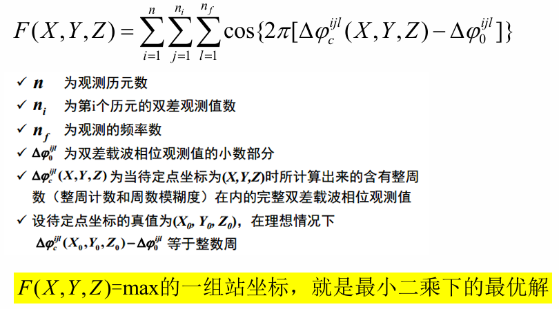

### 2. 搜索对象

AFM 搜索的是：

**待定点坐标 / 基线向量**

而不是：

整周模糊度本身

### 3. 基本步骤

**第一步：确定搜索区域**  
以待定点近似坐标为中心  
根据近似坐标标准差确定搜索范围  
  
**第二步：搜索最优坐标**  
寻找使模糊度函数 F(X,Y,Z) 最大的坐标

### 4. 对坐标初值的要求

**<u>AFM 对初始坐标要求较高：</u>**

初值精度高 → 搜索空间小 → 搜索速度快 → 成功率高  
初值精度低 → 搜索空间大 → 搜索时间急剧增加  
初值很差 → 方法可能失效

一般应用中，通常先用 **三差解** 得到坐标初值，再使用模糊度函数法。

### 5. AFM的优缺点

| **优点**                 | **缺点**           |
|--------------------------|--------------------|
| 只用载波相位不足一周部分 | 需要较好坐标初值   |
| 对周跳不敏感             | 初值差时搜索效率低 |
| 方法简单                 | 搜索空间可能很大   |
| 适合周跳较多资料         | 不适合初值很差情况 |

### 6. 适用场景

AFM 特别适合：

- 基线向量复测  
  接收机鉴定场检定  
  形变量较小的变形监测

## 八、模糊度域内的模糊度确定方法

这是本章最重要部分。

### 1.基本思想

### 2. 为什么是混合整数最小二乘问题

未知参数包括两类：

| **参数类型** | **特点** |
|--------------|----------|
| 坐标参数     | 连续实数 |
| 模糊度参数   | 整数     |

所以它**不是普通最小二乘**，而是：

Mixed Integer Least Squares，MILS  
混合整数最小二乘问题

常规处理方式：

先把模糊度当作实数估计  
↓  
得到浮点模糊度和协方差信息  
↓  
再利用整数约束搜索最优整数解

### 3. 整数最小二乘估计 ILSE

目标是在所有整数模糊度组合中，找到**<u>使加权残差平方和最小</u>**的一组：

最优整数模糊度 = 使目标函数最小的整数模糊度组合

理解重点：

不是哪个整数离浮点解最近就一定正确  
而是哪个整数组合在协方差约束下整体最优

这也是为什么简单取整法可能失败。

## 九、模糊度搜索空间的构造

**1. 固定范围法**

最简单方法：

若某个模糊度浮点解为 ${\widehat{X}}_{i}$,则划定一个搜索范围为 $\left\lbrack {\widehat{X}}_{i}\, - \, c,\,{\widehat{X}}_{i}\, + \, c \right\rbrack$

其中 c 可取 6、10 等。

**<u>缺点：</u>**

**<u>主观性强  
搜索空间大  
效率低</u>**

那么整个整周模糊度序列的搜索空间，就是一个以其实数解为中心的n维空间立方体。因此，这种方法要搜索的点为${（2c）}^{n}$个

若有 n 个模糊度参数，搜索点数量会迅速增加，形成高维立方体搜索空间。

### 2. 利用方差信息构造搜索空间

更合理的方法是利用模糊度精度信息：

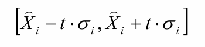

这样得到的搜索空间不再是简单立方体，而是具有统计意义的空间多面体或椭球区域。

优点：

**利用了模糊度方差  
统计意义更强  
搜索范围更合理**

## 十、模糊度确认与统计检验

搜索到最优整数模糊度后，不能立即盲目固定，还要进行确认。

主要包括三类检验：

### 1. 基线向量整数解与初始解一致性检验

检查固定模糊度后得到的基线向量是否与初始解一致。

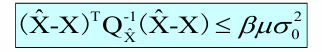

目的：

防止固定后的坐标发生异常偏移

### 2. 单位权中误差一致性检验

检查整数解和初始解的单位权中误差是否一致。

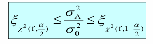

目的：

判断固定模糊度后整体平差精度是否合理

### 3. Ratio 检验

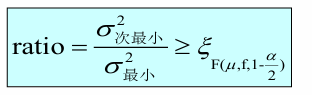

Ratio 检验比较：

$$\mathrm{Ratio}=\frac{\text{次优整数解的残差平方和}}{\text{最优整数解的残差平方和}}$$

若 Ratio 足够大，说明：

最优解明显优于次优解  
模糊度固定可靠性较高

若 Ratio 较小，说明：

最优解和次优解差别不明显  
模糊度固定风险较大

**Ratio 检验是实际模糊度固定中非常常用的可靠性检验。**

## 十一、LAMBDA方法

### 1. LAMBDA的地位

LAMBDA 是模糊度域解算中的重点和难点。

全称：

Least-squares AMBiguity Decorrelation Adjustment  
最小二乘模糊度降相关平差

### 2. 基本思想

LAMBDA 的核心思想：

通过整数变换降低模糊度参数之间的相关性  
↓  
压缩搜索椭球  
↓  
减少候选整数点数量  
↓  
提高搜索速度和固定成功率

### 3. 为什么要降相关

**<u>短时间观测时</u>**，模糊度浮点解通常存在两个问题：

1.  **精度低**

2.  **参数之间相关性强**

如果模糊度之间强相关，搜索椭球会发生旋转和拉长，导致搜索复杂。

**降相关的目的：**

1.  让协方差阵更接近对角阵

2.  减小非对角线元素

3.  降低参数相关性

4.  提高搜索效率

### 4. LAMBDA的两个主要步骤

**第一步：整数变换 / 降相关**

1.  将原模糊度参数 a 转换为新参数 z

2.  降低参数相关性

**第二步：整数搜索**

1.  在降相关后的空间中搜索最优整数 z

2.  再反变换得到原模糊度整数解 a

**结构关系**：

原始浮点模糊度 â  
↓ 整数变换 Z  
降相关后的浮点模糊度 ẑ  
↓ 整数最小二乘搜索  
最优整数 z  
↓ 反变换  
原始模糊度整数解 a

### 5. 整数变换矩阵 Z 的要求

Z 矩阵必须满足三个条件：

| **条件**         | **作用**             |
|------------------|----------------------|
| 元素必须为整数   | 保持整数模糊度特性   |
| 行列式绝对值为 1 | 保持搜索空间体积不变 |
| 能降低相关性     | 提高搜索效率         |

即：

$$det(Z)\  = \  \pm 1$$

### 6. LAMBDA的本质

一句话概括：

LAMBDA不是改变最优解，而是通过降相关让最优整数解更容易被搜索到。

它的本质是：

1.  保持整数特性不变

2.  保持搜索空间体积不变

3.  改变搜索空间形状

4.  降低搜索复杂度

## 十二、不同方法之间的关系

**1. 从简单到复杂**

取整法  
↓  
观测值域 MW组合  
↓  
坐标域 AFM  
↓  
模糊度域整数最小二乘  
↓  
LAMBDA

**2. 从搜索对象看**

| **方法**      | **搜索对象**   | **可靠性**     |
|---------------|----------------|----------------|
| 取整法        | 单个模糊度     | 低             |
| MW组合        | 宽巷模糊度     | 中等，常作辅助 |
| AFM           | 坐标           | 依赖初值       |
| ILSE / LAMBDA | 整数模糊度向量 | 高             |

**3. 从实际应用看**

| **方法** | **主要用途**               |
|----------|----------------------------|
| 取整法   | 简单情况、理论理解         |
| MW组合   | 宽巷模糊度确定、周跳探测   |
| AFM      | 坐标初值较好、周跳较多场景 |
| LAMBDA   | GNSS高精度定位中广泛使用   |

## 十三、影响模糊度解算效率的因素

**1. 载波波长**

波长越长，模糊度越容易固定。

宽巷组合波长长 → 更容易固定  
窄巷波长短 → 固定更困难

**2. 观测时间**

观测时间越长，观测信息越充分，模糊度浮点解越稳定。

观测时间短 → 浮点解精度低 → 固定困难  
观测时间长 → 浮点解精度高 → 固定容易

**3. 观测条件**

包括：

卫星数量  
卫星几何结构  
基线距离  
信号质量  
多路径环境  
周跳情况

一般规律：

卫星数越多 → 几何结构越好 → 成功率越高  
基线越长 → 残余误差越大 → 固定越困难  
观测环境越复杂 → 多路径越强 → 固定越困难

## 十四、模糊度固定成功率取决于什么

模糊度解算成功率主要取决于三方面：

| **因素**     | **含义**                     |
|--------------|------------------------------|
| 函数模型     | 观测方程是否合理             |
| 随机模型     | 观测值权阵、方差模型是否准确 |
| 整数估计方法 | 搜索和确认方法是否高效可靠   |

可以概括为：

模型正确 + 数据质量好 + 搜索方法可靠 = 模糊度固定成功率高

## 十五、考试易考点总结

**1. 名词解释**

| **名词**   | **答题要点**                                     |
|------------|--------------------------------------------------|
| 整周模糊度 | 载波相位观测中初始未知的整周数，理论上为整数     |
| Float 解   | 模糊度作为实数估计得到的解                       |
| Fix 解     | 模糊度固定为整数后得到的解                       |
| MW组合     | 双频码相组合，用于确定宽巷模糊度                 |
| AFM        | 在坐标域搜索最优坐标的模糊度函数法               |
| LAMBDA     | 通过整数变换降低模糊度相关性并进行整数搜索的方法 |

**2. 简答题高频方向**

**问：为什么要固定整周模糊度？**

答题结构：

载波相位观测精度高  
但其中含有未知整周模糊度  
浮点解不能充分发挥相位观测精度  
正确固定整数模糊度后  
可将载波相位转化为精确距离  
从而显著提高定位精度和可靠性

**问：MW组合有什么特点？**

答题结构：

MW组合由双频伪距和双频相位构成  
可以消除电离层、对流层、钟差和几何距离等公共误差  
主要包含宽巷模糊度  
宽巷波长长，模糊度容易固定  
但受伪距噪声和多路径影响较大  
一般用于宽巷模糊度确定和周跳探测  
不常直接用于最终定位

**问：AFM的基本思想是什么？**

答题结构：

AFM不直接搜索模糊度  
而是在坐标域内搜索待定点坐标  
根据坐标计算理论相位小数部分  
与实测小数部分比较  
构造模糊度函数  
使函数值最大的坐标即为最优解  
该方法需要较好坐标初值  
对周跳不敏感

**问：LAMBDA方法的核心思想是什么？**

答题结构：

LAMBDA通过整数变换降低模糊度参数之间的相关性  
在保持整数特性和搜索空间体积不变的前提下  
压缩搜索椭球  
减少搜索候选点数量  
从而提高整数最小二乘搜索效率  
其主要包括整数变换和整数搜索两部分

**第15讲 PPP及其增强技术**

**一、本章主线**

本章围绕 **精密单点定位 PPP** 展开，核心问题是：

如何利用单台 GNSS 接收机，在不架设本地基准站的条件下，实现广域高精度定位？

逻辑链条是：

本章考试重点不是背景，而是以下几个问题：

1.  **PPP 是什么，有什么特点？**

2.  **PPP 基本观测方程和待估参数有哪些？**

3.  **IF 模型、UC 模型、北斗三频 PPP 怎么理解？**

4.  **PPP 为什么收敛慢？为什么模糊度难固定？**

5.  **PPP 有哪些增强技术？分别解决什么问题？**

**二、PPP 的基本概念**

PPP 是利用（单台 GNSS 接收机），结合<u>精密卫星轨道、精密卫星钟差</u>和<u>精细误差改正模型</u>，对（伪距和载波相位观测值）进行处理，估计（测站坐标）、（接收机钟差）、（对流层延迟）、（非差模糊度），从而实现广域高精度定位的方法。

**三、PPP 与 RTK 的区别**

| **对比项** | **RTK**                  | **PPP**                    |
|------------|--------------------------|----------------------------|
| 定位方式   | 相对定位                 | 单点定位                   |
| 接收机要求 | 基准站 + 流动站          | 单台接收机                 |
| 误差处理   | 通过差分消除共同误差     | 通过精密产品和模型改正误差 |
| 作业范围   | 受基准站距离限制         | 广域或全球范围             |
| 收敛速度   | 快                       | 较慢                       |
| 精度       | 厘米级                   | 厘米至毫米级               |
| 主要问题   | 作用距离有限、依赖基准站 | 收敛慢、模糊度固定困难     |

考试答法可以写成：

RTK 是相对定位，需要基准站和流动站同步观测，通过双差处理削弱或消除共同误差，定位速度快，但作用距离有限。PPP 是精密单点定位，用户端只需单台接收机，依靠精密轨道、精密钟差和误差模型实现广域高精度定位，但收敛时间较长，非差模糊度固定较困难。

**四、PPP 的技术特点**

1.  **单机定位**：用户端不需要架设本地基准站。

2.  **作业方式灵活**：不受基准站距离限制。

3.  **点位精度均匀**：理论上不同测站间定位精度较均匀。

4.  **低成本**：减少基准站布设和维护成本。

5.  **计算效率较高**：法方程维数相对较小。

6.  **可用信息多**：保留较多原始观测信息。

7.  **操作相对简单**：处理流程较固定。

**五、PPP 技术发展方向**

后处理 → 实时  
双频 / 单频 → 多频  
单系统 / 双系统 → 多系统  
无电离层组合 → 非差非组合  
实数解 → 整数解 / 固定解

**六、PPP 基本观测方程**

**1. 伪距观测方程**

伪距观测值的组成可以写成：

$$P_{r,f}^{s} = \rho_{r}^{s} + c(\delta t_{r} - \delta t^{s}) + I_{r,f}^{s} + T_{r}^{s} + \text{硬件延迟} + \text{轨道误差} + \varepsilon_{P}$$

伪距观测方程中，电离层延迟以正号出现。

**2. 载波相位观测方程**

载波相位观测值的结构为：

$$L_{r,f}^{s} = \lambda_{f}\Phi_{r,f}^{s} = \rho_{r}^{s} + c(\delta t_{r} - \delta t^{s}) - I_{r,f}^{s} + T_{r}^{s} + \lambda_{f}N_{r,f}^{s} + \text{硬件延迟} + \text{轨道误差} + \varepsilon_{L}$$

与伪距方程相比，重点有两个：

1.  **增加了整周模糊度** $N$；

2.  **电离层项符号相反**。

**七、双频无电离层组合 IF**

**PPP 一般采用双频无电离层组合观测值。**

其目的就是利用两个频率的组合<u>消除一阶电离层延迟</u>。

但要注意：

<u>但会放大观测噪声，并破坏模糊度的整数特性。</u>

**八、PPP 线性化模型与待估参数**

PPP 观测方程线性化后写为：

$$V(k) = AX(k) + L(k)$$

其中：

- $V(k)$：残差向量；

- $A$：设计矩阵；

- $X(k)$：待估参数；

- $L(k)$：常数项或观测减计算值。

PPP 主要估计以下参数：

1.  **测站坐标改正数**：$\delta X,\delta Y,\delta Z$

2.  **接收机钟差**：$\delta t$

3.  **天顶对流层延迟**：$zpd/zwd$

4.  **非差模糊度**：$Amb$

5.  **电离层延迟**：主要在非差非组合模型中估计

静态 PPP 和动态 PPP 的区别可以简单记：

静态PPP：测站坐标固定，钟差逐历元估计  
动态PPP：测站坐标和钟差都逐历元估计

**九、PPP 定位模型**

**1. IF 模型：无电离层组合模型**

IF 模型是传统 PPP 中常用的模型。它通过双频组合消除一阶电离层延迟。

优点是<u>模型比较简单，处理方便。</u>

<u>缺点是：</u>

1.  组合会放大观测噪声；

2.  组合后的模糊度整数性变差；

3.  不利于充分利用多频多系统原始观测信息。

**IF 模型靠组合消除电离层，但代价是噪声放大和模糊度整数性变差。**

**2. UofC 模型**

UofC 模型适用于<u>单频和双频</u>。

它主要与<u>改善载波相位 PPP 的模糊度收敛有关</u>。

**3. UC 模型：非差非组合模型**

UC 是：

Undifferenced and Uncombined  
非差非组合

它的特点是：

1.  不进行站间差分；

2.  不进行频率组合；

3.  直接使用原始伪距和载波相位观测值；

4.  显式估计或建模电离层延迟；

5.  需要处理码偏差、相位偏差、频间偏差等问题。

UC 模型的优势是：

<u>保留原始观测信息，适合多频多系统 PPP。</u>

不足是：

<u>参数更多，模型更复杂，偏差处理要求更高。</u>

**十、北斗三频 PPP 模型**

**1. 三种实现形式**

北斗三频 PPP 有三种形式：

1.  **IF-PPP1**：B1/B2 + B1/B3，必要时加 B2/B3；

2.  **IF-PPP2**：B1/B2/B3 三频整体组合；

3.  **UC-PPP**：B1 + B2 + B3 原始观测值非组合处理。

**2. IF-PPP1**

IF-PPP1 是<u>多个双频无电离层组合</u>的形式。

重点有两个：

<u>第一</u>，B1/B2、B1/B3、B2/B3 三个组合中：**3 个方程只有 2 个独立。**

<u>第二</u>，不同伪距组合对应的接收机码偏差不同，不能完全被一个接收机钟差吸收。

因此有两种处理策略：

1.  设置 2 个接收机钟差参数；

2.  设置 1 个接收机钟差参数 + 1 个频间码偏差参数。

IF-PPP1 由多个双频无电离层组合构成，但组合之间不完全独立，且不同组合对应的接收机码偏差不同，需要通过增加钟差参数或频间码偏差参数处理。

**3. IF-PPP2**

IF-PPP2 使用 B1/B2/B3 三频整体组合。

<u>其组合系数需要满足：</u>

1.  系数和为 1；

2.  电离层项被消除；

3.  满足噪声最小准则。

**IF-PPP2 是三频整体无电离层组合，按噪声最小准则构造。**

**4. UC-PPP**

UC-PPP 直接使用 B1、B2、B3 三个频率的<u>原始观测值</u>。

它不通过组合消除电离层，而是<u>显式估计电离层及相关偏差</u>。

它的<u>优点是保留三频原始观测信息，适合多频多系统发展方向</u>；

缺点是<u>模型复杂、参数较多</u>。

**十一、PPP 数据处理流程**

输入：  
精密卫星轨道 + 精密卫星钟差 + 用户伪距和相位观测值  
↓  
数据预处理：  
粗差剔除、周跳探测、观测值质量控制  
↓  
模型构建：  
无电离层组合模型 或 非差非组合模型  
↓  
误差改正：  
轨道、钟差、电离层、对流层、潮汐、天线、相对论等  
↓  
参数估计：  
坐标、接收机钟差、对流层延迟、模糊度  
↓  
输出：  
PPP 定位结果

**十二、PPP 误差处理**

1.  **卫星轨道误差**：用精密轨道改正；

2.  **卫星钟差**：用精密钟差改正；

3.  **电离层延迟**：双频 IF 组合消除，或在 UC 模型中估计；

4.  **对流层延迟**：干分量模型改正，湿分量常作为参数估计；

5.  **相对论效应**；

6.  **地球自转改正**；

7.  **天线相位中心偏差**；

8.  **天线相位缠绕**；

9.  **固体潮、海洋潮**；

10. **周跳和多路径影响**。

位中心、相位缠绕、固体潮、海洋潮以及周跳等误差进行精细处理。

**十三、PPP 的关键难点**

**1. 误差处理复杂**

PPP 不通过本地差分消除误差，所以必须依靠精密产品和模型逐项改正。

**2. 参数多且耦合强**

PPP 需要同时估计<u>坐标、钟差、对流层延迟和模糊度</u>。

这些参数之间相关性强，尤其是：

<u>高程方向  
接收机钟差  
天顶对流层延迟  
模糊度</u>

之间容易相互影响，导致参数分离慢。

**3. 收敛时间长**

主要因为：

- 模糊度不能快速固定；

- 对流层、钟差、坐标等参数相关性强；

- 观测几何变化不够快时，参数分离慢。

**4. 非差模糊度难固定**

PPP 使用非差观测模型，<u>非差模糊度中吸收了硬件偏差</u>，不再是纯整数。

$$PPP非差模糊度 = 整数模糊度 + \ 接收机端小数偏差 - \ 卫星端小数偏差$$

因此不能像 <u>RTK 双差模糊度那样直接固定</u>。

**十四、PPP 模糊度固定**

**1. 为什么要固定模糊度？**

载波相位观测值精度高，但其中含有整周模糊度。若模糊度只能作为实数估计，称为浮点解；若能固定为整数，就可以得到固定解。

固定解的优势是：

- <u>精度更高；</u>

- <u>收敛更快；</u>

- <u>结果更稳定。</u>

**2. PPP 模糊度为什么不是整数？**

因为 PPP 的非差模糊度中含有：

1.  <u>接收机端相位小数偏差；</u>

2.  <u>卫星端相位小数偏差；</u>

3.  <u>其他硬件延迟影响。</u>

**3. PPP 模糊度固定的基本思路**

PPP 模糊度固定的关键是<u>恢复非差模糊度的整数性。</u>

PPP 模糊度固定通常利用参考站网估计卫星端相位小数偏差，并将偏差产品提供给用户。用户利用该偏差改正非差模糊度，使其恢复整数性，再进行整数模糊度固定，从而获得 PPP 固定解。

**4. 固定解效果**

PPP 固定解能显著提高定位精度，尤其东向提升明显。

**十五、PPP 增强技术**

PPP 增强技术的目标主要是：

缩短收敛时间  
提高模糊度固定率  
提高复杂环境下连续性和可用性  
提高定位精度和可靠性

**1. 多系统增强**

多系统增强是指同时使用 GPS、GLONASS、Galileo、BDS 等系统。

它的主要作用是：

- 增加可见卫星数；

- 改善空间几何结构；

- 增加观测冗余；

- 缩短收敛时间。

双系统或三系统组合对 PPP 定位精度提升不显著，但能较显著缩短收敛时间。

**2. 多频增强**

多频增强的作用主要体现在：

1.  可以构造更多线性组合；

2.  有利于周跳探测；

3.  有利于粗差探测；

4.  有利于宽巷、窄巷模糊度处理；

5.  提高数据质量控制能力。

北斗三频 PPP 中<u>第三频率的意义</u>主要是：

在 B1、B2 频率跟踪质量较差或受到污染时，

第三频率可以提供更多组合和冗余信息，从而提高结果可靠性。

**<u>3. CORS 增强</u>**

CORS 可通过稀疏参考站网估计卫星端相位小数偏差，为用户 PPP 模糊度固定提供支持；

也可通过密集区域参考站网建立电离层和对流层误差模型，并将大气改正内插到用户站，从而实现 PPP 快速首次初始化和快速重新初始化。

CORS 对 PPP 的增强主要有两类作用：

稀疏站网：提供小数偏差 → 支持 PPP 固定解  
密集站网：提供大气改正 → 支持快速初始化

**4. PPP 快速重新初始化**

PPP 信号失锁或中断后，需要重新收敛。

PPP 快速重新初始化的关键是利用中断前的信息，对中断后的大气误差进行预测，从而帮助模糊度快速重新固定。

大气预报时延越短，固定成功率越高。

**5. PPP 快速首次初始化**

首次初始化慢是 PPP 的重要问题。

利用 CORS 站的非差固定解，计算电离层和对流层误差，然后进行空间建模并内插给用户站，从而缩短 PPP 首次初始化时间。

**6. 接收机钟差建模**

接收机钟差建模可以降低<u>接收机钟差、测站高程和天顶对流层延迟</u>之间的相关性，从而提高动态 PPP 高程方向定位精度。

**7. GNSS/INS 组合增强**

<u>惯性辅助 PPP</u> 的作用主要是<u>提高复杂环境下的连续性和可用性。</u>

INS 可以在 GNSS 信号短时中断时提供连续的运动信息，有助于：

- 提高定位连续性；

- 改善遮挡环境下可用性；

- 辅助模糊度固定；

- 提高重新初始化能力。

**8. LEO 低轨卫星增强**

LEO 卫星轨道低、运动速度快，相同时段内卫星几何变化明显，可以加快 PPP 参数分离，改善观测几何结构，从而显著缩短 PPP 收敛时间。LEO 卫星数量越多，收敛时间越短。

**十六、PPP 应用**

主要包括：

1.  大地测量：板块运动、基准维持、长期坐标序列；

2.  航空测量：飞行平台轨迹确定；

3.  精密授时：时间传递、钟差分析；

4.  低轨卫星精密定轨；

5.  极地科考；

6.  地震同震位移监测；

7.  形变监测；

8.  GPS 气象学：对流层延迟提取；

9.  电离层建模：电离层延迟提取。

**十七、SBAS 与 GBAS 简要保留**

PPT 后半部分涉及星基与地基增强系统，如果考试覆盖，需要掌握基本区别。

**1. 增强系统目的**

增强系统主要用于：

1.  <u>提高定位精度；</u>

2.  <u>改善信号覆盖；</u>

3.  <u>提供完备性信息。</u>

**2. SBAS 与 GBAS**

| **项目** | **SBAS**             | **GBAS**     |
|----------|----------------------|--------------|
| 中文     | 星基增强系统         | 地基增强系统 |
| 播发方式 | GEO 等空间段播发     | 地面通信播发 |
| 覆盖范围 | 广域                 | 局域         |
| 代表系统 | WAAS、EGNOS、BDSBAS  | LAAS         |
| 主要作用 | 广域精度和完备性增强 | 局部区域增强 |

**十八、OSR 与 SSR**

- **RTK、网络 RTK** 属于 OSR，即观测值域差分；

- **PPP、广域精密定位** 属于 SSR，即状态域改正。

RTK 属于观测值域差分 OSR，主要通过基准站观测值或观测改正数实现相对定位；PPP 属于状态域差分 SSR，主要利用精密轨道、钟差、偏差和大气等状态改正实现精密单点定位。

**第16讲 GNSS常用数据标准与协议**

**一、本章主线**

本章讲的是 **GNSS 数据在不同使用环节采用什么格式或协议**。

可以按数据流理解：

接收机采集原始数据  
↓  
接收机内部格式：厂家专有格式，二进制，兼容性差  
↓  
后处理数据交换：RINEX  
↓  
精密星历产品：SP3  
↓  
接收机实时输出定位结果：NMEA-0183  
↓  
实时差分改正数传输：RTCM

1.  **RINEX 是什么？O 文件和 N 文件有什么区别？**

2.  **RINEX 2.XX 和 3.XX 命名规则怎么看？**

3.  **SP3 与 RINEX N 文件有什么区别？**

4.  **NMEA 中 GGA、GSA、GSV、GLL 分别表示什么？**

5.  **RTCM 用于什么？各版本有什么发展？**

6.  **RINEX、SP3、NMEA、RTCM 的使用场景区别。**

**二、接收机专有格式与 RINEX 的关系**

GNSS 接收机最初采集到的数据通常以厂家自己的格式存储——**接收机专有格式**。

它的特点是：

- 存储方式通常为 **二进制**；

- 可以包含观测值、广播星历、电离层信息、气象元素等；

- 数据紧凑，并可能包含厂家专有信息；

- 不同厂家格式不同；

- 配套软件一般只能读取本厂家格式；

- 不利于多种型号接收机联合作业。

因此，需要一种统一的数据交换格式，这就是 **RINEX**。

**三、RINEX 格式**

**1. RINEX 的基本概念**

RINEX 全称：

Receiver INdependent EXchange

**与接收机无关的数据交换格式。**

它的主要作用是：

把不同厂家、不同型号接收机的数据统一成标准文本格式，便于数据交换、联合处理和后处理。

RINEX 是与接收机无关的数据交换格式，采用 ASCII 文本文件存储，可记录观测值、导航电文、气象数据和钟数据等，便于不同厂家接收机数据的联合处理。

**2. RINEX 文件类型**

RINEX 可以记录多种类型的数据，考试最重要的是 **O 文件和 N 文件**。

| **文件类型**                           | **类型码**                  | **内容**                                              |
|----------------------------------------|-----------------------------|-------------------------------------------------------|
| 观测数据文件 | O | GNSS 观测值                 |
| 导航电文文件 | N | GPS 卫星导航电文 / 广播星历 |
| 气象数据文件                           | M                           | 测站气象数据                                          |
| GLONASS 导航电文文件                   | G                           | GLONASS 星历                                          |
| GEO 导航电文文件                       | H                           | GEO 卫星导航电文                                      |
| 钟文件                                 | C                           | 卫星和接收机钟信息                                    |

**四、RINEX 文件结构**

RINEX 文件由文件头和文件体组成，文件头中每条记录第 61～80 列为标签，文件头以 END OF HEADER 结束，之后为数据记录。

**五、RINEX O 文件：观测值文件**

O 文件记录的是接收机在各历元对各卫星的观测数据。

常见观测值包括：

- 伪距；

- 载波相位；

- 多普勒；

- 信噪比；

- 不同频率、不同卫星系统的观测值。

**1. O 文件文件头**

O 文件文件头通常包含：

- RINEX 版本和文件类型；

- 测站点名；

- 点号；

- 观测员和机构；

- 接收机编号、类型、版本；

- 天线编号和类型；

- 测站近似坐标；

- 天线高和偏心；

- 观测值类型及排列顺序；

- 采样间隔；

- 首次观测时间；

- END OF HEADER。

其中比较重要的是：

\# / TYPES OF OBSERV

它说明文件中记录了哪些观测值，以及它们的排列顺序。

**2. O 文件文件体**

RINEX 观测值文件的文件体按历元记录，每个历元包括观测时间、卫星数、卫星列表以及各卫星的伪距、载波相位等观测值。

**六、RINEX N 文件：导航电文文件**

N 文件记录的是 GPS 卫星导航电文，也就是广播星历相关数据。

**1. N 文件文件头**

常见内容包括：

- RINEX 版本和文件类型；

- 文件生成程序、机构、日期；

- 电离层参数；

- UTC 转换参数；

- 闰秒；

- END OF HEADER。

其中：

ION ALPHA  
ION BETA

与广播电离层改正模型有关。

DELTA-UTC  
LEAP SECONDS

与 GPS 时间和 UTC 转换有关。

**2. N 文件文件体**

RINEX N 文件记录 GPS 卫星导航电文，文件体以某颗卫星某一历元为单位，包含卫星 PRN 号、历元时刻、卫星钟偏、钟速、钟漂以及广播星历参数。

**七、RINEX 气象数据文件**

气象文件记录测站处的气象观测数据。

PPT 中出现的气象观测类型有：

PR TD HR

**八、RINEX 2.XX 命名规则**

RINEX 2.XX 采用 **8 + 3 文件名**。

格式为：

ssssdddf.yyt

各字段含义：

| **字段** | **含义**                |
|----------|-------------------------|
| ssss     | 4 字符测站名            |
| ddd      | 年积日                  |
| f        | 一天内文件序号 / 时段号 |
| yy       | 两位年号                |
| t        | 文件类型                |

其中 f 的取值为：

0~9，A~Z

若 f = 0，表示文件包含当天所有观测数据。

文件类型：

O：观测值  
N：星历 / 导航电文  
M：气象数据  
G：GLONASS星历  
H：同步卫星GPS载荷导航电文  
C：钟文件

例如：

wh022931.02o

可解释为：

- wh02：测站名；

- 293：年积日；

- 1：当天第 1 个时段；

- 02：2002 年；

- o：观测值文件。

**九、RINEX 3.XX 命名规则**

RINEX 3.XX 的命名比 2.XX 更长，适合多系统、多频率和更复杂数据管理。

它不再把观测年放在扩展名中，只保留两类扩展名：

.rnx：标准 RINEX 文件  
.crx：Compact RINEX 压缩格式

命名格式为：

\<SSSS\>\<MR\>\<CCC\>\_\<S\>\_\<YYYYDDDHHMM\>\_\<NNN\>\_\<FRQ\>\_\<TT\>.\<FMT\>.gz

字段含义：

- \<SSSS\>：测站名；

- \<MR\>：接收机编号；

- \<CCC\>：三位国家代码，例如 CHN；

- \<S\>：数据源，R 表示接收机，S 表示数据流；

- \<YYYYDDDHHMM\>：观测开始时间；

- \<NNN\>：观测时长，例如 01D；

- \<FRQ\>：采样间隔，例如 30S；

- \<TT\>：卫星系统和数据类型；

- \<FMT\>：rnx 或 crx；

- .gz：压缩格式。

**RINEX 3.XX 示例理解**

例如：

<u>ALGO00CAN_R_20170420100_01D_30S_MO.rnx</u>

表示：

加拿大 ALGO 站，0 号接收机，2017 年第 42 日 1 点开始观测，时长 1 天，采样间隔 30 s 的混合观测数据。

再如：

<u>BJFS00CHN_S_20170421000_15M_01S_GO.rnx</u>

表示：

中国 BJFS 站的实时数据流，2017 年第 42 日 1 点开始，时长 15 分钟，采样间隔 1 s 的 GPS 观测数据。

RINEX 3.XX 文件体还有一个重要特点：

历元记录以 \> 开始  
观测数据记录以卫星编号 snn 开始

例如 G12、R21 等卫星编号开头的记录就是具体卫星观测数据。

**十、SP3 精密星历格式**

**1. SP3 的基本概念**

SP3 全称：

Standard Product \#3

它是一种 **精密星历格式**。

PPT 中强调：

<u>IGS 精密星历采用 SP3 格式。</u>

SP3 的主要内容是：

- 卫星精密坐标；

- 卫星钟差；

- 有时还包括卫星速度；

- 有时还包括卫星钟漂。

SP3 采用 ASCII 文本存储。

**2. SP3 与 RINEX N 文件的区别**

这一点非常容易考。

| **对比项** | **RINEX N 文件**     | **SP3 文件**              |
|------------|----------------------|---------------------------|
| 星历类型   | 广播星历             | 精密星历                  |
| 内容形式   | 星历参数             | 卫星坐标和钟差            |
| 来源       | 卫星导航电文         | IGS 等精密产品            |
| 精度       | 较低                 | 较高                      |
| 主要用途   | 普通定位、常规后处理 | PPP、精密定轨、高精度处理 |

**3. SP3 命名规则**

SP3 也采用 **8 + 3 文件名**。

格式为：

tttwwwwd.sp3

其中：

- ttt：精密星历类型；

- wwww：GPS 周；

- d：星期；

- .sp3：文件类型。

星期 d 的含义：

0：星期日  
1~6：星期一至星期六

例如：

igs11065.sp3  
igr11065.sp3

.Z 表示压缩文件。

**4. SP3 文件结构**

SP3 文件也由文件头和数据记录组成。

主要特点：

- 文件头为前 20 行；

- 数据记录在 20 行之后；

- 每条记录占一行；

- 每行不超过 60 列。

文件头包含：

- 首历元时刻；

- 总历元数；

- 数据类型；

- 坐标参考系；

- 轨道类型；

- 发布机构；

- GPS 周和周内秒；

- 历元间隔；

- 卫星总数；

- 卫星列表；

- 精度信息；

- 注释。

文件体按历元记录卫星轨道信息。

每颗卫星记录包括：

- 卫星 PRN 号；

- X、Y、Z 坐标，单位 km；

- 卫星钟差，单位 $10^{- 6}s$。

**5. SP3 P 型与 V 型记录**

SP3 文件中常见两类记录：

P：位置 + 钟差  
V：速度 + 钟漂

**6. SP3 轨道内插**

<u>SP3 精密星历通常每隔 **15 min** 给出一次卫星坐标和钟差</u>。

但接收机观测数据采样间隔可能是：

- 1 s；

- 5 s；

- 15 s；

- 30 s。

所以实际解算时需要把 <u>SP3 中的离散星历内插到观测历元。</u>

PPT 中列出的内插方法包括：

1.  拉格朗日多项式内插；

2.  三次样条内插；

3.  三角多项式内插；

4.  切比雪夫多项式内插。

重点记：

采用 11～17 阶拉格朗日多项式内插，精度可优于 1 cm。

**十一、NMEA-0183 格式**

**1. 基本概念**

NMEA-0183 是美国国家海洋电子协会制定的标准格式。

它主要用于：

**GNSS 接收机实时输出定位结果和导航状态。**

特点：

**NMEA-0183 输出的是接收机已经解算好的位置、速度、时间和卫星状态信息。**

**2. NMEA 语句结构**

典型格式为：

\$ttmmm,d1,d2,...\*hh\<CR\>\<LF\>

其中：

- \$：语句起始符；

- tt：Talker ID，表示设备类型；

- mmm：语句类型；

- d1,d2,...：数据字段；

- \*hh：校验和；

- \<CR\>\<LF\>：回车换行。

常见 Talker ID：

GP：GPS 接收机

所以：

\$GPGGA

表示：

GPS 接收机输出的 GGA 定位主要数据语句。

**十二、NMEA 常见语句**

**1. GGA：定位主要数据**

<u>GGA 是最重要的 NMEA 语句。</u>

它包含：

- UTC 时间；

- 纬度；

- 经度；

- 定位质量因子；

- 参与解算卫星数；

- HDOP；

- 高程；

- 大地水准面起伏；

- 差分数据龄期；

- 基准站号。

考试重点是 **质量因子**：

| **数值** | **含义**     |
|----------|--------------|
| 0        | 未定位       |
| 1        | GPS 单点定位 |
| 2        | 差分定位     |
| 4        | RTK 固定解   |
| 5        | RTK 浮点解   |

其中最重要：

4：RTK 固定解  
5：RTK 浮点解

**2. GGA 示例**

\$GPGGA,061419,4808.9315,N,01133.9530,E,1,08,1.2,543.2,M,46.9,M,,\*4C

可解释为：

- 061419：UTC 时间 06:14:19；

- 4808.9315,N：北纬 48°08.9315′；

- 01133.9530,E：东经 11°33.9530′；

- 1：GPS 单点定位；

- 08：使用 8 颗卫星；

- 1.2：HDOP；

- 543.2,M：高程 543.2 m；

- 46.9,M：大地水准面起伏；

- \*4C：校验和。

**3. GSA：参与定位卫星和 DOP**

**GSA 说明哪些卫星参与解算，以及 DOP 精度因子。**

**4. GSV：可见卫星信息**

**GSV 表示可见卫星有哪些，以及它们的方位、仰角和信噪比。**

**5. GLL：地理位置**

**GLL 主要给经纬度位置和数据状态。**

**十三、RTCM 格式**

**1. RTCM 的基本概念**

RTCM 制定差分全球导航系统服务标准，**目的是统一不同接收机的差分数据格式。**

RTCM 的本质是：

**实时差分 GNSS 数据传输标准。**

特点：

- 采用二进制数据；

- 用于实时传输差分改正数；

- 广泛用于 DGPS、RTK、网络 RTK、CORS 服务；

- 支持 SSR、MSM 等电文。

**2. RTCM 版本发展**

RTCM 2.0 主要支持差分 GPS 码伪距改正；RTCM 2.1 增加码和相位差分改正；RTCM 2.2 增加 GLONASS；RTCM 3.X 支持网络 RTK、GNSS 多系统和北斗。

**3. RTCM Rev3 常见电文**

RTCM Rev3 中有多类电文，不需要全部死背，但要知道它们分别干什么。

**观测值电文**

1001～1008 主要与 GPS / GLONASS RTK 观测值有关。

包括：

- L1 GPS RTK 观测值；

- L1/L2 GPS RTK 观测值；

- GLONASS RTK 观测值；

- 扩展 RTK 观测值。

**基准站坐标电文**

1009、1010 主要用于传输：

- RTK 参考站坐标；

- 参考站天线高。

**天线描述电文**

1011、1012 主要用于传输：

- 天线描述；

- 天线序列号。

**系统参数电文**

1013 用于传输系统参数。

**十四、RTCM SSR 电文**

SSR 全称：

State Space Representation

中文可理解为：

**状态空间表示。**

<u>SSR 电文的作用是向用户发送状态改正信息</u>，例如：

- 卫星轨道改正；

- 卫星钟差改正；

- 码偏差；

- 用户测距精度 URA；

- 高频钟差改正。

SSR：轨道、钟差、码偏差、精度信息

它与 PPP 联系紧密，因为 PPP 本质上依赖轨道、钟差、偏差等状态改正信息。

**十五、RTCM MSM 电文**

**多信号电文。**

电文编号范围为：

1070～1129

MSM 分为 7 类：

- MSM1：DGNSS，伪距；

- MSM2：RTK，仅伪距；

- MSM3：RTK，伪距 + 载波相位；

- MSM4：RTK，伪距 + 载波相位 + CNR，不含多普勒；

- MSM5：RTK，伪距 + 载波相位 + 多普勒 + CNR；

- MSM6：高分辨率伪距 + 载波相位 + CNR；

- MSM7：高分辨率伪距 + 载波相位 + 多普勒 + CNR。

**十六、四类格式的核心区别**

这一部分是本章最重要的总结。

| **格式** | **主要作用**       | **数据形式**   | **典型场景**                      |
|----------|--------------------|----------------|-----------------------------------|
| RINEX    | 后处理数据交换     | ASCII 文本     | 静态测量、CORS 数据下载、科研处理 |
| SP3      | 精密星历           | ASCII 文本     | PPP、精密定轨、高精度后处理       |
| NMEA     | 接收机实时输出结果 | ASCII 逗号分隔 | 手簿显示、导航软件、实时定位状态  |
| RTCM     | 实时差分改正传输   | 二进制         | RTK、网络 RTK、CORS 改正数播发    |

**十七、容易混淆点**

**1. RINEX N 文件与 SP3**

RINEX N 文件：广播星历参数，用于普通定位和常规后处理  
SP3 文件：精密卫星坐标和钟差，用于 PPP、精密定轨和高精度处理

**2. RINEX 与 RTCM**

两者都可能涉及 GNSS 观测数据，但使用场景不同。

RINEX：文件格式，主要用于后处理  
RTCM：实时传输协议，主要用于差分改正数传输

**3. NMEA 与 RTCM**

两者都是实时数据，但内容完全不同。

NMEA：接收机输出的定位结果  
RTCM：基准站或服务端发送的差分改正信息

**4. GGA、GSA、GSV、GLL**

GGA：定位主结果，经纬度、高程、质量因子、卫星数  
GSA：参与定位卫星和 DOP  
GSV：可见卫星信息，方位角、仰角、信噪比  
GLL：经纬度位置和状态

**十八、考试高频答题模板**

**1. 简述 RINEX 格式**

RINEX 是 Receiver INdependent EXchange 的缩写，是与接收机无关的数据交换格式。它采用 ASCII 文本存储，可包含观测值、导航电文、气象数据和钟数据等。RINEX 通用性强，便于不同厂家、不同型号接收机数据的联合处理，是 GNSS 测量领域常用的数据交换标准。

**2. RINEX O 文件和 N 文件有什么区别？**

O 文件是观测值文件，记录接收机在各历元对各卫星的观测值，如伪距、载波相位等。N 文件是导航电文文件，记录 GPS 卫星广播星历参数和卫星钟参数，用于计算卫星位置和钟差。

**3. 简述 RINEX 文件结构**

RINEX 文件由文件头和文件体组成。每条记录占一行，行宽不超过 80 列。文件头中每条记录第 61～80 列为标签，用于说明该行内容。文件头以 END OF HEADER 结束，之后为数据记录。

**4. 简述 SP3 格式及用途**

SP3 是 Standard Product \#3 的缩写，是一种精密星历格式，IGS 精密星历采用该格式。SP3 采用 ASCII 文本存储，主要记录卫星精密坐标和卫星钟差，有时还包括卫星速度和钟漂，常用于 PPP、精密定轨和高精度 GNSS 后处理。

**5. SP3 与 RINEX N 文件有何区别？**

RINEX N 文件记录广播星历参数和卫星钟参数，主要用于普通定位和常规后处理；SP3 文件记录精密卫星坐标和卫星钟差，精度更高，主要用于 PPP、精密定轨和高精度后处理。

**6. 简述 NMEA-0183 格式**

NMEA-0183 是接收机实时输出标准格式，采用 ASCII 文本和逗号分隔方式，通常按秒输出。它主要用于输出定位结果、时间、速度、卫星状态和 DOP 等信息，常见语句包括 GGA、GSA、GSV、GLL、RMC 等。

**7. GGA 语句主要包含哪些信息？**

GGA 语句是 GPS 定位主要数据语句，主要包含 UTC 时间、经纬度、定位质量因子、参与解算卫星数、HDOP、高程、大地水准面起伏、差分数据龄期和基准站号等信息。

**8. 简述 RTCM 格式**

RTCM 是差分 GNSS 数据传输标准，采用二进制格式，用于实时传输差分改正数、RTK 观测值、网络 RTK 数据、SSR 状态空间改正和 MSM 多信号电文，广泛应用于 DGPS、RTK、网络 RTK 和 CORS 服务。

**9. RTCM 版本发展**

RTCM 2.0 支持差分 GPS 码伪距改正；RTCM 2.1 增加码和相位差分改正；RTCM 2.2 增加 GLONASS；RTCM 3.X 支持网络 RTK、多 GNSS 和北斗。

**10. 比较 RINEX、SP3、NMEA、RTCM**

RINEX 主要用于 GNSS 观测值、导航电文等数据的后处理交换；SP3 主要用于提供精密卫星轨道和钟差信息；NMEA-0183 主要用于接收机实时输出定位结果和导航状态；RTCM 主要用于实时传输差分改正数和 RTK、网络 RTK 数据。
