# 地图学复习2026

## 2.1 地图的基本知识

### 地图的定义：

地图是根据一定的数学法则，将自然和人文现象，使用地图语言，通过制图综合，缩小投影在平面上，反映各种现象的空间分布特征及其在时间中发展变化的图形。

### 地图的分类：

一、地图按所表示的内容分类

二、地图按包含的区域范围分类

三、地图按用途分类

四、地图按使用方式分类

五、地图按存储介质分类

六、地图按其他标志分类

### 地图基本内容

1.  **数学要素：**

坐标网：地理坐标网（经纬线网）、直角坐标网

控制点：

比例尺：

地图定向：

2.  **地理要素：**

表达地理信息的各种图形符号、文字注记，是地图的主体。

3.  **整饰要素：**

工具性图标，说明性内容

### 地图分幅

**分幅的原因：**区域表达，方便编图，印刷，保管和使用。

**分幅方法：**

| 优缺点 | 矩形 | 经纬线 |
| --- | --- | --- |
| 优点 | 图幅间拼接方便； 各图幅面积相对平衡，方便使用图纸和印刷； 图廓线可避开分割重要地物。 | 图幅有明确的地理范围； 分开多次投影，变形较小。 |
| 缺点 | 制图区域只能一次投影，变形较大 | 图廓为曲线时拼接不便； 高纬度地区图幅面积缩小，不利于纸张的使用和印刷； 破坏重要地物的完整性。 |
| 适用范围 | 地图集、专题 地图等 | 世界各国地形图、小比例尺地图 |

### 地图编号

#### 两个基本点：

1.  **1∶100万地图**是我国基本比例尺地形图的分幅和编号的基础。

例 北京为：J50

2.  1:5千～1:50万比例尺地图编号

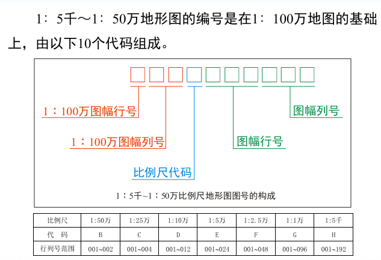

1.  以1:100万为基础 （2）编号由10个代码组成

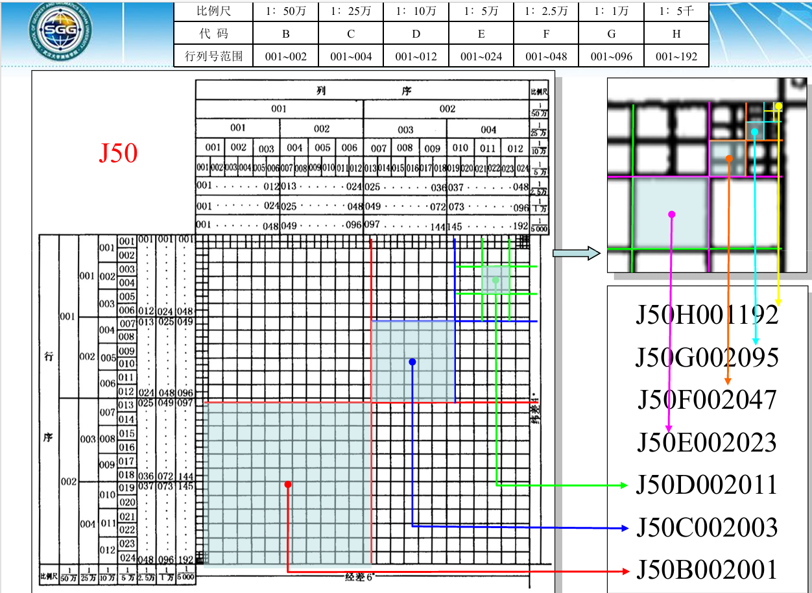

## 2.2 地图投影的基本理论

### 地图的空间基准

#### 大地坐标基准：

天文经纬度：表示地面点在大地水准面上的位置，用天文经度和纬度表示

大地经纬度：表示地面点在参考椭球面上的位置，用大地经度$\lambda$、大地纬度$\varphi$和大地高$H$

地心经纬度：以地球椭球体质量中心为基点，地心经度同大地经度$\lambda$，地心纬度ϕ是指参考椭球面上某点和椭球中心连线与赤道面之间的夹角y。

#### 高程基准

#### 深度基准

### 地图投影

#### 概念：将地球椭球面上的点通过投影方式转换成平面上的点。

实质：建立平面上的点和地球表面上的点）之间的函数关系，用数学式表达这种关系。

投影变形：将不可展的地球椭球面展开成平面，并且不能有断裂，则图形必将在某些地方被拉伸，某些地方被压缩，故投影变形是不可避免的

### 地图投影分类

| 变形性质 | 与地轴关系 | 与地表关系 |
| --- | --- | --- |
| 等角投影 | 正轴投影 | 切投影 |
| 等面积投影 | 斜轴投影 | 割投影 |
| 任意投影 | 横轴投影 |  |
| 等距离投影 |  |  |

### 条件投影

| **方位投影:**  |   | 纬线投影为同心圆，经线投影为同心圆的半径，且两条经线间的夹角与经差相等。                         |
|----------------|-------------------------------------------------------------------------------------------------------|--------------------------------------------------------------------------------------------------|
| **圆柱投影**   | 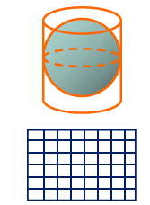  | 纬线投影成平行直线，经线投影为与纬线垂直的另一组平行直线，两条经线间的间隔与经差成比例。         |
| **圆锥投影**   |  | 纬线投影成同心圆弧，经线投影为同心圆弧的半径，两经线间的夹角小于经差且与经差成比例。             |
| **多圆锥投影** | 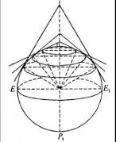 | 纬线投影为同轴圆弧，中央经线投影为过同轴圆弧圆心的直线，其它经线投影为对称于中央经线的曲线。     |
| **伪方位投影** | 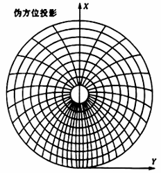   | 纬线投影为同心圆，中央经线投影为直线，其它经线投影为相交于同心圆圆心，并且对称于中央经线的曲线。 |
| **伪圆柱投影** | 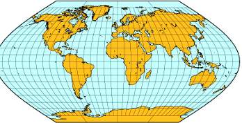  | 纬线投影为一组平行直线，中央经线投影为垂直于各纬线的直线，其它经线投影为对称于中央经线 的曲线。  |
| **伪圆锥投影** | 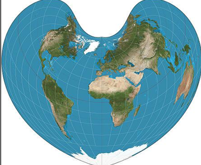 | 纬线投影为同心圆弧，中央经线投影为过同心圆弧圆心的直线，其它经线投影为对称于中央经线的曲线。     |

### 地图投影命名

（正轴、横轴、斜轴）+（等角、等面积、等距离….）+（相切、相割）+（方位、圆柱、圆锥）

例：高斯克吕格投影——横轴等角横切椭圆柱投影

### 圆锥投影分析

#### 应用：

地球上广大陆地位于中纬度地区，并且圆锥投影经纬线形状简单，最适于制作**中纬度沿东西方向延伸的地图**。

#### 按切割关系：

1.  圆锥投影的各种变形均**是纬度**$\mathbf{\varphi}$**的函数**，与经度$\lambda$，同一纬线上的变形相同；

2.  切圆锥投影，标准纬线长度比$n_{0}$=1，其余纬线长度比均大于1，并向南北方向增大；

3.  割圆锥投影，双标准纬线长度比$n_{1} = n_{2} = 1$，长度变形自内向外增大，n\<1，标准纬线之间，反之在双标准纬线之外。

#### 按投影性质：

1.  等角：经线长度比与纬线长度比相等（$m = n = 1$），角度没有变形，但面积变形较大（$P = m^{2}$）。

**应用**——多用于方向保持正确的图种，如我国的 百万分一地形图、中国全图、分省地图等。

2.  等面积：经线长度比与纬线长度比互为倒数 （$mn = 1$），面积没有变形，但角度变形较大。

**应用**——多用于面积比保持正确的图种，如分 布图、类型图、区划图等自然资源图与社会经济图

3.  等距离：变形介于等角投影与等 面积投影之间，经线长度比保持为1（$m = 1$），纬线长度比与面积比相 等（$n = P$）

**应用**——多用于各种变形要求适中的图种，如原苏联出版的《苏联全图》采用此投影。

#### 标准纬线的选择：

1.  如果制图区域纬差不大，可采用单标准纬线圆锥投影。单标准纬线的选择非常简单，只需要制图区域南北边纬线的 纬度$\mathbf{\varphi}_{\mathbf{S}}$**、**$\mathbf{\varphi}_{\mathbf{N}}$取中数，并凑整即可。

2.  如果制图区域纬差较大，应采用双标准纬线圆锥投影。 双标准纬线的选择可以使用下列近似公式求得。

$$
\varphi_{1} = \varphi_{S} + 0.16 \times \left( \varphi_{N} - \varphi_{S} \right)
$$

$$
\varphi_{2} = \varphi_{N} - 0.12 \times \left( \varphi_{N} - \varphi_{S} \right)
$$

该公式推导的标准纬线，基本符合 边纬与中纬长度变形绝对值相等的条件。

### 方位投影

#### 分类

| 切割关系   | 位置关系                                                                                              | 变形性质     | 透视关系                                                                                              |
|------------|-------------------------------------------------------------------------------------------------------|--------------|-------------------------------------------------------------------------------------------------------|
| 切方位投影 | 正轴方位投影                                                                                          | 等角方位投影 | 球心、内心、外心                                                                                      |
| 割方位投影 | 横轴方位投影                                                                                          | 等积方位投影 | 球面方位投影                                                                                          |
|            | 斜轴方位投影                                                                                          | 任意方位投影 | 正射方位投影                                                                                          |
|            | 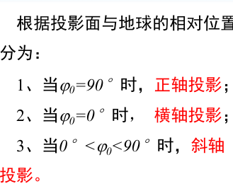 |              | 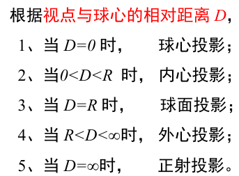 |

#### 一般公式：

以正轴方位投影为例：

纬线→同心圆，半径$\rho = f(\varphi)$；经线→同心圆直径，经线夹角→经差

$$
\begin{cases}
\rho = f(\varphi) \\
\delta = \lambda
\end{cases}
$$

利用球面极坐标→解答斜轴横轴投影计算：

| 投影平面与地球面的位置关系如图所 示，以Q为极点的等高圈和垂直圈分 别代替纬圈和经圈。这时过A点等高圈的天顶距Z相当于90°－**φ**，过A点垂直圈的方位角α相当于λ，有： $\begin{cases}\rho = f(Z) \\ \delta = \alpha\end{cases}$ |  |
| --- | --- |
| 以通过Q′点的经线的投影作X轴，过Q′点与经线投影相垂直的直线作为Y 轴，则平面直角坐标公式为 | $\begin{cases}x = \rho\cos\delta \\ y = \rho\sin\delta\end{cases}$ |

### 方位投影变形分析

#### 切割关系：

1.  方位投影的各种变形均是**天顶距Z**的函数，**与方位角α无关**。同一等高圈上的变形是相同的。

2.  在切方位投影中，**切点Q上没有变形**，其变形随着远离 Q点而增大。

3.  在割方位投影中，所割的等高圈上$\mu = 1$，其他变形自所割等高圈**向内、向外增大**。

#### 投影性质：

①等角方位投影：垂直圈长度比与等高圈长度比相等（$\mu_{1} = \mu_{2}$），角度没有变形，但面积变形较大（$P = \mu_{1}^{2}$）。

②等面积方位投影：等高圈长度比与垂直圈长度比互为倒数（$\mu_{1}\mu_{2}$=1），面积没有变形，但角度变形较大。

③等距离方位投影：变形介于等角投影与等面积投影之间，垂直圈长度比保持为1（$\mu_{1} = 1$），等高圈长度比与面积比相等（$\mu_{2} = P$）。

#### 应用：

1.  制图区域形状，适宜于具有圆形轮廓的地区。

2.  制图区域地理位置：

两极地区：正轴投影；两极→正轴

赤道地区：横轴投影；赤道→横轴

其它地区：斜轴投影。其他地区→斜轴

### 圆柱投影

#### 一般公式：

以正轴圆柱投影为例：

纬线→平行直线，间距$x = f(\varphi)$；经线→平行直线且正交于纬线，间距$y = \alpha \cdot \lambda$

### 圆柱投影变形分析

#### 切割关系：

1.  圆柱投影的各种变形均是纬度$\varphi$的函数，与经度$\lambda$无关。同一纬线上的变形是相同的。

2.  在切圆柱投影中，标准纬线上的长度比$n_{0}$=1，其余纬线上长度比均大于1，并向南、北方向增大。

3.  在割圆柱投影中，在双标准纬线处的长度比$n_{1}$=$n_{2}$=1，变形自标准纬线向内、向外增大，在双标准纬线之间，$n>1$。

#### 投影性质

1.  等角圆柱投影：由于经线长度比与纬线长度比相等（$m = n$），角度没有变形，但面积变形较大（$P = m^{2}$）。

2.  等面积圆柱投影：由于经线长度比与纬线长度比互为倒 数（$mn = 1$），面积没有变形，但角度变形较大。

3.  等距离圆柱投影：变形介于等角投影与等面积投影之间 ，经线长度比保持为1（$m = 1$），纬线长度比与面积比相等（$n = P$）。

#### 应用：

圆柱投影应用广泛，适宜于低纬度沿纬线方向伸展的地区，并且可以表示经度大于3600的范围。特别是在编制 《航海图》、《航空图》、《世界时区图》和《世界地图集》中多有应用。

### 圆锥、方位、圆柱投影之间的关系

$$
\alpha = \frac{\delta}{\lambda}
$$

$\alpha$为圆锥系数，由于圆锥展开后成为扇形，顶角$\delta$不足360°，而地球极点处的$\lambda = 360{^\circ}$，所以$0 < \alpha < 1$。

当$\alpha = 1$时，圆锥顶角$\delta$达到360°，伸展成平面，则成为方位投影。

当$\alpha = 0$时，圆锥顶角伸向无穷远，则成为圆柱投影。

因此可以说，方位投影和圆柱投影是圆锥投影的特例。

### 高斯-克吕格投影

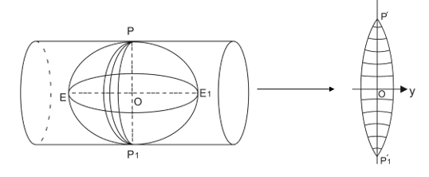

横轴等角切椭圆柱投影：

#### 三个基本条件：

1.  中央经线和赤道投影后正交直线，且为对称轴；

2.  中央经线投影后长度不变；

3.  投影具有等角性质。

#### 分带方法：

1.  我国基本比例尺地形图 1∶ 2.5万、1∶ 5万、1∶ 10万、 1∶ 25万、1∶ 50万均采用6°分带的高斯-克吕格投影。

2.  1∶5千、**1∶1万**地形图则采用3°分带的高斯-克吕格投影。

### 高斯投影变形分析：

#### 经纬距变化规律：

中央经线上纬距相等；赤道上经距从中央经线向东西扩大。

#### 变形分布规律：

1.  中央经线无长度变形，即长度比等于1，其它任何点上长度比均大于1。

2.  同纬线上，距中经愈远变形愈大，最大值位于投影带的边缘。

3.  同经线上，距赤道愈近变形愈大，最大值位于赤道上。

### 墨卡托投影（UTM投影）

UTM 是横轴等角割椭圆柱投影，其中央经线长度比为 0.9996；高斯—克吕格投影的中央经线长度比为 1。

#### UTM投影与高斯-克吕格投影的区别

（1）中央经线长度比不同，UTM投影是0.9996，而高斯-克吕格投影是1。

（2）带的划分相同，而带号的起算不同。

（3）对于中、低纬度地区，UTM投影的变形优于高斯-克吕格投影。

（4）西方国家多采用UTM投影作为国家基本地形图投影，东方国家多采用高斯 克吕格投影作为国家基本地形图投影。

### 正等角圆锥投影

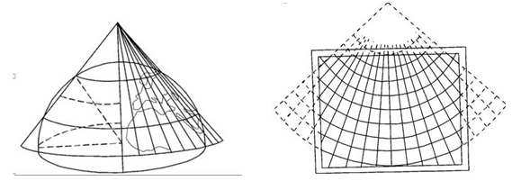

#### 经纬网特征：

经线为放射直线；纬线为同心圆

等距：纬距相等。

等积：纬距从图幅中央向南北逐渐缩小。

等角：纬距从图幅中央向南北逐渐扩大。

#### 变形分析：

1.  角度没有变形，即投影前后对应的微分面积保持图形相似，故亦可称为正形投影；

2.  等变形线和纬线一致，同一条纬线上的变形处处相等；

3.  （割圆锥投影）两条标准纬线上没有任何变形；

4.  在同一经线上，两标准纬线外侧为正变形（长度比大于1），而两标准纬线之间为负变形(长度比小于1)，因此，变形比较均匀，绝对值也较小；

5.  同一条纬线上等经差的线段长度相等，两条纬线间的经线线段长度处处相等。

6.  我国1:100万地图采用的等角圆锥投影是对每幅图单独进行投影，因此同纬度的相邻图幅在同一个投影带内，所以，东西相邻图幅拼接无裂隙。上下相邻图幅拼接时会有裂隙，裂隙大小随纬度的增加而减小。

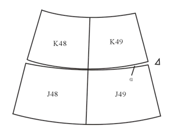

### 坐标网

#### 经纬线网（地理坐标网）：

#### 方里网（直角坐标网）：

### 地图投影的选择

#### 制图区域：

1.  地理位置——决定投影的种类

极地附近：方位投影；

中纬度地区：圆锥投影；

赤道附近：圆柱投影。

2.  范围大小——影响的投影选择

对于范围较小的地图，无论采取什么投影方式都无太大变形差异。

对于面积很大的地图，则需要慎重地选择投影。

3.  区域形状——制约的投影选择

圆形区域：方位投影

东西延伸的区域：

在赤道附近：圆柱投影

在中纬度地区：圆锥投影

南北延伸的区域：横圆柱投影

#### 地图用途：

1.  要求方向正确：选择等角投影。

2.  要求面积对比正确：选择等积投影。

3.  要求距离正确：选择距离投影。

### 我国常用的地图投影

#### 中国分省（区）地图常用投影

1、正轴等角割圆锥投影

2、正轴等面积割圆锥投影

3、宽带高斯-克吕格投影（经差达9°）

4、我国的南海海域单独成图 时，采用正轴圆柱投影。

#### 中国地图：

正轴（等面积/等角）割圆锥投影

#### 各大洲地图常用投影

| 地图范围           | 常用投影           | 常用投影类型     |
|--------------------|--------------------|------------------|
| 亚洲地图           | 斜轴等面积方位投影 | 彭纳投影         |
| 欧洲地图           |                    | 正轴等角圆锥投影 |
| 北美洲地图         |                    | 彭纳投影         |
| 南美洲地图         |                    | 桑逊投影         |
| 大洋洲（澳洲）地图 |                    | 正轴等角圆锥投影 |
| 非洲地图           | 横轴等面积方位投影 | 横轴等角圆柱投影 |

#### 半球地图：

| 地图范围     | 常用投影类型 1   | 常用投影类型 2     | 常用投影类型 3     |
|--------------|------------------|--------------------|--------------------|
| 东、西半球图 | 横轴等角方位投影 | 横轴等面积方位投影 | 横轴等距离方位投影 |
| 南、北半球图 | 正轴等角方位投影 | 正轴等面积方位投影 | 正轴等距离方位投影 |

#### 南北极地图

正轴等角方位投影

## 2.3 地图符号与注记

### 全章知识框架

| 部分     | 核心内容                                                   | 要解决的问题                     |
|----------|------------------------------------------------------------|----------------------------------|
| 地图符号 | 符号的实质、分类、视觉变量、符号对对象特征的描述、符号设计 | 地图怎样用图形表达地理事物       |
| 地图注记 | 地名与地图、地图注记、地名译写、地名书写标准化             | 地图怎样用文字准确补充和强化表达 |

符号是什么→符号如何变化→符号怎么描述对象→符号如何设计；

文字系统→地名、注记、译写与标准化如何支撑地图表达。

### 地图符号

#### 地图符号的本质

视觉形象→抽象概念的表象性符号，经历了从形象画到抽象符号的过程

#### 主要分类：

| 分类依据       | 类型                                                       | 核心特征                         | 例子                           |
|----------------|------------------------------------------------------------|----------------------------------|--------------------------------|
| 按几何特征     | 点状符号                                                   | 以点定位，大小一般与比例尺无关   | 居民点、控制点、矿产地         |
|                | 线状符号                                                   | 长度与比例有关，宽度多为示意     | 河流、道路、岸线               |
|                | 面状符号                                                   | 面积范围与对象实际范围一致或相似 | 森林、水域、土地利用区         |
| 按与比例尺关系 | 依比例符号                                                 | 符号大小与实地范围成比例         | 多为面状符号                   |
|                | 半依比例符号                                               | 长度依比例，宽度不完全依比例     | 多为线状符号                   |
|                | 不依比例符号                                               | 不按实地大小绘制                 | 多为点状符号                   |
| 按地理尺度     | 定性符号                                                   | 表示性质差异                     | 类型分类                       |
|                | 等级符号                                                   | 表示顺序和等级                   | 大中小、主次                   |
|                | 定量符号                                                   | 表示数量差异                     | 流量、密度、规模               |
| 按形状特征     | 几何符号、线状符号、面状符号、艺术符号、图表符号、文字符号 | 从图形外观和表达方式上分类       | 几何图形、象形符号、统计图表等 |

#### 几种特殊符号

- **艺术符号**：与对象形象相似或具有寓意，分为**象形符号**和**透视符号**。

- **图表符号**：用统计图表表达数量特征，可比较差异、表现结构、趋势、依存关系和空间差异。

- **文字符号**：包括**文字图形符号、文字注记符号、本义文字符号**

### 地图符号的视觉变量

视觉变量就是能引起视觉差别的图形和色彩变化因素。教材总结的基本视觉变量有：**形状、尺寸、方向、明度、密度、结构、颜色、位置**；此外，还扩展到动态图示中的**变化时长、变化速率、变化次序、变化周期**。

### 制图对象特征

| 特征         | 含义                         |
|--------------|------------------------------|
| 定位特征     | 对象的位置和空间范围         |
| 质量特征     | 对象的类型、性质差异         |
| 空间结构特征 | 轮廓和内部结构差异           |
| 数量特征     | 数量大小及其关系             |
| 关系特征     | 对象在系统中的地位及相互关系 |
| 时间特征     | 对象随时间变化的状态         |

| 描述对象 | 主要符号类型        | 最主要变量                 | 次要/辅助变量    |
|----------|---------------------|----------------------------|------------------|
| 质量特征 | 定性符号            | 形状、颜色、结构、方向     | 明度、密度       |
| 数量特征 | 定量符号 / 等级符号 | 尺寸                       | 明度、结构、密度 |
| 关系特征 | 系统符号组合        | 分类、分级、层次、空间组合 | 多变量联合       |

### 地图注记

#### 地名与地图

基本特征、功能、工作内容

#### 地图注记

功能：

| 功能     | 说明                               |
|----------|------------------------------------|
| 标识对象 | 给符号所代表的对象命名             |
| 指示属性 | 文字说明质量属性，数字说明数量属性 |
| 表明关系 | 用文字明确对象间联系               |
| 转译     | 把地图符号的意义转换为自然语言     |

设计要点：

字体分类型，字号分主次，字色分层次，字隔示分布，位置要明确

#### 地名译写

**专名重音译，通名重意译。**
**地名译写为什么“专名重音译、通名重意译”？**

地名一般由**专名 + 通名 + 附加形容词**构成。

- **专名**是某地专有的部分；

- **通名**是某类地理实体共有的部分；

- **附加形容词**是说明数量、质量、性质、颜色、方向等含义的成分。

译写原则是：

- **专名以音译为主，意译为辅**；

- **通名以意译为主，音译为辅**。

原因在于：

- **专名强调专属性**，要尽量保留原地名的读音特征，所以更适合音译；

- **通名强调类别意义**，本身和地图上的地理实体类型相对应，意义明确，所以更适合意译。这个逻辑能帮助你理解，而不是死背。依据教材，通名“有明确的含义”，因此通常以意译为主。

#### 地名书写标准化：

地名不仅要写出来，还要写得统一、规范、可检索、可管理

## 2.4 地图色彩设计

### 色彩的特征与色彩心理

#### 色彩的基本属性：

| 属性   | 含义                       | 在地图中的主要作用                           |
|--------|----------------------------|----------------------------------------------|
| 色相   | 颜色的基本相貌，如红黄蓝绿 | 主要表示事物的**质量特征**、类别差异         |
| 明度   | 颜色的明暗程度             | 主要表示**等级、层次、强弱**                 |
| 饱和度 | 颜色的纯净程度             | 主要表示**鲜明程度、重要程度、视觉刺激强度** |

#### 色彩的感觉

影响情感最强的是色相，其次是饱和度，最后是明度。

### 色彩的混合

#### 加色法RGB

RGB 是**色光三原色模式**，由红、绿、蓝三种光构成，主要用于显示器显示。三色光两两相加得到黄、青、品红，三者全部相加为白色，所以叫**加色法**。

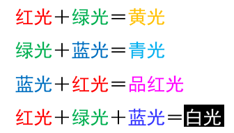
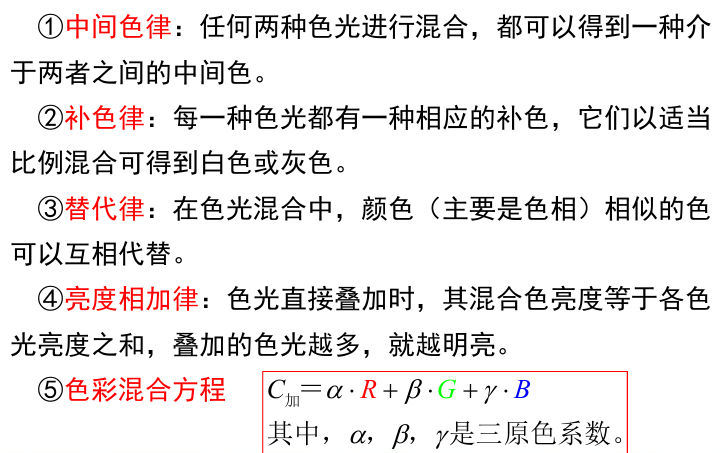

#### 减色法：CMYK

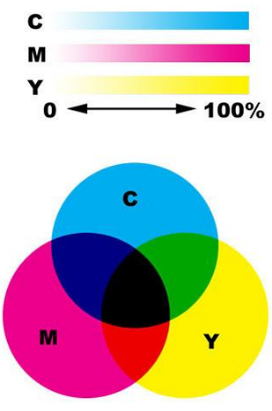

CMYK 是**色料三原色模式**，由青、品红、黄、黑四种油墨构成，主要用于印刷。油墨叠加越多越暗，所以叫**减色法**。需注意，CMY 在印刷中不能形成纯正黑色，因此要加入 K（黑色）。

- 品红 + 黄 = 红

- 黄 + 青 = 绿

- 青 + 品红 = 蓝

- 黄 + 品红 + 青 = 黑（理论上）

#### Lab 模式与色域关系

- **Lab** 是记录光线色彩的理论模式；

- 其中 **L 表示亮度**，**a 表示绿—红范围**，**b 表示蓝—黄范围**；

- 在 RGB、CMYK、Lab 三种模式中，**Lab 色域最大**，包含人眼看到的全部可见光。

| 模式 | 特征                           |
|------|--------------------------------|
| Lab  | 色域最大，接近人眼可见全部色彩 |
| RGB  | 色域大于 CMYK，适合屏幕显示    |
| CMYK | 色域小于 RGB，适合印刷输出     |

### 色彩的应用

地图色彩设计中，首先要确定图面的**主色调**，然后处理局部色彩之间的**对比与调和关系**。对比处理得好，图面就会主题突出、层次清楚、色彩响亮；处理不好，就会暗淡杂乱、主题模糊。

#### 色彩的作用

| 作用                 | 含义                             |
|----------------------|----------------------------------|
| 简化符号系统         | 颜色本身可承担部分分类和分级功能 |
| 丰富地图内容         | 让更多信息能直观表达             |
| 提高内容表现的科学性 | 更准确区分质量、数量、等级和关系 |
| 改善视觉效果         | 图面更清楚、更易读               |
| 提高审美价值         | 地图更有美感与感染力             |

#### 色彩的特点

| 特点               | 解释                                       |
|--------------------|--------------------------------------------|
| 多以均匀色层为主   | 地图上常采用大面积、稳定、规则的色层       |
| 色彩使用具有系统性 | 各颜色不是孤立存在，而是成套、有逻辑地配合 |
| 具有制约性         | 受地图性质、用途、传统习惯、对象属性限制   |
| 色彩意义明确       | 每种颜色通常对应特定对象或意义             |

#### 色彩设计的要求

与地图性质、用途一致；与地图内容相适应；充分利用色彩感觉和象征性；和谐美观

### 色彩选择要点

#### 主调：

总体色调

#### 强调

强调就是在小面积上使用更强烈醒目的颜色来突出重点

#### 分隔

当两种颜色过于相近或对比过强时，可在中间加入另一种颜色进行分隔

#### 平衡

平衡是指两种以上色彩组合后，在视觉上达到稳定安定的感觉。影响平衡的主要因素是：

- 色彩的明暗轻重；

- 面积大小；

- 空间位置。  
  在面积和位置难改时，可以通过调整色相、明度、纯度来达到视觉平衡。

#### 单纯化、呼应

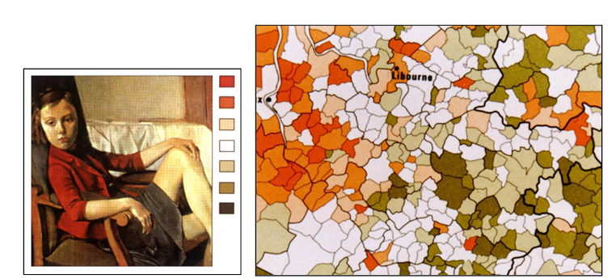

#### 色彩采集和重构

**重构方式**

- 整体色按比例重构；

- 整体色不按比例重构；

- 部分色重构。

## 第3章 时空数据获取与预处理

### 总框架

| 模块                        | 核心问题                         | 关键词                                           |
|-----------------------------|----------------------------------|--------------------------------------------------|
| §3.1 时空数据与制图数据基础 | 时空数据是什么，如何变成制图数据 | 时空数据、地理变量、制图数据、量表               |
| §3.2 时空数据来源与获取方式 | 数据从哪里来，怎样获得           | 地图资料、影像资料、统计资料、主动获取、被动获取 |
| §3.3 时空数据类型与数据结构 | 数据如何分类与存储               | 点线面、时间戳、时间序列、矢量、栅格、轨迹       |
| §3.4 时空数据加工与预处理   | 原始数据如何变得可用             | 平均值、比率、密度、位能、清洗、融合、降维       |

## 3.1 时空数据与制图数据基础

### 时空数据

有（空间位置信息）和（时间标签）的数据

### 地理变量与制图数据

| 概念     | 定义                                                                                             | 关系     |
|----------|--------------------------------------------------------------------------------------------------|----------|
| 地理变量 | 对地理事物空间位置和地理属性的定量或定性描述 | 原始表达 |
| 制图数据 | 将地理变量经过分类、分级、符号化后，用于制图的数据                                               | 制图表达 |

### 地理数据的基本类型

#### 按性质分：

| 类型     | 含义                                     |
|----------|------------------------------------------|
| 空间数据 | 描述地理事物的空间形状和空间位置         |
| 属性数据 | 定性或定量描述地理事物质量特征和数量特征 |

#### 作为制图数据分

| 类型 | 定义                       | 特征 | 例子                               |
|------|----------------------------|------|------------------------------------|
| 点位 | 用点描述单独位置存在的事物 | 零维 | 三角点、居民地                     |
| 线性 | 用坐标串描述线状事物       | 一维 | 道路、河流、境界                   |
| 面积 | 用封闭线描述区域范围       | 二维 | 湖泊、森林、库区                   |
| 体积 | 在面积基础上加第三维值     | 三维 | 土石方、降水量、城市人口、生产总值 |

### 地理数据的量表系统

衡量数据的精确度

| 量表 | 定义                     | 反映内容       | 能否排序/运算                                          | 例子                 |
|------|--------------------------|----------------|--------------------------------------------------------|----------------------|
| 定名 | 只作定性描述             | 质量特征       | 只能分类，不能排序           | 名称、类别、土壤类型 |
| 顺序 | 按某种标志排序           | 相对等级       | 可排序，不能准确度量差值                               | 大中小、轻中重       |
| 间隔 | 在顺序基础上增加距离信息 | 较精确数量特征 | 可比较差值，但不能得具体数量 | 分级温度、分级统计值 |
| 比率 | 完整定量方法             | 精确数量特征   | 可做加减乘除，能得绝对量                               | 人口、降水量         |

衡量的精确度依次升高

## 3.2 时空数据来源与获取方式

### 时空数据来源

地图、影像、统计、文字

### 时空数据获取方式

主动获取和被动

#### 主动获取

规则、精确、可靠

| 方式               | 原理                                     | 特点                             | 例子                                         | 应用                         |
|--------------------|------------------------------------------|----------------------------------|----------------------------------------------|------------------------------|
| 传感器监测         | 在固定或移动平台布设传感器自动采集       | 高频、自动化、标准化程度高       | 气象站、交通流量检测器、地震仪、无人机航摄仪 | 环境监测、灾害预警、智慧城市 |
| GPS/GNSS采集       | 通过卫星导航系统实时获取位置、高程和时间 | 定位精度高，可形成连续轨迹       | 控制点测量、手机运动轨迹、共享单车终端       | 导航、测绘、轨迹分析         |
| 问卷调查与实地测绘 | 人工或半自动获取空间位置与属性           | 属性丰富、准确，但成本高、更新慢 | 出行调查、POI采集、地籍测绘                  | 基础调查、专题采集           |

#### 被动获取

海量、零散、异构，但经过清洗和挖掘后价值很高

| 方式                   | 原理                          | 特点                                       | 例子                               | 应用                         |
|------------------------|-------------------------------|--------------------------------------------|------------------------------------|------------------------------|
| 开源地图数据           | 众包协作形成免费地理数据库    | 覆盖广、更新快，但质量不均                 | OSM、GeoNames                      | 底图、路径分析、官方数据补充 |
| 社交媒体签到与位置数据 | 用户发布内容或APP后台记录位置 | 数据量大、实时性强，但精度有限且有隐私问题 | 微博签到、基站信令                 | 人群流动分析、行为研究       |
| 政府公开时空统计数据   | 政府履职中形成并公开的数据    | 权威、覆盖广，但粒度较粗、更新较慢         | 人口普查、经济普查、路网与行政区划 | 宏观统计分析、区域研究       |

## 3.3 时空数据类型与数据结构

### 1. 空间要素类型：点、线、面

#### 点数据

**定义**：表示离散位置的几何对象，具有确定坐标。  
分类：

- 空间静态、时间静态：车站、宾馆、地标

- 空间静态、时间动态：气象站、空气质量监测点

- 时空动态：车辆、行人、动物

#### 线数据

**定义**：由连续坐标点组成的一维几何对象，表示路径、连接或边界。  
分类：

- 静态网络：路网、铁路网、河流水系、管线

- 动态轨迹：车辆路径、飞行航线、船舶航迹

- 虚拟连接：OD流、通信链路

#### 面数据

**定义**：由封闭边界构成的二维几何对象，表示区域范围。  
分类：

- 行政区划面：国家、省、市、县

- 自然区域面：湖泊、森林、农田

- 功能区域面：商圈、居住区、工业园区

- 动态面：洪水淹没区、污染扩散区、火灾过火区

### 时间维度特征

#### 时间表达方式

| 表达方式 | 定义               | 例子                |
|----------|--------------------|---------------------|
| 时间戳   | 单个时间点         | 2023-10-01 08:30:00 |
| 时间段   | 有起点和终点的区间 | 08:00—09:00         |
| 时间周期 | 规律重复的时间模式 | 每天、每周一、每月  |

#### 时间粒度

数据采集或聚合的时间单位

常见粒度：秒级、分钟级、小时级、日级、年级。

**粒度影响**

- 细粒度：保留更多细节，但数据量大

- 粗粒度：信息损失较多，但便于分析

### 时间序列与时间规律

**时间序列定义**

**同一空间位置上按时间顺序排列的观测值集合**

#### 时间的三大属性

| 属性   | 含义                   | 例子                     |
|--------|------------------------|--------------------------|
| 邻近性 | 相邻时间点的值通常相似 | 9:00与9:05温度接近       |
| 周期性 | 存在规律重复模式       | 每天8点左右出现早高峰    |
| 趋势性 | 长期变化方向           | 季节变化引起温度长期升降 |

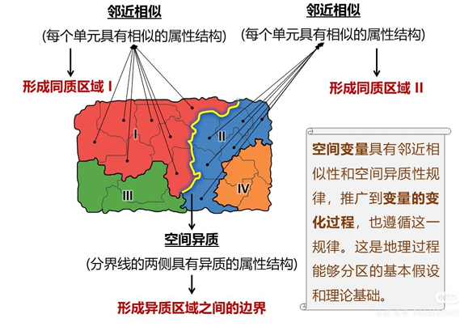

#### 时空分布特性

- **自相关**：邻近时间与空间的数据会相互影响

- **异质性**：不同时间段、不同区域的数据分布特征不同

### 时空数据结构

#### 图形数据

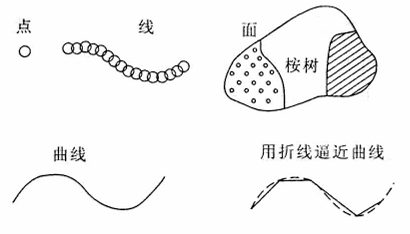

**定义**：表示地理物体位置、形状、大小和分布特征的信息，又称空间数据。
作用：

- 空间定位

- 空间量度

- 空间结构

- 空间聚合

#### 属性数据

**定义**：描述地理物体本质特性的数据，包括专题属性和质量描述。  
**表现形式**：通常以**特征码**表示，即按类别、级别等定义的数字编码。

**关系**

**完整的地理信息 = 图形数据 + 属性数据**。

### 图形数据的基本形式

| 形式 | 定义                       | 点线面表达方式                            | 优点               | 典型对象                |
|------|----------------------------|-------------------------------------------|--------------------|-------------------------|
| 矢量 | 由离散点坐标的有序集合组成 | 点=一对坐标；线=坐标串；面=首尾闭合坐标串 | 表达精确、边界清楚 | 路网、行政区、POI       |
| 栅格 | 由像元值组成的矩阵数据     | 点=单像元；线=像元集合；面=覆盖像元集合   | 表达连续场方便     | 遥感影像、DEM、温度分布 |

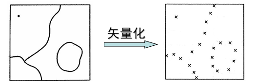
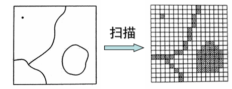

**栅矢转换**

- 矢量转栅格：点栅格化、线栅格化、面栅格化

- 栅格转矢量：栅格点矢量化、线栅格矢量化、面状栅格矢量化

**结论**

- **离散对象、边界明确**：更适合矢量

- **连续现象、面状覆盖**：更适合栅格

### 轨迹数据

#### 定义

**轨迹数据**：记录移动对象连续位置的时空序列，由一系列带时间戳的坐标点构成。  
数学形式：  

$$
Traj\  = \ \{(x1,\ y1,\ t1),\ (x2,\ y2,\ t2),\ \ldots\}
$$

**核心特征**

- **时空关联性**：位置变化必然伴随时间流逝

- **连续性与离散化**：真实运动连续，但观测是离散采样

- **方向性与速度**：点序隐含方向和速度信息

#### 分类

按时间：周期性、随机性

空间形态：点状、线状、面状

## 3.4 时空数据加工与预处理

### 1. 数据加工与分级

加工的两个目的

1.  把来源不同的数据换算成可比数据

2.  把实测数据加工成派生制图数据

实测数据与派生数据

| 类型     | 含义                   | 例子               |
|----------|------------------------|--------------------|
| 实测数据 | 直接测得并直接上图     | 高程、河流长度     |
| 派生数据 | 对实测数据加工后再上图 | 平均气温、人口密度 |

**结论**

制图常用的不只是原始观测值，更重要的是经过加工形成的 **平均值、比率、密度、位能** 等派生数据。

### 常见加工方法

| 方法       | 原理/公式                                        | 含义                                 | 例子                             |
|------------|--------------------------------------------------|--------------------------------------|----------------------------------|
| 算术平均值 | $X\bar{}\  = \ \Sigma xi\ /\ n$                | 求总体平均水平                       | 粮食亩产、人均收入、多年平均气温 |
| 加权平均值 | $X\bar{} = \Sigma(ai \cdot xi)/\Sigma ai$      | 不同对象按权重求平均                 | 各乡平均亩产推全县平均亩产       |
| 比率       | $x\  = \ n_{a\ }/\ n_{b}$                      | 两类事物数值之比                     | 出栏头数/存栏头数                |
| 比例       | $x\  = n_{a\ }\ /\ N$                          | 某类占总体之比                       | 降水天数/全年天数                |
| 百分比     | $\text{比例}\times 100\%$                            | 用百分率表示比例                     | 各类构成比                       |
| 密度       | $D\  = \ N\ /\ A$                              | 单位面积平均值                       | 人口密度、河网密度               |
| 位能       | $p_{i}\  = x_{i}\  + \ \Sigma(x_{j}/\ D_{ij})$ | 邻近点影响与数量成正比、与距离成反比 | 经济要素、人文要素制图           |

### 3. 制图数据分级

**目的**

分级后要使读者能清楚辨认不同等级在大小、颜色上的差异。

**分级界限标定**

需注意分级区间必须写清楚边界规则，如：

- 左闭右开

- 左开右闭

- 用整数区间连续表示，避免交叉和空档

**应试提醒**

题目若问“分级原则”，要答出两点：

1.  **等级数适中，便于辨认**

2.  **组界明确，区间连续、不重叠**

### 为什么需要预处理

**始时空数据的通病**

| 问题   | 表现                   | 成因                           |
|--------|------------------------|--------------------------------|
| 不完整 | 缺失、断点             | 传感器故障、传输中断、存储异常 |
| 不准确 | 异常值、噪声           | 设备漂移、环境干扰、人为误差   |
| 不一致 | 格式不同、时空基准不同 | 多源异构采集                   |
| 冗余   | 维度高、信息重复       | 高频采样、多特征记录           |

**预处理目标**

- 提高数据质量

- 统一数据基准

- 降低计算复杂度

- 为分析和可视化提供可靠输入

### 时空数据清洗

#### 5.1 缺失值处理

**缺失值类型**

| 类型       | 含义                   | 例子                   |
|------------|------------------------|------------------------|
| 随机缺失   | 缺失位置随机           | 单个时点传感器读数丢失 |
| 连续缺失   | 连续时间段缺失         | 传感器维护1周无数据    |
| 结构性缺失 | 采集方式导致规律性缺失 | 卫星重访周期观测空白   |

**处理方法**

| 方法                      | 适用场景             |
|---------------------------|----------------------|
| 线性插值、样条插值        | 短时间缺失、变化平缓 |
| 均值/中位数填充、回归插补 | 随机缺失、有辅助变量 |
| ARIMA、季节分解插补       | 有明显周期性的数据   |
| 张量分解方法              | 高维时空数据         |

#### 5.2 异常值处理

**异常值类型**

| 类型     | 特征                 | 例子                 |
|----------|----------------------|----------------------|
| 全局异常 | 明显偏离整体分布     | 温度记录100℃         |
| 局部异常 | 在局部时间窗口内异常 | 凌晨交通流量突峰     |
| 模式异常 | 破坏周期或趋势规律   | 工作日出现周末型流量 |

**检测方法**

| 方法                          | 特点                       |
|-------------------------------|----------------------------|
| 统计方法：3σ、箱线图、Z-score | 简单快速                   |
| 时间序列特征方法              | 考虑时序性，可识别局部异常 |
| 模型方法：聚类、混合模型      | 可输出异常概率             |

**处理策略**

| 策略 | 操作             | 适用场景             |
|------|------------------|----------------------|
| 删除 | 直接剔除         | 异常点少且不影响整体 |
| 修正 | 用插补值替代     | 明确属于记录错误     |
| 标记 | 保留但标识为异常 | 异常本身有分析价值   |
| 变换 | 平滑、滤波       | 噪声较多需整体降噪   |

**应试结论**

异常值**不能一律删除**。必须先判断是“错误”还是“信号”。例如交通突峰可能代表事故。

### 时空数据融合

#### 定义

将来自不同传感器、平台、时空分辨率的多源数据，统一到同一时空框架下，生成更高质量、更高密度的数据集。

**核心挑战**

- 空间基准不一致

- 时间不同步

- 尺度不匹配

**关键步骤**

| 步骤     | 任务                     | 方法                   |
|----------|--------------------------|------------------------|
| 空间对齐 | 统一坐标系、配准         | 空间网格编码、坐标转换 |
| 时间同步 | 统一时间基准             | 插值对齐、时间窗口聚合 |
| 属性关联 | 建立多源特征之间对应关系 | 特征匹配、统计建模     |

**融合层次**

| 层次       | 含义               | 例子             |
|------------|--------------------|------------------|
| 像素级融合 | 直接融合原始观测值 | 遥感影像波段融合 |
| 特征级融合 | 先提特征再融合     | 多源特征拼接     |
| 决策级融合 | 各自分析后融合结论 | 投票、加权平均   |

**例子**

深度学习的 **MCST-DF** 框架：把被动采集的“大数据”和精确但稀疏的“小数据”融合，用于交通流量估计。

### 时空数据降维

**为什么降维**

- 维度灾难：计算复杂、易过拟合

- 信息冗余：特征相关，可压缩

- 可视化需要：人只能直观理解低维空间

**两条路径**

| 路径     | 目标                     | 典型方法                     |
|----------|--------------------------|------------------------------|
| 特征选择 | 从原始特征中选最优子集   | 过滤式、包裹式、嵌入式       |
| 特征提取 | 将原始特征映射到低维空间 | PCA、ICA、自编码器、张量分解 |

**经典方法：PCA**

- **原理**：找方差最大的投影方向

- **优点**：简单、快速、可解释

- **局限**：适合线性数据，不擅长非线性和强时序依赖

**方法比较**

| **方法**    | **优点**       | **缺点**           | **适用**           |
|-------------|----------------|--------------------|--------------------|
| $PCA$     | 快、可解释     | 只能处理线性关系   | 初步探索、数据压缩 |
| $t - SNE$ | 可视化效果好   | 计算慢、结果不稳定 | 高维可视化         |
| 自编码器    | 能学复杂非线性 | 需要大量数据、黑箱 | 图像、序列数据     |
| 张量分解    | 保持多维结构   | 实现复杂           | 时空-属性三维数据  |

**效果评估**

- 重构误差

- 下游任务性能

- 计算效率

## 3.5 制图综合

### 整章主线

为什么要综合 → 怎么综合 → 受什么影响 → 综合时遵循什么规律。

### 基本概念

#### 1. 定义

**制图综合**：根据地图的**用途、比例尺和制图区域特点**，以**概括、抽象**的形式反映制图对象带有规律性的**类型特征和典型特点**，舍去次要、非本质内容的过程。

**关键词**

- 用途

- 比例尺

- 区域特点

- 概括、抽象

- 类型特征、典型特点

- 舍去次要内容

**一句话理解**

制图综合不是简单删东西，而是**有目的地保留本质、突出规律**。

#### 2. 制图综合的方法

制图综合通过两种基本手段实现：

| 方法 | 含义                                   | 作用                         |
|------|----------------------------------------|------------------------------|
| 选取 | 选择对制图目的有用的信息，舍去无用信息 | 决定“留什么、去什么”         |
| 概括 | 对图形、数量、质量特征进行化简         | 决定“怎样简化保留下来的内容” |

**二者关系**

- **顺序**：先选取，后概括

- **区别**：

  - 选取是整体地去掉某类或某级信息

  - 概括是对保留对象的形状、数量、质量再简化

**3. 制图综合的种类**

| 种类     | 含义                                                           |
|----------|----------------------------------------------------------------|
| 比例综合 | 由于地图比例尺缩小而引起的综合                                 |
| 目的综合 | 由编图者根据对象重要性主动确定的综合 |
| 感受综合 | 由于读者视觉、记忆等因素产生的综合   |

**理解**

- **比例综合**：客观上“图变小了，不得不综合”

- **目的综合**：主观上“为了表达重点而综合”

- **感受综合**：从读图效果出发的综合

#### 4. 制图综合的目的

制图综合的目的主要有三点：

1.  **突出制图对象的类型特征**

2.  **抽象出基本规律**

3.  **清晰传递信息**

4.  还能**延长地图时效性**，避免地图很快失去作用。

**考试常用表述**

制图综合的根本目的是：  
**在图面有限的条件下，突出本质，揭示规律，提高清晰性和可读性。**

#### 5. 制图综合的实质

制图综合的实质是：

**运用科学的选取和概括手段，在地图上清晰、深刻地反映地理事物的类型特征和典型特点。**

**由此引出的结论**

- 制图综合是**科学的、创造性的过程**

- 制图综合是**复杂的智能化过程**

- 制图综合本质上是在解决**图面缩小后产生的各种矛盾**

### 制图综合的方法

#### 1. 选取

选取分为两类：

**（1）类别选取**

指**整个一类信息全部选取**，受地图用途制约，是地图内容设计的一部分。

**（2）级别选取**

指在同类物体中选取**主要的、等级高的**对象，舍去**次要的、等级低的**对象。

**选取标准的两种方法**

| 方法   | 定义                                                                               | 优点                                   | 缺点                                       |
|--------|------------------------------------------------------------------------------------|----------------------------------------|--------------------------------------------|
| 资格法 | 以一定数量标志或质量标志作为选取标准                     | 标准明确，简单易行                     | 单一指标难全面反映重要性；无法预估地图容量 |
| 定额法 | 规定单位面积内应选取对象的数量 | 可预估地图容量；兼顾地图丰富性与易读性 | 难保证不同地区保持相同质量资格             |

**补充**

- **资格法**看“够不够资格保留”

- **定额法**看“单位面积允许保留多少”  
  此外，定额法可用**临界指标**来调节不同区域的过渡。

#### 2. 概括

概括包括三类：

| 概括类型 | 含义                                             | 结果                         |
|----------|--------------------------------------------------|------------------------------|
| 图形特征 | 简化形状，删去不重要碎部，保留并适当夸大重要特征 | 轮廓更清晰、更本质           |
| 数量特征 | 数量标志变得更概略                               | 长度、面积、密度等数值会变化 |
| 质量特征 | 减少类别和级别                                   | 质量差别减少，由详细到概略   |

**（1）图形特征概括的方法**

| 方法 | 含义 |
| --- | --- |
| 删除 | 删除比例尺缩小后无法清晰表示的碎部 |
| 合并 | 当物体细部及间隔太小无法区分时，合并同类细部 |
| 夸大 | 为强调重要形状特征，夸大本来按比例应删去的部分 |
| 分割 | 为避免单纯合并歪曲特征，对对象进行必要分开 |

**记忆方法**

**图形概括四字诀：删、并、夸、分。**

**（2）数量特征概括**

数量特征包括长度、面积、高度、深度、坡度、密度等。  
数量概括后，通常表现为：

- 数量标志改变

- 数据变得更概略  
  例如：

- 舍去小河流和小弯曲后，**河流总长减少**

- **河网密度发生变化**

**（3）质量特征概括**

质量特征是决定物体性质的特征。综合时主要通过：

- **分类**：区分不同性质对象

- **分级**：区分同类对象不同层次

**综合方法**

| 方法         | 目的     | 例子                               |
|--------------|----------|------------------------------------|
| 删除某类标志 | 减少类别 | 不再表示河流的通航性质             |
| 合并分级标志 | 减少级别 | 将“1～2万”和“2～5万”合并为“1～5万” |

**结果**

- 详细分类 → 概括分类

- 详细分级 → 概括分级

- 局部概念 → 总体概念

#### 3. 定位优先级

定位优先级主要解决：**比例尺缩小后，符号争位怎么办**。

**处理争位矛盾的三种方式**

| 方法     | 适用情况                                       |
|----------|------------------------------------------------|
| **舍弃** | 同类符号冲突时，舍去等级较低者                 |
| **移位** | 不同类别符号冲突时，将一方或双方移开           |
| **压盖** | 点、线与面发生冲突时，常压盖面状符号以突出点线 |

**点状符号优先级**

点状要素可分为五类：

- 有坐标位置的点

- 有固定位置的点

- 有相对位置的点

- 区域范围内的点

- 阵列符号的点

其中前两类定位最严格，越往后越容易调整。

**线状符号优先级**

线分成五类：

- 有坐标位置的线

- 有固定位置的线

- 表达三维特征的线

- 有相对位置的线

- 面状符号的边线

### 影响制图综合的基本因素

| 因素           | 作用                                                         |
|----------------|--------------------------------------------------------------|
| **地图用途**   | 决定地图内容和表示方法，影响综合方向和程度                   |
| **地图比例尺** | 比例尺越小，选取越少，概括越大                               |
| **景观条件**   | 决定对象重要性，影响综合原则                                 |
| **图解限制**   | 由物理、生理、心理因素决定图形最小尺寸、色彩差异和适宜容量   |
| **数据质量**   | 高质量资料提供可靠基础和较大综合余地，低质量资料则综合余地小 |

**重点理解**

**1. 地图用途**

不同用途，综合程度不同。  
举**中学教学参考图**与**科学参考图**的对比，说明同一区域因为用途不同，地图内容详略会不同。

**2. 地图比例尺**

- 比例尺越小，内容越少，概括越强

- 大比例尺重点研究**内部结构**

- 小比例尺重点概括**外部形态和相互联系**

- 随比例尺缩小，依比例表示的面状物体减少，点状、线状表示占主导

**3. 景观条件**

景观条件决定不同对象的重要程度。  
例子：

- 平原中的小山头可能很重要

- 沙漠中的水井可能很重要

### 制图综合的基本规律

#### 1. 图形最小尺寸

基本图形包括线划、几何图形、轮廓图形和弯曲。  
它们直接影响地图内容的详细程度和精确性。

常见规范给出了一组最小尺寸要求，考试里通常不要求你把所有数值完整背下来，但要知道：

- 线宽、线间距、图形边长、轮廓半径、弯曲内径等都有**最小可辨尺寸**

- 这些最小尺寸是图形删减、合并、夸大的依据

#### 2. 地图载负量

**定义**

**地图载负量**：地图图廓内符号和注记的数量。  
当符号设计确定后，载负量越大，地图内容越多。

**两种形式**

| 形式       | 定义                           | 表示方式                               |
|------------|--------------------------------|----------------------------------------|
| 面积载负量 | 符号和注记面积与图幅总面积之比 | 单位面积中符号注记所占面积             |
| 数值载负量 | 单位面积中符号和注记的个数     | 点看个数，线看长度密度，面看面积百分比 |

**相关概念**

| 概念       | 含义                                     |
|------------|------------------------------------------|
| 极限载负量 | 地图可能达到的最高容量                   |
| 适宜载负量 | 根据用途、比例尺、景观条件确定的最佳容量 |

**规律**

- 随地图比例尺缩小，**极限载负量数值增加**

- 但增加有上限，比例尺小到一定程度后趋于常数

- 在接近上限时，仍可通过改进符号设计和制图、印刷技术增加表达内容

#### 3. 制图物体选取的基本规律

这一部分非常适合简答题。

1.  **物体密度越大，选取标准越低，但舍弃对象的绝对数量越大**

2.  **按从主要到次要、从大到小顺序选取**

3.  **高密度区到低密度区，密度系数损失应逐渐减少**

4.  **在保持最小辨认系数前提下，保持地区间密度对比关系**

**一句话总结**

选取不是平均删减，而是要**既保证可读性，又尽量保持地区面貌和密度对比关系**。

#### 4. 形状概括的基本规律

1.  舍去小于规定尺寸的弯曲，夸大特征弯曲，保持基本特征

2.  保持各线段曲折系数和单位长度弯曲个数的对比

3.  保持弯曲图形的类型特征

4.  保持制图对象的结构对比

5.  保持面状物体的面积平衡

**理解**

形状概括不是“随便画简单一点”，而是要在简化时仍然保持：

- 基本形态

- 结构关系

- 面积平衡

- 类型特征

#### 5. 制图综合对地图精度的影响

制图综合会引起三类误差：

| 误差类型 | 含义                                         |
|----------|----------------------------------------------|
| 描绘误差 | 扫描底图、矢量化时产生的误差                 |
| 移位误差 | 因争位处理或强调特征导致对象位置改变         |
| 概括误差 | 因删去弯曲、简化轮廓引起长度、方向、轮廓变化 |

**结论**

制图综合虽然必要，但一定会影响地图精度，所以综合本质上是在**清晰表达**与**精度保持**之间寻找平衡。

### 海洋要素的综合

#### 1. 海岸线综合

**1）海岸线图形概括的基本过程**

**步骤**：  
①研究类型及图形特征  
②找出关键点  
③确定准确位置  
④图形化简。

**2）海岸线图形概括的要求**

**三个保留**：

1.  **保持海岸线平面图形的类型特征**。

    - 侵蚀海岸：岩质、多港汊、多岛屿、棱角弯曲多。

    - 堆积海岸：后滨低平、岸线平滑。

    - 生物海岸：如珊瑚礁、红树林海岸。

2.  **保持各段海岸线间的曲折对比**。

3.  **保持海陆面积对比**。

    - 海角上删小海湾 → 扩大陆地面积

    - 海湾中删小海角 → 扩大海面面积。

**3）一句话总结**

**海岸线综合不是简单“拉直”，而是“在删小弯曲时，保住海岸类型、曲折对比和海陆对比”。**

#### 2. 岛屿的综合

**1）形状概括**

- **大岛屿**：按海岸线概括。

- **小岛屿**：突出形态特征。

- **岛屿只取舍，不合并**。

**2）选取原则**

1.  按**选取标准**选，如 0.5 平方毫米。

2.  按**重要意义**选，如国家领土主权岛、重要航道上的岛。

3.  按**分布范围和密度**选。

**3）常考结论**

**岛屿综合的关键，不是拼数量，而是保留“形态代表性 + 分布格局 + 重要意义”。**

#### 3. 海底地貌的综合

**1）水深注记的选取**

优先选：

- 浅滩、航道上的**最浅水深**；

- 标志航道特征的水深；

- 反映海底坡度变化的水深；

- 必要时补足到合理密度。

**2）等深线勾绘**

- 先判断海底地形的**基本结构和走向**，再内插。

- 原则：**判浅不判深**。

**3）等深线综合**

**等深线选择**：

- 根据深度表选取；

- **浅海详细，深海概略**；

- **-20m、-200m 等深线必须选**；

- 封闭等深线中，浅海小洼地可舍去，深海小浅部应保留。

**等深线图形概括原则**：

- **舍深扩浅**。

**4）考试模板**

问“海底地貌综合如何做”，答：  
**先选关键水深注记 → 判断地形结构 → 选取关键等深线 → 按“浅详深略、舍深扩浅”概括图形。**

### 陆地水系综合

#### 1. 河流综合

**1）河流类型**

- **平原地区水网**

- **山区水网**  
  这是后续选取与概括的前提，因为不同类型，综合方式不同。

**2）河流的选取**

**（1）确定选取标准**

**步骤**：  
Step1：量算制图区域河网密度并分级。  
Step2：根据数学方法确定各级的**定额指标、长度标准、间隔指标**。

**（2）临界值的灵活运用**

不能死卡标准，要防止密度区之间出现明显“阶梯”。  
即使低于临界值，以下河流也应适当选取：

- 独流入海的小河

- 联通湖泊的小河

- 干旱区常年河

- 羽毛状河系、格网状河系中的特征河段。

**（3）河流选取的基本规律**

1.  河网密度大的地区，标准低，但舍去条数反而更多。

2.  选取顺序：**从主要到次要、从大到小**。

3.  要保持不同密度区之间的**密度对比**。

4.  随比例尺缩小，选取标准上限逐渐增大。

**（4）低于标准的河流怎么处理**

以下情况可破格保留：

- 小的河源河

- 能反映河系类型和河网密度对比的小河

- 有联系作用的小河：贯通城市、联系湖泊/井/泉、喀斯特伏流、界河、独流入海小河、干旱区小河、联系灌溉系统的河段

- 反过来，虽然长度达标，但若与邻河间隔小于最小间隔尺寸，也可舍去。

**（5）河流选取基本步骤**

**主流 → 一级支流 → 二级支流……**  
前提是已确定选取指标，间隔指标一般为 **2.5～3 mm**。

**3）河流的图形概括**

**目标**

**舍去小弯曲，突出类型特征，同时保持各河段弯曲对比。**

**（1）河流弯曲类型**

- **简单弯曲**：微弯曲、钝角形、近半圆形、套形、菌形

- **复杂弯曲**：在套形或菌形基础上发育成的复合弯曲。

**（2）图形概括原则**

1.  **舍弃小弯曲，保持弯曲的基本形状**。

2.  **保持河流弯曲的特征转折点**。

3.  **保持不同河段弯曲程度的对比**。

4.  **保持河流长度不过分缩短**，优先删去尺寸最小的弯曲。

**4）一句话总结**

**河流综合 = 先决定“留哪些河”，再决定“河线怎么画”；前者看密度、等级、联系，后者看弯曲类型、转折点和河段对比。**

#### 2. 湖泊的综合

**1）湖泊选取**

- 成群湖泊：**只能取舍，不能合并**。

- 选取标准：约 **0.5～1 mm²**。

- 选大于等于标准者。

- 小于标准但有意义者可选并夸大，或改点符号表示，如矿泉湖、干旱区小湖。

- 注意保持湖泊**分布特征和密度对比**。

**2）湖泊图形概括**

1.  删除岸线小弯曲，适当夸大局部弯曲，保持基本平面特征。

2.  保持湖陆面积对比。

3.  保持湖泊与其他要素的关系，如与等高线关系。

**3）和河流的区别**

- 河流重在**等级、连通、弯曲**。

- 湖泊重在**面积、形状、分布**。

#### 3. 第五章速记表

| **对象** | **重点**       | **核心原则**                             | **常考点**                 |
|----------|----------------|------------------------------------------|----------------------------|
| 海岸线   | 形状概括       | 保类型、保曲折对比、保海陆面积对比       | 海角删小海湾，海湾删小海角 |
| 岛屿     | 取舍与形态     | 大岛按海岸线，小岛突出形态；只取舍不合并 | 重要岛屿优先保留           |
| 海底地貌 | 水深与等深线   | 浅详深略、判浅不判深、舍深扩浅           | -20m、-200m 必选           |
| 河流     | 选取+弯曲概括  | 从主到次、从大到小；保弯曲类型和河段对比 | 主流→一级支流→二级支流     |
| 湖泊     | 面积+分布+形状 | 只取舍不合并；保湖陆对比和分布特征       | 特殊小湖可夸大表示         |

### 居民地的制图综合

#### 居民地类型

**1）大分类**

- **城镇式居民地**

  - 建筑密集街区

  - 建筑稀疏街区

- **农村式居民地**

  - 街区式农村居民地

  - 散列式农村居民地

  - 分散式农村居民地

  - 特殊式农村居民地。

**2）理解逻辑**

**类型不同，综合方法不同。**

- 有街道结构的，重点处理**街道—街区—轮廓**。

- 以独立房屋为主的，重点处理**房屋选取—密度对比—分布范围**。

#### 居民地的形状概括

**1. 城镇式居民地概括**

**（1）城市居民地平面图形化简原则**

**①正确反映内部通行情况**

重点是街道。随着比例尺缩小，要对街道取舍。  
**街道选取顺序**：

1.  先主要街道，后次要街道；

2.  选连贯性强、对平面结构影响大的街道；

3.  选与公路相连的街道，尤其两端都与公路连接者；

4.  选连接车站、码头、机场及其他重要目标的街道；

5.  再按街网密度和形状补充。

**②注意事项**

- 主、次街道要按新图符号尺寸绘制，同级街道宽度一致。

- 难判主次的街道，**就低不就高**。

- 一般要求主要街道中心线位置准确；只有与铁路、江河、海岸等争位时才允许移位。

**③正确反映街区平面图形特征**

在舍去次要街道、合并街区时，**不能改变原街区的纵横方向和总体形态**。

**④正确反映街道密度和街区大小对比**

要保持不同地区街区大小、街网疏密的差异。  
规范示例：如 1:25 万图中，城市街区面积最大不超过 12 mm²，农村不超过 4 mm²，最小不小于 1 mm²。

**⑤正确反映建筑面积与非建筑面积对比**

- **建筑密集街区**：合并为主，删除为辅。

- **建筑稀疏街区**：选取、合并、删除并用。  
  本质是保持“建筑地段”和“空白地段”的比例关系。

**⑥正确反映外部轮廓形状**

当比例尺继续缩小，内部结构画不下时，只能用外围轮廓表示居民地。  
轮廓线通常以街区外边线或外缘街道线为准；小于 **0.5 mm²** 的凸凹可舍去，外围零散建筑可不表示。

**（2）城镇式居民地形状概括的一般程序**

**六步法**：  
①选取内部方位物  
②选取铁路、车站及主要街道  
③选取次要街道  
④概括街区内部结构  
⑤概括外部轮廓  
⑥填绘其他说明符号。

**（3）一句话结论**

**城镇式居民地综合，核心是“先保交通骨架，再保街区结构，最后保外轮廓”。**

#### 农村居民地概括

**（1）街区式农村居民地**

原则与城镇式居民地基本相同。

- **密集街区式**：舍次要街道，合并街区，区分主次街道。

- **稀疏街区式**：舍次要街道，合并街区，并对独立房屋取舍。

- **混合型**：按各部分固有特征分别处理。

**（2）散列式农村居民地**

**特点**：不依比例独立房屋为主，核心有少量依比例街区。  
**方法**：以**独立房屋选取**为主。  
**原则**：

1.  选位于重要位置的房屋；

2.  选能反映居民地范围和形状特征的房屋；

3.  选能反映内部密度对比的房屋。  
    列状分布时，应首先选取两端，再在中间适当选取。  
    若与其他要素争位，房屋可适当移位，但要保持方向和相互关系。

**（3）分散式、特殊式农村居民地**

- **分散式**：特点是“散而有界、小而有名”，方法以选取为主。

- **特殊式**：如窑洞、蒙古包等，也以选取为主。

#### 用圈形符号表示居民地

**1）何时用圈形符号**

当居民地已不能用真实平面图形表达时，改用圈形符号表示。  
要解决三个问题：

1.  圈形符号的设计

2.  圈形符号的定位

3.  圈形符号与其他要素的关系处理。

**2）圈形符号的设计**

- 要考虑**最大尺寸、最小尺寸、适宜尺寸**。

- 最小尺寸受地图用途、使用方法影响。

- 设计时要兼顾明显性：面积、结构、视觉黑度、颜色等。

**3）圈形符号的定位原则**

1.  面状均匀分布 → 定位在图形中心。

2.  街区 + 外围独立房屋 → 定位在街区中心。

3.  有街道结构 + 无街道结构混合 → 定位在有街道结构部分中心。

4.  散列式居民地 → 定位在房屋较集中处中心。

5.  分散式居民地 → 先判明范围，再定于主体位置中心。

**4）与其他要素的关系处理**

- **相接**：线状要素通过居民地，圈形符号中心放在线状符号中心线上。

- **相切**：居民地紧靠线状要素一侧，圈形符号切于线状符号一侧。

- **相离**：若实际相离，图上两符号应离开 **0.2 mm** 以上。

#### 居民地的选取

**1）选取指标的确定**

①对整个区域进行**密度分区**（个/dm²）  
②确定各密度区的数量指标。

**2）指标确定方法**

- **图解法**：靠经验 + 局部样图试验调整。

- **解析法**：用数学模型。

- **数理统计法**：用单相关或复相关模型求参数。

**3）全取线**

要确定一个**选取资格（全取线）**。  
如：“乡镇以上居民地全取”。  
可采用**开方根规律**来估算选取率。

**4）一般原则**

1.  优先选取具有重要性意义的居民地：行政等级、人口数、图形面积、政治、军事、历史文化意义等。

2.  保持居民地分布特征：密度、分布中心、分布轴线、分布范围等。

**5）选取方法**

**先全取资格线以上的居民地，再按数量指标和原则，从资格线以下补充选取，直到达到选取定额。**

#### 居民地名称注记

**1）名称注记的选取**

- 与城市连成一体的郊区农村居民地可选注名。

- 成群分布且有总名、分名时，注总名条件下可酌情注分名。

- 大居民地有正名和副名时，副名可按规定选注。

**2）定名、定级、配置**

- **定名**：以国家公布地名为主。

- **定级**：确定字体、字大。

- **配置**：不压盖同居民地联系密切的重要地物。

#### 第六章速记表

| **类型**             | **主要内容**           | **综合重点**                       |
|----------------------|------------------------|------------------------------------|
| **城镇式居民地**     | 街道、街区、轮廓       | 先交通骨架，后街区结构，再外轮廓   |
| **街区式农村居民地** | 与城镇式相近           | 舍次要街道，合并街区               |
| **散列式农村居民地** | 独立房屋为主           | 选重要位置、保范围形状、保密度对比 |
| **分散式/特殊式**    | 散而有界或特殊居住形式 | 以选取为主                         |
| **圈形符号居民地**   | 画不下平面图形时       | 设计、定位、关系处理               |
| **居民地选取**       | 数量 + 重要性 + 分布   | 全取线以上全取，其余补取           |

### 地貌的制图综合

#### 1. 总体思想

**1）本质**

大中比例尺地貌强调“**微观**”形态和精度；小比例尺地貌强调“**宏观**”形态和整体感。  
所以地貌综合本质上是：**地貌表达从“微观”向“宏观”转化**。

**2）等高线综合体现在哪**

1.  等高距变化 → 等高线的选取

2.  等高线形状特征变化 → 等高线的图形概括

3.  地貌符号和高程注记变化 → 符号与注记的选取。

### 地貌等高线综合

#### 1. 地形图上的等高距

**1）定义与关系**

等高距与地图用途、比例尺、地貌类型（坡度）以及图上两条等高线最小间隔有关。  
大、中比例尺地形图一般采用**固定等高距**；小比例尺地图常采用**变高距**。

**2）等高距变化带来的影响**

等高距变化会导致：

- 新编图上要重新**选取等高线**；

- 若不是整倍数关系，还要进行**插绘**。

**3）等高线“并绘”**

当局部等高线过密、图上相邻两等高线间隔小于 **0.2 mm** 时，要采取**并绘**处理。

**4）补充等高线**

基本等高线不足以表达局部细部时，可加补充等高线以强调地貌特征：

- **间曲线**：1/2 等高距

- **助曲线**：1/4 等高距  
  作用：强调某些局部地貌，如不对称山脊、斜坡。

#### 2. 等高线的插绘

**1）何时插绘**

当新编图与资料图的等高距**不是简单整倍数关系**时，要插绘。  
例如：1:10 万图等高距 20m，1:25 万图等高距 50m，这时 50m 的奇数倍等高线需要插绘。

**2）插绘依据**

插绘时要根据**斜坡、谷地、山顶、鞍部**的形态特征进行，最好参考较大比例尺地形图。

**3）两个典型例子**

**例1：按坡形插绘**

- 平直坡 → 均匀插绘

- 凸形坡 → 插绘等高线向陡坡方向位移（向下位移）

- 凹形坡 → 插绘等高线向上位移。

**例2：按山顶和鞍部形态插绘**

- 临近较低等高线 1/4 水平距离时，插绘线**通过鞍部**较好；

- 临近较高等高线 1/4 水平距离时，插绘线**分开**较好。

#### 3. 地貌高度表的设计

**1）为什么要设计高度表**

普通地理图不是直接套用地形图等高距，而是要根据区域地貌特点制定**地貌高度表**，作为选取等高线的依据。  
同一地区采用不同高度表，表现出的地貌特征会不同。

**2）高度表的构成**

高度表一般由**基本等高线 + 补充等高线**组成，并构成**基本单元和高层带**。

**3）设计原则**

1.  综合考虑地图用途、比例尺、区域地貌形态特点、资料情况。

2.  等高距变化应是**渐进的**，并适应地形变化规律。

3.  高层带分界线尽量与地貌类型分界线吻合。  
    我国地貌分类常用高度分界为：**200m、500m、1000m、3500m、5000m**。

#### 4. 地貌等高线的形状化简

**1）基本原则**

- **以正向形态为主的地貌**：扩大正向形态，减少负向形态。  
  做法：删除谷地、合并山脊，使山体逐渐完整。

- **以负向形态为主的地貌**：扩大负向形态，减少正向形态。  
  做法：删除谷地中的小山脊，扩大谷地。  
  例：喀斯特地貌、冰川谷、冰斗等。

**2）等高线协调**

删除一条谷地或山脊时，要保持**整组等高线协调一致**，特别是同一斜坡上的等高线要协调。

**3）等高线移位**

移位有三类目的：

1.  **突出典型地貌形态**：可适当夸大小于最小尺寸的山头、山脊、鞍部、谷地。

2.  **保持地貌形态特征**：如强调局部陡坡、阶地，显示主谷与支谷关系，协调谷底线。

3.  **协调与其他要素关系**：尤其与国界线等要素的关系。  
    但移位必须有限度，既要限制适用场合，也要控制移位大小。

**4）最小尺寸要求**

- 山顶最小直径约 **0.3 mm**

- 山脊、最窄鞍部宽度不小于 **0.5 mm**

- 谷地最窄不小于 **0.3 mm**

- 等高线与河流间隔大于 **0.2 mm**。

#### 谷地、山顶、符号和注记的选取

**（1）谷地的选取**

**数量指标**

- 可按**谷间距**选取，谷间距指相邻两条谷底线之间距离，常以 **2～5 mm** 为控制范围。

- 也可按比例公式选取，数量取决于资料图与新编图比例尺及切割密度条件。

**质量指标**

优先选取在地貌中作用大的谷地：

- 主要河源谷地

- 有河流的谷地

- 组成重要鞍部的谷地

- 构成汇水地形的谷地

- 反映山脊形状与走向的谷地

- 较长、较宽的谷底。

**（2）山顶的选取与合并**

**选取**

1.  山体最高山顶必须选取，面积过小时要夸大到必要程度，如 **0.5 mm²**。

2.  优先选结构方向上的山顶。

3.  反映山顶分布密度。

**合并**

- 沿山脊线分布且间隔小于 **0.5 mm** 的山顶可合并。

- 方向一致、连续分布的条形山顶、沙垄、风蚀残丘等可合并。

**（3）地貌符号、高程注记、山名的选取**

**地貌符号**

不能用等高线表示的微型地貌，可用地貌符号代替。  
如：陡崖、陡坎、冲沟、土堆、戈壁滩、盐碱地等；选取时看范围大小和分布密度。

**高程注记**

包括：

- 高程点高程

- 等高线高程

- 地貌符号的比高注记  
  选取时先确定密度，再优先选重要点：最高点、最低点、山峰、山顶、鞍部、洼地、重要地物高程等。

**山名**

优先选取重要、规模大的山脉和山峰名称。

#### 等高线图形化简的实施方法

**三步法**：  
①分析地形特征  
②勾绘地性线  
③进行等高线选取与图形概括。

#### 第七章速记表

| **内容**           | **核心点**                       | **常考表达**                       |
|--------------------|----------------------------------|------------------------------------|
| **地貌综合本质**   | 从微观到宏观                     | 比例尺越小，整体感越强             |
| **等高距**         | 固定/变高距                      | 受用途、比例尺、坡度、最小间隔影响 |
| **并绘**           | 线距太小                         | 相邻等高线间隔 \< 0.2mm            |
| **补充等高线**     | 强调细部                         | 间曲线 1/2，助曲线 1/4             |
| **插绘**           | 非整倍数等高距                   | 看坡形、谷地、山顶、鞍部           |
| **形状化简**       | 正向/负向形态                    | 正向扩山体，负向扩谷地             |
| **等高线移位**     | 突出典型、保持关系、协调其他要素 | 有限度使用                         |
| **谷地选取**       | 数量 + 质量                      | 重要河源、汇水、鞍部谷地优先       |
| **山顶选取**       | 最高点、结构方向、密度           | 间隔过小可合并                     |
| **地貌符号与注记** | 符号替代微地貌                   | 高程优先选关键点                   |

## 4.1 时空分布地图概述

### 1. 什么是时空分布地图

**定义**

时空分布地图，是指**通过专题地图的形式，表达地理现象在某一时刻或某一时段内的空间分布特征**。

**核心目标**

它不是单纯把对象“摆在地图上”，而是为了揭示：

- 空间格局

- 变化梯度

- 聚集特征

- 区域差异。

**应试表述**  
**用专题地图反映某类地理现象在一定时间范围内的空间分布状态，并突出其区域差异、梯度变化和聚散规律。**

### 2. 专题地图的基本要素

**专题地图定义**

专题地图是**根据专业需要，突出反映一种或几种主题要素的地图**。  
其中：

- 主题要素表现得**详细**

- 其他地理要素围绕主题需要，作为**地理基础概略表示**。

**专题地图的表示内容 = 地理要素的表示（地理底图） + 专题要素的表示。**

普通地图内容的表示方法

#### 1. 普通地图内容包括哪些

普通地图内容分为七类：

1.  独立地物

2.  水系

3.  地貌

4.  土质和植被

5.  居民地

6.  交通网

7.  境界。

同时还展示了普通地图的辅助内容，包括：

- 图名、图幅号

- 接图表

- 图例

- 比例尺

- 说明性文字

- 经纬度注记与坐标方里网信息。

**地图内容的层次关系**

地图内容中，**地理要素是主体**。  
地理要素再分为：

- **自然要素**：水系、地貌、土质植被

- **人文要素**：居民地、交通网、境界。

**考试高频点**

“地图内容组成”这类题，别只答七类地理要素，还要知道地图上还有辅助内容，如图例、比例尺、接图表、说明文字等。

### 3.地物的表示

#### 1. 定义

在实地形体较小、**无法按比例表示**的一些地物，统称为独立地物。

#### 2. 主要类别

**工业标志 农业标志 历史文化标志 地形标志 其他标志**

**特别注意**

需注意：**小比例尺地图上以历史文化标志为主。**  
这说明比例尺越小，保留的独立地物越偏向“有地标意义”的对象。

#### 3. 表示方法

独立地物因为实地太小，不能按真形画出，所以大都采用**侧视的象形符号**表示。  
例如纪念碑、烟囱、水塔、气象台站、钟楼鼓楼、塔、庙等，都有专门象形符号。

#### 4. 定位与关系处理

**定位原则**

独立地物一般有明显的**方位意义**，因此在地形图上必须**精确定位**，符号都有规定的定位点。

**关系处理**

当独立地物与其他符号冲突时：

- 一般优先保证独立地物位置准确

- 与同色地物压盖时，通常中断其他地物，保持独立地物完整。

### 4.水系的表示

**海洋要素**和**陆地水系**。

#### （一）海洋要素的表示

**1. 海洋要素包括什么**

主要表示：

- 海岸 海底地貌 海流 海底底质 冰界 海上航行标志等。

**2. 海岸的表示**

**（1）海岸的结构**

海岸是海水与陆地相互作用形成的、具有一定宽度的海边狭长地带，由三部分组成：

1.  **岸上地带（后滨）**：高潮线以上

2.  **潮浸地带（干出滩）**：高潮线与低潮线之间

3.  **沿海地带（前滨）**：低潮线以下直到波浪作用下限。

**（2）海岸的具体表示方法**

**① 海岸线**

海岸线是沿海地带与潮浸地带的分界线，也是多年大潮高潮位形成的海陆分界线。

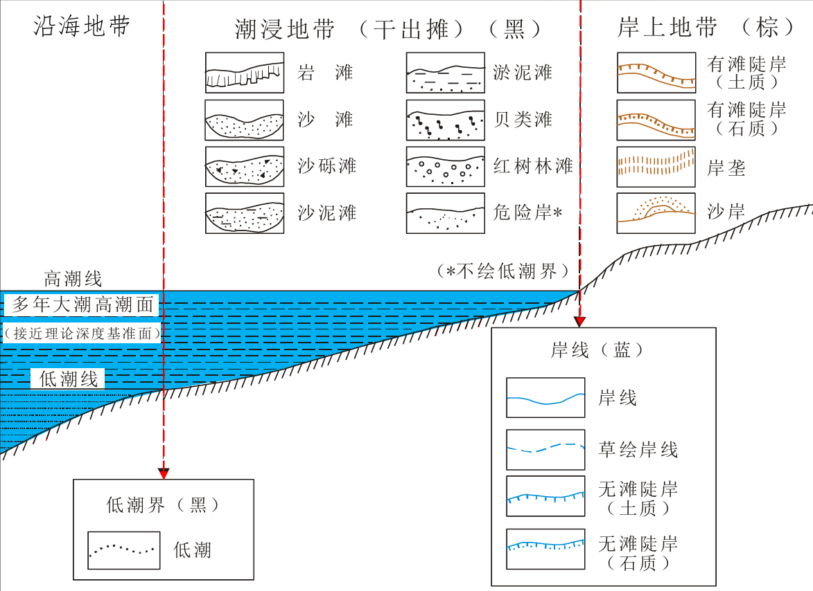

- 用**蓝色实线**表示

- 低潮线用**黑色点线**概略表示。

**② 潮浸地带**

重点表示各类干出滩。

- **符号**：表示滩涂性质

- **填绘**：表示分布范围。

**③ 岸上地带**

重点表示各种岸滩类型。

- **等高线**：表示地貌

- **地貌符号**：表示岸滩类型

- 无滩陡岸与海岸线重合。

**④ 沿海地带**

重点表示岛礁和海底地形。

- **符号**：表示岛礁

- **等深线**：表示海底地貌。

**应试总结**

海岸表示要抓住“**三带结构 + 三类线 + 两类符号**”：

- 三带：后滨、干出滩、前滨

- 三类线：海岸线、高潮线、低潮线

- 两类符号：岸滩符号、等深线/等高线。

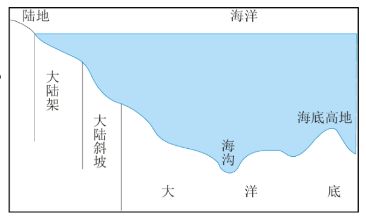

**3. 海底地貌的表示**

**（1）海底地貌基本分区**

**大陆架**

- 从低潮线向海洋延伸到坡度明显变化处的浅海区

- 深度约 **0～200m**

- 坡度平缓。

**大陆坡**

- 大陆架到大洋底之间的过渡地带

- 深度约 **200～2500m**

- 坡度大于 20°，切割破碎，起伏复杂。

**大洋底**

- 海洋主体部分，占约 **80%**

- 深度约 **2500～6000m**

- 地势总体起伏较小，但也有海底山脉、海沟、海原、海盆、海岭等。

**（2）理论深度基准面**

理论深度基准面是根据长期验潮数据求得的、理论上可能达到的**最低潮面**。

它决定了几个关键量：

1.  干出滩和干出礁的高度，是**从理论深度基准面向上计算**

2.  水深，是**从理论深度基准面到海底的深度**

3.  零米等高线通过干出滩、接近海岸线，用海岸线表示

4.  零米等深线接近低潮界

5.  无滩陡岸地带中，海岸线、零米等高线、零米等深线重合。

**这一块怎么理解**

它是海底表示的“**统一零点**”。  
陆地高程往上量，海底水深往下量，都要先确定基准面。

**（3）海底地貌表示方法**

**① 水深注记**

水深注记类似陆地上的高程点注记。  
规则：

- 不标点位，而用整数位几何中心代表点位

- 可靠、新测资料用**斜体**

- 不可靠、旧资料用**正体**

- 不足整米的小数位用**下标**表示。

**② 等深线**

等深线是从深度基准面起算的等深点连线。  
有两种形式：

- 点线符号

- 细实线符号。

**③ 分层设色**

在等深线基础上，在相邻等深线之间加绘连续渐变颜色，以表现海底起伏。

**④ 海底晕渲**

利用类似陆地晕渲的方法表现海底地貌起伏。例如可用世界海底晕渲图说明。

**应试结论**

海底地貌表示最常见的组合是：  
**水深注记 + 等深线 + 分层设色/晕渲。**

#### （二）陆地水系的表示

**1. 陆地水系包括什么**

陆地水系包括：

1.  井、泉及贮水池 —— 点状要素

2.  河流、运河及沟渠 —— 线状要素

3.  湖泊、水库及池塘 —— 面状要素

4.  水系附属物。

**2. 井、泉及贮水池**

表示方法：  
**蓝色记号性符号 + 说明注记。**

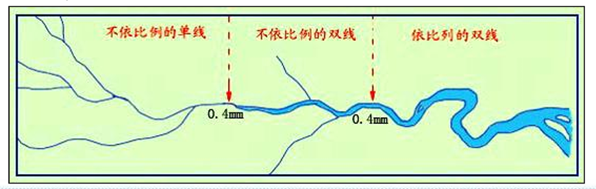

**3. 河流、运河及沟渠**

**（1）河流表示**

河流表示的目标是反映：

- 长度

- 宽度

- 形状

- 水流状况。

河流符号的演变规律：  
**不依比例尺的单线 → 不依比例尺的双线 → 依比例尺的双线。**

**具体类型**

- **真形双线河流**：蓝色水涯线 + 蓝色水部普染

- **高水位岸线**：棕色虚线

- **非真形双线河流**：0.4mm 蓝色双线 + 蓝色普染

- **单线河流**：0.1～0.4mm 蓝色渐变实线

- **时令河**：蓝色虚线

- **消失河段**：蓝色点线

- **干河床**：棕色虚线。

**小比例尺地图**

小比例尺地图河流表示原则与地形图相同，但单线河要略加粗；挂图可粗到 **0.15～0.6mm**。  
可概括为：  
**不依比例尺的单线河流 + 依比例尺的单线河流。**

**（2）运河和沟渠**

通常用：

- **蓝色平行双线 + 水部普染**  
  或

- **不同粗细的等粗蓝色实线**。

**4. 湖泊、水库及池塘**

**表示规则**

- 湖泊、水库、池塘：蓝色水涯线 + 蓝色水部普染

- 时令湖：蓝色虚线 + 蓝色普染

- 淡水：浅蓝色

- 咸水：浅紫色。

**水库表示**

水库既可以：

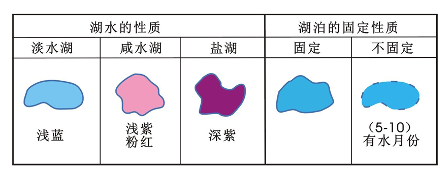

- 用依比例尺的真形符号表示
  也可以：

- 用不依比例尺的记号性符号表示。

**湖泊性质与固定性**

可进一步区分为：

- 淡水湖、咸水湖、盐湖

- 固定湖、不固定湖。

**5. 水系附属物**

包括：

- 自然形成的，如瀑布、石滩

- 附属建筑物，如渡口、码头、拦水坝。

表示方法：

- 半依比例尺符号

- 不依比例尺符号

- 小比例尺地图上多不表示。

### 地貌的表示

#### 1. 地貌表示的基本要求

地貌就是地表高低起伏形态，地图表现地貌时要满足三点：

1.  **基本形态** ——要看出山、谷、丘陵、平原

2.  **可量测性** ——要能读高程、判断坡度

3.  **立体感** ——要让人一眼看出起伏

#### 2. 地貌表示的五种主要方法

1.  写景法

2.  晕滃法

3.  晕渲法

4.  等高线法

5.  分层设色法。

#### 3. 写景法

**定义**

写景法是以绘画写景形式表示地貌起伏和分布位置的方法。

#### 4. 晕滃法

**定义**

晕滃法是沿斜坡方向布置晕线表示地貌的一种方法。

**原理**

根据光线垂直照射时，地面与水平面的倾角越大，受光越少。  
换句话说：**坡越陡，晕线表现越重。**

**优点**

- 能表示地貌起伏的分布范围

- 能表现不同坡度。

**缺点**

- 不能确定高程

- 工作量大

- 技术要求高

- 密集晕线容易掩盖其他地图内容

- 立体感不强。

**应试结论**

晕滃法重在“**坡度表达**”，不重在“**高程量测**”。

#### 5. 晕渲法

**定义**

晕渲法是在平面上显示地貌立体的主要方法之一，也叫阴影法或光影法。

**类型**

- 直照晕渲 ——立体感相对规则，但层次变化弱

- 斜照晕渲 ——阴阳坡对比强

- 综合光照晕渲——斜坡纹理层次表达更好

**基本思想**

根据假定光源对地面照射产生的明暗程度，用浓淡不一的墨色或彩色沿斜坡渲绘阴影，制造明暗对比，从而显示地貌分布、起伏和形态。

**光照强度**  

$$
\mathbf{I\  = \ k\  \cdot \ cos(\theta)}
$$

其中：

- $k$为光照系数

- $\theta$ 为光源入射方向与斜坡法线之间的夹角。

**晕渲设计要素**

晕渲效果取决于：光源方位 入射角度 网格大小 渲绘颜色。

**光源方位规律**

一般情况下，光源设在**西北角**。  
因为从西北角照射更符合人眼对地形起伏的常见识别习惯。

**颜色类型**

- 单色晕渲：灰色或棕灰色

- 双色晕渲：阳坡暖色，阴坡冷色

- 自然色晕渲：平原绿、丘陵黄、高山棕灰、极高山白。

**优缺点**

| **优点** | **缺点** |
| --- | --- |
| 视觉立体感强 生动直观 | 缺乏高程可量测性 |

#### 6. 等高线法

**定义**

等高线是地面上高程相等点连线在水平面上的投影。  
用等高线表现地面起伏的方法称为等高线法，又叫水平曲线法。

**（1）等高线的基本特点**

1.  同一条等高线上的各点高程相等

2.  等高线是封闭连续的曲线

3.  等高线图形与实地保持几何相似

4.  在等高距相同的情况下，线越密坡越陡，线越稀坡越缓。

**（2）等高距**

等高距是地形图上相邻等高线的高程差。  
大、中比例尺地形图中，等高距一般是固定的。

**（3）等高线的种类**

| 名称       | 定义核心                               | 绘制规则 & 间距                      | 线型规格                 |
|------------|----------------------------------------|--------------------------------------|--------------------------|
| **首曲线** | 基本等高线，按基本等高距由零点起算绘制 | 常规基础等高线，反映常规地形起伏     | 0.1mm 棕色实线           |
| **计曲线** | 加粗等高线，方便快速判读、计算高程     | 每隔 4 条首曲线加粗绘制 1 条         | 0.25～0.3mm 加粗棕色实线 |
| **间曲线** | 半距等高线，补充型等高线               | 用于凸显局部重要地形形态，可不闭合   | 0.1mm 棕色长虚线         |
| **助曲线** | 1/4 距等高线，精细补充型等高线         | 用于表达微小、关键地形细节，可不闭合 | 0.1mm 棕色短虚线         |

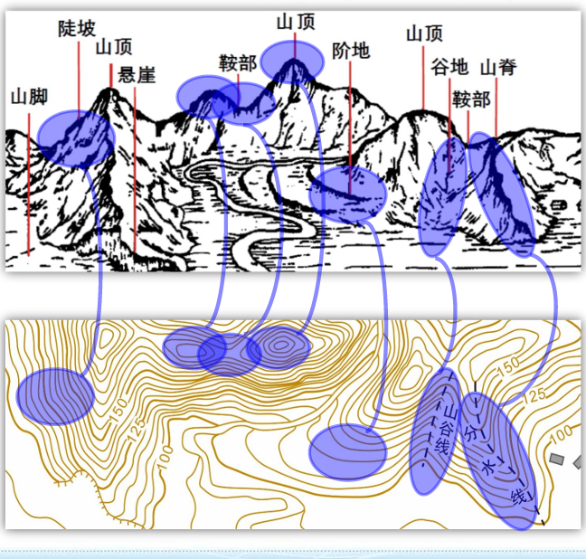

**（4）等高线组蕴含的地貌信息**

**（5）等高线测绘步骤**

1.  测定地貌特征点 ——山顶点、鞍部点、倾斜变换点、方向变换点

2.  连接地性线 ——山脊线、山谷线

3.  求等高线通过点 ——比例内插求出等高线交点

4.  连接等高线。

**（6）等高线法的优缺点**

> **├─** 优势亮点 → **方法科学** + **可量测、能精准算高程**
>
> ├─ 现存短板 → **立体感差** + **微地形表达不清**
>
> └─ 两大优化方向
>
> ├─ 其他辅助：高程标注 + 地貌符号 + 地貌晕渲（加光影）
>
> └─ 线条改造：粗细分层等高线 + 明暗光影等高线

**如：**

> **等高线 + 晕渲** 的瑞士地形图
>
> **等高线 + 分层设色** 的地势图。

#### 7. 分层设色法

**定义**

根据地面高度划分高程层（带），逐层设置不同颜色，形成地貌分层设色法。

**优点**

1.  使地图立刻获得高程分布及其对比印象

2.  使等高线地图获得一定立体感。

**设色原则**

各层色彩可采用两类原则：**越高越亮** **越高越暗**。

分层设色法擅长“**整体高低分布**”，但不如等高线法精确。

#### 8. 地貌符号与地貌注记

**（1）地貌符号**

**独立微地貌**

微小且独立分布，如坑穴、土堆、溶斗、独立峰、隘口、火山口、山洞等。

**急变地貌**

小范围内变化急剧，如冲沟、陡崖、冰陡崖、陡石山、崩崖、滑坡等。

**区域微地貌**

成片分布但高差较小，如小草丘、残丘，或表示地表性质状况的沙地、石块地、龟裂地等。

**（2）地貌注记**

**高程注记**

- **高程点注记**：表示等高线不能显示的山头、凹地等

- **等高线注记**：便于迅速判断等高线高程。

**说明注记**

说明比高、宽度、性质等。

**地貌名称注记**

包括山峰、山脉等名称。

#### 9. 地貌表示方法比较表

| 方法       | 原理/核心 | 优点             | 缺点             | 适用认识             |                |
|------------|-----------|------------------|------------------|----------------------|----------------|
| 写景法     |           | 绘画写景表现地貌 | 生动直观         | 量测性差             | 强调形象       |
| 晕滃法     |           | 沿坡向布晕线     | 可反映坡度       | 高程不明、立体感一般 | 坡度表达       |
| 晕渲法     |           | 明暗阴影表现立体 | 立体感最强       | 不可量测             | 强调视觉效果   |
| 等高线法   |           | 高程相等点连线   | 科学可量测       | 立体感不足           | 最标准、最常考 |
| 分层设色法 |           | 高程分带着色     | 整体高低一目了然 | 精确性一般           | 区域高程分布   |

### 土质和植被的表示

**1. 定义**

- **土质**：地表覆盖层的表面性质

- **植被**：地表植物覆盖的简称。

**2. 表示方法**

- 地类界 ——不同地面覆盖物的分界线，通常用点线符号表示范围

- 说明符号 ——在范围内部用符号说明种类和性质

- 底色 ——森林、幼林等范围内套印绿色底色

- 说明注记——在大面积土质或植被范围内加文字数字注记，说明其质量和数量特征

### 居民地的表示

#### 1. 居民地地图表示内容

居民地表示：位置 类型 形状 建筑物质量特征 行政等级 人口数量。

#### 2. 居民地类型

**城镇式 农村式**

#### 3. 居民地形状

**内部结构**

由街道网图形、街区形状、水域、种植地、绿化地、空旷地等构成。

**外部轮廓**

由街道网、街区和各种建筑物的分布范围决定。

**比例尺变化规律**

随着比例尺逐渐缩小，居民地形状表示不断简化，最后可用**圈形符号**表示。

#### 4. 建筑物质量特征

只有在大比例尺图上，才可能详细区分建筑物质量特征。
#### 5. 行政等级

行政等级是国家法定标志，反映居民地的政治、经济、文化意义。  
表示方法：

- 地名注记字体、字号

- 符号图形和尺寸

- 地名下方加绘辅助线。

#### 6. 人口数量

人口数反映居民地规模和经济发展状况

### 交通网的表示

#### 1. 分类

交通网是各种交通运输线路的总称，包括：

1.  陆地交通

2.  水路交通

3.  空中交通

4.  管线交通。

#### 2. 陆地交通

| **大类** | **细分内容** | **比例尺 / 分类说明** | **地图表示方法** | **附加细节** |
| --- | --- | --- | --- | --- |
| 铁路 | 铁路整体 | 大比例尺：内容详细完整 小比例尺：仅区分**主要铁路、次要铁路** | 按等级用对应线型、符号区分主次 | 无额外附属细化标注（小比例尺） |
| 公路 | 1.公路分类 | ①汽车专用公路：高速、一级、专用二级 ②一般公路：二级、三级、四级 | 统一以 **双线符号** 为主；通过符号宽窄、线划粗细、色彩差异、文字注记区分等级 | 大比例尺需精细表达附属设施 |
| 2. 大比例尺专属细化 | 涵盖公路配套地形 / 建筑 | 精准绘出对应地物符号 | 需标注：涵洞、路堤、路堑、隧道等附属建筑物 |  |
| 其他道路 | 大车路、乡村路、小路、时令路、无定路 | 按通行等级、固定与否划分主次等级 | 采用实线、虚线、点线搭配线划粗细变化区分道路类型与等级 | 线型简单，不绘双线复杂符号 |

#### 3. 水路交通

**分类**

- 内河航线

- 海洋航线。

**内河航线**

通常用短线表示通航起讫点，小比例尺地图有时还标定期和不定期通航河段。

**海洋航线**

由港口和航线组成。

- 港口：用符号表示位置，有时分级

- 航线：多用蓝色虚线表示。

其中：

- 近海航线：沿大陆边缘用弧线画出

- 远洋航线：按两港口的大圆航线方向画出。

#### 4. 空中交通

普通地图上，空中交通主要通过**航空站**来体现，一般不表示航空线。

#### 5. 管线运输

- 地面管道：线状符号 + 说明注记

- 地下管道：目前一般不表示

- 高压输电线：在线状符号基础上加电压说明注记

- 通信线：用线状符号表示，并表示有方位的线杆。

### 境界的表示

**政区境界**

包括：

- 国界

- 省、自治区、直辖市界

- 自治州、盟、省辖市界

- 县、自治县、旗界等。

**其他境界**

如：

- 地区界

- 停火线界

- 禁区界等。

### 专题地图内容的表示方法

- 表示“点”的：定点符号法、点数法、定位图表法

- 表示“线”的：线状符号法、运动线法

- 表示“面”的：范围法、质底法、分区统计图法

- 表示“连续量场”的：等值线法

- 表示“统计强度”的：分级统计图法。

**1. 水系表示速记表 居民地表示内容表**

| 方面     | 表示重点               |
|----------|------------------------|
| 位置     | 地理定位               |
| 类型     | 城镇式 / 农村式        |
| 形状     | 内部结构 + 外部轮廓    |
| 质量特征 | 房屋与街区特征         |
| 行政等级 | 字体字号、符号、辅助线 |
| 人口数量 | 注记字大、符号尺寸结构 |

| 对象             | 类型 | 主要表示方法                |
|------------------|------|-----------------------------|
| 井、泉、贮水池   | 点状 | 蓝色记号性符号 + 注记       |
| 河流             | 线状 | 单线/双线、普染、虚线、点线 |
| 运河、沟渠       | 线状 | 蓝色平行双线或等粗实线      |
| 湖泊、水库、池塘 | 面状 | 水涯线 + 普染               |
| 水系附属物       | 附属 | 半依比例尺或不依比例尺符号  |

## 4.2 时空分布地图

### 空间状态分布

时空分布地图的定义是：

**通过专题地图形式，表达地理现象在某一时刻或某一时段内的空间分布特征**；

它的核心目标是——揭示空间格局、变化梯度、聚集特征和区域差异。

专题地图本质上由两部分组成：**地理底图 + 专题要素**。

真正逻辑是：

**先有底图，再把专题内容放上去；**

**而放上去的方法，取决于对象在空间上是点、线还是面。**

### 十种表示方法

#### 方法汇总：

| **空间分布类型**   | **主要回答的问题**           | **适合方法** | **逻辑说明**                   |
|--------------------|------------------------------|--------------|--------------------------------|
| 点状分布           | 东西在哪里、是什么、多少     | 定点符号法   | 一个符号对应一个具体地点       |
| 线状/带状分布      | 线性对象如何延伸             | 线状符号法   | 保留对象的线性骨架             |
| 间断成片分布       | 某类现象出现在哪些区域       | 范围法       | 强调“分布到哪里”               |
| 全区分类分布       | 每块地方属于什么类型         | 质底法       | 整个区域被分成互斥类别         |
| 连续渐变分布       | 数值场如何连续变化           | 等值线法     | 表达连续量场                   |
| 大面积分散分布     | 哪里密、哪里疏、总量如何     | 点数法       | 用大量点逼近真实疏密           |
| 定位点上的周期变化 | 某地随时间如何起伏           | 定位图表法   | 地点固定，变化过程入图表       |
| 运动变化过程       | 朝哪里动、走哪条路、强度多大 | 运动线法     | 同时表达路径、方向、数量、质量 |
| 区划之间等级差异   | 哪个区高、哪个区低           | 分级统计图法 | 用区划单元表达等级             |
| 区划内部总量与结构 | 每个区总量多大、内部怎么构成 | 分区统计图法 | 用统计图表放进区划单元         |

#### 方法比较

| **容易混淆的方法** | **共同点** | **根本区别** | **一句话判断** |
| --- | --- | --- | --- |
| 定点符号法 vs 分区统计图法 | 都可能画圆、柱等图形 | 前者对应真实地点上的对象； 后者对应整个区划单元的总量 | 看它代表“一个点”还是“一个区” |
| 线状符号法 vs 运动线法 | 都画线 | 前者表达静态沿线分布； 后者表达动态过程 | 静态线用线状符号，动态流用运动线 |
| 范围法 vs 质底法 | 都会画区域、填颜色/网纹 | 范围法可空白、重叠、交叉；质底法布满全区、互斥分类 | 看问题是“它分布到哪”还是“这里属于哪类” |
| 分级统计图法 vs 分区统计图法 | 都按区划单元表达 | 前者强调等级高低； 后者强调总量和内部构成 | 看重点是“高低差异”还是“区内结构” |
| 点数法 vs 分级统计图法 | 都能表现数量差别 | 点数法更接近真实空间疏密；分级统计图法更强调区间比较 | 看你关心“区内疏密”还是“区间高低” |

### 定点符号法

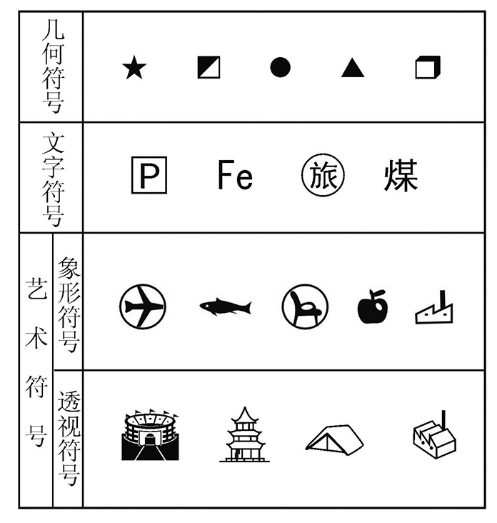

#### （1）定性数据表达

核心结论：

- **颜色**表示最主要、最本质的差别

- **符号形状**表示次要差别。

#### （2）符号形状类型

- 几何符号：简单、区别明显、便于定位

- 文字符号：便于识别、阅读

- 艺术/象形符号：形象、生动、直观，易辨认和记忆。

#### （3）定量数据靠符号大小

- **比率符号**：符号尺度和数量有一定比率关系

- **非比率符号**：只能表示模糊数量关系，不表示精确数量。

#### （4）比率符号还继续细分

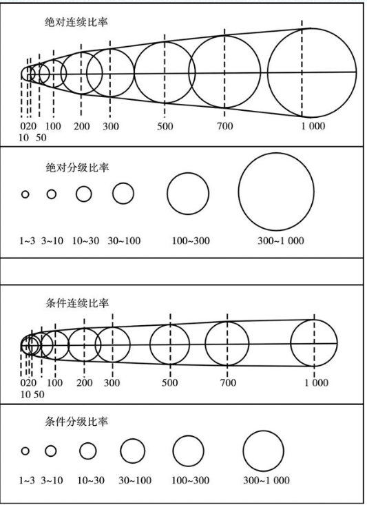

| **比率类型** | **含义**                         |
|--------------|----------------------------------|
| 绝对连续比率 | 符号面积比 = 数量之比            |
| 条件连续比率 | 在连续比率基础上附加函数条件     |
| 绝对分级比率 | 对分级数据按组中值确定基准线长度 |
| 条件分级比率 | 分级数据 + 附加函数条件          |

#### （5）符号还能组合

- **组合结构符号**：反映专题现象内部结构

- **扩张符号**：反映现象的发展动态。

#### （6）符号定位

这部分也很重要：

- 底图河流、道路、居民点越清楚，越利于专题符号定位

- 多个符号重叠时，可以保持定位点不变，把符号做成组合结构

- 若多个现象难合并，可把符号布置在定位点周围。

### 线状符号法

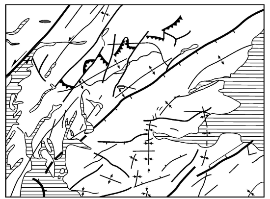

| **定位方式** | **适用对象**             |
|--------------|--------------------------|
| 严格定位     | 河流、道路、地质构造线等 |
| 不严格定位   | 航空线等                 |
| 单边定位     | 境界线色带等             |

### 质底法

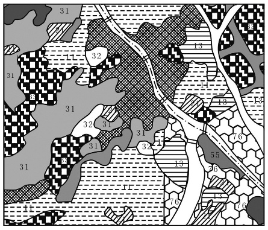

| **方面** | **内容** |
| --- | --- |
| 种类 | 精确范围（如土壤图、地质图）； 概略范围（如土地利用图） |
| 表示方法 | 范围用轮廓线/网格法分区； 内部用颜色、晕线、花纹、注记 |
| 实施步骤 | 分类分区 → 绘出分布界限 → 填绘区域内部 |

### 等值线法

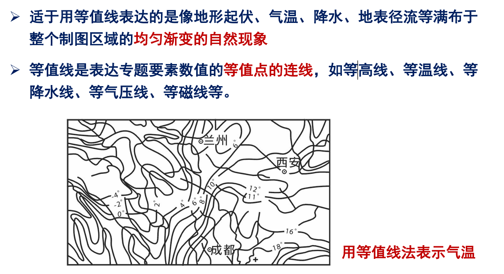

### 点数法

| **方面**     | **内容**                                                   |
|--------------|------------------------------------------------------------|
| 点的排布范围 | 表示分布范围                                               |
| 点的数量     | 表示数量特征                                               |
| 点的集中程度 | 表示分布密度                                               |
| 布点方法     | 均匀布点（统计方法、概略）/ 定位布点（地理方法、精确）     |
| 点值确定     | 取决于比例尺和资料详细程度；比例尺越大，点数越多、点值越小 |

### 运动线法

- 动态性：描述运动轨迹及趋势

- 直观性：兼顾质量、数量、路径、方向

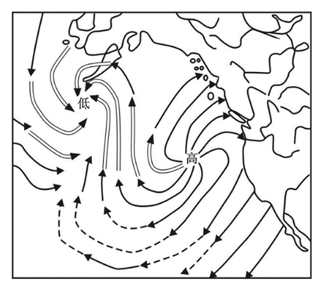

- 一览性：可准确表达也可概略表达。

| **要表达什么** | **用什么变量表达**                   |
|----------------|--------------------------------------|
| 质量特征       | 线的颜色、结构、纹理                 |
| 数量特征       | 线的宽度                             |
| 运动方向       | 箭形矢部（单向箭头、双向箭头、单线） |
| 运动路径       | 线的位置（准确表达/概略表达）        |

### 分级统计图法

| **方面** | **内容**                                                          |
|----------|-------------------------------------------------------------------|
| 分级指标 | 绝对指标（人口数、粮食产量）/ 相对指标（人均产值、亩产）          |
| 表示范围 | 区划单元（行政或自然）                                            |
| 内部表现 | 颜色（不同级别时用饱和度变化）、饱和度、色相（级数超过5时）、晕线 |
| 关键     | 科学分级                                                          |

### 分区统计图法

- 表示区划单元总值

- 表示形式是易计量的几何图形

- 如柱状、圆环、扇形等

- 图表大小常采用比率符号。

### 扩展图表

| **具体图表形态** | **主要作用** | **更接近哪个主方法** |
| --- | --- | --- |
| 金字塔图表 | 表示数量、质量和结构 | 分区统计图法 定位图表法 |
| 三角形图表 | 表示三个亚类的比例关系 | 统计图表法扩展 |
| 玫瑰花图表 | 表示方向频率、 季节/月份方向变化 | 定位图表法 |
| 圆形（扇形）图表 | 表示构成比例、总量与结构 | 分区统计图法 / 定位图表法 |

## 4.3 时空对比地图

### 解决问题

通过对比两个或多个时间节点的空间数据，揭示地理现象在时间维度上的变化幅度与空间差异。如：位置变化，属性变化，存在性变化

#### 两个解决策略

| **对比策略** | **描述**             | **代表方法**   | **本质**           |
|--------------|----------------------|----------------|--------------------|
| 并列对比     | 同时展示多个时间状态 | 时间切片对比图 | 看原始状态如何演变 |
| 直接对比     | 计算差异并直接展示   | 差值地图       | 直接看变化量本身   |

### 时间切片对比图

时间切片对比图的定义是：

把同一区域在不同时间节点的快照地图并排列出，通过视觉比较观察变化。

它的核心思想是——**所有地图设计必须完全一致，只改变时间维度。**  
一致性的内容包括投影、比例尺、分级方法、颜色编码方案、图例范围等。

#### 时间切片组织方式

| **布局方式** | **特点**       | **适用场景**             |
|--------------|----------------|--------------------------|
| 水平排列     | 左到右时间递增 | 时间节点较少（≤6）       |
| 垂直堆叠     | 上到下时间递增 | 空间范围较宽，便于上下比 |
| 网格排列     | 矩阵式排列     | 多时间节点 + 多变量组合  |

#### 它的优缺点

优点是：

- 保留原始分布信息

- 能看演变过程

- 叙事感强。

局限是：

- 时间切片数有限，通常不宜太多

- 难以表达连续变化

- 读者必须自己做视觉比较，变化强度不是直接给出的。

### 差值地图

差值地图的定义是：**通过计算两个时间节点数据的差值，直接生成表达“变化量”的地图。**  
核心思想非常明确——**不展示原始状态，只展示变化本身。**

#### 差值的两种计算方式

| **计算类型** | **公式**                    | **含义**   |
|--------------|-----------------------------|------------|
| 绝对差值     | 后值 - 前值                 | 实际增减量 |
| 相对差值     | (后值 - 前值) / 前值 × 100% | 变化百分比 |

#### 它的优缺点

优点是：

- 省空间

- 变化更突出

- 适合快速回答“哪里增、哪里减、哪里不变”。

不足是：

- 原始状态会被隐藏

- 通常只能处理前后两个时间点

- 正负变化必须靠专门配色来区分。

适合栅格数据、像元级别的一一对应比较，比如遥感影像、DEM、NDVI、格网气温数据。

### 切片与差值地图对比

| **对比维度** | **时间切片对比图**     | **差值地图**             |
|--------------|------------------------|--------------------------|
| 展示内容     | 多个时间节点的原始状态 | 两个时间节点的变化量     |
| 地图数量     | 多幅地图               | 单幅地图                 |
| 原始信息     | 保留                   | 不保留                   |
| 视觉重点     | 格局演变过程           | 变化幅度与方向           |
| 时间节点数   | 可多个                 | 只能前后两个             |
| 配色特点     | 连续渐变/分级设色      | 双色发散配色             |
| 更适合回答   | 怎么一步步变           | 哪里增、哪里减、变化多大 |

## 4.4 时空关联地图

### 解决问题

时空关联地图的定义是：

**通过可视化方法揭示不同地理要素之间，或同一要素在不同时空维度上的关联规律。**  
它想回答的是：

**A 与 B 在哪里相关？何时相关？相关强度如何？**

关联可分成两大类：

| **关联类型** | **含义**                                       | **示例**                       |
|--------------|------------------------------------------------|--------------------------------|
| 空间关联     | 不同要素在同一空间位置上的共存、邻近或相互作用 | 化工厂与周边学校、医院分布重叠 |
| 时空关联     | 要素之间的相互作用随时间变化                   | 交通拥堵与事故发生的时空耦合   |

### 空间叠加分析可视化

哪里叠在一起？

空间叠加分析的定义是：

**把两个或多个图层（点、线、面）在同一空间坐标系下进行逻辑运算，生成新图层。**  
它的核心原理有两个：

- **数据空间定位必须统一**

- **图层渲染顺序必须合理。**

#### 图层叠加基本原则

| **原则** | **含义**                               |
|----------|----------------------------------------|
| 坐标统一 | 各图层必须在同一坐标系下，否则位置错乱 |
| 分类清晰 | 图层分组管理，不能混成一团             |
| 视觉层次 | 用透明度和颜色区分主次                 |
| 交互友好 | 支持图层开关、透明度调节、联动分析     |

#### 布尔运算可视化

| **运算类型** | **几何含义**                           | **可视化效果** | **应用场景**             |
|--------------|----------------------------------------|----------------|--------------------------|
| 相交         | 保留两个图层重叠部分                   | 只显示交集区域 | 找同时满足多个条件的区域 |
| 联合         | 合并两个图层所有区域                   | 显示并集       | 划定综合影响范围         |
| 擦除         | 从一个图层去掉与另一图层重叠部分       | 显示剩余区域   | 排除不适宜区域           |
| 标识         | 保留第一个图层，同时附加第二个图层属性 | 叠加属性信息   | 多因素综合评价           |

### 4. 缓冲区分析可视化：回答“离它多近算受影响”

缓冲区分析是空间关联里最常见的一种，它以点、线、面要素为中心，建立一定距离范围的缓冲区多边形，分析其与其他要素的空间关系。

#### 缓冲区类型

| **要素类型** | **缓冲区形态**    | **示例**              |
|--------------|-------------------|-----------------------|
| 点缓冲区     | 圆形              | 化工厂 1 英里影响范围 |
| 线缓冲区     | 带状              | 道路两侧 500 米噪声带 |
| 面缓冲区     | 外扩 / 内缩多边形 | 自然保护区外围缓冲区  |

#### 多缓冲区叠加可视化方法

| **方法**   | **操作**           | **效果**               |
|------------|--------------------|------------------------|
| 分层设色   | 不同距离用不同颜色 | 清晰展示影响梯度       |
| 透明度叠加 | 重叠区域颜色加深   | 直观显示影响叠加程度   |
| 融合处理   | 合并相邻缓冲区     | 简化视图，突出整体范围 |

### 时空耦合分析可视化：回答“关系如何随时间变化”

这一部分比前面的空间叠加更进一步，它同时考虑空间和时间两个维度，揭示要素之间的**动态关联规律**。它的核心挑战在于时空数据的高维性，即同时包含空间维度 $(x,y)$ 与时间维度 $t$。

它主要问三件事：

- A 和 B 是否在时间和空间上同时发生？

- A 的变化是否滞后于 B？

- 是否存在时空聚类模式？

#### 主要方法总表

| **方法**   | **特点**                     | **适用场景**       |
|------------|------------------------------|--------------------|
| 时空立方体 | 三维展示时空分布             | 事件时空聚类分析   |
| 时空路径   | 轨迹线 + 时间轴              | 个体移动行为分析   |
| 多视图联动 | 地图 + 时间序列 + 统计图协同 | 多变量时空关联探索 |

### 三类时空耦合方法细分

#### 时空立方体

时空立方体把 x、y 当作空间位置，把 z 轴当作时间轴；每个体素代表“某位置 + 某时刻”的数据值。它适合把时空分布整体三维化。

| **形式** | **表现方式**             | **适用场景**     |
|----------|--------------------------|------------------|
| 三维柱体 | 在平面上竖起高度表示时间 | 离散事件时间分布 |
| 体素着色 | 立方体单元颜色编码数值   | 连续时空场数据   |
| 等时面   | 连接同时刻的等值面       | 扩散过程分析     |

#### 时空路径与轨迹关联

时空路径本质上是把轨迹写成一串$\ (x,\ y,\ t)$ 点，然后在二维地图上用轨迹线、颜色或符号编码时间。

| **方法**              | **操作**             | **揭示的关联**      |
|-----------------------|----------------------|---------------------|
| 轨迹叠置              | 多条轨迹同时显示     | 移动模式的共性/差异 |
| 起点-终点连线（OD流） | 连接出发地与目的地   | 出行流向规律        |
| 时空密度              | 对轨迹点做核密度分析 | 热点时段/热点区域   |

#### 多视图联动分析

多视图联动不是只画一张地图，而是让地图、时间序列图、统计图表协同工作；用户在一个视图上的操作会同步影响其他视图。

| **联动类型** | **操作**         | **效果**                   |
|--------------|------------------|----------------------------|
| 筛选联动     | 在地图上框选区域 | 时间序列图只显示该区域数据 |
| 高亮联动     | 鼠标悬停某要素   | 其他视图中对应要素高亮     |
| 时间联动     | 拖动时间滑块     | 地图显示对应时刻状态       |

## 第5章 时空信息可视化设计

| **模块**                     | **核心研究对象**     | **关注重点**           | **典型表达**                 | **一句话理解**                 |
|------------------------------|----------------------|------------------------|------------------------------|--------------------------------|
| 5.1 动态地图的类型与实现技术 | 地图上的时空变化过程 | 时间与空间如何联动表达 | 时间滑块、动画播放、交互查询 | 把“变化过程”放到地图上         |
| 5.2 轨迹数据可视化           | 个体运动路径         | 路径、节点、热点       | 轨迹线、轨迹点、热力图       | 看“谁怎么走”                   |
| 5.3 时空流可视化             | 群体流动现象         | 方向、速度、规模       | 流线、流面、粒子动画         | 看“整体怎么流”                 |
| 5.4 时空场可视化             | 连续分布的物理量     | 场值分布及其动态变化   | 面绘制、体绘制               | 看“某种量如何在时空中连续变化” |

### 二、5.1 动态地图的类型与实现技术

#### 1. 核心概念表

| **内容**       | **总结**                                                         |
|----------------|------------------------------------------------------------------|
| 动态地图定义   | 通过计算机技术将时空数据变化过程动态呈现于地图，核心是“时空联动” |
| 核心特征       | 保留空间位置，同时展示时间维度变化                               |
| 与静态地图区别 | 静态地图是某一时刻切片；动态地图是一个过程的完整呈现             |

#### 2. 动态地图三种类型表

| **类型**           | **核心特征**                       | **主要特点**                 | **典型应用**                 |
|--------------------|------------------------------------|------------------------------|------------------------------|
| 时间滑块式动态地图 | 手动拖动时间滑块，查看任意时刻状态 | 交互性强、精度高、操作简单   | PM2.5变化、气象监控          |
| 动画播放式动态地图 | 自动播放变化过程                   | 动态感强、展示整体趋势       | 台风路径、人口演变、生物迁徙 |
| 交互查询式动态地图 | 用户查询触发动态效果               | 针对性强、信息联动、交互灵活 | 公交查询、历史建筑变迁       |

#### 3. 动态地图制作流程表

| **步骤**                   | **主要内容**                     | **关键点**                       |
|----------------------------|----------------------------------|----------------------------------|
| 1\. 明确目标与需求         | 明确做什么、给谁看、呈现什么效果 | 先定目标、受众、展示方式         |
| 2\. 时空数据收集与预处理   | 收集空间数据、时间数据、属性数据 | 清洗无效数据、统一格式、建立关联 |
| 3\. 地图底图制作与要素加载 | 选择底图并加载处理后的要素       | 确保位置准确、底图合适           |
| 4\. 动态效果设置           | 设置时间滑块、动画速度、交互触发 | 不同动态类型参数不同             |
| 5\. 测试优化与导出         | 检查流畅性、时空对应、交互效果   | 可导出GIF、MP4、HTML             |

### 三、5.2 轨迹数据可视化

#### 1. 轨迹预处理表

| **处理环节** | **作用**                             | **常见方法/特点**                                  | **关键词**   |
|--------------|--------------------------------------|----------------------------------------------------|--------------|
| 轨迹简化     | 删除冗余点，减少数据量，提高渲染效率 | DP算法适合离线批处理；滑动窗口算法适合实时数据     | 保形删点     |
| 轨迹匹配     | 修正GPS偏差，使轨迹贴合真实路网      | 局部增量匹配适合实时导航；全局匹配适合离线分析     | 贴合路网     |
| 轨迹聚合     | 从大量轨迹中发现整体规律             | 空间聚合看热点；时间聚合看流量；形态聚合看主流通道 | 挖掘群体规律 |

#### 2. 轨迹可视化三种形式表

| **形式**       | **表达对象**       | **优势**                                 | **适用场景**                 | **一句话记忆** |
|----------------|--------------------|------------------------------------------|------------------------------|----------------|
| 轨迹线可视化   | 完整路径           | 直观展示运动路线，可用颜色和线宽编码属性 | 候鸟迁徙、车辆轨迹、台风路径 | 看“整条路”     |
| 轨迹点可视化   | 关键节点           | 突出细节，可表达停留、上下客、时间戳等   | 外卖配送、停留分析、状态变化 | 看“关键点”     |
| 轨迹密度热力图 | 大量轨迹的密度分布 | 适合海量数据，便于发现热点区域           | 出行热点、活动集中区         | 看“整体热度”   |

### 四、5.3 时空流可视化

#### 1. 时空流与轨迹的区别表

| **比较项** | **轨迹**       | **时空流**         |
|------------|----------------|--------------------|
| 研究对象   | 个体运动痕迹   | 群体流动过程       |
| 关注重点   | 路径本身       | 方向、速度、规模   |
| 例子       | 单辆出租车路线 | 所有出租车整体流动 |

#### 2. 时空流三种表达方法表

| **方法**   | **核心逻辑**                                               | **主要特点**                     | **应用场景**                     | **适用情况**               |
|------------|------------------------------------------------------------|----------------------------------|----------------------------------|----------------------------|
| 流线法     | 用带方向的线表示流动方向和路径，线粗表规模，颜色表速度     | 简洁直观、表达高效、制作简单     | 人口迁徙、交通流、物流           | 适合大范围、路径清晰的流动 |
| 流面法     | 用连续面状图形表示流动范围和边界                           | 立体感强，能表达流动范围         | 大气环流、河流径流、大型活动人流 | 适合有宽度和范围的流动     |
| 粒子动画法 | 用大量粒子模拟流动过程，方向表方向，密度表规模，颜色表速度 | 动态感最强、细节丰富、视觉效果好 | 实时交通流、商场人流、全球洋流   | 适合动态变化明显的流动     |

#### 3. 方法选择表

| **展示需求**         | **推荐方法** | **原因**               |
|----------------------|--------------|------------------------|
| 想清楚表达方向和规模 | 流线法       | 简洁、直观、效率高     |
| 想表达流动范围和边界 | 流面法       | 能体现面状流动特征     |
| 想生动表现动态过程   | 粒子动画法   | 动态感强，视觉表现最好 |

### 五、5.4 时空场可视化

#### 1. 时空场基础表

| **内容**   | **总结**                                       |
|------------|------------------------------------------------|
| 定义       | 时空场是在空间和时间维度连续变化的物理量分布   |
| 典型数据   | 温度、气压、PM2.5、洋流速度等                  |
| 本质       | 三维空间（x,y,z）+ 一维时间（t）的四维连续分布 |
| 可视化挑战 | 维度高、数据量大、动态变化难直观展示           |

#### 2. 核心可视化方法表

| **方法** | **原理**                   | **典型手段**       | **应用**                             |
|----------|----------------------------|--------------------|--------------------------------------|
| 面绘制   | 将三维时空场投影到二维平面 | 伪彩色映射、等值线 | 气象云图、PM2.5分布、热岛效应        |
| 体绘制   | 直接渲染三维数据           | 体渲染、等值面提取 | 大气温度三维分布、海洋洋流、医学影像 |

#### 3. 动态展示技术表

| **技术**   | **方式**               | **优点**             | **例子**         |
|------------|------------------------|----------------------|------------------|
| 动画播放   | 逐帧播放不同时间点结果 | 直观展示变化过程     | 气象云图动画     |
| 时间滑块   | 用户拖动滑块选择时间点 | 交互性强、可精确控制 | ArcGIS时间滑块   |
| 多视图联动 | 并列展示多个时间点结果 | 便于对比分析         | 季节温度分布对比 |

### 六、对比总结

| **对比项**           | **前者** | **后者** | **核心区别**                       |
|----------------------|----------|----------|------------------------------------|
| 静态地图 vs 动态地图 | 静态地图 | 动态地图 | 一个是时刻切片，一个是变化过程     |
| 轨迹 vs 时空流       | 轨迹     | 时空流   | 一个看个体，一个看群体             |
| 轨迹线 vs 轨迹点     | 轨迹线   | 轨迹点   | 一个重完整路径，一个重关键细节     |
| 流线法 vs 流面法     | 流线法   | 流面法   | 一个强调方向路径，一个强调范围边界 |
| 面绘制 vs 体绘制     | 面绘制   | 体绘制   | 一个二维表达，一个三维表达         |

### 七、期末背诵

| **模块**     | **最简背诵句**                                                         |
|--------------|------------------------------------------------------------------------|
| 动态地图     | 动态地图的核心是时空联动，常见有时间滑块式、动画播放式、交互查询式     |
| 动态地图流程 | 目标需求→数据收集预处理→底图与要素加载→动态效果设置→测试优化导出       |
| 轨迹预处理   | 轨迹预处理包括简化、匹配、聚合                                         |
| 轨迹表达     | 轨迹线看路径，轨迹点看细节，热力图看整体热点                           |
| 时空流       | 时空流强调群体流动的方向、速度和规模                                   |
| 时空流方法   | 流线看方向，流面看范围，粒子动画看过程                                 |
| 时空场       | 时空场是连续物理量在时空中的分布                                       |
| 时空场方法   | 面绘制是二维表达，体绘制是三维表达，动态展示可用动画、滑块、多视图联动 |

## 第6章 时空信息可视化设计

### 一、章节内容

**时空信息可视化设计 = 版式与视觉表达设计 + 用户交互设计 + 多维联动设计 + 沉浸式体验设计。**

### 二、6.1 地图设计：版式、视觉变量与风格色彩

回答三个问题：

1.  **地图怎么摆**（版式与布局）

2.  **信息怎么画**（视觉变量）

3.  **整体长什么样**（风格与色彩）

#### （一）地图版式与布局设计

##### 1. 常见版式

这一部分很适合考选择题、简答题。

- **横版版式**：适合展示**东西向延伸**的区域，比如中国地图、世界地图；

- **竖版版式**：适合展示**南北向延伸**的区域，比如南美洲、非洲；

- **多图组合版式**：适合展示**不同主题、不同时间或不同区域的对比信息**，如对比图、系列图。

##### 2. 布局设计原则

**四个原则直接背：**

- **视觉平衡**：地图元素分布均衡，不要一边太重一边太空；

- **主次分明**：核心信息要突出，主题要素放在视觉中心；

- **简洁清晰**：少装饰、少冗余，保证可读性；

- **逻辑连贯**：元素摆放符合阅读习惯和空间逻辑。

##### 3. 这一部分怎么理解

老师讲“版式”时，核心不是美术排版，而是：  
**地图不是把数据放上去就完了，而是要让读者第一眼就知道“重点在哪、怎么看、先看什么后看什么”。**  
所以考试答题时，别只写“好看”，要写**可读性、层次性、逻辑性**。

#### （二）时空要素的视觉变量设计

这一块是本章很重要的理论点，属于“地图符号化”的内容。

##### 1. 常用视觉变量

常用视觉变量中，建议重点掌握：

- **形状**：区分类型

- **尺寸**：表示数量或重要性

- **色相**：表示类别、属性或强弱

- **方向**：表示运动方向或趋势

- **明度**：表示数值大小规律

- **位置**：表示空间定位

- **密度**：表示单位面积或长度上的聚集程度  
  另外还包括**结构**，即符号内部组织方式的变化。

##### 2. 静态要素和动态要素的视觉变量选择

- **静态时空要素**，如行政区划、地形地貌，通常用**形状、颜色、纹理**去表达属性和分布；

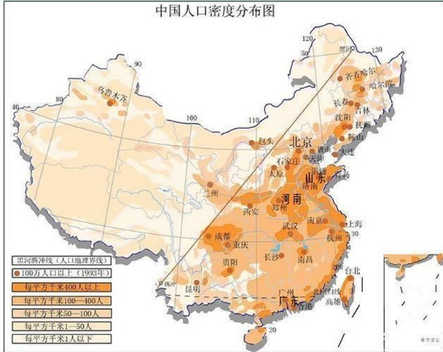

- **动态时空要素**，如人口流动、交通流量，更适合用**尺寸、颜色、方向**去表达数量、速度和变化趋势。
  

##### 3. 两个经典例子

- **人口密度图**：颜色梯度表示密度高低，尺寸大小表示城市规模；

- **台风路径图**：线条表示移动路径，颜色表示强度，粗细表示影响范围。

##### 4. 这一部分怎么答题

如果题目问“如何选择视觉变量”，你不要只罗列变量，要写出原则：

**先看对象是静态还是动态，再看要表达的是类别、数量、方向还是变化趋势，最后匹配最合适的视觉变量。**  
这句话写上去，答案就会比单纯背书更完整。

#### （三）地图风格与色彩体系设计

这一部分偏基础，但很容易出名词题。

地图风格可分为四类：

- **写实风格**：追求真实再现，比如地形图、卫星影像图；

- **抽象风格**：简化形态、突出本质，比如示意图、概念图；

- **简约风格**：去细节、强调清晰可读，比如交通图、旅游图；

- **艺术风格**：增强吸引力，比如手绘地图、插画地图。

这一部分的考试重点不在“背名字”，而在“会选用”。  
比如：

- 要求真实性强 → 选**写实风格**

- 强调概念关系 → 选**抽象风格**

- 面向大众快速阅读 → 选**简约风格**

- 强调传播性和趣味性 → 选**艺术风格**

### 三、6.2 交互可视化

这一节的核心就是一句话：

**传统可视化是“给你看结果”，交互可视化是“让你自己去探索结果”。**  
交互可视化强调用户通过动态操作与界面交互来实现数据探索、分析与理解，其核心特征是**动态反馈、个性化定制、主动探索**。

#### （一）交互可视化的基本概念

##### 1. 定义

交互可视化是用户通过动态操作与界面交互，实现数据探索、分析与理解的技术。

##### 2. 与传统可视化的区别

- **传统可视化**：强调静态展示结果；

- **交互可视化**：强调用户参与和数据挖掘过程。

这个对比题很可能会考。

#### （二）核心交互类型

这一部分最好按“操作—作用—价值”去记。

| **交互类型** | **作用**                   | **典型价值**           |
|--------------|----------------------------|------------------------|
| 选择交互     | 点击或框选目标数据         | 聚焦关键数据，减少干扰 |
| 缩放交互     | 放大或缩小视图             | 兼顾全局与细节         |
| 平移交互     | 拖动视图拓展观察范围       | 查看未显示区域         |
| 过滤交互     | 按时间、空间、属性筛选数据 | 聚焦目标信息，提高效率 |

时空数据有三个天然特点：**多维、动态、规模大**。静态图很容易信息过载，所以必须通过交互去“分层看、按需看、局部看”。

#### （三）交互对时空数据探索的价值

交互之所以对时空数据重要，是因为它能：

- **打破静态限制**：动态展示变化过程；

- **支持用户主导探索**：用户可按需调整视图，分析时空关联；

- **提升决策效率**：可快速验证假设，辅助决策。  
  这体现了交互可视化的三层价值。

#### （四）典型应用案例

##### 1. 城市交通流量交互

操作流程是：  
**过滤早高峰数据 → 缩放到拥堵区域 → 选择关键路段 → 查看流量趋势**。  
结果发现信号配时不合理，优化后拥堵时间缩短。相关案例中，通行效率提升25%、拥堵时间缩短30%。

##### 2. 气象数据时空探索

操作流程是：  
**平移地图 → 缩放到暴雨中心 → 过滤特定时段 → 观察变化**。  
最终发现降水集中在山区，与地形高度正相关。

### 四、6.3 多维度交互设计

6.2 讲的是交互的价值，6.3 讲的是如何从时间、空间、属性和多视图四个维度开展交互。

#### （一）时间维度筛选

时间交互是时空数据里最核心的一类交互。

##### 常见时间控件

- **时间滑块**：拖动选择时间点或时间范围；

- **时间轴**：在线性时间序列上点选节点；

- **时间范围选择器**：输入开始与结束时间筛选。

##### 实现逻辑

1.  按时间维度组织数据并建立时间索引；

2.  设计适合的控件；

3.  根据用户选择实时更新数据；

4.  必要时加入动画效果展示连续变化。

##### 应试理解

时间维度交互的意义在于：  
**帮助用户从“静态一张图”变成“按时间切片或连续观察变化过程”**。  
这在交通、气象、人口等题目里都可以直接套。

#### （二）空间范围选择

##### 常见方式

- 框选

- 圈选

- 多边形选择

- 地理编码选择（输入地址或城市名快速定位）

##### 实现逻辑

- 建立**空间索引**（如四叉树、R树）；

- 监听交互事件；

- 计算选择区域范围；

- 根据范围筛选数据并更新地图。

##### 这一部分怎么理解

空间选择交互的核心作用是：  
**帮助用户把注意力从整个地图缩小到某一个具体区域。**  
也就是说，它本质上是在做“空间聚焦”。

#### （三）属性条件过滤

如果说时间筛选是按“什么时候”，空间选择是按“哪里”，那属性过滤就是按“是什么”。

##### 常见控件

- 下拉菜单

- 复选框

- 输入框

- 滑块

##### 实现逻辑

- 属性数据建模与属性索引；

- 解析用户输入的过滤条件；

- 查询符合条件的数据；

- 将结果更新到地图并突出显示。

##### 高频表述

属性条件过滤的意义是：  
**让用户根据数值、类别、文本等属性特征筛选目标数据，提高分析针对性。**

#### （四）多视图联动

这是本章很重要的设计思想。

##### 1. 核心概念

多视图联动就是把**地图和图表结合起来**，用户在一个视图中的操作会实时影响其他视图。用户操作地图、柱状图、折线图等任一视图时，其他视图会同步更新。

##### 2. 四个设计原则

- **数据关联**

- **交互同步**

- **视图互补**

- **布局合理**

##### 3. 常见联动模式

常见联动模式有四种：

| **联动模式**    | **作用**                     |
|-----------------|------------------------------|
| 地图—柱状图联动 | 地图看分布，柱状图看统计     |
| 地图—折线图联动 | 地图看区域，折线图看时间趋势 |
| 地图—散点图联动 | 地图看空间，散点图看属性关系 |
| 地图—表格联动   | 地图看位置，表格看详细属性   |

##### 4. 实现逻辑

- **数据共享**

- **事件监听与触发**

- **状态同步**

##### 5. 这一部分怎么答题

如果老师问“多视图联动的意义”，你可以这样答：

**多视图联动通过把地图与图表、表格等多种视图结合，实现空间分布、时间趋势和属性关系的综合分析，提高时空数据探索的完整性和效率。**

### 五、6.4 沉浸式时空可视化

#### （一）VR 与 AR 的定义及特点

##### VR（虚拟现实）

通过计算机技术创建完全虚拟的三维环境，用户佩戴头显沉浸其中并进行交互。  
其特点是：

- 完全沉浸

- 支持三维交互

- 多感官刺激强

##### AR（增强现实）

将虚拟信息叠加到真实世界，通过设备实现虚实融合。  
其特点是：

- 虚实结合

- 支持实时交互

- 设备便携、适用范围广

##### 一句话区分

- **VR**：你进入虚拟世界

- **AR**：虚拟信息进入真实世界

#### （二）VR/AR 在时空可视化中的优势

- **三维空间展示**：突破二维屏幕限制；

- **自然交互**：手势、语音等更符合直觉；

- **沉浸式体验**：增强理解和记忆。

#### （三）沉浸式时空数据的呈现方法

##### 1. VR 环境中的呈现

- 构建三维地理环境；

- 叠加轨迹、流等时空数据；

- 采用分层展示，支持用户切换查看。

##### 2. AR 环境中的呈现

- 在真实场景中叠加虚拟数据；

- 通过GPS等技术实现空间定位与跟踪；

- 展示地下管线、历史变迁等不易直接观察的信息。

##### 3. 设计原则

- **空间一致性**

- **信息简洁性**

- **交互自然性**

- **多感官融合**

#### （四）沉浸式场景下的交互逻辑设计

##### 常见交互方式

- 手势识别

- 语音控制

- 头部追踪

- 身体运动

##### 交互逻辑设计原则

- **直观性**

- **高效性**

- **反馈性**

- **容错性**

#### （五）应用案例与发展趋势

典型应用包括四类：

- 虚拟地理环境（如 Google Earth VR）

- AR导航

- 沉浸式气象可视化

- 历史时空重现

未来趋势包括：

- 技术融合（VR/AR 与 AI、大数据、物联网结合）

- 硬件普及

- 多感官体验

- 跨平台应用

### 六、本章最容易考的几个对比

#### 1. 传统可视化 vs 交互可视化

- 传统可视化：静态展示结果

- 交互可视化：强调用户参与和探索过程

#### 2. 静态时空要素 vs 动态时空要素

- 静态要素：适合用形状、颜色、纹理表达

- 动态要素：适合用尺寸、颜色、方向表达变化趋势

#### 3. VR vs AR

- VR：完全虚拟、沉浸式

- AR：虚实叠加、现实增强

#### 4. 时间筛选 vs 空间选择 vs 属性过滤

- 时间筛选：按“什么时候”筛

- 空间选择：按“哪里”筛

- 属性过滤：按“什么特征”筛

### 七、考试可直接套用的简答题模板

#### 1. 简述地图布局设计的原则

地图布局设计应遵循视觉平衡、主次分明、简洁清晰和逻辑连贯等原则。通过合理安排标题、图例、图廓和主题要素的位置，突出地图核心内容，增强可读性和逻辑性。

#### 2. 简述时空要素视觉变量的选择思路

时空要素视觉变量的选择应根据表达对象和表达目的确定。对于静态时空要素，可采用形状、颜色、纹理等变量表示属性与分布；对于动态时空要素，可采用尺寸、颜色、方向等变量表示数量、速度和变化趋势。

#### 3. 简述交互可视化的核心价值

交互可视化通过动态反馈、个性化定制和主动探索，帮助用户打破静态展示限制，实现多维度数据分析，发现隐藏的时空关联规律，并提升数据驱动决策效率。

#### 4. 简述多视图联动的设计思想

多视图联动是将地图与柱状图、折线图、散点图、表格等多种视图结合，通过数据共享、事件监听和状态同步，实现不同视图之间的交互响应，从而从空间分布、时间变化和属性关系等多个维度综合分析时空数据。

#### 5. 简述VR/AR在时空可视化中的作用

VR/AR能够突破二维屏幕限制，以三维空间方式展示时空数据，并通过手势、语音等自然交互方式提升用户体验。其中VR强调沉浸式虚拟环境，AR强调将虚拟信息叠加到真实场景，两者都能增强时空信息的理解和记忆。
